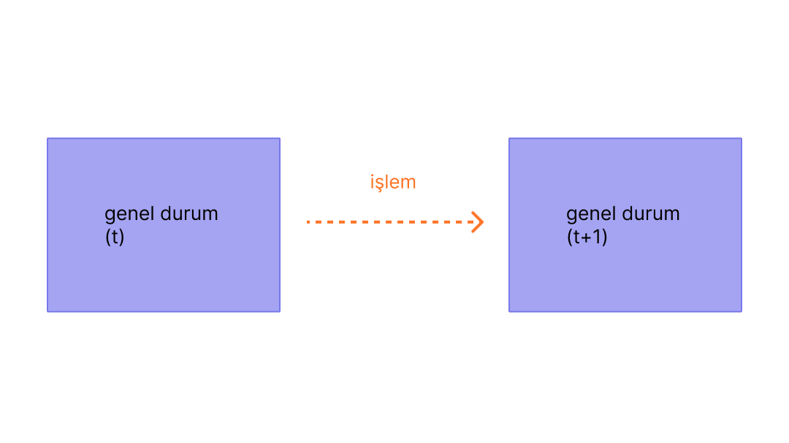

İşlemler, hesaplardan kriptografik olarak imzalanmış talimatlardır. Bir hesap, Ethereum ağının durumunu güncellemek için bir işlem başlatacaktır. En basit işlem ETH'yi bir hesaptan diğerine aktarmaktır.

## Ön koşullar {#prerequisites}

Bu sayfayı daha iyi anlamanıza yardımcı olmak için önce [Hesaplar](/developers/docs/accounts/) ve [Ethereum'a giriş](/developers/docs/intro-to-ethereum/) bölümlerini okumanızı öneririz.

## İşlem ne demek? {#whats-a-transaction}

Bir Ethereum işlemi, harici olarak sahiplenilmiş bir hesap tarafından başlatılan bir eylemi ifade eder, başka bir deyişle, bir sözleşme değil, bir insan tarafından yönetilen bir hesap. Örneğin Bob, Alice'e 1 ETH gönderirse, Bob'un hesabı borçlandırılmalı ve Alice'inki alacaklandırılmalıdır. Bu durum değiştirme eylemi bir işlem içinde gerçekleşir.

 _Diyagram [Ethereum EVM resmediciden](https://takenobu-hs.github.io/downloads/ethereum_evm_illustrated.pdf) uyarlanmıştır_

EVM'nin durumunu değiştiren işlemlerin tüm ağa yayınlanması gerekir. Herhangi bir düğüm, Ethereum Sanal Makinesinde ugulanacak işlemleri yayınlamak için talepte bulunabilir, bu olduktan sonra da, doğrulayıcı işlemi uygulayacak ve ortaya çıkan durum değişikliğini ağın geri kalanına yayacaktır.

İşlemler için ücretler gereklidir ve doğrulanan bir blokta bulunmak zorundadırlar. Bu taslağı daha basit hale getirebilmek için gaz ücretlerini ve doğrulamayı başka bir yerde inceleyeceğiz.

Gönderilen bir işlem aşağıdaki bilgileri içerir:

- `from` - işlemi imzalayacak olan göndericinin adresi. Bu sözleşme hesapları işlem gönderemeyeceği için harici olarak sahiplenilmiş bir hesap olacaktır.
- `to` - alıcı adres (harici olarak sahiplenilmiş bir hesapsa, işlem değeri aktaracaktır. Eğer bir sözleşme hesabıysa, işlem sözleşme kodunu yürütecektir)
- `signature` - gönderenin tanımlayıcısı. Bu, gönderenin özel anahtarı işlemi imzaladığında ve gönderenin bu işleme yetki verdiğini doğruladığında oluşturulur
- `nonce` - hesabın işlem sayısını belirten ve ardışık olarak artan bir sayaç
- `value` - göndericiden alıcıya aktarılacak ETH miktarı (WEI şeklinde birimlendirilmiştir, 1ETH 1e+18wei'ye eşittir)
- `giriş verileri` - keyfi verileri dahil etmek için opsiyonel alan
- `gasLimit` - işlem tarafından tüketilebilecek maksimum gaz birimi miktarı. [EVM](/developers/docs/evm/opcodes) her bir hesaplık adım için gereken gaz birimini belirtir
- `maxPriorityFeePerGas` - doğrulayıcıya bir bahşiş olarak eklenmesi için harcanan gazın maksimum fiyatı
- `maxFeePerGas` - işlem için ödenebilecek gaz birimi başına maksimum ücret (`baseFeePerGas` ve `maxPriorityFeePerGas`'ı kapsayıcıdır)

Gaz, işlemin bir doğrulayıcı tarafından işlenmesi için gereken hesaplamaya bir referanstır. Kullanıcılar bu hesaplama için bir ücret ödemek zorundadır. `gasLimit` ve `maxPriorityFeePerGas` doğrulayıcıya ödenen maksimum işlem ücretini belirler. [Gaz hakkında daha fazla bilgi](/developers/docs/gas/).

İşlem nesnesi biraz şuna benzer:

```js
{
  from: "0xEA674fdDe714fd979de3EdF0F56AA9716B898ec8",
  to: "0xac03bb73b6a9e108530aff4df5077c2b3d481e5a",
  gasLimit: "21000",
  maxFeePerGas: "300",
  maxPriorityFeePerGas: "10",
  nonce: "0",
  value: "10000000000"
}
```

Ancak, gönderenin özel anahtarı kullanılarak bir işlem nesnesinin imzalanması gerekir. Bu, işlemin yalnızca göndericiden gelebileceğini ve sahtekârlıkla gönderilmediğini kanıtlıyor.

Geth gibi bir Ethereum istemcisi bu imzalama sürecini yerine getirir.

[JSON-RPC](/developers/docs/apis/json-rpc) çağrısı örneği:

```json
{
  "id": 2,
  "jsonrpc": "2.0",
  "method": "account_signTransaction",
  "params": [
    {
      "from": "0x1923f626bb8dc025849e00f99c25fe2b2f7fb0db",
      "gas": "0x55555",
      "maxFeePerGas": "0x1234",
      "maxPriorityFeePerGas": "0x1234",
      "input": "0xabcd",
      "nonce": "0x0",
      "to": "0x07a565b7ed7d7a678680a4c162885bedbb695fe0",
      "value": "0x1234"
    }
  ]
}
```

Yanıt örneği:

```json
{
  "jsonrpc": "2.0",
  "id": 2,
  "result": {
    "raw": "0xf88380018203339407a565b7ed7d7a678680a4c162885bedbb695fe080a44401a6e4000000000000000000000000000000000000000000000000000000000000001226a0223a7c9bcf5531c99be5ea7082183816eb20cfe0bbc322e97cc5c7f71ab8b20ea02aadee6b34b45bb15bc42d9c09de4a6754e7000908da72d48cc7704971491663",
    "tx": {
      "nonce": "0x0",
      "maxFeePerGas": "0x1234",
      "maxPriorityFeePerGas": "0x1234",
      "gas": "0x55555",
      "to": "0x07a565b7ed7d7a678680a4c162885bedbb695fe0",
      "value": "0x1234",
      "input": "0xabcd",
      "v": "0x26",
      "r": "0x223a7c9bcf5531c99be5ea7082183816eb20cfe0bbc322e97cc5c7f71ab8b20e",
      "s": "0x2aadee6b34b45bb15bc42d9c09de4a6754e7000908da72d48cc7704971491663",
      "hash": "0xeba2df809e7a612a0a0d444ccfa5c839624bdc00dd29e3340d46df3870f8a30e"
    }
  }
}
```

- `raw` [Özyinelemeli Uzunluk Ön Eki (RLP)](/developers/docs/data-structures-and-encoding/rlp) şeklinde şifrelenmiş imzalı işlemdir
- `tx`, imzalanmış işlemin JSON biçimidir

İmza hash değeri ile işlemin göndericiden geldiği ve ağa gönderildiği kriptografik olarak kanıtlanabilir.

### Veri alanı {#the-data-field}

İşlemlerin büyük bir çoğunluğu, bir sözleşmeye dıştan sahiplenilmiş bir hesaptan erişir. Çoğu sözleşme Solidity ile yazılmıştır ve veri alanlarını [uygulama ikili arayüzü (ABI)](/glossary/#abi) ile uyumlu olacak şekilde yorumlar.

İlk dört bayt, fonksiyonun isminin ve argümanlarının hash değerini kullanarak hangi fonksiyonun çağrılacağını belirler. Bazen seçiciden [bu veri tabanını](https://www.4byte.directory/signatures/) kullanarak fonksiyonu tespit edebilirsiniz.

Çağrı verisinin geri kalanı, [ABI şartnamesine uygun şekilde şifrelenmiş olan](https://docs.soliditylang.org/en/latest/abi-spec.html#formal-specification-of-the-encoding) argümanlardır.

Örnek olarak, [bu işleme](https://etherscan.io/tx/0xd0dcbe007569fcfa1902dae0ab8b4e078efe42e231786312289b1eee5590f6a1) bakalım. Çağrı verisini görmek için **Click to see More** düğmesini kullanın.

`0xa9059cbb` fonksiyon seçicisidir. [Bu imza ile bilinen birkaç fonksiyon](https://www.4byte.directory/signatures/?bytes4_signature=0xa9059cbb) var. Bu durumda [sözleşme kaynak kodu](https://etherscan.io/address/0xa0b86991c6218b36c1d19d4a2e9eb0ce3606eb48#code) Etherscan'e yüklenmiş, yani fonksiyonun `transfer(address,uint256)` olduğunu biliyoruz.

Verinin geri kalanı:

```
0000000000000000000000004f6742badb049791cd9a37ea913f2bac38d01279
000000000000000000000000000000000000000000000000000000003b0559f4
```

ABI koşullarına göre, tamsayı değerleri (20 bayt tamsayılar olan adresler gibi) ABI içinde 32 bayt kelimelerin önü sıfırlarla doldurulmuş şekilde bulunurlar. Yani `to` adresinin [`4f6742badb049791cd9a37ea913f2bac38d01279`](https://etherscan.io/address/0x4f6742badb049791cd9a37ea913f2bac38d01279) olduğunu biliyoruz. `value` ise 0x3b0559f4 = 990206452'dir.

## İşlem türleri {#types-of-transactions}

Ethereum'da birkaç farklı işlem türü vardır:

- Düzenli işlemler: bir hesaptan diğerine yapılan işlem.
- Sözleşme dağıtım işlemleri: Veri alanının sözleşme kodu için kullanıldığı, "to"' (gönderilen adres) adresi olmayan bir işlem.
- Bir sözleşmenin yürütümü: dağıtılmış akıllı sözleşme ile etkileşime geçen bir işlem. Bu durumda, "to" adresi akıllı sözleşme adresidir.

### Gaz hakkında {#on-gas}

Belirtildiği gibi, işlemlerin yürütülmesi [gaz](/developers/docs/gas/) harcar. Basit transfer işlemleri 21.000 birim Gaz gerektirir.

Dolayısıyla Bob'un 1 ETH'yi Alice'e 190 gwei `baseFeePerGas` ve 10 gwei `maxPriorityFeePerGas` ile göndermesi için Bob'un aşağıdaki ücreti ödemesi gerekir:

```
(190 + 10) * 21.000 = 4.200.000 gwei
--veya--
0,0042 ETH
```

Bob'un hesabı **-1,0042 ETH** borçlandırılacaktır (Alice için 1 ETH + gaz ücretleri için 0,0042 ETH)

Alice'in hesabı **+1,0 ETH** alacaklandırılır

Taban ücret yakılacaktır **-0,00399 ETH**

Doğrulayıcı **+0,000210 ETH** bahşişi tutar


 _Diyagram [Ethereum EVM resmediciden](https://takenobu-hs.github.io/downloads/ethereum_evm_illustrated.pdf) uyarlanmıştır_

İşlemde kullanılmayan gaz, kullanıcı hesabına iade edilir.

### Akıllı sözleşme etkileşimleri {#smart-contract-interactions}

Akıllı sözleşme içeren herhangi bir işlem için gaz gereklidir.

Akıllı sözleşmeler, sözleşmenin durumunu değiştirmeyen [`view`](https://docs.soliditylang.org/en/latest/contracts.html#view-functions) ya da [`pure`](https://docs.soliditylang.org/en/latest/contracts.html#pure-functions) olarak adlandırılan fonksiyonlar da içerebilir. Bu nedenle bu fonksiyonların bir EOA tarafından çağrılması için herhangi bir gaz gerekmez. Bu senaryoda kullanılan temel RPC çağrısı [`"eth_call"`](/developers/docs/apis/json-rpc#eth_call) olarak adlandırılır

Bu `view` veya `pure` fonksiyonları, `eth_call` kullanılarak erişildiği durumun aksine, genellikle dahili olarak (yani sözleşmenin kendisinden veya başka bir sözleşmeden) çağrılır ve bu da gaz maliyetine yol açmaz.

## İşlem yaşam döngüsü {#transaction-lifecycle}

İşlem gönderildikten sonra aşağıdakiler gerçekleşir:

1. Bir işlem şifresi kriptografik olarak oluşturulur: `0x97d99bc7729211111a21b12c933c949d4f31684f1d6954ff477d0477538ff017`
2. İşlem sonrasında ağa yayınlanır ve diğer bekleyen ağ işlemlerinden oluşan işlem havuzuna eklenir.
3. Bir doğrulayıcı, işlemi doğrulamak ve "başarılı" olarak değerlendirmek için işleminizi seçmeli ve bir bloka eklemelidir.
4. Zaman geçtikçe işleminizi taşıyan blok önce "kanıtlanmış" sonrasında "kesinleştirilmiş" şeklinde güncellenecektir. Bu yükseltmeler işleminizin başarılı olduğunu ve asla değiştirilemeyeceğini daha netleştirir. Bir blok "kesinleştirildikten" sonra sadece milyarlarca dolar maliyetinde ağ seviyesinde bir saldırı ile değiştirilebilir.

## Görsel bir demo {#a-visual-demo}

Austin'in işlemlerde, gazda ve madencilikte size yol göstermesini izleyin.

<YouTube id="er-0ihqFQB0" />

## Yazılan İşlem Zarfı {#typed-transaction-envelope}

Ethereum'un başlangıçta işlemler için tek bir formatı vardı. Her işlem, adres, değer, veri, v, r ve s için nonce, gaz fiyatı, gaz limiti içeriyordu. Bu alanlar [RLP ile şifrelenmiştir](/developers/docs/data-structures-and-encoding/rlp/), şuna benzer bir şekilde görünür:

`RLP([nonce, gasPrice, gasLimit, to, value, data, v, r, s])`

Ethereum, erişim listelerini ve [EIP-1559](https://eips.ethereum.org/EIPS/eip-1559)'un eski işlem formatlarını etkilemeden uygulanmasını mümkün kılmak için birçok işlem türünü destekleyecek şekilde evrildi.

[EIP-2718](https://eips.ethereum.org/EIPS/eip-2718) bu davranışa izin verendir. İşlemler şu şekilde yorumlanır:

`TransactionType || TransactionPayload`

Burada alanlar şu şekilde tanımlanır:

- `TransactionType` - toplam 128 olası işlem türü için 0 ile 0x7f arasında bir sayı.
- `TransactionPayload` - işlem türü tarafından tanımlanan rastgele bir bayt dizisi.

`TransactionType` değerine göre, bir işlem şöyle sınıflandırılabilir

1. **Tip 0 (Eski) İşlemler:** Ethereum'un başlatılmasından itibaren kullanılan orijinal işlem formatıdır. [EIP-1559](https://eips.ethereum.org/EIPS/eip-1559)'dan gelen dinamik gaz ücreti hesaplamaları veya akıllı sözleşmeler için erişim listeleri gibi özellikler içermezler. Eski işlemler, [Tekrarlamalı Uzunluk Öneki (RLP)](/developers/docs/data-structures-and-encoding/rlp) kodlaması kullanıldığında `0xf8` baytıyla başlayarak serileştirilmiş formlarında türlerini belirten belirli bir öneke sahip değildir. Bu işlemler için TransactionType değeri `0x0`'dır.

2. **Tip 1 İşlemler:** Ethereum'un [Berlin Yükseltmesi](/history/#berlin)'nin bir parçası olarak [EIP-2930](https://eips.ethereum.org/EIPS/eip-2930)'da kullanıma açılan bu işlemler bir `accessList` parametresi içerir. Bu liste, işlemin erişmeyi beklediği adresleri ve depolama anahtarlarını belirtir, bu da akıllı sözleşmelerle ilgili karmaşık işlemler için [gaz](/developers/docs/gas/) maliyetlerinin potansiyel olarak azaltılmasına yardımcı olur. EIP-1559 ücret piyasası değişiklikleri Tip 1 işlemlere dahil değildir. Tip 1 işlemler buna ek olarak, secp256k1 imzasının y değerinin paritesini gösteren `0x0` veya `0x1` olabilen bir `yParity` parametresi de içerir. Bu işlemler, `0x01` baytıyla başladıkları için kolayca tanınır ve TransactionType değerleri `0x1`'dir.

3. **Tip 2 İşlemler**, sıklıkla EIP-1559 işlemleri olarak adlandırılır ve Ethereum'un [Londra Yükseltmesi](/history/#london)'nde [EIP-1559](https://eips.ethereum.org/EIPS/eip-1559) dahilinde tanıtılan işlemlerdir. Bu işlemler, Ethereum ağında standart işlem tipi haline gelmiştir. Bu işlemler, işlem ücretini ana ücret ve öncelik ücreti olarak ayıran öngörülebilirliği artıran yeni bir ücret piyasası mekanizması sunar. `0x02` baytı ile başlarlar ve `maxPriorityFeePerGas` ile `maxFeePerGas` gibi alanları içerirler. Tip 2 işlemler, esneklikleri ve verimlilikleri nedeniyle varsayılan seçenek durumuna gelmiştir. Özellikle yüksek ağ tıkanıklığı dönemlerinde kullanıcıların işlem ücretlerini daha öngörülebilir şekilde yönetmelerine yardımcı olma yetenekleri nedeniyle tercih edilirler. Bu işlemler için TransactionType değeri `0x2`'dir.


## Daha fazla bilgi {#further-reading}

- [EIP-2718: Yazılan İşlem Zarfı](https://eips.ethereum.org/EIPS/eip-2718)

_Size yardımcı olan bir topluluk kaynağı mı biliyorsunuz? Bu sayfayı düzenleyin ve ekleyin!_

## İlgili konular {#related-topics}

- [Hesaplar](/developers/docs/accounts/)
- [Ethereum sanal makinesi (EVM)](/developers/docs/evm/)
- [Gaz](/developers/docs/gas/)
