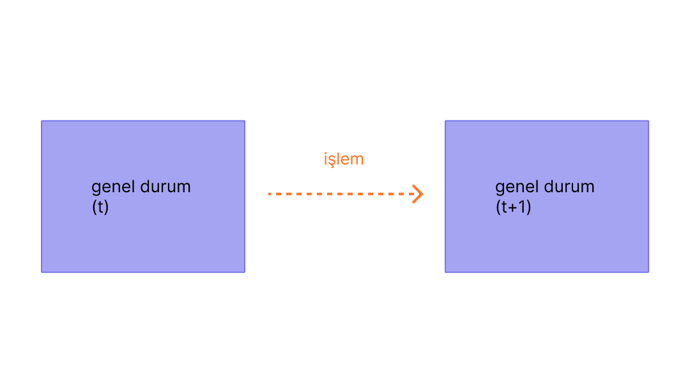

İşlemler, hesaplardan gelen kriptografik olarak imzalanmış talimatlardır. Bir hesap, [Ethereum](/) ağının durumunu güncellemek için bir işlem başlatır. En basit işlem, bir hesaptan diğerine ETH transfer etmektir.

## Ön koşullar {#prerequisites}

Bu sayfayı daha iyi anlamanıza yardımcı olması için öncelikle [Hesaplar](/developers/docs/accounts/) ve [Ethereum'a giriş](/developers/docs/intro-to-ethereum/) bölümlerini okumanızı öneririz.

## İşlem nedir? {#whats-a-transaction}

Bir Ethereum işlemi, harici olarak sahip olunan bir hesap, başka bir deyişle bir sözleşme değil, bir insan tarafından yönetilen bir hesap tarafından başlatılan bir eylemi ifade eder. Örneğin, Bob Alice'e 1 ETH gönderirse, Bob'un hesabından düşülmeli ve Alice'in hesabına eklenmelidir. Bu durum değiştiren eylem bir işlem içinde gerçekleşir.


_Diyagram [Ethereum EVM illustrated](https://takenobu-hs.github.io/downloads/ethereum_evm_illustrated.pdf)'dan uyarlanmıştır_

EVM'nin durumunu değiştiren işlemlerin tüm ağa yayınlanması gerekir. Herhangi bir düğüm, EVM üzerinde bir işlemin yürütülmesi için bir istek yayınlayabilir; bu gerçekleştikten sonra, bir doğrulayıcı işlemi yürütecek ve ortaya çıkan durum değişikliğini ağın geri kalanına yayacaktır.

İşlemler bir ücret gerektirir ve doğrulanmış bir bloğa dahil edilmelidir. Bu genel bakışı daha basit hale getirmek için gaz ücretlerini ve doğrulamayı başka bir yerde ele alacağız.

Gönderilen bir işlem aşağıdaki bilgileri içerir:

- `from` – işlemi imzalayacak olan göndericinin adresi. Kontrat hesapları işlem gönderemediği için bu, harici olarak sahip olunan bir hesap olacaktır
- `to` – alıcı adresi (eğer harici olarak sahip olunan bir hesap ise, işlem değer transfer edecektir. Eğer bir kontrat hesabı ise, işlem sözleşme kodunu yürütecektir)
- `signature` – göndericinin tanımlayıcısı. Bu, göndericinin özel anahtarı işlemi imzaladığında oluşturulur ve göndericinin bu işleme yetki verdiğini onaylar
- `nonce` - hesaptan gelen işlem numarasını gösteren sıralı olarak artan bir sayaç (nonce)
- `value` – göndericiden alıcıya transfer edilecek ETH miktarı (1 ETH'nin 1e+18 Wei'ye eşit olduğu Wei cinsinden ifade edilir)
- `input data` – isteğe bağlı verileri dahil etmek için isteğe bağlı alan
- `gasLimit` – işlem tarafından tüketilebilecek maksimum gaz birimi miktarı. [EVM](/developers/docs/evm/opcodes), her hesaplama adımı için gereken gaz birimlerini belirtir
- `maxPriorityFeePerGas` - tüketilen gazın doğrulayıcıya öncelik ücreti olarak dahil edilecek maksimum fiyatı
- `maxFeePerGas` - işlem için ödenmeye razı olunan gaz birimi başına maksimum ücret (`baseFeePerGas` ve `maxPriorityFeePerGas` dahil)

Gaz, işlemin bir doğrulayıcı tarafından işlenmesi için gereken hesaplamaya bir referanstır. Kullanıcılar bu hesaplama için bir ücret ödemek zorundadır. `gasLimit` ve `maxPriorityFeePerGas`, doğrulayıcıya ödenen maksimum işlem ücretini belirler. [Gaz hakkında daha fazlası](/developers/docs/gas/).

İşlem nesnesi şuna benzer bir görünüme sahip olacaktır:

```js
{
  from: "0xEA674fdDe714fd979de3EdF0F56AA9716B898ec8",
  to: "0xac03bb73b6a9e108530aff4df5077c2b3d481e5a",
  gasLimit: "21000",
  maxFeePerGas: "300",
  maxPriorityFeePerGas: "10",
  nonce: "0",
  value: "10000000000"
}
```

Ancak bir işlem nesnesinin göndericinin özel anahtarı kullanılarak imzalanması gerekir. Bu, işlemin yalnızca göndericiden gelmiş olabileceğini ve hileli bir şekilde gönderilmediğini kanıtlar.

Geth gibi bir Ethereum istemcisi bu imzalama sürecini halledecektir.

Örnek [JSON-RPC](/developers/docs/apis/json-rpc) çağrısı:

```json
{
  "id": 2,
  "jsonrpc": "2.0",
  "method": "account_signTransaction",
  "params": [
    {
      "from": "0x1923f626bb8dc025849e00f99c25fe2b2f7fb0db",
      "gas": "0x55555",
      "maxFeePerGas": "0x1234",
      "maxPriorityFeePerGas": "0x1234",
      "input": "0xabcd",
      "nonce": "0x0",
      "to": "0x07a565b7ed7d7a678680a4c162885bedbb695fe0",
      "value": "0x1234"
    }
  ]
}
```

Örnek yanıt:

```json
{
  "jsonrpc": "2.0",
  "id": 2,
  "result": {
    "raw": "0xf88380018203339407a565b7ed7d7a678680a4c162885bedbb695fe080a44401a6e4000000000000000000000000000000000000000000000000000000000000001226a0223a7c9bcf5531c99be5ea7082183816eb20cfe0bbc322e97cc5c7f71ab8b20ea02aadee6b34b45bb15bc42d9c09de4a6754e7000908da72d48cc7704971491663",
    "tx": {
      "nonce": "0x0",
      "maxFeePerGas": "0x1234",
      "maxPriorityFeePerGas": "0x1234",
      "gas": "0x55555",
      "to": "0x07a565b7ed7d7a678680a4c162885bedbb695fe0",
      "value": "0x1234",
      "input": "0xabcd",
      "v": "0x26",
      "r": "0x223a7c9bcf5531c99be5ea7082183816eb20cfe0bbc322e97cc5c7f71ab8b20e",
      "s": "0x2aadee6b34b45bb15bc42d9c09de4a6754e7000908da72d48cc7704971491663",
      "hash": "0xeba2df809e7a612a0a0d444ccfa5c839624bdc00dd29e3340d46df3870f8a30e"
    }
  }
}
```

- `raw`, [Özyinelemeli Uzunluk Öneki (RLP)](/developers/docs/data-structures-and-encoding/rlp) kodlanmış formundaki imzalı işlemdir
- `tx`, JSON formundaki imzalı işlemdir

İmza hash'i ile işlemin göndericiden geldiği ve ağa gönderildiği kriptografik olarak kanıtlanabilir.

### Veri alanı {#the-data-field}

İşlemlerin büyük çoğunluğu, harici olarak sahip olunan bir hesaptan bir sözleşmeye erişir.
Çoğu sözleşme Solidity dilinde yazılır ve veri alanlarını [uygulama ikili arayüzüne (ABI)](/glossary/#abi) uygun olarak yorumlar.

İlk dört bayt, işlevin adının ve argümanlarının hash'ini kullanarak hangi işlevin çağrılacağını belirtir.
Bazen [bu veritabanını](https://www.4byte.directory/signatures/) kullanarak işlevi seçiciden tanımlayabilirsiniz.

Çağrı verisinin geri kalanı, [ABI spesifikasyonlarında belirtildiği gibi kodlanmış](https://docs.soliditylang.org/en/latest/abi-spec.html#formal-specification-of-the-encoding) argümanlardır.

Örneğin, [bu işleme](https://etherscan.io/tx/0xd0dcbe007569fcfa1902dae0ab8b4e078efe42e231786312289b1eee5590f6a1) bakalım.
Çağrı verisini görmek için **Daha Fazlasını Görmek İçin Tıklayın** (Click to see More) seçeneğini kullanın.

İşlev seçici `0xa9059cbb` şeklindedir. [Bu imzaya sahip bilinen birkaç işlev](https://www.4byte.directory/signatures/?bytes4_signature=0xa9059cbb) vardır.
Bu durumda [sözleşme kaynak kodu](https://etherscan.io/address/0xa0b86991c6218b36c1d19d4a2e9eb0ce3606eb48#code) Etherscan'e yüklenmiştir, bu nedenle işlevin `transfer(address,uint256)` olduğunu biliyoruz.

Verinin geri kalanı şöyledir:

```
0000000000000000000000004f6742badb049791cd9a37ea913f2bac38d01279
000000000000000000000000000000000000000000000000000000003b0559f4
```

ABI spesifikasyonlarına göre, tamsayı değerleri (20 baytlık tamsayılar olan adresler gibi) ABI'de ön tarafı sıfırlarla doldurulmuş 32 baytlık kelimeler olarak görünür.
Yani `to` adresinin [`4f6742badb049791cd9a37ea913f2bac38d01279`](https://etherscan.io/address/0x4f6742badb049791cd9a37ea913f2bac38d01279) olduğunu biliyoruz.
`value` 0x3b0559f4 = 990206452'dir.

### İşlem tanımlayıcıları {#transaction-descriptors}

Veri alanı opak onaltılık baytlar içerdiğinden, bir işlemin gerçekte hangi eylemi gerçekleştireceğini doğrulamak son derece zor olabilir. Bu "kör imzalama" (blind signing) güvenlik açığı, [işlem tanımlayıcılarının](https://eips.ethereum.org/EIPS/eip-7730) (ERC-7730 tarafından tanımlanmıştır) kullanımı yoluyla **[Açık İmzalama](https://clearsigning.org/)** (Clear Signing) ile ele alınmaktadır.  

ERC-7730 spesifikasyonu, ABI'lerde ve EVM işlemi çağrı verisi, EIP-712 mesajları ve EIP-4337 Kullanıcı Operasyonları gibi yapılandırılmış mesajlarda bulunan verileri zenginleştirmek için işlem tanımlayıcılarını (genellikle JSON dosyaları olarak yapılandırılır) kullanır. Geliştiriciler, belirli işlem değişkenlerini doğrudan biçimlendirme şablonlarıyla eşlemek için bu tanımlayıcıları kullanır ve temel verilerin uygulamalar için makine tarafından okunabilir kalmasını sağlar.

Ön uçta cüzdanlar, opak baytkodu açık, insan tarafından okunabilir bilgilere çevirmek için bu biçimlendirme bağlamını kullanır. Token adresleri gibi değerleri tanınan sembollere veya miktarları ondalık sayılara otomatik olarak çözümleyerek, kullanıcılara imzalamadan önce işlemin kesin niyetinin sade bir dille özeti sunulur (örneğin, 'En az 0.25 WETH karşılığında 1000 USDC takas et')

## İşlem türleri {#types-of-transactions}

Ethereum'da birkaç farklı işlem türü vardır:

- Normal işlemler: bir hesaptan diğerine yapılan bir işlem.
- Sözleşme dağıtım işlemleri: veri alanının sözleşme kodu için kullanıldığı, 'to' (alıcı) adresi olmayan bir işlem.
- Bir sözleşmenin yürütülmesi: dağıtılmış bir akıllı sözleşme ile etkileşime giren bir işlem. Bu durumda, 'to' adresi akıllı sözleşme adresidir.

### Gaz üzerine {#on-gas}

Belirtildiği gibi, işlemlerin yürütülmesi [gaz](/developers/docs/gas/) maliyetine neden olur. Basit transfer işlemleri 21000 birim Gaz gerektirir.

Yani Bob'un Alice'e 190 Gwei `baseFeePerGas` ve 10 Gwei `maxPriorityFeePerGas` ile 1 ETH göndermesi için Bob'un aşağıdaki ücreti ödemesi gerekecektir:

```
(190 + 10) * 21000 = 4,200,000 gwei
--or--
0.0042 ETH
```

Bob'un hesabından **-1.0042 ETH** düşülecektir (Alice için 1 ETH + gaz ücretleri olarak 0.0042 ETH)

Alice'in hesabına **+1.0 ETH** eklenecektir

Taban ücret yakılacaktır **-0.00399 ETH**

Doğrulayıcı öncelik ücretini elinde tutar **+0.000210 ETH**


_Diyagram [Ethereum EVM illustrated](https://takenobu-hs.github.io/downloads/ethereum_evm_illustrated.pdf)'dan uyarlanmıştır_

Bir işlemde kullanılmayan gaz, kullanıcı hesabına iade edilir.

### Akıllı sözleşme etkileşimleri {#smart-contract-interactions}

Bir akıllı sözleşmeyi içeren herhangi bir işlem için gaz gereklidir.

Akıllı sözleşmeler ayrıca sözleşmenin durumunu değiştirmeyen [`view`](https://docs.soliditylang.org/en/latest/contracts.html#view-functions) veya [`pure`](https://docs.soliditylang.org/en/latest/contracts.html#pure-functions) işlevleri olarak bilinen işlevler de içerebilir. Bu nedenle, bu işlevleri bir EOA'dan çağırmak herhangi bir gaz gerektirmeyecektir. Bu senaryo için temel RPC çağrısı [`eth_call`](/developers/docs/apis/json-rpc#eth_call)'dir.

`eth_call` kullanılarak erişildiğinde olduğunun aksine, bu `view` veya `pure` işlevleri genellikle dahili olarak da çağrılır (yani, sözleşmenin kendisinden veya başka bir sözleşmeden) ve bu da gaz maliyetine neden olur.

## İşlem yaşam döngüsü {#transaction-lifecycle}

İşlem gönderildikten sonra aşağıdakiler gerçekleşir:

1. Kriptografik olarak bir işlem hash'i oluşturulur:
   `0x97d99bc7729211111a21b12c933c949d4f31684f1d6954ff477d0477538ff017`
2. İşlem daha sonra ağa yayınlanır ve bekleyen diğer tüm ağ işlemlerinden oluşan bir işlem havuzuna eklenir.
3. Bir doğrulayıcı, işlemi doğrulamak ve "başarılı" olarak kabul etmek için işleminizi seçmeli ve bir bloğa dahil etmelidir.
4. Zaman geçtikçe işleminizi içeren blok "gerekçelendirilmiş" ve ardından "kesinleşmiş" durumuna yükseltilecektir. Bu yükseltmeler, işleminizin başarılı olduğundan ve asla değiştirilmeyeceğinden çok daha emin olmanızı sağlar. Bir blok "kesinleşmiş" olduğunda, yalnızca milyarlarca dolara mal olacak ağ düzeyinde bir saldırı ile değiştirilebilir.

## Görsel bir demo {#a-visual-demo}

Austin'in işlemler, gaz ve madencilik konularında size rehberlik etmesini izleyin.

<VideoWatch slug="transactions-eth-build" />

## Tipli İşlem Zarfı {#typed-transaction-envelope}

Ethereum başlangıçta işlemler için tek bir formata sahipti. Her işlem bir nonce, gas fiyatı, gaz limiti, alıcı adresi, değer, veri, v, r ve s içeriyordu. Bu alanlar şuna benzer görünecek şekilde [RLP kodludur](/developers/docs/data-structures-and-encoding/rlp/):

`RLP([nonce, gasPrice, gasLimit, to, value, data, v, r, s])`

Ethereum, erişim listeleri ve [EIP-1559](https://eips.ethereum.org/EIPS/eip-1559) gibi yeni özelliklerin eski işlem formatlarını etkilemeden uygulanmasına olanak tanımak için birden fazla işlem türünü destekleyecek şekilde gelişmiştir.

Bu davranışa olanak tanıyan şey [EIP-2718](https://eips.ethereum.org/EIPS/eip-2718)'dir. İşlemler şu şekilde yorumlanır:

`TransactionType || TransactionPayload`

Burada alanlar şu şekilde tanımlanır:

- `TransactionType` - 0 ile 0x7f arasında bir sayı, toplam 128 olası işlem türü için.
- `TransactionPayload` - işlem türü tarafından tanımlanan isteğe bağlı bir bayt dizisi.

`TransactionType` değerine bağlı olarak, bir işlem şu şekilde sınıflandırılabilir:

1. **Tip 0 (Eski) İşlemler:** Ethereum'un lansmanından bu yana kullanılan orijinal işlem formatı. Dinamik gaz ücreti hesaplamaları veya akıllı sözleşmeler için erişim listeleri gibi [EIP-1559](https://eips.ethereum.org/EIPS/eip-1559) özelliklerini içermezler. Eski işlemler, serileştirilmiş formlarında türlerini belirten belirli bir önekten yoksundur ve [Özyinelemeli Uzunluk Öneki (RLP)](/developers/docs/data-structures-and-encoding/rlp) kodlaması kullanıldığında `0xf8` baytı ile başlarlar. Bu işlemler için TransactionType değeri `0x0` şeklindedir.

2. **Tip 1 İşlemler:** Ethereum'un [Berlin Güncellemesi](/ethereum-forks/#berlin)'nin bir parçası olarak [EIP-2930](https://eips.ethereum.org/EIPS/eip-2930)'da tanıtılan bu işlemler, bir `accessList` parametresi içerir. Bu liste, işlemin erişmeyi beklediği adresleri ve depolama anahtarlarını belirterek, akıllı sözleşmeleri içeren karmaşık işlemler için [gaz](/developers/docs/gas/) maliyetlerini potansiyel olarak azaltmaya yardımcı olur. EIP-1559 ücret piyasası değişiklikleri Tip 1 işlemlere dahil değildir. Tip 1 işlemler ayrıca, secp256k1 imzasının y-değerinin paritesini gösteren, `0x0` veya `0x1` olabilen bir `yParity` parametresi içerir. `0x01` baytı ile başlayarak tanımlanırlar ve TransactionType değerleri `0x1` şeklindedir.

3. **Tip 2 İşlemler**, yaygın olarak EIP-1559 işlemleri olarak adlandırılır, Ethereum'un [London Güncellemesi](/ethereum-forks/#london)'nde [EIP-1559](https://eips.ethereum.org/EIPS/eip-1559) ile tanıtılan işlemlerdir. Ethereum ağındaki standart işlem türü haline gelmişlerdir. Bu işlemler, işlem ücretini bir taban ücret ve bir öncelik ücreti olarak ayırarak öngörülebilirliği artıran yeni bir ücret piyasası mekanizması sunar. `0x02` baytı ile başlarlar ve `maxPriorityFeePerGas` ile `maxFeePerGas` gibi alanları içerirler. Tip 2 işlemler, esneklikleri ve verimlilikleri nedeniyle artık varsayılandır ve özellikle yüksek ağ tıkanıklığı dönemlerinde kullanıcıların işlem ücretlerini daha öngörülebilir bir şekilde yönetmelerine yardımcı olma yetenekleri nedeniyle tercih edilirler. Bu işlemler için TransactionType değeri `0x2` şeklindedir.

4. **Tip 3 (Blob) İşlemler**, Ethereum'un [Dencun güncellemesi](/ethereum-forks/#dencun)'nin bir parçası olarak [EIP-4844](https://eips.ethereum.org/EIPS/eip-4844)'te tanıtıldı. Bu işlemler, "blob" verilerini (İkili Büyük Nesneler) daha verimli bir şekilde işlemek için tasarlanmıştır ve özellikle Ethereum ağına daha düşük bir maliyetle veri göndermenin bir yolunu sağlayarak Katman 2 toplamalarına fayda sağlar. Blob işlemleri `blobVersionedHashes`, `maxFeePerBlobGas` ve `blobGasPrice` gibi ek alanlar içerir. `0x03` baytı ile başlarlar ve TransactionType değerleri `0x3` şeklindedir. Blob işlemleri, Ethereum'un veri kullanılabilirliği ve ölçeklendirme yeteneklerinde önemli bir iyileştirmeyi temsil eder.

5. **Tip 4 İşlemler**, Ethereum'un [Pectra Güncellemesi](/roadmap/pectra/)'nin bir parçası olarak [EIP-7702](https://eips.ethereum.org/EIPS/eip-7702)'de tanıtıldı. Bu işlemler, hesap soyutlama ile ileriye dönük uyumlu olacak şekilde tasarlanmıştır. EOA'ların orijinal işlevselliklerinden ödün vermeden geçici olarak akıllı sözleşme hesapları gibi davranmalarına olanak tanırlar. EOA'nın yetkisini devrettiği akıllı sözleşmeyi belirten bir `authorization_list` parametresi içerirler. İşlemden sonra, EOA'nın kod alanı devredilen akıllı sözleşmenin adresine sahip olacaktır.

## Daha fazla okuma {#further-reading}

- [EIP-2718: Tipli İşlem Zarfı](https://eips.ethereum.org/EIPS/eip-2718)

_Size yardımcı olan bir topluluk kaynağı mı biliyorsunuz? Bu sayfayı düzenleyin ve ekleyin!_

## İlgili konular {#related-topics}

- [Hesaplar](/developers/docs/accounts/)
- [Ethereum sanal makinesi (EVM)](/developers/docs/evm/)
- [Gaz](/developers/docs/gas/)