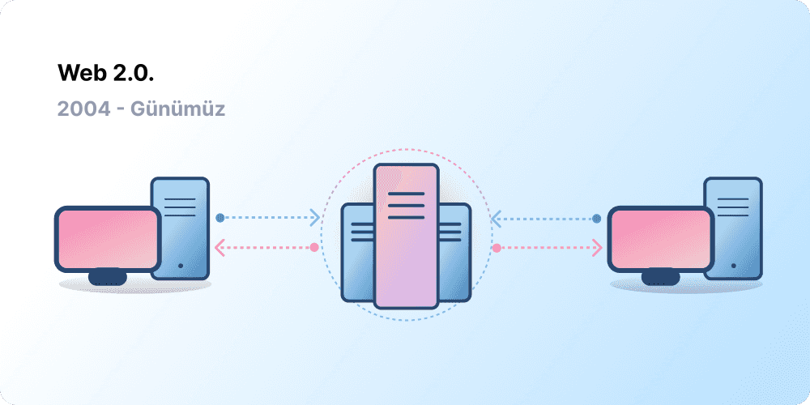
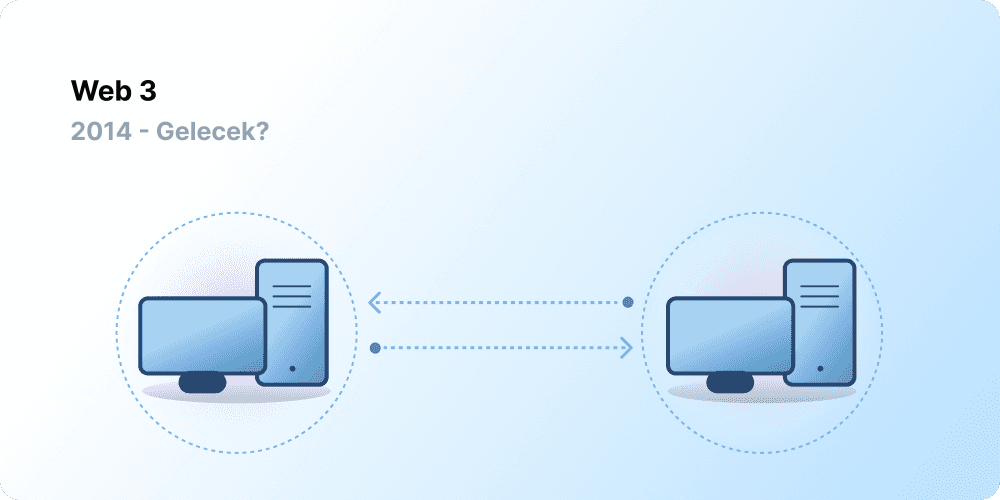

Merkeziyetçilik, milyarlarca insanın World Wide Web'e katılmasına yardımcı oldu ve üzerinde yaşadığı istikrarlı, sağlam altyapıyı oluşturdu. Aynı zamanda, bir avuç merkezi kuruluş World Wide Web'in büyük bir bölümünü elinde tutuyor ve neye izin verilip neye verilmemesi gerektiğine tek taraflı olarak karar veriyor.

Web3 bu ikilemin cevabıdır. Büyük teknoloji şirketlerinin tekeline aldığı bir Web yerine Web3, merkeziyetsizliği benimser ve kullanıcıları tarafından inşa edilir, işletilir ve sahiplenilir. Web3, gücü şirketler yerine bireylerin ellerine verir.
Web3 hakkında konuşmadan önce, buraya nasıl geldiğimizi inceleyelim.

<Divider />

## Erken dönem Web {#early-internet}

Çoğu insan Web'i modern yaşamın kesintisiz bir temel taşı olarak düşünür; icat edildi ve o zamandan beri varlığını sürdürüyor. Ancak bugün çoğumuzun bildiği Web, başlangıçta hayal edilenden oldukça farklıdır. Bunu daha iyi anlamak için, Web'in kısa tarihini Web 1.0 ve Web 2.0 gibi genel dönemlere ayırmak faydalı olacaktır.

### Web 1.0: Salt Okunur (1990-2004) {#web1}

1989'da Cenevre'deki CERN'de Tim Berners-Lee, World Wide Web olacak protokolleri geliştirmekle meşguldü. Fikri neydi? Dünyanın her yerinden bilgi paylaşımına olanak tanıyan açık, merkeziyetsiz protokoller oluşturmak.

Berners-Lee'nin eserinin şu anda 'Web 1.0' olarak bilinen ilk başlangıcı, kabaca 1990 ile 2004 yılları arasında gerçekleşti. Web 1.0, temel olarak şirketlerin sahip olduğu statik web sitelerinden oluşuyordu ve kullanıcılar arasında neredeyse sıfır etkileşim vardı (bireyler nadiren içerik üretiyordu), bu da onun salt okunur web olarak bilinmesine yol açtı.

### Web 2.0: Okuma-Yazma (2004-günümüz) {#web2}

Web 2.0 dönemi, 2004 yılında sosyal medya platformlarının ortaya çıkmasıyla başladı. Web, salt okunur olmak yerine okuma-yazma şeklinde evrimleşti. Şirketler kullanıcılara içerik sağlamak yerine, kullanıcı tarafından oluşturulan içeriği paylaşmak ve kullanıcıdan kullanıcıya etkileşimlerde bulunmak için platformlar da sağlamaya başladı. Daha fazla insan çevrim içi oldukça, bir avuç en büyük şirket, web üzerinde oluşturulan trafiğin ve değerin orantısız bir miktarını kontrol etmeye başladı. Web 2.0 ayrıca reklam odaklı gelir modelini de doğurdu. Kullanıcılar içerik oluşturabilse de, bu içeriğe sahip değillerdi veya bundan para kazanılmasından faydalanamıyorlardı.

<Divider />

## Web 3.0: Okuma-Yazma-Sahiplik {#web3}

'Web 3.0' kavramı, 2014 yılında Ethereum'un piyasaya sürülmesinden kısa bir süre sonra [Ethereum](/) kurucu ortağı Gavin Wood tarafından ortaya atıldı. Gavin, kriptoyu ilk benimseyenlerin çoğunun hissettiği bir soruna yönelik bir çözümü kelimelere döktü: Web çok fazla güven gerektiriyordu. Yani, bugün insanların bildiği ve kullandığı Web'in çoğu, kamu yararına hareket etmeleri için bir avuç özel şirkete güvenmeye dayanıyor.

### Web3 nedir? {#what-is-web3}

Web3, yeni ve daha iyi bir internet vizyonu için her şeyi kapsayan bir terim hâline geldi. Özünde Web3, gücü sahiplik şeklinde kullanıcılara geri vermek için Blokzincirleri, kripto paraları ve NFT'leri kullanır. [Twitter'daki 2020 tarihli bir gönderi](https://twitter.com/himgajria/status/1266415636789334016) bunu en iyi şekilde ifade etti: Web1 salt okunurdu, Web2 okuma-yazmadır, Web3 ise okuma-yazma-sahiplik olacaktır.

#### Web3'ün temel fikirleri {#core-ideas}

Web3'ün ne olduğuna dair kesin bir tanım yapmak zor olsa da, birkaç temel ilke onun yaratılışına rehberlik eder.

- **Web3 merkeziyetsizdir:** İnternetin büyük bir bölümünün merkezi kuruluşlar tarafından kontrol edilmesi ve sahiplenilmesi yerine, sahiplik onu inşa edenler ve kullanıcıları arasında dağıtılır.
- **Web3 izinsizdir:** Herkesin Web3'e katılmak için eşit erişimi vardır ve hiç kimse dışlanmaz.
- **Web3 yerel ödemelere sahiptir:** Bankaların ve ödeme işlemcilerinin modası geçmiş altyapısına güvenmek yerine, çevrim içi para harcamak ve göndermek için kripto para kullanır.
- **Web3 güven gerektirmeyendir:** Güvenilir üçüncü taraflara dayanmak yerine teşvikler ve ekonomik mekanizmalar kullanarak çalışır.

### Web3 neden önemlidir? {#why-is-web3-important}

Web3'ün en çarpıcı özellikleri birbirinden bağımsız olmasa ve kesin kategorilere uymasa da, basitlik adına onları daha kolay anlaşılır kılmak için ayırmaya çalıştık.

#### Sahiplik {#ownership}

Web3, dijital varlıklarınızın sahipliğini size benzeri görülmemiş bir şekilde verir. Örneğin, bir Web2 oyunu oynadığınızı varsayalım. Oyun içi bir eşya satın alırsanız, bu doğrudan hesabınıza bağlanır. Oyunun yaratıcıları hesabınızı silerse, bu eşyaları kaybedersiniz. Veya oyunu oynamayı bırakırsanız, oyun içi eşyalarınıza yatırdığınız değeri kaybedersiniz.

Web3, [değiştirilemez tokenlar (NFT'ler)](/glossary/#nft) aracılığıyla doğrudan sahipliğe olanak tanır. Hiç kimse, oyunun yaratıcıları bile, sahipliğinizi elinizden alma gücüne sahip değildir. Ve oynamayı bırakırsanız, oyun içi eşyalarınızı açık piyasalarda satabilir veya takas edebilir ve değerlerini geri kazanabilirsiniz. Bunu iş başında görmek için [zincir içi oyunları](/gaming/) keşfedin.

<Alert variant="update">
<AlertEmoji text=":eyes:"/>
<AlertContent className="flex-row items-center justify-between">
  
NFT'ler hakkında daha fazla bilgi edinin

  <ButtonLink href="/nft/">
    NFT'ler hakkında daha fazlası
  </ButtonLink>
</AlertContent>
</Alert>

#### Sansür direnci {#censorship-resistance}

Platformlar ve içerik oluşturucular arasındaki güç dinamiği büyük ölçüde dengesizdir.

OnlyFans, birçoğu platformu birincil gelir kaynağı olarak kullanan 1 milyondan fazla içerik oluşturucuya sahip, kullanıcı tarafından oluşturulan bir yetişkin içerik sitesidir. Ağustos 2021'de OnlyFans, cinsel içerikli paylaşımları yasaklama planlarını duyurdu. Bu duyuru, yaratılmasına yardımcı oldukları bir platformda gelirlerinin ellerinden alındığını hisseden platformdaki içerik oluşturucular arasında öfkeye yol açtı. Tepkilerin ardından karar hızla geri alındı. İçerik oluşturucular bu savaşı kazanmış olsa da, bu durum Web 2.0 içerik oluşturucuları için bir sorunu vurguluyor: Bir platformdan ayrılırsanız, biriktirdiğiniz itibarı ve takipçi kitlesini kaybedersiniz.

Web3'te verileriniz Blokzincir üzerinde yaşar. Bir platformdan ayrılmaya karar verdiğinizde, itibarınızı yanınıza alabilir ve onu değerlerinizle daha net bir şekilde örtüşen başka bir arayüze bağlayabilirsiniz.

Web 2.0, içerik oluşturucuların kuralları değiştirmeyecekleri konusunda platformlara güvenmelerini gerektirir, ancak sansür direnci bir Web3 platformunun yerel bir özelliğidir.

#### Merkeziyetsiz otonom organizasyonlar (DAO'lar) {#daos}

Web3'te verilerinize sahip olmanın yanı sıra, bir şirketteki hisseler gibi davranan tokenları kullanarak platforma kolektif olarak da sahip olabilirsiniz. DAO'lar, bir platformun merkeziyetsiz sahipliğini koordine etmenize ve geleceği hakkında kararlar almanıza olanak tanır.

DAO'lar teknik olarak, bir kaynak havuzu (tokenlar) üzerinde merkeziyetsiz karar almayı otomatikleştiren, üzerinde anlaşmaya varılmış [akıllı sözleşmeler](/glossary/#smart-contract) olarak tanımlanır. Token sahibi kullanıcılar kaynakların nasıl harcanacağı konusunda oy kullanır ve kod, oylama sonucunu otomatik olarak gerçekleştirir.

Ancak insanlar birçok Web3 topluluğunu DAO olarak tanımlar. Bu toplulukların hepsinin kod aracılığıyla farklı merkeziyetsizlik ve otomasyon seviyeleri vardır. Şu anda DAO'ların ne olduğunu ve gelecekte nasıl evrimleşebileceklerini araştırıyoruz.

<Alert variant="update">
<AlertEmoji text=":eyes:"/>
<AlertContent className="flex-row items-center justify-between">
  
DAO'lar hakkında daha fazla bilgi edinin

  <ButtonLink href="/dao/">
    DAO'lar hakkında daha fazlası
  </ButtonLink>
</AlertContent>
</Alert>

### Kimlik {#identity}

Geleneksel olarak, kullandığınız her platform için bir hesap oluşturursunuz. Örneğin, bir Twitter hesabınız, bir YouTube hesabınız ve bir Reddit hesabınız olabilir. Görünen adınızı veya profil resminizi değiştirmek mi istiyorsunuz? Bunu her hesapta ayrı ayrı yapmanız gerekir. Bazı durumlarda sosyal ağlarla giriş yapmayı kullanabilirsiniz, ancak bu tanıdık bir sorun olan sansürü ortaya çıkarır. Tek bir tıklamayla bu platformlar sizi tüm çevrim içi hayatınızdan kilitleyebilir. Daha da kötüsü, birçok platform bir hesap oluşturmak için kişisel olarak tanımlanabilir bilgilerinizle onlara güvenmenizi gerektirir.

Web3, dijital kimliğinizi bir Ethereum adresi ve [Ethereum Name Service (ENS)](/glossary/#ens) profili ile kontrol etmenize olanak tanıyarak bu sorunları çözer. Bir Ethereum adresi kullanmak, platformlar arasında güvenli, sansüre dirençli ve anonim olan tek bir giriş sağlar.

### Yerel ödemeler {#native-payments}

Web2'nin ödeme altyapısı bankalara ve ödeme işlemcilerine dayanır; banka hesabı olmayan veya yanlış ülkenin sınırları içinde yaşayan insanları dışlar.
Web3, doğrudan tarayıcı üzerinden para göndermek için [ETH](/glossary/#ether) gibi tokenları kullanır ve güvenilir bir üçüncü tarafa ihtiyaç duymaz.

<ButtonLink href="/what-is-ether/">
  ETH hakkında daha fazlası
</ButtonLink>

## Web3'ün sınırlamaları {#web3-limitations}

Mevcut hâliyle Web3'ün sayısız faydasına rağmen, ekosistemin gelişmesi için ele alması gereken birçok sınırlama hâlâ mevcuttur.

### Erişilebilirlik {#accessibility}

Ethereum ile Giriş Yap gibi önemli Web3 özellikleri, herkesin sıfır maliyetle kullanması için zaten mevcuttur. Ancak, işlemlerin göreceli maliyeti birçok kişi için hâlâ engelleyicidir. Yüksek işlem ücretleri nedeniyle Web3'ün daha az varlıklı, gelişmekte olan ülkelerde kullanılması daha düşük bir ihtimaldir. Ethereum'da bu zorluklar [yol haritası](/roadmap/) ve [katman 2 (l2) ölçeklendirme çözümleri](/glossary/#layer-2) aracılığıyla çözülmektedir. Teknoloji hazır, ancak Web3'ü herkes için erişilebilir kılmak adına katman 2'de daha yüksek benimsenme seviyelerine ihtiyacımız var.

### Kullanıcı deneyimi {#user-experience}

Web3'ü kullanmaya başlamanın önündeki teknik engel şu anda çok yüksektir. Kullanıcılar güvenlik endişelerini kavramalı, karmaşık teknik belgeleri anlamalı ve sezgisel olmayan kullanıcı arayüzlerinde gezinmelidir. Özellikle [cüzdan sağlayıcıları](/wallets/find-wallet/) bunu çözmek için çalışıyor, ancak Web3'ün kitlesel olarak benimsenmesinden önce daha fazla ilerlemeye ihtiyaç var.

### Eğitim {#education}

Web3, Web 2.0'da kullanılanlardan farklı zihinsel modeller öğrenmeyi gerektiren yeni paradigmalar sunar. 1990'ların sonlarında Web 1.0 popülerlik kazanırken benzer bir eğitim hamlesi gerçekleşti; world wide web savunucuları, halkı eğitmek için basit metaforlardan (bilgi otoyolu, tarayıcılar, web'de gezinmek) [televizyon yayınlarına](https://www.youtube.com/watch?v=SzQLI7BxfYI) kadar bir dizi eğitim tekniği kullandı. Web3 zor değildir, ancak farklıdır. Web2 kullanıcılarını bu Web3 paradigmaları hakkında bilgilendiren eğitim girişimleri, başarısı için hayati önem taşır.

Ethereum.org, önemli Ethereum içeriğini mümkün olduğunca çok dile çevirmeyi amaçlayan [Çeviri Programımız](/contributing/translation-program/) aracılığıyla Web3 eğitimine katkıda bulunur.

### Merkezi altyapı {#centralized-infrastructure}

Web3 ekosistemi gençtir ve hızla evrimleşmektedir. Sonuç olarak, şu anda temel olarak merkezi altyapıya (GitHub, Twitter, Discord vb.) bağımlıdır. Birçok Web3 şirketi bu boşlukları doldurmak için acele ediyor, ancak yüksek kaliteli, güvenilir altyapı oluşturmak zaman alıyor.

## Merkeziyetsiz bir gelecek {#decentralized-future}

Web3 genç ve evrimleşen bir ekosistemdir. Gavin Wood bu terimi 2014 yılında ortaya attı, ancak bu fikirlerin birçoğu ancak yakın zamanda gerçeğe dönüştü. Sadece geçtiğimiz yıl içinde kripto paraya olan ilgide, katman 2 (l2) ölçeklendirme çözümlerindeki iyileştirmelerde, yeni yönetişim biçimleriyle yapılan devasa deneylerde ve dijital kimlikteki devrimlerde önemli bir artış oldu.

Web3 ile daha iyi bir Web yaratmanın henüz başındayız, ancak onu destekleyecek altyapıyı geliştirmeye devam ettikçe Web'in geleceği parlak görünüyor.

## Nasıl dâhil olabilirim {#get-involved}

- [Bir cüzdan edinin](/wallets/)
- [Bir topluluk bulun](/community/)
- [Web3 uygulamalarını keşfedin](/apps/)
- [Bir DAO'ya katılın](/dao/)
- [Web3 üzerinde geliştirin](/developers/)

## Daha fazla okuma {#further-reading}

Web3 kesin olarak tanımlanmamıştır. Çeşitli topluluk katılımcılarının bu konuda farklı bakış açıları vardır. İşte bunlardan birkaçı:

- [Web3 Nedir? Geleceğin Merkeziyetsiz İnterneti Açıklandı](https://www.freecodecamp.org/news/what-is-web3) – _Nader Dabit_
- [Web 3'ü Anlamak](https://medium.com/l4-media/making-sense-of-web-3-c1a9e74dcae) – _Josh Stark_
- [Web3 Neden Önemlidir?](https://a16zcrypto.com/posts/article/why-web3-matters/) — _Chris Dixon_
- [Merkeziyetsizlik Neden Önemlidir?](https://onezero.medium.com/why-decentralization-matters-5e3f79f7638e) - _Chris Dixon_
- [Web3 Manzarası](https://a16z.com/wp-content/uploads/2021/10/The-web3-Readlng-List.pdf) – _a16z_
- [Web3 Tartışması](https://www.notboring.co/p/the-web3-debate) – _Packy McCormick_

<QuizWidget quizKey="web3" />
