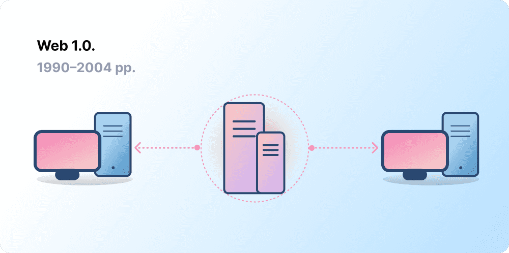
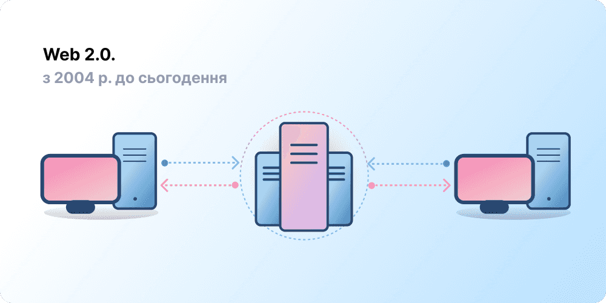
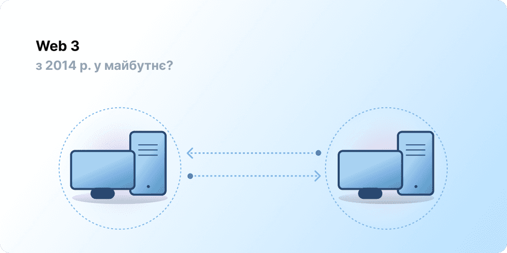

# Вступ до Web3 {#introduction}

<ListenToPlayer slug="/web3/" />

Централізація допомогла залучити мільярди людей до всесвітньої мережі та створила стабільну, надійну інфраструктуру для неї. Однак при цьому кілька централізованих організацій мають вплив на великих ділянках всесвітньої мережі, в односторонньому порядку вирішуючи, що слід дозволяти.

Web3 дає змогу розв’язати цю дилему. Замість мережі, монополізованої великими технологічними компаніями, Web3 впроваджує децентралізацію, створюється, керується користувачами та належить саме їм. Web3 передає владу в руки окремих осіб, а не корпорацій.
Перш ніж говорити про Web3, згадаймо, як ми до цього дійшли.

<Divider />

## Ранній Інтернет {#early-internet}

Більшість людей вважають мережу незмінною частиною сучасного життя — її було винайдено, і відтоді вона існує дотепер. Однак та мережа, якою її більшість із нас знає сьогодні, дещо відрізняється від тієї, що була спочатку. Для кращого розуміння розіб’ємо коротку історію мережі на окремі періоди — Web 1.0 і Web 2.0.

### Web 1.0: тільки для читання (1990–2004 рр.) {#web1}

У 1989 році в CERN, Женева, Тім Бернерс-Лі займався розробкою протоколів, які згодом стали всесвітньою мережею. У чому ж полягала його ідея? Створити відкриті децентралізовані протоколи, які дадуть змогу обмінюватись інформацією з будь-якого куточка світу.

Перше втілення ідеї Бернерса-Лі, тепер відоме як «Web 1.0», відбулося приблизно в 1990–2004 роках. Мережа Web 1.0 була в основному сукупністю статичних сайтів, що належали компаніям, а взаємодія між користувачами була практично мінімальною, адже окремі особи рідко створювали контент. Тому цю версію інтернету почали називати «доступною лише для читання».

### Web 2.0: для читання та написання (від 2004 р. до сьогодні) {#web2}

Період Web 2.0 розпочався у 2004 році з появою соціальних мереж. Замість доступу лише для читання, інтернет надав можливість читання та написання. Тепер компанії почали не тільки надавати користувачам контент, а й пропонувати їм платформи для обміну створеним користувачами контентом і взаємодії між ними. Оскільки в інтернеті з’являлося все більше людей, кілька провідних компаній почали контролювати непропорційну кількість трафіку й цінності, створені в мережі. Версія Web 2.0 також породила модель доходів, орієнтовану на рекламу. Хоча користувачі могли створювати контент, вони не володіли ним і не отримували вигоду від його монетизації.

<Divider />

## Web 3.0: для читання, написання та володіння {#web3}

Поняття «Web 3.0» було введено співзасновником [Ethereum](/what-is-ethereum/) Гевіном Вудом невдовзі після запуску Ethereum у 2014 році. Гевін сформулював рішення для проблеми, від якої потерпали багато перших власників криптовалюти: мережа вимагала забагато довіри. Адже мережа, яку люди знають і використовують сьогодні, значною мірою покладається на довіру кільком приватним компаніям, що діють в інтересах громадськості.

### Що таке Web3? {#what-is-web3}

Web3 став універсальним терміном для концепції нового, кращого інтернету. По суті, Web3 використовує блокчейн, криптовалюти й NFT, щоб повернути владу користувачам завдяки праву власності. [У дописі у Twitter за 2020 рік](https://twitter.com/himgajria/status/1266415636789334016) це було влучно сказано: Web1 був лише для читання, Web2 — для читання та запису, а Web3 буде для читання, запису та володіння.

#### Основні ідеї Web3 {#core-ideas}

Хоча дати чітке визначення того, що таке Web3, складно, створення цієї версії мережі регулюється кількома основними принципами.

- **Web3 є децентралізованим:** замість великих сегментів Інтернету, що контролюються та належать централізованим організаціям, право власності розподіляється між його розробниками та користувачами.
- **Web3 не вимагає дозволів:** кожен має рівний доступ до участі у Web3, і ніхто не виключається.
- **Web3 має вбудовані платежі:** він використовує криптовалюту для витрачання та надсилання грошей онлайн, не покладаючись на застарілу інфраструктуру банків і платіжних систем.
- **Web3 не вимагає довіри:** він працює з використанням стимулів та економічних механізмів, а не покладається на довірені треті сторони.

### Чому мережа Web3 важлива? {#why-is-web3-important}

Хоча ключові функції Web3 не ізольовані та не вкладаються в чіткі категорії, для простоти й кращого розуміння ми спробували розділити їх.

#### Власність {#ownership}

Web3 дає вам право власності на ваші цифрові активи безпрецедентним способом. Наприклад, припустімо, ви граєте в гру в мережі Web2. Якщо ви купуєте предмет у грі, він прив’язується безпосередньо до вашого облікового запису. Якщо розробники гри видалять ваш обліковий запис, ви втратите придбані предмети. Або ж якщо ви припините грати в гру, то втратите цінність, яку інвестували в придбані в ній предмети.

Web3 дозволяє пряме володіння через [невзаємозамінні токени (NFT)](/glossary/#nft). Ніхто не зможе відібрати у вас право власності — навіть творці гри. А якщо ви припините грати, то зможете продати або обміняти свої ігрові предмети на відкритих ринках і окупити їх вартість. Дослідіть [ончейн-ігри](/gaming/), щоб побачити це в дії.

<Alert variant="update">
<AlertEmoji text=":eyes:"/>
<AlertContent className="flex-row items-center justify-between">
  
Дізнайтеся більше про NFT

  <ButtonLink href="/nft/">
    Докладніше про NFT
  </ButtonLink>
</AlertContent>
</Alert>

#### Стійкість до цензури {#censorship-resistance}

Динаміка взаємодії між платформами й творцями контенту вкрай незбалансована.

OnlyFans — це сайт із контентом для дорослих із понад 1 мільйоном творців, багато з яких використовують платформу як основне джерело доходу. У серпні 2021 року OnlyFans оголосили про плани заборонити контент сексуального характеру. Оголошення викликало обурення серед творців, які вважали, що в них крадуть дохід на платформі, яку вони допомогли створити. Після негативної реакції рішення було швидко скасовано. Хоча творці контенту виграли цю битву, цей приклад вказує на їхню проблему в мережі Web 2.0: ви втрачаєте репутацію та кількість накопичених читачів, якщо залишаєте платформу.

У мережі Web3 ваші дані перебувають у блокчейні. Вирішивши залишити платформу, ви зможете забрати свою репутацію із собою, під’єднавши її до іншого інтерфейсу, який краще відповідає вашим цінностям.

Web 2.0 вимагає від творців контенту довіряти платформам і сподіватися, що ті не змінюватимуть правила, тоді як опір цензурі є невіддільною властивістю платформ Web3.

#### Децентралізовані автономні організації (DAOs) {#daos}

Окрім володіння своїми даними у Web3, ви можете володіти платформою як колектив, використовуючи токени, які діють як акції компанії. DAO дають змогу координувати децентралізоване володіння платформою та приймати рішення щодо її майбутнього.

Технічно DAO визначаються як узгоджені [смарт-контракти](/glossary/#smart-contract), які автоматизують децентралізоване прийняття рішень щодо пулу ресурсів (токенів). Користувачі з токенами голосують за те, як витрачатимуться ресурси, і код автоматично виконує результати голосування.

Однак багато спільнот Web3 вважаються організаціями DAO. Усі ці спільноти мають різні рівні децентралізації й автоматизації за допомогою коду. Зараз ми досліджуємо, що таке DAO і як вони можуть розвиватися в майбутньому.

<Alert variant="update">
<AlertEmoji text=":eyes:"/>
<AlertContent className="flex-row items-center justify-between">
  
Докладніше про DAO

  <ButtonLink href="/dao/">
    Докладніше про DAO
  </ButtonLink>
</AlertContent>
</Alert>

### Ідентичність {#identity}

Традиційно ви створювали обліковий запис для кожної платформи, яку використовуєте. Наприклад, у вас може бути обліковий запис Twitter, обліковий запис YouTube і обліковий запис Reddit. Хочете змінити своє відображуване ім’я або зображення профілю? Це потрібно зробити в кожному обліковому записі. У деяких випадках можна використовувати вхід через облікові записи соцмереж, але це створює знайому проблему — цензура. В одну мить ці платформи можуть заблокувати вам доступ до всього вашого онлайн-життя. Що ще гірше, для створення облікового запису багато платформ вимагають від вас довірити їм вашу особисту інформацію.

Web3 вирішує ці проблеми, дозволяючи вам контролювати свою цифрову ідентичність за допомогою адреси Ethereum і профілю [Ethereum Name Service (ENS)](/glossary/#ens). Використання адреси Ethereum передбачає єдиний вхід для всіх платформ — безпечний, стійкий до цензури й анонімний.

### Вбудовані платежі {#native-payments}

Платіжна інфраструктура Web2 покладається на банки й інструменти обробки платежів, залишаючи людей без банківських рахунків і тих, хто проживає в межах «незручної» країни, за бортом.
Web3 використовує токени, як-от [ETH](/glossary/#ether), щоб надсилати гроші безпосередньо в браузері та не потребує довіреної третьої сторони.

<ButtonLink href="/eth/">
  Докладніше про ETH
</ButtonLink>

## Обмеження Web3 {#web3-limitations}

Попри численні переваги мережі Web3 в її нинішньому вигляді, досі існує багато обмежень, які необхідно вирішити, щоб дати змогу цій екосистемі розцвісти на повну.

### Доступність {#accessibility}

Важливі функції Web3, як-от вхід за допомогою Ethereum, уже доступні для використання безкоштовно. Але відносна вартість транзакцій досі є зависокою для багатьох користувачів. Web3 рідше використовуватиметься в бідніших країнах, що розвиваються, через високу комісію за транзакції. В Ethereum ці проблеми вирішуються за допомогою [плану розвитку](/roadmap/) та [рішень для масштабування на 2-му рівні](/glossary/#layer-2). Технологія готова, але нам потрібні вищі рівні впровадження на рівні 2, щоб зробити мережу Web3 доступною для всіх.

### Досвід користувача {#user-experience}

Технічний бар’єр для доступу до використання Web3 зараз занадто високий. Користувачі повинні усвідомлювати проблеми безпеки, розуміти складну технічну документацію й орієнтуватися в складних інтерфейсах. [Постачальники гаманців](/wallets/find-wallet/), зокрема, працюють над вирішенням цієї проблеми, але потрібен більший прогрес, перш ніж Web3 отримає масове поширення.

### Освіта {#education}

Web3 впроваджує нові парадигми, які вимагають вивчення інших ментальних моделей, відмінних від тих, що використовуються у Web 2.0. Подібна освітня кампанія відбулася, коли Web1.0 набирав популярності наприкінці 1990-х; прихильники всесвітньої павутини використовували безліч освітніх методів для просвіти громадськості: від простих метафор (інформаційна магістраль, браузери, вебсерфінг) до [телевізійних передач](https://www.youtube.com/watch?v=SzQLI7BxfYI). Мережа Web3 не складна, але інша. Навчальні ініціативи, які розповідатимуть користувачам Web2 про парадигми Web3, є життєво необхідними для успіху.

Ethereum.org робить внесок в освіту щодо Web3 через нашу [Програму перекладів](/contributing/translation-program/), метою якої є переклад важливого контенту Ethereum якомога більшою кількістю мов.

### Централізована інфраструктура {#centralized-infrastructure}

Екосистема Web3 молода та швидко розвивається. Як наслідок, наразі вона залежить переважно від централізованої інфраструктури (GitHub, Twitter, Discord тощо). Багато компаній Web3 поспішають заповнити ці прогалини, але створення якісної та надійної інфраструктури вимагає часу.

## Децентралізоване майбутнє {#decentralized-future}

Web3 — це молода екосистема, що розвивається. Гевін Вуд ввів цей термін у 2014 році, але багато з цих ідей стали реальністю лише нещодавно. Лише за останній рік спостерігається значний сплеск інтересу до криптовалюти, удосконалення рішень для масштабування рівня 2, масові експерименти з новими формами керування та прориви у сфері цифрової ідентифікації.

Ми лише на початку створення кращого інтернету за допомогою версії Web3, але, оскільки ми продовжуємо вдосконалювати інфраструктуру, яка його підтримуватиме, майбутнє мережі виглядає успішним.

## Як я можу долучитися {#get-involved}

- [Отримайте гаманець](/wallets/)
- [Знайдіть спільноту](/community/)
- [Досліджуйте застосунки Web3](/apps/)
- [Приєднайтеся до DAO](/dao/)
- [Створюйте на Web3](/developers/)

## Для подальшого читання {#further-reading}

Мережа Web3 не має жорсткої регламентації. Різні учасники спільноти мають різне ставлення щодо цього. Ось деякі з них:

- [Що таке Web3? Пояснення децентралізованого Інтернету майбутнього](https://www.freecodecamp.org/news/what-is-web3) – _Надер Дабіт_
- [Осмислення Web 3](https://medium.com/l4-media/making-sense-of-web-3-c1a9e74dcae) – _Джош Старк_
- [Чому Web3 має значення](https://a16zcrypto.com/posts/article/why-web3-matters/) — _Кріс Діксон_
- [Чому децентралізація має значення](https://onezero.medium.com/why-decentralization-matters-5e3f79f7638e) — _Кріс Діксон_
- [Ландшафт Web3](https://a16z.com/wp-content/uploads/2021/10/The-web3-Readlng-List.pdf) – _a16z_
- [Дебати про Web3](https://www.notboring.co/p/the-web3-debate) – _Пакі Маккормік_

<QuizWidget quizKey="web3" />
