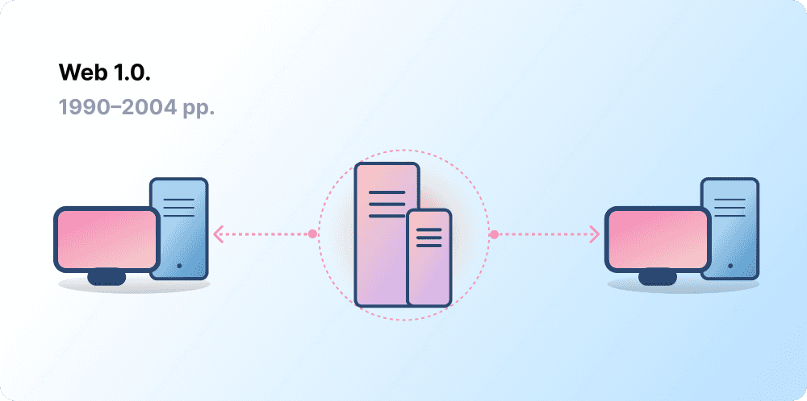
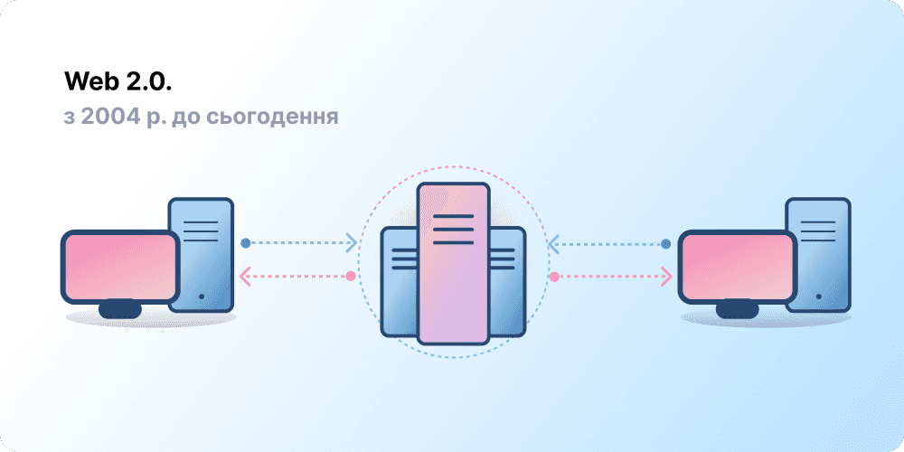
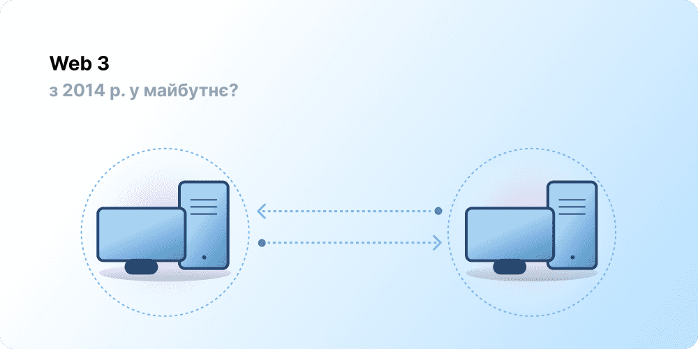

Централізація допомогла залучити мільярди людей до Всесвітньої павутини та створила стабільну, надійну інфраструктуру, на якій вона існує. Водночас невелика кількість централізованих організацій утримує контроль над значними частинами Всесвітньої павутини, одноосібно вирішуючи, що має бути дозволено, а що ні.

Web3 є відповіддю на цю дилему. Замість мережі, монополізованої великими технологічними компаніями, Web3 підтримує децентралізацію, а її розбудовою, управлінням та володінням займаються самі користувачі. Web3 передає владу в руки окремих осіб, а не корпорацій.
Перш ніж говорити про Web3, давайте розглянемо, як ми до цього прийшли.

<Divider />

## Рання мережа {#early-internet}

Більшість людей сприймає мережу як невіддільну опору сучасного життя — її винайшли, і відтоді вона просто існує. Однак мережа, яку більшість із нас знає сьогодні, суттєво відрізняється від того, якою її уявляли спочатку. Щоб краще це зрозуміти, корисно розділити коротку історію мережі на умовні періоди — Web 1.0 та Веб 2.0.

### Web 1.0: Тільки для читання (1990-2004) {#web1}

У 1989 році в ЦЕРНі (Женева) Тім Бернерс-Лі працював над розробкою протоколів, які згодом стали Всесвітньою павутиною. Його ідея? Створити відкриті, децентралізовані протоколи, які б дозволяли обмінюватися інформацією з будь-якої точки Землі.

Перший етап творіння Бернерса-Лі, нині відомий як «Web 1.0», тривав приблизно з 1990 по 2004 рік. Web 1.0 складався переважно зі статичних вебсайтів, що належали компаніям, а взаємодія між користувачами була майже нульовою — окремі особи рідко створювали контент, через що цей етап став відомим як мережа «тільки для читання».

### Веб 2.0: Читання та запис (2004-дотепер) {#web2}

Період Веб 2.0 розпочався у 2004 році з появою платформ соціальних мереж. Замість формату «тільки для читання» мережа еволюціонувала до «читання та запису». Компанії не лише надавали контент користувачам, але й почали створювати платформи для обміну контентом, створеним самими користувачами, та для їхньої взаємодії між собою. Зі збільшенням кількості користувачів в інтернеті невелика група провідних компаній почала контролювати непропорційно велику частку трафіку та цінності, що генерувалися в мережі. Веб 2.0 також породив модель доходу на основі реклами. Хоча користувачі могли створювати контент, вони не володіли ним і не отримували вигоди від його монетизації.

<Divider />

## Веб 3.0: Читання, запис, володіння {#web3}

Концепцію «Веб 3.0» сформулював співзасновник [Етеріуму](/) Гевін Вуд невдовзі після запуску Етеріуму у 2014 році. Гевін висловив рішення проблеми, яку відчували багато перших користувачів крипто: мережа вимагала занадто багато довіри. Тобто більша частина мережі, яку люди знають і використовують сьогодні, покладається на довіру до кількох приватних компаній, які нібито діють у найкращих інтересах громадськості.

### Що таке Web3? {#what-is-web3}

Web3 став загальним терміном для бачення нового, кращого інтернету. За своєю суттю Web3 використовує блокчейни, криптовалюти та NFT, щоб повернути владу користувачам у формі права власності. [У дописі в Twitter за 2020 рік](https://twitter.com/himgajria/status/1266415636789334016) це було сказано найкраще: Web1 був тільки для читання, Веб2 — для читання та запису, Web3 буде для читання, запису та володіння.

#### Основні ідеї Web3 {#core-ideas}

Хоча дати чітке визначення тому, що таке Web3, досить складно, його створення керується кількома основними принципами.

- **Web3 децентралізований:** замість того, щоб великі частини інтернету контролювалися та належали централізованим організаціям, право власності розподіляється між його творцями та користувачами.
- **Web3 бездозвільний:** кожен має рівний доступ до участі у Web3, і ніхто не виключається.
- **Web3 має вбудовані платежі:** він використовує криптовалюту для витрачання та надсилання грошей в інтернеті замість того, щоб покладатися на застарілу інфраструктуру банків та платіжних систем.
- **Web3 бездовірчий:** він працює за допомогою стимулів та економічних механізмів замість того, щоб покладатися на довірених третіх осіб.

### Чому Web3 важливий? {#why-is-web3-important}

Хоча ключові переваги Web3 не є ізольованими і не вписуються в чіткі категорії, для простоти ми спробували розділити їх, щоб зробити їх більш зрозумілими.

#### Право власності {#ownership}

Web3 надає вам право власності на ваші цифрові активи безпрецедентним чином. Наприклад, припустімо, ви граєте в гру Веб2. Якщо ви купуєте внутрішньоігровий предмет, він прив'язується безпосередньо до вашого акаунта. Якщо творці гри видалять ваш акаунт, ви втратите ці предмети. Або, якщо ви перестанете грати в гру, ви втратите цінність, яку вклали у свої внутрішньоігрові предмети.

Web3 забезпечує пряме право власності через [невзаємозамінні токени (NFT)](/glossary/#nft). Ніхто, навіть творці гри, не має повноважень відібрати ваше право власності. А якщо ви перестанете грати, ви зможете продати або обміняти свої внутрішньоігрові предмети на відкритих ринках і повернути їхню вартість. Дослідіть [ончейн-ігри](/gaming/), щоб побачити це в дії.

<Alert variant="update">
<AlertEmoji text=":eyes:"/>
<AlertContent className="flex-row items-center justify-between">
  
Дізнайтеся більше про NFT

  <ButtonLink href="/nft/">
    Більше про NFT
  </ButtonLink>
</AlertContent>
</Alert>

#### Стійкість до цензури {#censorship-resistance}

Динаміка влади між платформами та творцями контенту є вкрай незбалансованою.

OnlyFans — це сайт із контентом для дорослих, який створюють користувачі, з понад 1 мільйоном творців контенту, багато з яких використовують платформу як основне джерело доходу. У серпні 2021 року OnlyFans оголосив про плани заборонити відвертий сексуальний контент. Це оголошення викликало обурення серед творців на платформі, які відчули, що їх позбавляють доходу на платформі, яку вони допомогли створити. Після бурхливої реакції рішення було швидко скасовано. Попри те, що творці виграли цю битву, вона підкреслює проблему для творців Веб 2.0: ви втрачаєте репутацію та підписників, яких ви здобули, якщо залишаєте платформу.

У Web3 ваші дані зберігаються в блокчейні. Коли ви вирішуєте покинути платформу, ви можете забрати свою репутацію із собою, підключивши її до іншого інтерфейсу, який більше відповідає вашим цінностям.

Веб 2.0 вимагає від творців контенту довіряти платформам у тому, що вони не змінять правила, але стійкість до цензури є вбудованою функцією платформи Web3.

#### Децентралізовані автономні організації (DAO) {#daos}

Окрім володіння своїми даними у Web3, ви можете володіти платформою колективно, використовуючи токени, які діють як акції компанії. DAO дозволяють координувати децентралізоване володіння платформою та приймати рішення щодо її майбутнього.

Технічно DAO визначаються як узгоджені [смартконтракти](/glossary/#smart-contract), які автоматизують децентралізоване прийняття рішень щодо пулу ресурсів (токенів). Користувачі з токенами віддають свої голоси за те, як витрачаються ресурси, а код автоматично виконує результати голосування.

Однак люди визначають багато спільнот Web3 як DAO. Усі ці спільноти мають різні рівні децентралізації та автоматизації за допомогою коду. Наразі ми досліджуємо, що таке DAO і як вони можуть еволюціонувати в майбутньому.

<Alert variant="update">
<AlertEmoji text=":eyes:"/>
<AlertContent className="flex-row items-center justify-between">
  
Дізнайтеся більше про DAO

  <ButtonLink href="/dao/">
    Більше про DAO
  </ButtonLink>
</AlertContent>
</Alert>

### Ідентичність {#identity}

Традиційно ви створювали б акаунт для кожної платформи, яку використовуєте. Наприклад, у вас може бути акаунт у Twitter, акаунт у YouTube та акаунт у Reddit. Хочете змінити своє відображуване ім'я або зображення профілю? Вам доведеться зробити це в кожному акаунті. У деяких випадках ви можете використовувати вхід через соціальні мережі, але це створює знайому проблему — цензуру. Одним кліком ці платформи можуть заблокувати вам доступ до всього вашого онлайн-життя. Ще гірше те, що багато платформ вимагають від вас довірити їм особисту інформацію для створення акаунта.

Web3 вирішує ці проблеми, дозволяючи вам контролювати свою цифрову ідентичність за допомогою адреси Етеріуму та профілю [Служби імен Етеріуму (ENS)](/glossary/#ens). Використання адреси Етеріуму забезпечує єдиний вхід на різних платформах, який є безпечним, стійким до цензури та анонімним.

### Вбудовані платежі {#native-payments}

Платіжна інфраструктура Веб2 покладається на банки та платіжні системи, виключаючи людей без банківських рахунків або тих, хто випадково живе в межах «неправильної» країни.
Web3 використовує токени, такі як [ETH](/glossary/#ether), для надсилання грошей безпосередньо в браузері та не потребує довіреної третьої сторони.

<ButtonLink href="/what-is-ether/">
  Більше про ETH
</ButtonLink>

## Обмеження Web3 {#web3-limitations}

Попри численні переваги Web3 у його нинішньому вигляді, все ще існує багато обмежень, які екосистема повинна подолати для свого процвітання.

### Доступність {#accessibility}

Важливі функції Web3, такі як «Вхід з Етеріумом» (Sign-in with Ethereum), вже доступні для безкоштовного використання будь-ким. Але відносна вартість транзакцій все ще залишається непомірно високою для багатьох. Web3 з меншою ймовірністю буде використовуватися в менш заможних країнах, що розвиваються, через високі комісії за транзакції. В Етеріумі ці виклики вирішуються за допомогою [дорожньої карти](/roadmap/) та [рішень для масштабування рівня 2 (l2)](/glossary/#layer-2). Технологія готова, але нам потрібен вищий рівень впровадження на рівні 2 (l2), щоб зробити Web3 доступним для всіх.

### Користувацький досвід {#user-experience}

Технічний бар'єр для входу у використання Web3 наразі занадто високий. Користувачі повинні усвідомлювати проблеми безпеки, розуміти складну технічну документацію та орієнтуватися в неінтуїтивних користувацьких інтерфейсах. [Провайдери гаманців](/wallets/find-wallet/), зокрема, працюють над вирішенням цієї проблеми, але потрібен більший прогрес, перш ніж Web3 буде масово впроваджено.

### Освіта {#education}

Web3 запроваджує нові парадигми, які вимагають вивчення інших ментальних моделей, ніж ті, що використовуються у Веб 2.0. Подібна освітня кампанія відбувалася, коли Web 1.0 набував популярності наприкінці 1990-х років; прихильники всесвітньої павутини використовували безліч освітніх методів для навчання громадськості: від простих метафор (інформаційна магістраль, браузери, серфінг у мережі) до [телевізійних трансляцій](https://www.youtube.com/watch?v=SzQLI7BxfYI). Web3 не є складним, але він інший. Освітні ініціативи, що інформують користувачів Веб2 про ці парадигми Web3, є життєво важливими для його успіху.

Ethereum.org робить свій внесок в освіту щодо Web3 через нашу [Програму перекладів](/contributing/translation-program/), маючи на меті перекласти важливий контент про Етеріум якомога більшою кількістю мов.

### Централізована інфраструктура {#centralized-infrastructure}

Екосистема Web3 молода і швидко розвивається. Як наслідок, наразі вона залежить переважно від централізованої інфраструктури (GitHub, Twitter, Discord тощо). Багато компаній у сфері Web3 поспішають заповнити ці прогалини, але створення високоякісної та надійної інфраструктури потребує часу.

## Децентралізоване майбутнє {#decentralized-future}

Web3 — це молода екосистема, що розвивається. Гевін Вуд запровадив цей термін у 2014 році, але багато з цих ідей лише нещодавно стали реальністю. Лише за останній рік відбувся значний сплеск інтересу до криптовалюти, покращення рішень для масштабування рівня 2 (l2), масові експерименти з новими формами управління та революції в цифровій ідентичності.

Ми знаходимося лише на початку створення кращої мережі за допомогою Web3, але оскільки ми продовжуємо вдосконалювати інфраструктуру, яка її підтримуватиме, майбутнє мережі виглядає світлим.

## Як я можу долучитися {#get-involved}

- [Отримати гаманець](/wallets/)
- [Знайти спільноту](/community/)
- [Дослідити застосунки Web3](/apps/)
- [Приєднатися до DAO](/dao/)
- [Створювати на Web3](/developers/)

## Додаткові матеріали {#further-reading}

Web3 не має жорсткого визначення. Різні учасники спільноти мають різні погляди на нього. Ось кілька з них:

- [Що таке Web3? Пояснення децентралізованого інтернету майбутнього](https://www.freecodecamp.org/news/what-is-web3) — _Надер Дабіт_
- [Осмислення Web 3](https://medium.com/l4-media/making-sense-of-web-3-c1a9e74dcae) — _Джош Старк_
- [Чому Web3 має значення](https://a16zcrypto.com/posts/article/why-web3-matters/) — _Кріс Діксон_
- [Чому децентралізація має значення](https://onezero.medium.com/why-decentralization-matters-5e3f79f7638e) — _Кріс Діксон_
- [Ландшафт Web3](https://a16z.com/wp-content/uploads/2021/10/The-web3-Readlng-List.pdf) — _a16z_
- [Дебати про Web3](https://www.notboring.co/p/the-web3-debate) — _Пакі Маккормік_

<QuizWidget quizKey="web3" />