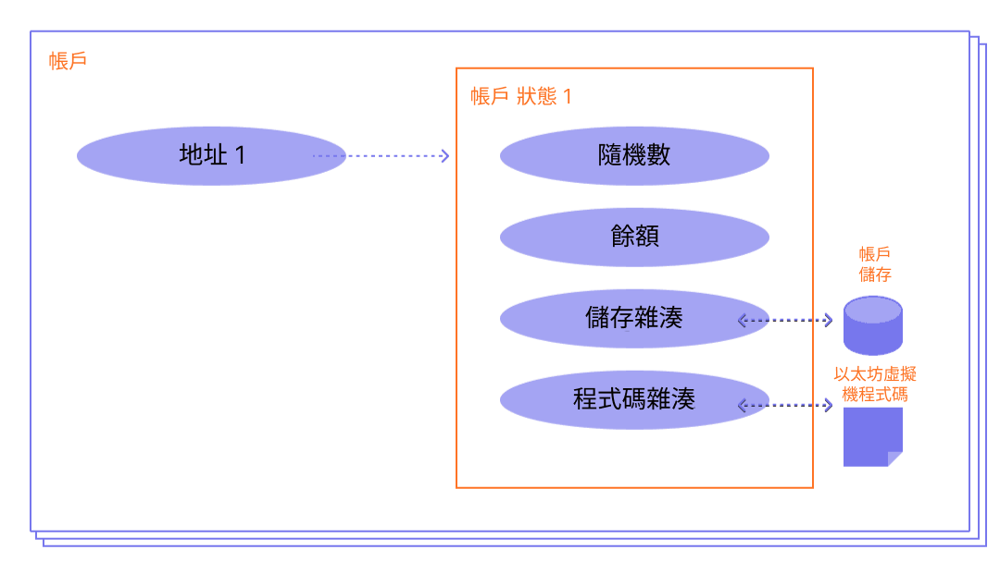

一個[以太坊](/)帳戶是一個擁有以太幣 (ETH) 餘額的實體，可以在以太坊上發送訊息。帳戶可以由使用者控制，或是部署為智能合約。

## 先決條件 {#prerequisites}

為了幫助你更了解本頁面，我們建議你先閱讀我們的[以太坊簡介](/developers/docs/intro-to-ethereum/)。

## 帳戶類型 {#types-of-account}

以太坊有兩種帳戶類型：

- 外部擁有帳戶 (EOA) – 由任何擁有私鑰的人控制
- 合約帳戶 – 部署到網路的智能合約，由程式碼控制。了解[智能合約](/developers/docs/smart-contracts/)

這兩種帳戶類型都能夠：

- 接收、持有和發送 ETH 與代幣
- 與已部署的智能合約互動

### 主要差異 {#key-differences}

**外部擁有帳戶**

- 建立帳戶不需任何費用
- 可以發起交易
- 外部擁有帳戶之間的交易只能是 ETH/代幣轉帳
- 由一對密碼學金鑰組成：控制帳戶活動的公鑰和私鑰

**合約帳戶**

- 建立合約需要成本，因為你會使用到網路儲存空間
- 只能在接收到交易時發送訊息作為回應
- 從外部帳戶到合約帳戶的交易可以觸發程式碼，進而執行許多不同的動作，例如轉帳代幣，甚至建立新合約
- 合約帳戶沒有私鑰。相反地，它們由智能合約程式碼的邏輯控制

## 帳戶剖析 {#an-account-examined}

以太坊帳戶有四個欄位：

- `nonce` – 一個計數器，表示從外部擁有帳戶發送的交易數量，或由合約帳戶建立的合約數量。每個帳戶只能執行一個具有特定隨機數的交易，這可以防止重放攻擊（即已簽署的交易被重複廣播和執行）。
- `balance` – 該地址擁有的 Wei 數量。Wei 是 ETH 的面額，1 ETH 等於 1e+18 Wei。
- `codeHash` – 此雜湊指向以太坊虛擬機 (EVM) 上帳戶的_程式碼_。合約帳戶編寫了可以執行不同操作的程式碼片段。如果帳戶收到訊息呼叫，此 EVM 程式碼就會被執行。與其他帳戶欄位不同，它無法被更改。所有這些程式碼片段都包含在狀態資料庫中，並對應其雜湊以便日後檢索。此雜湊值被稱為 codeHash。對於外部擁有帳戶，codeHash 欄位是空字串的雜湊。
- `storageRoot` – 有時被稱為儲存雜湊。這是一個 256 位元雜湊，指向[默克爾帕特里夏樹](/developers/docs/data-structures-and-encoding/patricia-merkle-trie/)的根節點，該樹對帳戶的儲存內容（256 位元整數值之間的映射）進行編碼，並在樹中編碼為從 256 位元整數金鑰的 Keccak-256 雜湊到 RLP 編碼的 256 位元整數值的映射。此樹對該帳戶儲存內容的雜湊進行編碼，預設為空。


_圖表改編自 [Ethereum EVM illustrated](https://takenobu-hs.github.io/downloads/ethereum_evm_illustrated.pdf)_

## 外部擁有帳戶與金鑰對 {#externally-owned-accounts-and-key-pairs}

帳戶由一對密碼學金鑰組成：公鑰和私鑰。它們有助於證明交易確實是由發送者簽署的，並防止偽造。你的私鑰是用來簽署交易的，因此它賦予你對帳戶相關資金的保管權。你從未真正持有加密貨幣，你持有的是私鑰——資金始終在以太坊的帳本上。

這可以防止惡意行為者廣播假交易，因為你始終可以驗證交易的發送者。

如果 Alice 想從自己的帳戶發送以太幣到 Bob 的帳戶，Alice 需要建立一個交易請求並將其發送到網路進行驗證。以太坊使用公鑰密碼學確保 Alice 可以證明她最初發起了該交易請求。如果沒有密碼學機制，惡意對手 Eve 可以輕易地公開廣播一個類似「從 Alice 的帳戶發送 5 ETH 到 Eve 的帳戶」的請求，而沒有人能夠驗證這不是來自 Alice。

## 建立帳戶 {#account-creation}

當你想要建立帳戶時，大多數的函式庫會為你產生一個隨機的私鑰。

私鑰由 64 個十六進位字元組成，並且可以使用密碼進行加密。

範例：

`fffffffffffffffffffffffffffffffebaaedce6af48a03bbfd25e8cd036415f`

公鑰是使用[橢圓曲線數位簽章演算法](https://wikipedia.org/wiki/Elliptic_Curve_Digital_Signature_Algorithm)從私鑰產生的。你可以透過取公鑰的 Keccak-256 雜湊的最後 20 個位元組，並在開頭加上 `0x` 來獲得帳戶的公開地址。

這意味著外部擁有帳戶 (EOA) 具有 42 個字元的地址（20 個位元組的片段，即 40 個十六進位字元，加上 `0x` 前綴）。

範例：

`0x5e97870f263700f46aa00d967821199b9bc5a120`

以下範例展示如何使用名為 [Clef](https://geth.ethereum.org/docs/tools/clef/introduction) 的簽署工具來產生新帳戶。Clef 是一個帳戶管理和簽署工具，與以太坊客戶端 [Geth](https://geth.ethereum.org) 捆綁在一起。`clef newaccount` 指令會建立一個新的金鑰對，並將它們儲存在加密的金鑰庫中。

```
> clef newaccount --keystore <path>

請為要建立的新帳戶輸入密碼：
> <password>

------------
INFO [10-28|16:19:09.156] 你的新金鑰已產生       address=0x5e97870f263700f46aa00d967821199b9bc5a120
WARN [10-28|16:19:09.306] 請備份你的金鑰檔案      path=/home/user/go-ethereum/data/keystore/UTC--2022-10-28T15-19-08.000825927Z--5e97870f263700f46aa00d967821199b9bc5a120
WARN [10-28|16:19:09.306] 請記住你的密碼！
已產生帳戶 0x5e97870f263700f46aa00d967821199b9bc5a120
```

[Geth 文件](https://geth.ethereum.org/docs)

你可以從私鑰推導出新的公鑰，但無法從公鑰推導出私鑰。保持私鑰安全至關重要，顧名思義，它必須是**私密的**。

你需要私鑰來簽署訊息和交易，這會輸出一個簽章。其他人隨後可以取得該簽章來推導出你的公鑰，從而證明訊息的作者。在你的應用程式中，你可以使用 JavaScript 函式庫將交易發送到網路。

## 合約帳戶 {#contract-accounts}

合約帳戶同樣具有 42 個字元的十六進位地址：

範例：

`0x06012c8cf97bead5deae237070f9587f8e7a266d`

合約地址通常在合約部署到以太坊區塊鏈時給定。該地址來自建立者的地址以及從該地址發送的交易數量（「隨機數」）。

## 驗證者金鑰 {#validators-keys}

以太坊中還有另一種類型的金鑰，這是在以太坊從工作量證明 (PoW) 切換到基於權益證明 (PoS) 的共識時引入的。這些是「BLS」金鑰，用於識別驗證者。這些金鑰可以有效地聚合，以減少網路達成共識所需的頻寬。如果沒有這種金鑰聚合，驗證者的最低質押要求將會高得多。

[更多關於驗證者金鑰的資訊](/developers/docs/consensus-mechanisms/pos/keys/)。

## 關於錢包的注意事項 {#a-note-on-wallets}

帳戶不是錢包。錢包是一個介面或應用程式，讓你能夠與你的以太坊帳戶（無論是外部擁有帳戶還是合約帳戶）進行互動。

## 視覺化示範 {#a-visual-demo}

觀看 Austin 為你講解雜湊函式和金鑰對。

<VideoWatch slug="hash-function-eth-build" />

<VideoWatch slug="key-pair-eth-build" />

## 延伸閱讀 {#further-reading}

- [了解以太坊帳戶](https://info.etherscan.com/understanding-ethereum-accounts/) - Etherscan

_知道有什麼社群資源對你有幫助嗎？編輯此頁面並加入它！_

## 相關主題 {#related-topics}

- [智能合約](/developers/docs/smart-contracts/)
- [交易](/developers/docs/transactions/)