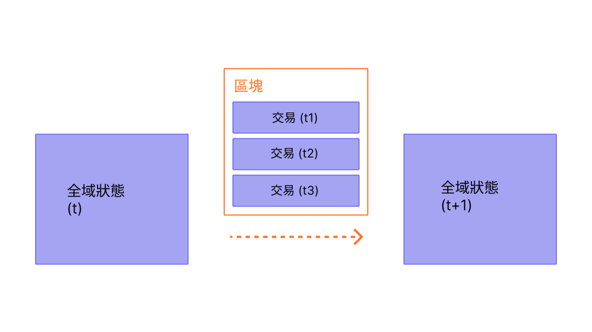

區塊是一批交易的集合，並包含鏈中前一個區塊的雜湊。這將區塊（在鏈中）連結在一起，因為雜湊是從區塊資料透過密碼學推導出來的。這可以防止詐欺，因為歷史上任何一個區塊的改變都會使所有後續區塊無效，因為所有後續的雜湊都會改變，而每個運行區塊鏈的人都會注意到。

## 先決條件 {#prerequisites}

區塊是一個對初學者非常友善的主題。但為了幫助你更了解本頁面，我們建議你先閱讀[帳戶](/developers/docs/accounts/)、[交易](/developers/docs/transactions/)以及我們的[以太坊簡介](/developers/docs/intro-to-ethereum/)。

## 為何需要區塊？ {#why-blocks}

為了確保[以太坊](/)網路上的所有參與者保持同步的狀態，並對精確的交易歷史達成共識，我們將交易分批放入區塊中。這意味著數十（或數百）筆交易會同時被提交、達成共識並同步。

_圖表改編自[以太坊 EVM 圖解](https://takenobu-hs.github.io/downloads/ethereum_evm_illustrated.pdf)_

透過拉開提交的間隔，我們給予所有網路參與者足夠的時間來達成共識：即使每秒發生數十次交易請求，以太坊上每十二秒才會建立並提交一次區塊。

## 區塊如何運作 {#how-blocks-work}

為了保存交易歷史，區塊有嚴格的排序（每個建立的新區塊都包含對其父區塊的參考），且區塊內的交易也有嚴格的排序。除了極少數情況外，在任何給定時間，網路上的所有參與者都對區塊的確切數量和歷史達成共識，並致力於將當前即時的交易請求分批放入下一個區塊中。

一旦網路上隨機選擇的驗證者組裝好一個區塊，它就會被傳播到網路的其餘部分；所有節點都會將此區塊新增到其區塊鏈的末端，然後選擇一個新的驗證者來建立下一個區塊。確切的區塊組裝過程和提交/共識過程目前由以太坊的「權益證明 (PoS)」協定所規範。

## 權益證明協定 {#proof-of-stake-protocol}

權益證明 (PoS) 意味著以下幾點：

- 驗證節點必須將 32 ETH 質押到存款合約中，作為防止不良行為的抵押品。這有助於保護網路，因為可證明的惡意活動會導致部分或全部的質押被銷毀。
- 在每個時槽（間隔十二秒）中，會隨機選擇一名驗證者作為區塊提案者。他們將交易捆綁在一起、執行它們並決定一個新的「狀態」。他們將這些資訊打包成一個區塊，並將其傳遞給其他驗證者。
- 收到新區塊消息的其他驗證者會重新執行交易，以確保他們同意對全域狀態提出的變更。假設區塊有效，他們會將其新增到自己的資料庫中。
- 如果驗證者收到同一個時槽有兩個衝突的區塊，他們會使用其分叉選擇演算法來挑選由最多質押 ETH 支持的那個區塊。

[更多關於權益證明的資訊](/developers/docs/consensus-mechanisms/pos)

## 區塊裡有什麼？ {#block-anatomy}

區塊內包含大量資訊。在最高層級，區塊包含以下欄位：

| 欄位            | 描述                                           |
| :--------------- | :---------------------------------------------------- |
| `slot`           | 該區塊所屬的時槽                         |
| `proposer_index` | 提出該區塊的驗證者 ID           |
| `parent_root`    | 前一個區塊的雜湊                       |
| `state_root`     | 狀態物件的根雜湊                     |
| `body`           | 包含多個欄位的物件，定義如下 |

區塊的 `body` 本身包含多個欄位：

| 欄位                | 描述                                      |
| :------------------- | :----------------------------------------------- |
| `randao_reveal`      | 用於選擇下一個區塊提案者的值   |
| `eth1_data`          | 關於存款合約的資訊           |
| `graffiti`           | 用於標記區塊的任意資料                |
| `proposer_slashings` | 將被罰沒的驗證者清單                 |
| `attester_slashings` | 將被罰沒的證明者清單                  |
| `attestations`       | 針對先前時槽所作的證明清單 |
| `deposits`           | 存款合約的新存款清單     |
| `voluntary_exits`    | 退出網路的驗證者清單           |
| `sync_aggregate`     | 用於服務輕客戶端的驗證者子集 |
| `execution_payload`  | 從執行客戶端傳遞的交易    |

`attestations` 欄位包含區塊中所有證明的清單。證明有其專屬的資料類型，其中包含多項資料。每個證明包含：

| 欄位              | 描述                                                    |
| :----------------- | :------------------------------------------------------------- |
| `aggregation_bits` | 參與此證明的驗證者清單    |
| `data`             | 包含多個子欄位的容器                            |
| `signature`        | 一組驗證者針對 `data` 部分的聚合簽章 |

`attestation` 中的 `data` 欄位包含以下內容：

| 欄位               | 描述                                                     |
| :------------------ | :-------------------------------------------------------------- |
| `slot`              | 該證明相關的時槽                             |
| `index`             | 進行證明的驗證者索引                                |
| `beacon_block_root` | 被視為鏈頭的信標區塊根雜湊 |
| `source`            | 最後一個已證明的檢查點                                   |
| `target`            | 最新的紀元邊界區塊                                 |

執行 `execution_payload` 中的交易會更新全域狀態。所有客戶端都會重新執行 `execution_payload` 中的交易，以確保新狀態與新區塊 `state_root` 欄位中的狀態相符。這就是客戶端如何判斷新區塊是否有效且可以安全地新增到其區塊鏈中的方式。`execution payload` 本身是一個包含多個欄位的物件。還有一個 `execution_payload_header`，其中包含有關執行資料的重要摘要資訊。這些資料結構的組織方式如下：

`execution_payload_header` 包含以下欄位：

| 欄位               | 描述                                                         |
| :------------------ | :------------------------------------------------------------------ |
| `parent_hash`       | 父區塊的雜湊                                            |
| `fee_recipient`     | 支付交易費用的帳戶地址                      |
| `state_root`        | 套用此區塊變更後的全域狀態根雜湊 |
| `receipts_root`     | 交易收據 Trie 的雜湊                               |
| `logs_bloom`        | 包含事件日誌的資料結構                                |
| `prev_randao`       | 用於隨機選擇驗證者的值                            |
| `block_number`      | 當前區塊的編號                                     |
| `gas_limit`         | 此區塊允許的最大燃料 (Gas)                                   |
| `gas_used`          | 此區塊實際使用的燃料 (Gas) 數量                         |
| `timestamp`         | 區塊時間                                                      |
| `extra_data`        | 作為原始位元組的任意附加資料                              |
| `base_fee_per_gas`  | 基礎費用值                                                  |
| `block_hash`        | 執行區塊的雜湊                                             |
| `transactions_root` | 負載中交易的根雜湊                        |
| `withdrawal_root`   | 負載中提款的根雜湊                         |

`execution_payload` 本身包含以下內容（請注意，這與標頭相同，差別在於它包含實際的交易清單和提款資訊，而不是交易的根雜湊）：

| 欄位              | 描述                                                         |
| :----------------- | :------------------------------------------------------------------ |
| `parent_hash`      | 父區塊的雜湊                                            |
| `fee_recipient`    | 支付交易費用的帳戶地址                      |
| `state_root`       | 套用此區塊變更後的全域狀態根雜湊 |
| `receipts_root`    | 交易收據 Trie 的雜湊                               |
| `logs_bloom`       | 包含事件日誌的資料結構                                |
| `prev_randao`      | 用於隨機選擇驗證者的值                            |
| `block_number`     | 當前區塊的編號                                     |
| `gas_limit`        | 此區塊允許的最大燃料 (Gas)                                   |
| `gas_used`         | 此區塊實際使用的燃料 (Gas) 數量                         |
| `timestamp`        | 區塊時間                                                      |
| `extra_data`       | 作為原始位元組的任意附加資料                              |
| `base_fee_per_gas` | 基礎費用值                                                  |
| `block_hash`       | 執行區塊的雜湊                                             |
| `transactions`     | 將被執行的交易清單                                 |
| `withdrawals`      | 提款物件清單                                          |

`withdrawals` 清單包含結構如下的 `withdrawal` 物件：

| 欄位            | 描述                        |
| :--------------- | :--------------------------------- |
| `address`        | 已提款的帳戶地址 |
| `amount`         | 提款金額                  |
| `index`          | 提款索引值             |
| `validatorIndex` | 驗證者索引值              |

## 區塊時間 {#block-time}

區塊時間是指區塊之間的間隔時間。在以太坊中，時間被劃分為十二秒的單位，稱為「時槽」。在每個時槽中，會選擇一名驗證者來提出區塊。假設所有驗證者都在線且功能完全正常，每個時槽都會有一個區塊，這意味著區塊時間為 12 秒。然而，有時驗證者在被呼叫提出區塊時可能處於離線狀態，這意味著時槽有時會是空的。

這種實作方式不同於基於工作量證明 (PoW) 的系統，後者的區塊時間是機率性的，並由協定的目標挖礦難度進行調整。以太坊的[平均區塊時間](https://etherscan.io/chart/blocktime)就是一個完美的例子，透過新的 12 秒區塊時間的一致性，可以清楚地推斷出從工作量證明到權益證明的過渡。

## 區塊大小 {#block-size}

最後一個重要的注意事項是，區塊本身的大小是有限制的。每個區塊的目標大小為 3,000 萬燃料，但區塊的大小會根據網路需求增加或減少，最高可達 6,000 萬燃料的區塊限制（目標區塊大小的 2 倍）。區塊 Gas 限制可以從前一個區塊的 Gas 限制向上或向下調整 1/1024 的倍數。因此，驗證者可以透過共識來改變區塊 Gas 限制。區塊中所有交易所消耗的燃料總量必須小於區塊 Gas 限制。這很重要，因為它確保了區塊不能任意變大。如果區塊可以任意變大，那麼效能較差的全節點將會因為空間和速度的要求而逐漸無法跟上網路。區塊越大，在下一個時槽到來前及時處理它們所需的運算能力就越大。這是一種中心化的力量，而限制區塊大小正是為了抵抗這種力量。

## 延伸閱讀 {#further-reading}

_知道有什麼社群資源對你有幫助嗎？編輯此頁面並加入它！_

## 相關主題 {#related-topics}

- [交易](/developers/docs/transactions/)
- [燃料](/developers/docs/gas/)
- [權益證明 (PoS)](/developers/docs/consensus-mechanisms/pos)