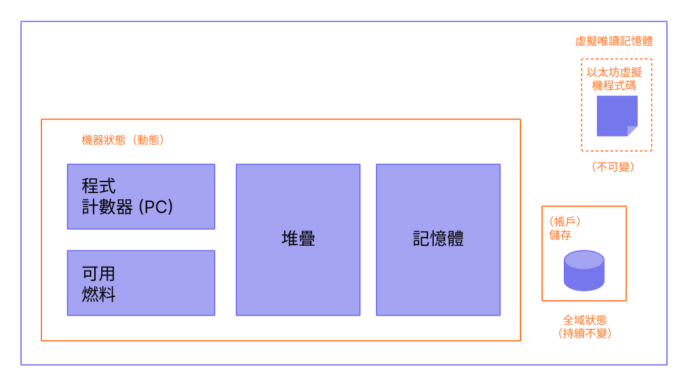
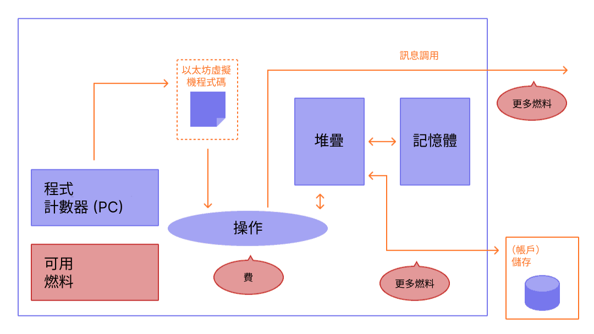

以太坊虛擬機 (EVM) 是一個去中心化的虛擬環境，能在所有 [以太坊](/) 節點上一致且安全地執行程式碼。節點運行 EVM 來執行智能合約，並使用「[燃料 (gas)](/developers/docs/gas/)」來衡量[操作](/developers/docs/evm/opcodes/)所需的運算量，以確保資源的有效分配與網路安全。

## 先決條件 {#prerequisites}

了解 EVM 需要對電腦科學中的常見術語有一些基本的認識，例如[位元組 (bytes)](https://wikipedia.org/wiki/Byte)、[記憶體 (memory)](https://wikipedia.org/wiki/Computer_memory)和[堆疊 (stack)](<https://wikipedia.org/wiki/Stack_(abstract_data_type)>)。如果能熟悉密碼學/區塊鏈概念，例如[雜湊函式](https://wikipedia.org/wiki/Cryptographic_hash_function)和[默克爾樹](https://wikipedia.org/wiki/Merkle_tree)，也會很有幫助。

## 從帳本到狀態機 {#from-ledger-to-state-machine}

「分散式帳本」的比喻經常被用來描述像比特幣這樣的區塊鏈，它們利用密碼學的基本工具來實現去中心化的貨幣。該帳本維護著活動紀錄，這些紀錄必須遵守一套規則，這套規則規範了人們在修改帳本時能做與不能做的事。例如，一個比特幣地址花費的比特幣不能超過它之前收到的數量。這些規則是比特幣及許多其他區塊鏈上所有交易的基礎。

雖然以太坊擁有自己的原生加密貨幣（以太幣），且遵循幾乎完全相同且直觀的規則，但它還實現了一個更強大的功能：[智能合約](/developers/docs/smart-contracts/)。對於這個更複雜的功能，我們需要一個更精確的比喻。以太坊與其說是分散式帳本，不如說是一個分散式[狀態機](https://wikipedia.org/wiki/Finite-state_machine)。以太坊的狀態是一個大型資料結構，不僅保存所有帳戶和餘額，還包含一個_機器狀態_，該狀態可以根據預先定義的一套規則在區塊之間發生變化，並且可以執行任意的機器碼。在區塊之間改變狀態的具體規則就是由 EVM 所定義的。


_圖表改編自 [Ethereum EVM illustrated](https://takenobu-hs.github.io/downloads/ethereum_evm_illustrated.pdf)_

## 以太坊狀態轉換函式 {#the-ethereum-state-transition-function}

EVM 的行為就像一個數學函式：給定一個輸入，它會產生一個確定性的輸出。因此，將以太坊更正式地描述為具有一個**狀態轉換函式**會非常有幫助：

```
Y(S, T)= S'
```

給定一個舊的有效狀態 `(S)` 和一組新的有效交易 `(T)`，以太坊狀態轉換函式 `Y(S, T)` 會產生一個新的有效輸出狀態 `S'`

### 狀態 {#state}

在以太坊的脈絡下，狀態是一個巨大的資料結構，稱為[修改過的默克爾帕特里夏樹](/developers/docs/data-structures-and-encoding/patricia-merkle-trie/)，它將所有[帳戶](/developers/docs/accounts/)透過雜湊連結起來，並可簡化為儲存在區塊鏈上的單一根雜湊。

### 交易 {#transactions}

交易是來自帳戶且經過密碼學簽署的指令。交易有兩種類型：導致訊息呼叫的交易，以及導致合約建立的交易。

建立合約會產生一個新的合約帳戶，其中包含已編譯的[智能合約](/developers/docs/smart-contracts/anatomy/)位元組碼。每當另一個帳戶對該合約進行訊息呼叫時，它就會執行其位元組碼。

## EVM 指令 {#evm-instructions}

EVM 作為一個深度為 1024 個項目的[堆疊機](https://wikipedia.org/wiki/Stack_machine)來執行。每個項目是一個 256 位元的字組，選擇這個大小是為了方便與 256 位元密碼學（例如 Keccak-256 雜湊或 secp256k1 簽章）搭配使用。

在執行期間，EVM 會維護一個暫時的_記憶體_（作為一個以字組定址的位元組陣列），該記憶體不會在交易之間保留。

### 暫時儲存 {#transient-storage}

暫時儲存是一個針對每筆交易的鍵值儲存，透過 `TSTORE` 和 `TLOAD` 操作碼進行存取。它在同一筆交易期間的所有內部呼叫中都會保留，但在交易結束時會被清除。與記憶體不同，暫時儲存被塑造成 EVM 狀態的一部分，而不是執行框架的一部分，但它不會被提交到全域狀態中。暫時儲存能在交易期間的內部呼叫之間，實現節省燃料的暫時狀態共享。

### 儲存 {#storage}

合約包含一個默克爾帕特里夏_儲存_前綴樹（作為一個可字組定址的字組陣列），與相關帳戶關聯，並且是全域狀態的一部分。這種持久性儲存不同於暫時儲存，後者僅在單一交易期間可用，且不構成帳戶持久性儲存前綴樹的一部分。

### 操作碼 {#opcodes}

已編譯的智能合約位元組碼會作為多個 EVM [操作碼](/developers/docs/evm/opcodes)來執行，這些操作碼執行標準的堆疊操作，例如 `XOR`、`AND`、`ADD`、`SUB` 等。EVM 還實作了許多區塊鏈特定的堆疊操作，例如 `ADDRESS`、`BALANCE`、`BLOCKHASH` 等。操作碼集還包含 `TSTORE` 和 `TLOAD`，它們提供對暫時儲存的存取。


_圖表改編自 [Ethereum EVM illustrated](https://takenobu-hs.github.io/downloads/ethereum_evm_illustrated.pdf)_

## EVM 實作 {#evm-implementations}

所有 EVM 的實作都必須遵守以太坊黃皮書中描述的規範。

在以太坊十年的歷史中，EVM 經歷了多次修訂，並且有使用各種程式語言編寫的多種 EVM 實作。

[以太坊執行客戶端](/developers/docs/nodes-and-clients/#execution-clients)包含了一個 EVM 實作。此外，還有多個獨立的實作，包括：

- [Py-EVM](https://github.com/ethereum/py-evm) - _Python_
- [evmone](https://github.com/ethereum/evmone) - _C++_
- [ethereumjs-vm](https://github.com/ethereumjs/ethereumjs-vm) - _JavaScript_
- [revm](https://github.com/bluealloy/revm) - _Rust_

## 延伸閱讀 {#further-reading}

- [以太坊黃皮書](https://ethereum.github.io/yellowpaper/paper.pdf)
- [Jellopaper（又稱 KEVM）：K 語言中的 EVM 語意](https://jellopaper.org/)
- [米皮書 (The Beigepaper)](https://github.com/chronaeon/beigepaper)
- [以太坊虛擬機操作碼](https://www.ethervm.io/)
- [以太坊虛擬機操作碼互動式參考](https://www.evm.codes/)
- [Solidity 文件的簡短介紹](https://docs.soliditylang.org/en/latest/introduction-to-smart-contracts.html#index-6)
- [精通以太坊 - 以太坊虛擬機](https://github.com/ethereumbook/ethereumbook/blob/openedition/13evm.asciidoc)

## 相關主題 {#related-topics}

- [燃料 (Gas)](/developers/docs/gas/)

## 教學：以太坊虛擬機 (EVM) / 以太坊上的操作碼 {#tutorials}

- [了解黃皮書的 EVM 規範](/developers/tutorials/yellow-paper-evm/) _– 以太坊黃皮書中正式 EVM 規範的引導式演練。_
- [逆向工程合約](/developers/tutorials/reverse-engineering-a-contract/) _– 如何使用 EVM 操作碼對已編譯的智能合約進行逆向工程。_