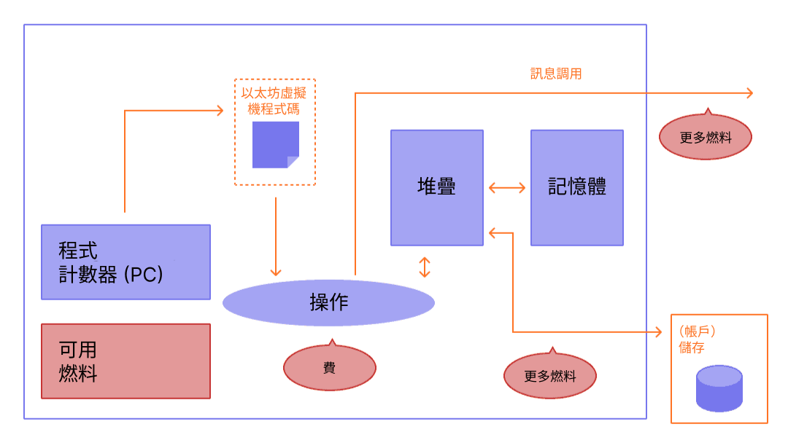

燃料對於以太坊網路至關重要。 燃料讓以太坊得以運轉，就像是汽車需要汽油行駛一樣。

## 基本資訊 {#prerequisites}

為了更好地理解本頁面，建議你先閱讀[交易](/developers/docs/transactions/)和[以太坊虛擬機](/developers/docs/evm/)。

## 什麼是燃料？ {#what-is-gas}

燃料是衡量在以太坊網路上執行特定操作所需計算工作量的單位。

因為執行每一筆以太坊交易都需要計算資源，要使用這些資源就必須付費，以確保以太坊不會受到垃圾訊息的影響，或者卡在無窮計算迴圈中。 計算費用以燃料費的形式支付。

燃料費的計算方式是**執行操作消耗的燃料數量乘以每單位燃料費價格**。 無論交易成功與否，都要支付燃料費。

 _此圖表源於[以太坊的以太坊虛擬機圖解](https://takenobu-hs.github.io/downloads/ethereum_evm_illustrated.pdf)_

燃料費須用以太坊原生貨幣以太幣 (ETH) 支付。 燃料價格一般會以 gwei 為單位，gwei 是以太幣的面額之一。 每一 gwei 等於一以太幣的十億分之一（0.000000001 以太幣或 10-9 以太幣）。

舉例來說，可以說你的燃料費為 1 gwei，而不是 0.000000001 以太幣。

「gwei」這個字是「giga-wei」的縮寫，意思是「10 億 wei」。 1 gwei 等於 10 億 wei。 Wei 本身（命名於 [Wei Dai](https://wikipedia.org/wiki/Wei_Dai)，[b-money](https://www.investopedia.com/terms/b/bmoney.asp) 創建者）為以太幣之最小單位面額。

## 燃料費是如何計算的？ {#how-are-gas-fees-calculated}

提交交易時，可以設定你願意支付的燃料費數量。 藉由提供一定數量的燃料費，你實際上是在出價，以便將你的交易加入下一個區塊。 如果你的報價過低，驗證者就不太可能選擇將你的交易加入下一個區塊，代表你的交易可能會延遲或根本不會被執行。 如果你報價過高，則可能會浪費一些以太幣。 那麼，該如何判定支付多少費用呢？

支付的燃料費分成兩個部分：`base fee` 及 `priority fee`（小費）。

`base fee` 是由協議設定的 - 你必須支付至少這個數量的以太幣，你的交易才會被視為有效。 `priority fee` 是你在基本費用上增加的額外小費，使你的交易對驗證者來說更有吸引力，以便讓他們選擇將其添加到下一個區塊中。

只支付 `base fee` 的交易在技術層面上是有效的，但不太可能加入下一個區塊中，因為此類交易未向驗證者提供任何激勵，因此驗證者不會選擇它而不管任何其他交易。 「適宜」的 `priority` 費依據發送交易時的網路使用情況而定 - 若當時需求非常高，你需要將你的 `priority` 費設高點，而需求低時則可以付少點。

舉例來說，假設 Jordan 要付給 Taylor 1 以太幣。 以太幣轉帳需要 21,000 單位的燃料，而基本費用為 10 gwei。 Jordan 支付 2 gwei 小費。

現在總燃料費為：

`使用的單位燃料 * （基本費用 + 優先費）`

其中，`base fee` 的值由協議設定，而 `priority fee` 的值則是由使用者設置，是給驗證者的小費。

範例：`21,000 * (10 + 2) = 252,000 gwei` （0.000252 以太幣）。

當 Jordan 發送該金額時，1.000252 以太幣將從 Jordan 的帳戶中扣除。 而 Taylor 將獲得 1.0000 以太幣。 驗證者將收到 0.000042 以太幣的小費。 0.00021 以太幣的 `base fee` 被銷毀。

### 基本費用 {#base-fee}

每個區塊都有基本費用作為底價。 為了達成添加至區塊中的條件，提供的每單位燃料價格必須至少等於基本費用。 基本費用的計算與當前區塊無關，而是由當前區塊前面的區塊決定，讓交易費用對於使用者更具可預測性。 建立區塊時，此**基本費用被「銷毀」**，從流通中移除。

此基本費用透過一個公式計算，該公式比較前一個區塊的大小（所有交易使用的燃料用量）與目標區塊大小。 如果超出目標區塊大小，每個區塊的基本費用將最大增加 12.5%。 這種指數級增長讓區塊大小無限增加在經濟上不可行。

| 區塊編號 | 包含燃料 |  費用增幅 |     當前基本費用 |
| ---- | ----:| -----:| ----------:|
| 1    |  15M |    0% |   100 gwei |
| 2    |  30M |    0% |   100 gwei |
| 3    |  30M | 12.5% | 112.5 gwei |
| 4    |  30M | 12.5% | 126.6 gwei |
| 5    |  30M | 12.5% | 142.4 gwei |
| 6    |  30M | 12.5% | 160.2 gwei |
| 7    |  30M | 12.5% | 180.2 gwei |
| 8    |  30M | 12.5% | 202.7 gwei |

依據上表 -- 要在 9 號區塊中建立一筆交易，錢包會讓使用者明確知道將交易添加到下一個區塊中的**最大基本費用**為 `current base fee * 112.5%` 或 `202.7 gwei * 112.5% = 228.1 gwei`。

值得注意的是，因為基本費用在區塊變滿之前增加的速度很快，我們不太可能看到大量已滿區塊連續出現。

| 區塊編碼 | 包含Gas費 |  增加費用 |          目前基本費用 |
| ---- | ------:| -----:| ---------------:|
| 30   |    30M | 12.5% |     2705.6 gwei |
| ...  |    ... | 12.5% |             ... |
| 50   |    30M | 12.5% |    28531.3 gwei |
| ...  |    ... | 12.5% |             ... |
| 100  |    30M | 12.5% | 10302608.6 gwei |

### 優先費（小費） {#priority-fee}

優先費（小費）激勵驗證者將交易添加進區塊中。 如果沒有小費，驗證者會發現開採空區塊在經濟上可行，因為他們收到的區塊獎勵相同。 少量的小費提供的激勵極弱，不足以讓驗證者將交易打包進區塊。 為了使交易比相同區塊中的其他交易優先執行，可以提供較高的小費，以超出其他競爭交易的報價。

### 最大費用 {#maxfee}

要在網路上執行交易，使用者可以指定為了執行其交易他們願意支付的最大費用限制。 此可選參數亦稱為 `maxFeePerGas`。 執行交易所需的最大費用必須超過基本費用與小費的總和。 會向交易發送者退還最大費用與基本費用和小費之總合之間的差額。

### 區塊大小 {#block-size}

每個區塊具 15M 單位燃料用量之目標大小，但區塊大小將跟隨網路需求增減，最大可達到 30M 燃料用量的區塊大小限制（目標區塊大小之兩倍）。 協議往往透過 _tâtonnement_ 流程達成 15M 的均衡區塊大小。 這意味著，如果區塊大小大於目標區塊大小，協議將增加下一個區塊的基本費用。 同樣，如果區塊大小小於目標區塊大小，協議將減少基本費用。 基本費用的調節額度與實際區塊大小與目標區塊大小之間的差異成比例。 [更多區塊相關資訊](/developers/docs/blocks/)。

### 實際計算燃料費 {#calculating-fees-in-practice}

可明確聲明願意支付多少費用，以讓驗證者執行你的交易。 然而，大多數錢包提供商會自動設定推薦的交易費（基本費用 + 推薦的優先費），以降低使用者面臨的複雜度。

## 為何需要燃料費？ {#why-do-gas-fees-exist}

簡言之，燃料費可幫助保障以太坊網路安全。 透過要求為網路上執行的每次計算支付費用，可以阻止惡意行為者利用垃圾郵件攻擊網路。 為避免程式碼中出現意外或是惡意的無限迴圈或其他計算浪費，對於每筆交易，都必須設定一個關於可以使用程式碼執行中多少個計算步驟的限制。 計算的基本單位為「燃料」。

雖然交易包括限制，但任何在交易中未使用的燃料將會退還給使用者（即退還 `max fee - (base fee + tip)`）。

 _此圖表源於[以太坊的以太坊虛擬機圖解](https://takenobu-hs.github.io/downloads/ethereum_evm_illustrated.pdf)_

## 什麼是燃料限制？ {#what-is-gas-limit}

燃料限制指的是你在一筆交易中最多願意使用多少燃料。 包含[智慧型合約](/developers/docs/smart-contracts/)的更複雜的交易需要進行更多計算工作，所以比起簡單的支付，它們需要更高的燃料限制。 標準以太幣轉帳需要的燃料限制為 21,000 單位燃料。

例如，如果為一次簡單的以太幣轉帳設定了 50,000 的燃料限制，以太坊虛擬機將消耗 21,000 單位燃料並退還剩餘的 29,000。 然而，如果你設定的燃料過低，例如為簡單的以太幣轉帳設定 20,000 的燃料限制，以太坊虛擬機將用盡 20,000 燃料單位嘗試完成交易，但最終交易會失敗。 隨後，以太坊虛擬機會還原全部變更，但因為驗證者已完成了相當於 20k 燃料單位的工作，所以會消耗這些燃料。

## 為何燃料費這麼高？ {#why-can-gas-fees-get-so-high}

燃料費高是因為以太坊人氣高。 如果需求過高，使用者必須支付更高的小費，以便超出其他使用者的交易報價。 小費越高，你的交易添加到下一個區塊中的可能性越大。 另外，越複雜的智慧型合約應用程式可能會執行大量操作，以支援其函式，這會消耗許多燃料。

## 燃料費用削減倡議 {#initiatives-to-reduce-gas-costs}

以太坊的[可擴容性](/roadmap/)應最終解決一部分燃料費用問題，繼而讓該平台能夠每秒處理數千筆交易並實現全域擴容。

二層網路擴容為一項主要倡議，可大幅減低燃料費用並加強用戶體驗及可擴容性。 [更多二層網路擴容相關資訊](/developers/docs/scaling/#layer-2-scaling)。

## 監控燃料費 {#monitoring-gas-fees}

若你想要監控燃料價格，以便能以更低的費用發送以太幣，你可以使用許多不同的工具，例如：

- [Etherscan](https://etherscan.io/gastracker) _交易燃料費價格估算器_
- [以太幣燃料追蹤器](https://www.ethgastracker.com/)_監控並追蹤以太坊和二層網路的燃料價格，以降低交易費用並節省資金_
- [Blocknative ETH Gas Estimator](https://chrome.google.com/webstore/detail/blocknative-eth-gas-estim/ablbagjepecncofimgjmdpnhnfjiecfm) _燃料估算 Chrome 延伸模組，支援 0 類原始交易及 2 類 EIP-1559 交易。_
- [Cryptoneur燃料Fees Calculator](https://www.cryptoneur.xyz/gas-fees-calculator) _在主網、Arbitrum、Polygon 上使用當地貨幣計算不同交易類型的燃料費。_

## 相關工具 {#related-tools}

- [Blocknative's Gas Platform](https://www.blocknative.com/gas)_ 由 Blocknative 的全域記憶體池資料平臺支援的燃料估算應用程式介面平台_

## 了解更多 {#further-reading}

- [以太坊燃料詳解](https://defiprime.com/gas)
- [減低智慧型合約之燃料消耗](https://medium.com/coinmonks/8-ways-of-reducing-the-gas-consumption-of-your-smart-contracts-9a506b339c0a)
- [權益證明與工作量證明](https://blockgeeks.com/guides/proof-of-work-vs-proof-of-stake/)
- [開發者的燃料優化策略](https://www.alchemy.com/overviews/solidity-gas-optimization)
- [EIP-1559 文檔](https://eips.ethereum.org/EIPS/eip-1559)。
- [Tim Beiko 的 EIP-1559 資源](https://hackmd.io/@timbeiko/1559-resources)。
