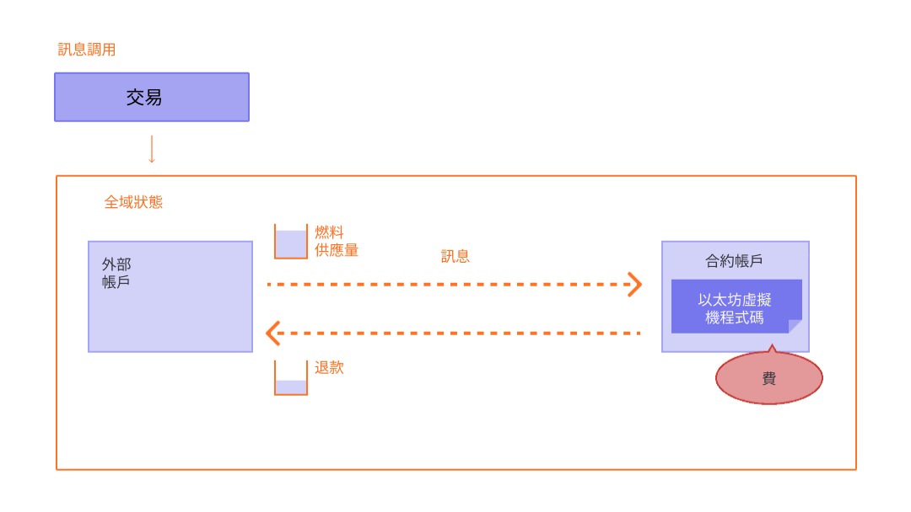

燃料對 [以太坊](/) 網路來說不可或缺。它是讓網路運作的燃料，就像汽車需要汽油才能行駛一樣。

## 先決條件 {#prerequisites}

為了更了解本頁面，我們建議你先閱讀[交易](/developers/docs/transactions/)和 [EVM](/developers/docs/evm/)。

## 什麼是燃料？ {#what-is-gas}

燃料是指衡量在以太坊網路上執行特定操作所需運算工作量的單位。

由於每筆以太坊交易都需要運算資源來執行，因此必須為這些資源付費，以確保以太坊不會受到垃圾訊息攻擊，也不會陷入無限的運算迴圈。運算費用的支付形式為 Gas 費。

Gas 費是**執行某項操作所使用的燃料數量，乘以每單位燃料的成本**。無論交易成功或失敗，都必須支付該費用。

_圖表改編自 [Ethereum EVM illustrated](https://takenobu-hs.github.io/downloads/ethereum_evm_illustrated.pdf)_

Gas 費必須以以太坊的原生貨幣以太幣 (ETH) 支付。Gas 價格通常以 Gwei 報價，這是 ETH 的一種面額。每個 Gwei 等於十億分之一 ETH（0.000000001 ETH 或 10-9 ETH）。

例如，你可以說你的燃料成本為 1 Gwei，而不是說你的燃料成本為 0.000000001 以太幣。

「Gwei」一詞是「giga-wei」的縮寫，意思是「十億 Wei」。一 Gwei 等於十億 Wei。Wei 本身（以 [b-money](https://www.investopedia.com/terms/b/bmoney.asp) 創造者[戴偉](https://wikipedia.org/wiki/Wei_Dai)的名字命名）是 ETH 的最小單位。

## Gas 費是如何計算的？ {#how-are-gas-fees-calculated}

你可以在提交交易時設定你願意支付的燃料數量。透過提供一定數量的燃料，你正在競標讓你的交易被包含在下一個區塊中。如果你提供的太少，驗證者就不太可能選擇包含你的交易，這意味著你的交易可能會延遲執行或根本不執行。如果你提供的太多，你可能會浪費一些 ETH。那麼，你怎麼知道該付多少錢呢？

你支付的總燃料分為兩個部分：`base fee` 和 `priority fee`（小費）。

`base fee` 由協定設定——你必須至少支付此金額，你的交易才會被視為有效。`priority fee` 是你加在基礎費用上的小費，目的是讓你的交易對驗證者更具吸引力，以便他們選擇將其包含在下一個區塊中。

僅支付 `base fee` 的交易在技術上是有效的，但不太可能被包含在內，因為它沒有提供任何誘因讓驗證者優先選擇它而不是其他交易。「正確的」`priority` 費用取決於你發送交易時的網路使用情況——如果需求量很大，你可能必須將 `priority` 費用設定得更高，但當需求較少時，你可以支付較少。

例如，假設 Jordan 必須支付 Taylor 1 ETH。一筆 ETH 轉帳需要 21,000 單位的燃料，而基礎費用為 10 Gwei。Jordan 包含了 2 Gwei 的小費。

總費用現在將等於：

`units of gas used * (base fee + priority fee)`

其中 `base fee` 是由協定設定的值，而 `priority fee` 是由使用者設定作為給驗證者小費的值。

例如，`21,000 * (10 + 2) = 252,000 gwei` (0.000252 ETH)。

當 Jordan 匯款時，將從 Jordan 的帳戶中扣除 1.000252 ETH。Taylor 將收到 1.0000 ETH。驗證者收到 0.000042 ETH 的小費。0.00021 ETH 的 `base fee` 會被銷毀。

### 基礎費用 {#base-fee}

每個區塊都有一個基礎費用，作為底價。為了有資格被包含在區塊中，提供的每單位燃料價格必須至少等於基礎費用。基礎費用的計算獨立於當前區塊，而是由其之前的區塊決定，這使得使用者的交易手續費更具可預測性。當區塊被建立時，這個**基礎費用會被「銷毀」**，將其從流通中移除。

基礎費用是透過一個公式計算出來的，該公式將前一個區塊的大小（所有交易使用的燃料數量）與目標大小（Gas 限制的一半）進行比較。如果目標區塊大小高於或低於目標，基礎費用將每個區塊最多增加或減少 12.5%。這種指數級增長使得區塊大小無限期保持在高位在經濟上是不可行的。

| 區塊編號 | 包含的燃料 | 費用增加 | 當前基礎費用 |
| ------------ | -----------: | -----------: | ---------------: |
| 1            |          18M |           0% |         100 gwei |
| 2            |          36M |           0% |         100 gwei |
| 3            |          36M |        12.5% |       112.5 gwei |
| 4            |          36M |        12.5% |       126.6 gwei |
| 5            |          36M |        12.5% |       142.4 gwei |
| 6            |          36M |        12.5% |       160.2 gwei |
| 7            |          36M |        12.5% |       180.2 gwei |
| 8            |          36M |        12.5% |       202.7 gwei |

在上表中，示範了一個使用 3600 萬作為 Gas 限制的例子。按照這個例子，要在第 9 號區塊上建立一筆交易，錢包會明確地讓使用者知道，要添加到下一個區塊的**最高基礎費用**是 `current base fee * 112.5%` 或 `202.7 gwei * 112.5% = 228.1 gwei`。

同樣重要的是要注意，我們不太可能看到滿載區塊的長時間激增，因為在滿載區塊之前基礎費用增加的速度很快。

| 區塊編號 | 包含的燃料 | 費用增加 | 當前基礎費用 |
| ------------ | -----------: | -----------: | ---------------: |
| 30           |          36M |        12.5% |      2705.6 gwei |
| ...          |          ... |        12.5% |              ... |
| 50           |          36M |        12.5% |     28531.3 gwei |
| ...          |          ... |        12.5% |              ... |
| 100          |          36M |        12.5% |  10302608.6 gwei |

### 優先費（小費） {#priority-fee}

優先費（小費）激勵驗證者最大化區塊中的交易數量，僅受區塊 Gas 限制的約束。如果沒有小費，理性的驗證者可以包含較少——甚至零筆——交易，而不會受到任何直接的執行層或共識層懲罰，因為質押獎勵與區塊中有多少筆交易無關。此外，小費允許使用者在同一個區塊內出價高於其他人以獲得優先權，有效地發出緊急訊號。 

### 最高費用 {#maxfee}

為了在網路上執行交易，使用者可以指定他們願意為執行交易支付的最高限制。這個可選參數被稱為 `maxFeePerGas`（最高費用）。為了執行交易，最高費用必須超過基礎費用和小費的總和。交易發送者將獲得最高費用與基礎費用和小費總和之間差額的退款。

### 區塊大小 {#block-size}

每個區塊的目標大小為當前 Gas 限制的一半，但區塊的大小將根據網路需求增加或減少，直到達到區塊限制（目標區塊大小的 2 倍）。協定透過_試探 (tâtonnement)_ 過程在目標處達到均衡的平均區塊大小。這意味著如果區塊大小大於目標區塊大小，協定將增加下一個區塊的基礎費用。同樣地，如果區塊大小小於目標區塊大小，協定將減少基礎費用。

基礎費用調整的幅度與當前區塊大小偏離目標的程度成正比。這是一個線性計算，從空區塊的 -12.5%、目標大小的 0%，一直到達到 Gas 限制的區塊的 +12.5%。Gas 限制可以隨著時間的推移根據驗證者的訊號以及透過網路升級而波動。你可以[在此處查看 Gas 限制隨時間的變化](https://eth.blockscout.com/stats/averageGasLimit?interval=threeMonths)。

[更多關於區塊的資訊](/developers/docs/blocks/)

### 實際計算 Gas 費 {#calculating-fees-in-practice}

你可以明確說明你願意支付多少費用來執行你的交易。然而，大多數錢包提供商會自動設定建議的交易手續費（基礎費用 + 建議的優先費），以減少加諸在使用者身上的複雜性。

## 為什麼會有 Gas 費？ {#why-do-gas-fees-exist}

簡而言之，Gas 費有助於保持以太坊網路的安全。透過要求對網路上執行的每次運算收取費用，我們防止了惡意行為者對網路發送垃圾訊息。為了避免程式碼中意外或惡意的無限迴圈或其他運算浪費，每筆交易都被要求設定其可以使用的程式碼執行運算步驟的限制。運算的基本單位是「燃料」。

雖然交易包含一個限制，但交易中未使用的任何燃料都會退還給使用者（例如，退還 `max fee - (base fee + tip)`）。

_圖表改編自 [Ethereum EVM illustrated](https://takenobu-hs.github.io/downloads/ethereum_evm_illustrated.pdf)_

## 什麼是 Gas 限制？ {#what-is-gas-limit}

Gas 限制是指你願意在一筆交易中消耗的最大燃料數量。涉及[智能合約](/developers/docs/smart-contracts/)的更複雜交易需要更多的運算工作，因此它們需要比簡單付款更高的 Gas 限制。標準的 ETH 轉帳需要 21,000 單位燃料的 Gas 限制。

例如，如果你為一筆簡單的 ETH 轉帳設定了 50,000 的 Gas 限制，EVM 將消耗 21,000，而你將拿回剩餘的 29,000。然而，如果你指定的燃料太少，例如，為一筆簡單的 ETH 轉帳設定了 20,000 的 Gas 限制，交易將在驗證階段失敗。它將在被包含在區塊之前被拒絕，並且不會消耗任何燃料。另一方面，如果交易在執行期間耗盡了燃料（例如，智能合約在中途用完了所有燃料），EVM 將回滾任何更改，但提供的所有燃料仍將被消耗用於已執行的工作。

## 為什麼 Gas 費會變得這麼高？ {#why-can-gas-fees-get-so-high}

高昂的 Gas 費是由於以太坊的受歡迎程度。如果有太多的需求，使用者必須提供更高的小費金額，試圖出價高於其他使用者的交易。較高的小費可以使你的交易更有可能進入下一個區塊。此外，更複雜的智能合約應用程式可能會執行大量操作來支援其功能，從而使它們消耗大量燃料。

## 降低燃料成本的舉措 {#initiatives-to-reduce-gas-costs}

以太坊[擴容升級](/roadmap/)最終應能解決一些 Gas 費問題，這將反過來使平台能夠每秒處理數千筆交易並在全球範圍內擴展。

第二層 (L2) 擴容是大幅改善燃料成本、使用者體驗和可擴展性的主要舉措。

[更多關於第二層 (L2) 擴容的資訊](/developers/docs/scaling/#layer-2-scaling)

## 監控 Gas 費 {#monitoring-gas-fees}

如果你想監控 Gas 價格，以便以更低的成本發送你的 ETH，你可以使用許多不同的工具，例如：

- [Etherscan](https://etherscan.io/gastracker) _交易 Gas 價格估算器_
- [Blockscout](https://eth.blockscout.com/gas-tracker) _開源交易 Gas 價格估算器_
- [ETH Gas Tracker](https://www.ethgastracker.com/) _監控和追蹤以太坊及 L2 Gas 價格，以降低交易手續費並節省金錢_
- [Blocknative ETH Gas Estimator](https://chrome.google.com/webstore/detail/blocknative-eth-gas-estim/ablbagjepecncofimgjmdpnhnfjiecfm) _支援 Type 0 傳統交易和 Type 2 EIP-1559 交易的 Gas 估算 Chrome 擴充功能。_
- [Cryptoneur Gas Fees Calculator](https://www.cryptoneur.xyz/gas-fees-calculator) _以你的當地貨幣計算主網、Arbitrum 和 Polygon 上不同交易類型的 Gas 費。_

## 相關工具 {#related-tools}

- [Blocknative 的 Gas 平台](https://www.blocknative.com/gas) _由 Blocknative 全球記憶體池資料平台驅動的 Gas 估算 API_
- [Gas Network](https://gas.network) 鏈上 Gas 預言機。支援 35 條以上的區塊鏈。 

## 延伸閱讀 {#further-reading}

- [以太坊燃料 (Gas) 解釋](https://defiprime.com/gas)
- [降低智能合約的燃料消耗](https://medium.com/coinmonks/8-ways-of-reducing-the-gas-consumption-of-your-smart-contracts-9a506b339c0a)
- [開發者的 Gas 最佳化策略](https://www.alchemy.com/overviews/solidity-gas-optimization)
- [EIP-1559 文件](https://eips.ethereum.org/EIPS/eip-1559)。
- [Tim Beiko 的 EIP-1559 資源](https://hackmd.io/@timbeiko/1559-resources)
- [EIP-1559：將機制與迷因分開](https://web.archive.org/web/20241126205908/https://research.2077.xyz/eip-1559-separating-mechanisms-from-memes)