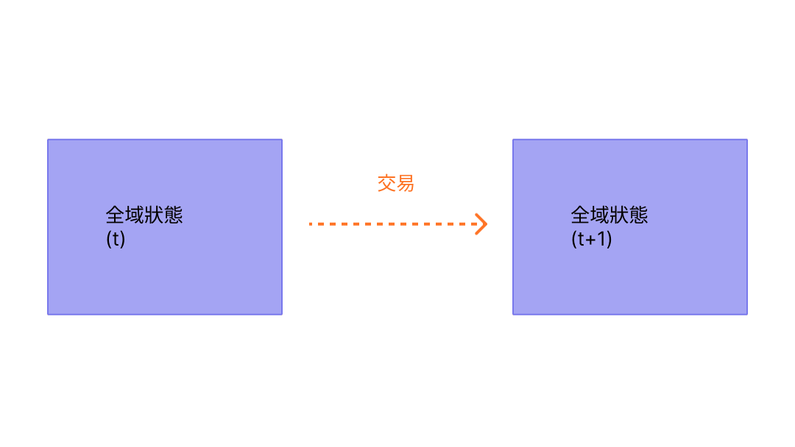

交易是來自帳戶且經過密碼學簽署的指令。帳戶會發起交易來更新[以太坊](/)網路的狀態。最簡單的交易是將 ETH 從一個帳戶轉帳到另一個帳戶。

## 先決條件 {#prerequisites}

為了幫助你更了解本頁面，我們建議你先閱讀[帳戶](/developers/docs/accounts/)以及我們的[以太坊簡介](/developers/docs/intro-to-ethereum/)。

## 什麼是交易？ {#whats-a-transaction}

以太坊交易是指由外部擁有帳戶（externally-owned account，EOA）發起的動作，換句話說，是由人類而非合約管理的帳戶。例如，如果 Bob 發送 1 ETH 給 Alice，Bob 的帳戶必須扣款，而 Alice 的帳戶必須入帳。這個改變狀態的動作發生在交易之內。


_圖表改編自 [Ethereum EVM illustrated](https://takenobu-hs.github.io/downloads/ethereum_evm_illustrated.pdf)_

改變 EVM 狀態的交易需要廣播到整個網路。任何節點都可以廣播在 EVM 上執行交易的請求；發生這種情況後，驗證者將執行該交易，並將產生的狀態變更傳播到網路的其餘部分。

交易需要手續費，並且必須包含在已驗證的區塊中。為了讓這篇概覽更簡單，我們將在其他地方介紹 Gas 費和驗證。

提交的交易包含以下資訊：

- `from` – 發送者的地址，將簽署該交易。這將是一個外部擁有帳戶，因為合約帳戶無法發送交易
- `to` – 接收地址（如果是外部擁有帳戶，交易將轉帳價值。如果是合約帳戶，交易將執行合約程式碼）
- `signature` – 發送者的識別碼。這是在發送者的私鑰簽署交易時產生的，並確認發送者已授權此交易
- `nonce` - 一個循序遞增的計數器，表示來自該帳戶的交易編號（隨機數）
- `value` – 從發送者轉帳到接收者的 ETH 數量（以 Wei 為單位，其中 1 ETH 等於 1e+18 Wei）
- `input data` – 包含任意資料的選填欄位
- `gasLimit` – 交易可消耗的最大燃料單位數量（Gas 限制）。[EVM](/developers/docs/evm/opcodes) 指定了每個運算步驟所需的燃料單位
- `maxPriorityFeePerGas` - 作為給驗證者的小費，所消耗燃料的最高價格
- `maxFeePerGas` - 願意為交易支付的每單位燃料最高費用（包含 `baseFeePerGas` 和 `maxPriorityFeePerGas`）

燃料（Gas）是指驗證者處理交易所需的運算量。使用者必須為此運算支付費用。`gasLimit` 和 `maxPriorityFeePerGas` 決定了支付給驗證者的最高交易手續費。[更多關於燃料的資訊](/developers/docs/gas/)。

交易物件看起來會像這樣：

```js
{
  from: "0xEA674fdDe714fd979de3EdF0F56AA9716B898ec8",
  to: "0xac03bb73b6a9e108530aff4df5077c2b3d481e5a",
  gasLimit: "21000",
  maxFeePerGas: "300",
  maxPriorityFeePerGas: "10",
  nonce: "0",
  value: "10000000000"
}
```

但交易物件需要使用發送者的私鑰進行簽署。這證明了交易只能來自發送者，而不是被欺詐性地發送。

像 Geth 這樣的以太坊用戶端將處理這個簽署過程。

[JSON-RPC](/developers/docs/apis/json-rpc) 呼叫範例：

```json
{
  "id": 2,
  "jsonrpc": "2.0",
  "method": "account_signTransaction",
  "params": [
    {
      "from": "0x1923f626bb8dc025849e00f99c25fe2b2f7fb0db",
      "gas": "0x55555",
      "maxFeePerGas": "0x1234",
      "maxPriorityFeePerGas": "0x1234",
      "input": "0xabcd",
      "nonce": "0x0",
      "to": "0x07a565b7ed7d7a678680a4c162885bedbb695fe0",
      "value": "0x1234"
    }
  ]
}
```

回應範例：

```json
{
  "jsonrpc": "2.0",
  "id": 2,
  "result": {
    "raw": "0xf88380018203339407a565b7ed7d7a678680a4c162885bedbb695fe080a44401a6e4000000000000000000000000000000000000000000000000000000000000001226a0223a7c9bcf5531c99be5ea7082183816eb20cfe0bbc322e97cc5c7f71ab8b20ea02aadee6b34b45bb15bc42d9c09de4a6754e7000908da72d48cc7704971491663",
    "tx": {
      "nonce": "0x0",
      "maxFeePerGas": "0x1234",
      "maxPriorityFeePerGas": "0x1234",
      "gas": "0x55555",
      "to": "0x07a565b7ed7d7a678680a4c162885bedbb695fe0",
      "value": "0x1234",
      "input": "0xabcd",
      "v": "0x26",
      "r": "0x223a7c9bcf5531c99be5ea7082183816eb20cfe0bbc322e97cc5c7f71ab8b20e",
      "s": "0x2aadee6b34b45bb15bc42d9c09de4a6754e7000908da72d48cc7704971491663",
      "hash": "0xeba2df809e7a612a0a0d444ccfa5c839624bdc00dd29e3340d46df3870f8a30e"
    }
  }
}
```

- `raw` 是以[遞迴長度前綴（RLP）](/developers/docs/data-structures-and-encoding/rlp)編碼形式表示的已簽署交易
- `tx` 是 JSON 形式的已簽署交易

透過簽章雜湊，可以在密碼學上證明該交易來自發送者並已提交到網路。

### 資料欄位 {#the-data-field}

絕大多數交易都是從外部擁有帳戶存取合約。
大多數合約都是用 Solidity 編寫的，並根據[應用程式二進位介面（ABI）](/glossary/#abi)來解釋其資料欄位。

前四個位元組使用函式名稱和引數的雜湊來指定要呼叫哪個函式。
你有時可以使用[這個資料庫](https://www.4byte.directory/signatures/)從選擇器中識別出函式。

呼叫資料的其餘部分是引數，[按照 ABI 規範中的指定進行編碼](https://docs.soliditylang.org/en/latest/abi-spec.html#formal-specification-of-the-encoding)。

例如，讓我們看看[這筆交易](https://etherscan.io/tx/0xd0dcbe007569fcfa1902dae0ab8b4e078efe42e231786312289b1eee5590f6a1)。
使用 **Click to see More** 來查看呼叫資料。

函式選擇器是 `0xa9059cbb`。有幾個[具有此簽章的已知函式](https://www.4byte.directory/signatures/?bytes4_signature=0xa9059cbb)。
在這個例子中，[合約原始碼](https://etherscan.io/address/0xa0b86991c6218b36c1d19d4a2e9eb0ce3606eb48#code)已上傳到 Etherscan，所以我們知道該函式是 `transfer(address,uint256)`。

其餘資料為：

```
0000000000000000000000004f6742badb049791cd9a37ea913f2bac38d01279
000000000000000000000000000000000000000000000000000000003b0559f4
```

根據 ABI 規範，整數值（例如地址，即 20 位元組的整數）在 ABI 中顯示為 32 位元組的字組，並在前面補零。
所以我們知道 `to` 地址是 [`4f6742badb049791cd9a37ea913f2bac38d01279`](https://etherscan.io/address/0x4f6742badb049791cd9a37ea913f2bac38d01279)。
`value` 是 0x3b0559f4 = 990206452。

### 交易描述符 {#transaction-descriptors}

因為資料欄位包含不透明的十六進位位元組，所以要驗證交易實際將執行什麼動作可能非常困難。這種「盲簽（blind signing）」漏洞透過使用[交易描述符](https://eips.ethereum.org/EIPS/eip-7730)（由 ERC-7730 定義）的 **[明文簽署（Clear Signing）](https://clearsigning.org/)** 來解決。  

ERC-7730 規範使用交易描述符（通常結構化為 JSON 檔案）來豐富在 ABI 和結構化訊息中找到的資料，例如 EVM 交易呼叫資料、EIP-712 訊息和 EIP-4337 使用者操作。開發人員使用這些描述符將特定的交易變數直接對應到格式化範本中，確保底層資料對應用程式保持機器可讀性。

在前端，錢包使用這種格式化上下文將不透明的位元組碼翻譯成清晰、人類可讀的資訊。透過自動將代幣地址等數值解析為可識別的代號，或將金額解析為小數，使用者在簽署之前會看到交易確切意圖的白話文摘要（例如，「將 1000 USDC 兌換為至少 0.25 包裝以太幣 (wETH)」）。

## 交易類型 {#types-of-transactions}

在以太坊上，有幾種不同類型的交易：

- 一般交易：從一個帳戶到另一個帳戶的交易。
- 合約部署交易：沒有「to」地址的交易，其中資料欄位用於合約程式碼。
- 執行合約：與已部署的智能合約互動的交易。在這種情況下，「to」地址是智能合約地址。

### 關於燃料 {#on-gas}

如前所述，執行交易需要花費[燃料](/developers/docs/gas/)。簡單的轉帳交易需要 21000 單位的燃料。

因此，如果 Bob 要以 190 Gwei 的 `baseFeePerGas`（基礎費用）和 10 Gwei 的 `maxPriorityFeePerGas`（優先費）發送 1 ETH 給 Alice，Bob 將需要支付以下費用：

```
(190 + 10) * 21000 = 4,200,000 gwei
--or--
0.0042 ETH
```

Bob 的帳戶將被扣款 **-1.0042 ETH**（給 Alice 的 1 ETH + 0.0042 ETH 的 Gas 費）

Alice 的帳戶將入帳 **+1.0 ETH**

基礎費用將被銷毀 **-0.00399 ETH**

驗證者保留小費 **+0.000210 ETH**


_圖表改編自 [Ethereum EVM illustrated](https://takenobu-hs.github.io/downloads/ethereum_evm_illustrated.pdf)_

交易中未使用的任何燃料都會退還給使用者帳戶。

### 智能合約互動 {#smart-contract-interactions}

任何涉及智能合約的交易都需要燃料。

智能合約也可以包含被稱為 [`view`](https://docs.soliditylang.org/en/latest/contracts.html#view-functions) 或 [`pure`](https://docs.soliditylang.org/en/latest/contracts.html#pure-functions) 的函式，這些函式不會改變合約的狀態。因此，從外部擁有帳戶（EOA）呼叫這些函式不需要任何燃料。此情境的底層 RPC 呼叫是 [`eth_call`](/developers/docs/apis/json-rpc#eth_call)。

與使用 `eth_call` 存取時不同，這些 `view` 或 `pure` 函式通常也會在內部被呼叫（即從合約本身或從另一個合約），這確實會消耗燃料。

## 交易生命週期 {#transaction-lifecycle}

提交交易後，會發生以下情況：

1. 透過密碼學產生交易雜湊值：
   `0x97d99bc7729211111a21b12c933c949d4f31684f1d6954ff477d0477538ff017`
2. 接著，交易會被廣播到網路，並加入到由所有其他待處理網路交易組成的交易池中。
3. 驗證者必須挑選你的交易並將其包含在區塊中，以便驗證該交易並將其視為「成功」。
4. 隨著時間推移，包含你交易的區塊將升級為「已證明」，然後「已定案」。這些升級讓你更加確定你的交易已成功且永遠不會被更改。一旦區塊「已定案」，它只能透過花費數十億美元的網路層級攻擊來改變。

## 視覺化示範 {#a-visual-demo}

觀看 Austin 為你解說交易、燃料和挖礦。

<VideoWatch slug="transactions-eth-build" />

## 型別化交易封裝 {#typed-transaction-envelope}

以太坊最初只有一種交易格式。每筆交易包含隨機數、Gas 價格、Gas 限制、接收地址、價值、資料、v、r 和 s。這些欄位經過[ RLP 編碼](/developers/docs/data-structures-and-encoding/rlp/)，看起來像這樣：

`RLP([nonce, gasPrice, gasLimit, to, value, data, v, r, s])`

以太坊已經發展為支援多種類型的交易，以允許實作存取清單和 [EIP-1559](https://eips.ethereum.org/EIPS/eip-1559) 等新功能，而不會影響傳統的交易格式。

[EIP-2718](https://eips.ethereum.org/EIPS/eip-2718) 允許了這種行為。交易被解釋為：

`TransactionType || TransactionPayload`

其中欄位定義為：

- `TransactionType` - 介於 0 和 0x7f 之間的數字，總共有 128 種可能的交易類型。
- `TransactionPayload` - 由交易類型定義的任意位元組陣列。

根據 `TransactionType` 的值，交易可以分類為：

1. **類型 0（傳統）交易：** 自以太坊推出以來使用的原始交易格式。它們不包含 [EIP-1559](https://eips.ethereum.org/EIPS/eip-1559) 的功能，例如動態 Gas 費計算或智能合約的存取清單。傳統交易在其序列化形式中缺乏指示其類型的特定前綴，在使用[遞迴長度前綴（RLP）](/developers/docs/data-structures-and-encoding/rlp)編碼時以位元組 `0xf8` 開頭。這些交易的 TransactionType 值為 `0x0`。

2. **類型 1 交易：** 在 [EIP-2930](https://eips.ethereum.org/EIPS/eip-2930) 中引入，作為以太坊[柏林升級](/ethereum-forks/#berlin)的一部分，這些交易包含一個 `accessList` 參數。此清單指定了交易預期存取的地址和儲存鍵，有助於潛在地降低涉及智能合約的複雜交易的[燃料](/developers/docs/gas/)成本。EIP-1559 費用市場變更不包含在類型 1 交易中。類型 1 交易還包含一個 `yParity` 參數，它可以是 `0x0` 或 `0x1`，表示 secp256k1 簽章 y 值的奇偶性。它們透過以位元組 `0x01` 開頭來識別，其 TransactionType 值為 `0x1`。

3. **類型 2 交易**，通常被稱為 EIP-1559 交易，是在以太坊[倫敦升級](/ethereum-forks/#london)的 [EIP-1559](https://eips.ethereum.org/EIPS/eip-1559) 中引入的交易。它們已成為以太坊網路上的標準交易類型。這些交易引入了一種新的費用市場機制，透過將交易手續費分為基礎費用和優先費來提高可預測性。它們以位元組 `0x02` 開頭，並包含 `maxPriorityFeePerGas` 和 `maxFeePerGas` 等欄位。由於其靈活性和效率，類型 2 交易現在是預設的，特別是在網路高度擁塞期間受到青睞，因為它們能夠幫助使用者更可預測地管理交易手續費。這些交易的 TransactionType 值為 `0x2`。

4. **類型 3（資料塊）交易**是在 [EIP-4844](https://eips.ethereum.org/EIPS/eip-4844) 中引入的，作為以太坊 [Dencun 升級](/ethereum-forks/#dencun)的一部分。這些交易旨在更有效地處理「資料塊（blob）」資料（二進位大型物件），透過提供一種以較低成本將資料發布到以太坊網路的方法，特別有利於第二層 (L2) 匯總。資料塊交易包含額外的欄位，例如 `blobVersionedHashes`、`maxFeePerBlobGas` 和 `blobGasPrice`。它們以位元組 `0x03` 開頭，其 TransactionType 值為 `0x3`。資料塊交易代表了以太坊資料可用性和擴展能力的重大改進。

5. **類型 4 交易**是在 [EIP-7702](https://eips.ethereum.org/EIPS/eip-7702) 中引入的，作為以太坊[佩克特拉升級](/roadmap/pectra/)的一部分。這些交易旨在與帳戶抽象化向前相容。它們允許外部擁有帳戶（EOA）暫時表現得像合約帳戶，而不會損害其原始功能。它們包含一個 `authorization_list` 參數，該參數指定了 EOA 將其權限委託給哪個智能合約。交易後，EOA 的程式碼欄位將具有被委託智能合約的地址。

## 延伸閱讀 {#further-reading}

- [EIP-2718：型別化交易封裝](https://eips.ethereum.org/EIPS/eip-2718)

_知道有什麼社群資源對你有幫助嗎？編輯此頁面並加入它！_

## 相關主題 {#related-topics}

- [帳戶](/developers/docs/accounts/)
- [以太坊虛擬機 (EVM)](/developers/docs/evm/)
- [燃料](/developers/docs/gas/)