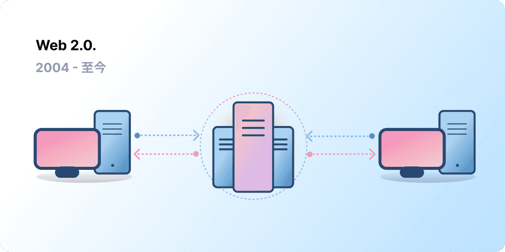
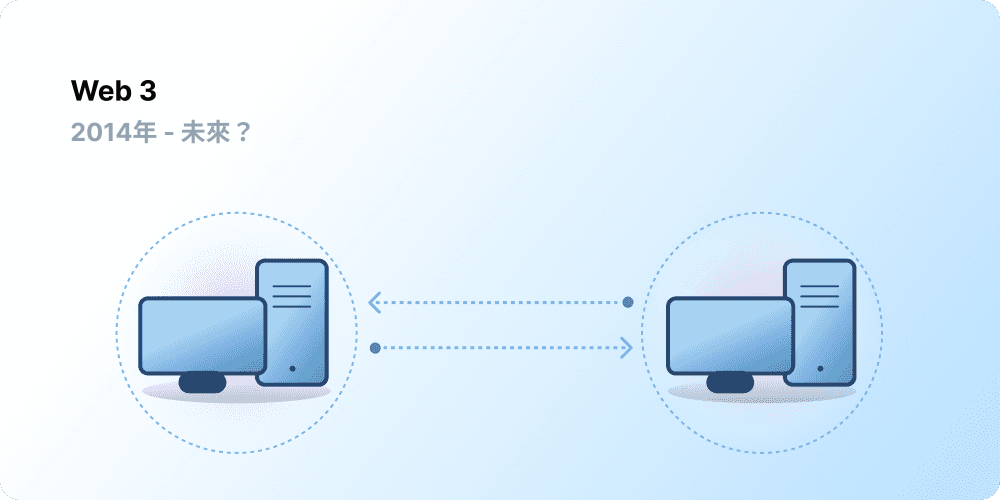

中心化幫助了數十億人進入全球資訊網 (World Wide Web)，並為其建立了穩定、強大的基礎設施。同時，少數中心化實體在全球資訊網的廣大領域中佔據了據點，單方面決定什麼是被允許的，什麼是不被允許的。

Web3 就是這個困境的答案。Web3 擁抱去中心化，由使用者建立、營運和擁有，而不是由大型科技公司壟斷網路。Web3 將權力交給個人，而不是企業。
在我們討論 Web3 之前，讓我們先探討一下我們是如何走到這一步的。

<Divider />

## 早期的網路 {#early-internet}

大多數人認為網路是現代生活不可或缺的支柱——它被發明出來，然後就一直存在著。然而，我們今天所熟知的網路與最初的想像大不相同。為了更好地理解這一點，將網路短暫的歷史大致分為幾個時期（Web 1.0 和 Web 2.0）會很有幫助。

### Web 1.0：唯讀 (1990-2004) {#web1}

1989 年，在日內瓦的歐洲核子研究組織 (CERN)，提姆·柏內茲-李 (Tim Berners-Lee) 正忙著開發後來成為全球資訊網的協定。他的想法是什麼？建立開放、去中心化的協定，允許從地球上任何地方分享資訊。

柏內茲-李的發明最初被稱為「Web 1.0」，大約發生在 1990 年到 2004 年之間。Web 1.0 主要是由公司擁有的靜態網站，使用者之間幾乎沒有互動——個人很少產生內容——這導致它被稱為唯讀網路。

### Web 2.0：讀寫 (2004-至今) {#web2}

Web 2.0 時期始於 2004 年社群媒體平台的出現。網路從唯讀演變為讀寫。公司不再只是向使用者提供內容，他們也開始提供平台來分享使用者產生的內容，並參與使用者之間的互動。隨著越來越多的人上網，少數頂尖公司開始控制網路上產生的大部分流量和價值。Web 2.0 也催生了廣告驅動的收入模式。雖然使用者可以建立內容，但他們並不擁有它，也無法從其貨幣化中獲益。

<Divider />

## Web 3.0：讀寫與擁有 {#web3}

「Web 3.0」的概念是由[以太坊](/)共同創辦人加文·伍德 (Gavin Wood) 在 2014 年以太坊推出後不久提出的。加文為許多早期加密貨幣採用者感受到的問題提出了解決方案：網路需要太多的信任。也就是說，人們今天所熟知和使用的大部分網路，都依賴於信任少數私人公司會為了公眾的最大利益行事。

### 什麼是 Web3？ {#what-is-web3}

Web3 已經成為一個包羅萬象的術語，代表著一個全新、更好的網際網路願景。Web3 的核心是使用區塊鏈、加密貨幣和非同質化代幣 (NFT)，以所有權的形式將權力交還給使用者。[2020 年推特上的一篇貼文](https://twitter.com/himgajria/status/1266415636789334016)說得最好：Web1 是唯讀的，Web2 是讀寫的，Web3 將是讀寫與擁有的。

#### Web3 的核心理念 {#core-ideas}

雖然很難為 Web3 下一個嚴格的定義，但有幾個核心原則指導著它的發展。

- **Web3 是去中心化的：** 網際網路的大部分不再由中心化實體控制和擁有，而是將所有權分配給其建設者和使用者。
- **Web3 是無需許可的：** 每個人都有平等的機會參與 Web3，沒有人會被排除在外。
- **Web3 具有原生支付功能：** 它使用加密貨幣在線上消費和匯款，而不是依賴銀行和支付處理商過時的基礎設施。
- **Web3 是無須信任的：** 它透過激勵和經濟機制運作，而不是依賴受信任的第三方。

### 為什麼 Web3 很重要？ {#why-is-web3-important}

雖然 Web3 的殺手級功能並非孤立存在，也無法完美分類，但為了簡單起見，我們試著將它們分開，以便更容易理解。

#### 所有權 {#ownership}

Web3 以一種前所未有的方式賦予你數位資產的所有權。舉例來說，假設你正在玩一款 Web2 遊戲。如果你購買了遊戲內物品，它會直接與你的帳戶綁定。如果遊戲創作者刪除了你的帳戶，你將失去這些物品。或者，如果你停止玩遊戲，你將失去投資在遊戲內物品上的價值。

Web3 允許透過[非同質化代幣 (NFT)](/glossary/#nft) 實現直接所有權。沒有人（甚至遊戲創作者）有權剝奪你的所有權。而且，如果你停止遊玩，你可以在公開市場上出售或交易你的遊戲內物品，並收回它們的價值。探索[鏈上遊戲](/gaming/)來看看實際應用。

<Alert variant="update">
<AlertEmoji text=":eyes:"/>
<AlertContent className="flex-row items-center justify-between">
  
了解更多關於 NFT 的資訊

  <ButtonLink href="/nft/">
    更多關於 NFT 的資訊
  </ButtonLink>
</AlertContent>
</Alert>

#### 抗審查性 {#censorship-resistance}

平台和內容創作者之間的權力動態嚴重失衡。

OnlyFans 是一個由使用者產生內容的成人網站，擁有超過 100 萬名內容創作者，其中許多人將該平台作為主要收入來源。2021 年 8 月，OnlyFans 宣布計畫禁止露骨的色情內容。這項公告引發了平台上創作者的強烈不滿，他們覺得自己在這個他們協助建立的平台上被剝奪了收入。在強烈反對之後，這項決定很快就被撤回了。儘管創作者贏得了這場戰役，但它凸顯了 Web 2.0 創作者面臨的一個問題：如果你離開一個平台，你就會失去累積的聲譽和追隨者。

在 Web3 上，你的資料存在於區塊鏈上。當你決定離開一個平台時，你可以帶走你的聲譽，將其插入另一個更符合你價值觀的介面。

Web 2.0 要求內容創作者信任平台不會改變規則，但抗審查性是 Web3 平台的原生功能。

#### 去中心化自治組織 (DAO) {#daos}

除了在 Web3 中擁有你的資料之外，你還可以作為一個集體擁有平台，使用類似於公司股份的代幣。DAO 讓你協調平台的去中心化所有權，並對其未來做出決策。

在技術上，DAO 被定義為商定的[智慧合約](/glossary/#smart-contract)，可自動對資源池（代幣）進行去中心化決策。擁有代幣的使用者投票決定資源的支出方式，程式碼會自動執行投票結果。

然而，人們將許多 Web3 社群定義為 DAO。這些社群都具有不同程度的去中心化和程式碼自動化。目前，我們正在探索 DAO 是什麼以及它們未來可能如何演變。

<Alert variant="update">
<AlertEmoji text=":eyes:"/>
<AlertContent className="flex-row items-center justify-between">
  
了解更多關於 DAO 的資訊

  <ButtonLink href="/dao/">
    更多關於 DAO 的資訊
  </ButtonLink>
</AlertContent>
</Alert>

### 身分 {#identity}

傳統上，你會為你使用的每個平台建立一個帳戶。例如，你可能有一個推特帳戶、一個 YouTube 帳戶和一個 Reddit 帳戶。想要更改你的顯示名稱或個人資料圖片嗎？你必須在每個帳戶中進行更改。在某些情況下，你可以使用社群登入，但這帶來了一個熟悉的問題——審查制度。只需點擊一下，這些平台就可以將你鎖在整個線上生活之外。更糟的是，許多平台要求你信任他們並提供個人識別資訊才能建立帳戶。

Web3 透過允許你使用以太坊地址和[以太坊域名服務 (ENS)](/glossary/#ens) 個人資料來控制你的數位身分，從而解決了這些問題。使用以太坊地址可提供跨平台的單一登入，既安全、抗審查又匿名。

### 原生支付 {#native-payments}

Web2 的支付基礎設施依賴銀行和支付處理商，將沒有銀行帳戶的人或碰巧生活在錯誤國家邊界內的人排除在外。
Web3 使用像 [ETH](/glossary/#ether) 這樣的代幣直接在瀏覽器中匯款，並且不需要受信任的第三方。

<ButtonLink href="/what-is-ether/">
  更多關於 ETH 的資訊
</ButtonLink>

## Web3 的限制 {#web3-limitations}

儘管目前形式的 Web3 具有許多好處，但生態系統仍必須解決許多限制才能蓬勃發展。

### 可及性 {#accessibility}

重要的 Web3 功能（例如使用以太坊登入）已經可以供任何人零成本使用。但是，交易的相對成本對許多人來說仍然令人望而卻步。由於高昂的交易費用，Web3 不太可能在較不富裕的開發中國家被利用。在以太坊上，這些挑戰正在透過[路線圖](/roadmap/)和[第二層 (L2) 擴容解決方案](/glossary/#layer-2)來解決。技術已經準備就緒，但我們需要在第二層 (L2) 上有更高的採用率，才能讓每個人都能使用 Web3。

### 使用者體驗 {#user-experience}

目前使用 Web3 的技術門檻太高。使用者必須理解安全問題、了解複雜的技術文件，並瀏覽不直觀的使用者介面。[錢包提供商](/wallets/find-wallet/)尤其正在努力解決這個問題，但在 Web3 被大規模採用之前，還需要取得更多進展。

### 教育 {#education}

Web3 引入了新的典範，需要學習與 Web 2.0 中使用的不同心智模型。在 1990 年代後期 Web 1.0 逐漸普及時，也發生了類似的教育推動；全球資訊網的支持者使用了大量的教育技術來教育大眾，從簡單的比喻（資訊高速公路、瀏覽器、上網衝浪）到[電視廣播](https://www.youtube.com/watch?v=SzQLI7BxfYI)。Web3 並不困難，但它有所不同。向 Web2 使用者宣導這些 Web3 典範的教育計畫對其成功至關重要。

Ethereum.org 透過我們的[翻譯計畫](/contributing/translation-program/)為 Web3 教育做出貢獻，旨在將重要的以太坊內容翻譯成盡可能多的語言。

### 中心化基礎設施 {#centralized-infrastructure}

Web3 生態系統還很年輕且發展迅速。因此，它目前主要依賴中心化基礎設施（GitHub、推特、Discord 等）。許多 Web3 公司正爭相填補這些空白，但建立高品質、可靠的基礎設施需要時間。

## 去中心化的未來 {#decentralized-future}

Web3 是一個年輕且不斷發展的生態系統。加文·伍德在 2014 年創造了這個詞，但其中許多想法直到最近才成為現實。僅在過去一年中，人們對加密貨幣的興趣大幅激增，第二層 (L2) 擴容解決方案得到改善，對新治理形式進行了大規模實驗，數位身分也發生了革命。

我們才剛開始使用 Web3 建立一個更好的網路，但隨著我們不斷改善支援它的基礎設施，網路的未來一片光明。

## 我該如何參與 {#get-involved}

- [取得錢包](/wallets/)
- [尋找社群](/community/)
- [探索 Web3 應用程式](/apps/)
- [加入 DAO](/dao/)
- [在 Web3 上進行開發](/developers/)

## 延伸閱讀 {#further-reading}

Web3 並沒有嚴格的定義。不同的社群參與者對它有不同的看法。以下是其中幾個：

- [什麼是 Web3？未來的去中心化網際網路解析](https://www.freecodecamp.org/news/what-is-web3) – _Nader Dabit_
- [理解 Web 3](https://medium.com/l4-media/making-sense-of-web-3-c1a9e74dcae) – _Josh Stark_
- [為什麼 Web3 很重要](https://a16zcrypto.com/posts/article/why-web3-matters/) — _Chris Dixon_
- [為什麼去中心化很重要](https://onezero.medium.com/why-decentralization-matters-5e3f79f7638e) - _Chris Dixon_
- [Web3 概覽](https://a16z.com/wp-content/uploads/2021/10/The-web3-Readlng-List.pdf) – _a16z_
- [Web3 辯論](https://www.notboring.co/p/the-web3-debate) – _Packy McCormick_

<QuizWidget quizKey="web3" />
