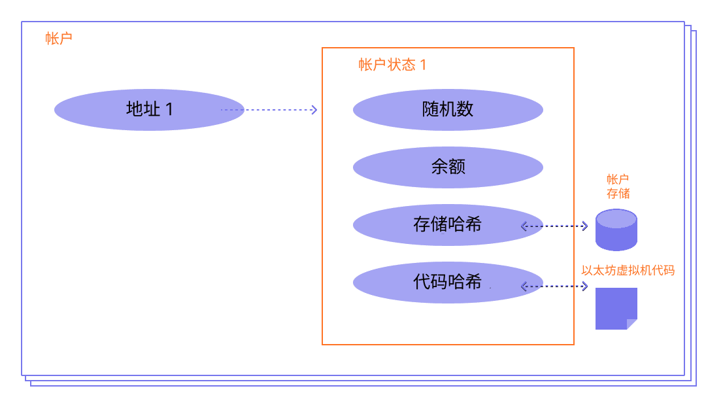

[以太坊](/)账户是一个拥有以太币 (ETH) 余额的实体，可以在以太坊上发送消息。账户可以由用户控制，也可以作为智能合约部署。

## 前提条件 {#prerequisites}

为了帮助你更好地理解本页内容，我们建议你首先阅读[以太坊简介](/developers/docs/intro-to-ethereum/)。

## 账户类型 {#types-of-account}

以太坊有两种账户类型：

- 外部拥有账户 (EOA) ——由任何拥有私钥的人控制
- 合约账户——部署到网络上的智能合约，由代码控制。了解有关[智能合约](/developers/docs/smart-contracts/)的更多信息

这两种账户类型都能够：

- 接收、持有和发送 ETH 和代币
- 与已部署的智能合约进行交互

### 主要区别 {#key-differences}

**外部拥有账户**

- 创建账户没有任何成本
- 可以发起交易
- 外部拥有账户之间的交易只能是 ETH 或代币转移
- 由一对密码学密钥组成：控制账户活动的公钥和私钥

**合约账户**

- 创建合约会产生费用，因为你需要使用网络存储空间
- 只能在收到交易的响应中发送消息
- 从外部账户到合约账户的交易可以触发代码，这些代码可以执行许多不同的操作，例如转移代币甚至创建新合约
- 合约账户没有私钥。相反，它们由智能合约代码的逻辑控制

## 账户剖析 {#an-account-examined}

以太坊账户有四个字段：

- `nonce` – 一个计数器，指示从外部拥有账户发送的交易数量或合约账户创建的合约数量。每个账户只能执行具有给定随机数 (nonce) 的一笔交易，这可以防止重放攻击（即已签名的交易被重复广播和重新执行）。
- `balance` – 该地址拥有的 Wei 数量。Wei 是 ETH 的面额，每个 ETH 包含 1e+18 个 Wei。
- `codeHash` – 该哈希指向以太坊虚拟机 (EVM) 上账户的*代码*。合约账户中编程了可以执行不同操作的代码片段。如果账户收到消息调用，此 EVM 代码就会被执行。与其他账户字段不同，它不能被更改。所有这些代码片段都包含在状态数据库中，位于它们相应的哈希之下，以便以后检索。这个哈希值被称为 codeHash。对于外部拥有账户，codeHash 字段是一个空字符串的哈希。
- `storageRoot` – 有时被称为存储哈希。它是[默克尔帕特里夏树](/developers/docs/data-structures-and-encoding/patricia-merkle-trie/)根节点的 256 位哈希，该树对账户的存储内容（256 位整数值之间的映射）进行编码，并作为从 256 位整数键的 Keccak-256 哈希到 RLP 编码的 256 位整数值的映射编码到树中。这棵树对该账户存储内容的哈希进行编码，默认情况下为空。


_图表改编自 [Ethereum EVM illustrated](https://takenobu-hs.github.io/downloads/ethereum_evm_illustrated.pdf)_

## 外部拥有账户和密钥对 {#externally-owned-accounts-and-key-pairs}

账户由一对密码学密钥组成：公钥和私钥。它们有助于证明交易确实是由发送者签名的，并防止伪造。你的私钥用于对交易进行签名，因此它赋予你对与账户相关联资金的保管权。你从未真正持有加密货币，你持有的是私钥——资金始终在以太坊的账本上。

这可以防止恶意行为者广播虚假交易，因为你始终可以验证交易的发送者。

如果 Alice 想从自己的账户向 Bob 的账户发送以太币，Alice 需要创建一个交易请求并将其发送到网络进行验证。以太坊对公钥密码学的使用确保了 Alice 能够证明她最初发起了该交易请求。如果没有密码学机制，恶意攻击者 Eve 就可以简单地公开广播一个类似于“从 Alice 的账户向 Eve 的账户发送 5 ETH”的请求，而没有人能够验证该请求并非来自 Alice。

## 账户创建 {#account-creation}

当你想要创建一个账户时，大多数库都会为你生成一个随机的私钥。

私钥由 64 个十六进制字符组成，并且可以使用密码进行加密。

示例：

`fffffffffffffffffffffffffffffffebaaedce6af48a03bbfd25e8cd036415f`

公钥是使用[椭圆曲线数字签名算法](https://wikipedia.org/wiki/Elliptic_Curve_Digital_Signature_Algorithm)从私钥生成的。通过获取公钥的 Keccak-256 哈希的最后 20 个字节并在开头添加 `0x`，你就可以获得账户的公共地址。

这意味着外部拥有账户 (EOA) 具有 42 个字符的地址（20 字节段，即 40 个十六进制字符加上 `0x` 前缀）。

示例：

`0x5e97870f263700f46aa00d967821199b9bc5a120`

以下示例展示了如何使用名为 [Clef](https://geth.ethereum.org/docs/tools/clef/introduction) 的签名工具生成新账户。Clef 是一个账户管理和签名工具，与以太坊客户端 [Geth](https://geth.ethereum.org) 捆绑在一起。`clef newaccount` 命令创建一个新的密钥对，并将它们保存在加密的密钥库中。

```
> clef newaccount --keystore <path>

请输入要创建的新账户的密码：
> <password>

------------
INFO [10-28|16:19:09.156] 你的新密钥已生成       address=0x5e97870f263700f46aa00d967821199b9bc5a120
WARN [10-28|16:19:09.306] 请备份你的密钥文件      path=/home/user/go-ethereum/data/keystore/UTC--2022-10-28T15-19-08.000825927Z--5e97870f263700f46aa00d967821199b9bc5a120
WARN [10-28|16:19:09.306] 请记住你的密码！
已生成账户 0x5e97870f263700f46aa00d967821199b9bc5a120
```

[Geth 文档](https://geth.ethereum.org/docs)

可以从你的私钥派生出新的公钥，但你无法从公钥派生出私钥。保证私钥的安全至关重要，顾名思义，它必须是**私密的**。

你需要使用私钥对消息和交易进行签名，从而输出一个签名。然后，其他人可以使用该签名来派生你的公钥，从而证明消息的作者。在你的应用程序中，你可以使用 JavaScript 库向网络发送交易。

## 合约账户 {#contract-accounts}

合约账户也有一个 42 个字符的十六进制地址：

示例：

`0x06012c8cf97bead5deae237070f9587f8e7a266d`

合约地址通常在合约部署到以太坊区块链时给出。该地址源自创建者的地址以及从该地址发送的交易数量（“随机数”）。

## 验证者密钥 {#validators-keys}

以太坊中还有另一种类型的密钥，它是在以太坊从工作量证明 (PoW) 切换到基于权益证明 (PoS) 的共识时引入的。这些是“BLS”密钥，用于识别验证者。这些密钥可以被高效地聚合，以减少网络达成共识所需的带宽。如果没有这种密钥聚合，验证者的最低质押要求将会高得多。

[关于验证者密钥的更多信息](/developers/docs/consensus-mechanisms/pos/keys/)。

## 关于钱包的说明 {#a-note-on-wallets}

账户不是钱包。钱包是一个界面或应用程序，让你能够与你的以太坊账户（无论是外部拥有账户还是合约账户）进行交互。

## 可视化演示 {#a-visual-demo}

观看 Austin 为你讲解哈希函数和密钥对。

<VideoWatch slug="hash-function-eth-build" />

<VideoWatch slug="key-pair-eth-build" />

## 延伸阅读 {#further-reading}

- [理解以太坊账户](https://info.etherscan.com/understanding-ethereum-accounts/) - Etherscan

_知道对你有帮助的社区资源吗？编辑本页并添加它！_

## 相关主题 {#related-topics}

- [智能合约](/developers/docs/smart-contracts/)
- [交易](/developers/docs/transactions/)