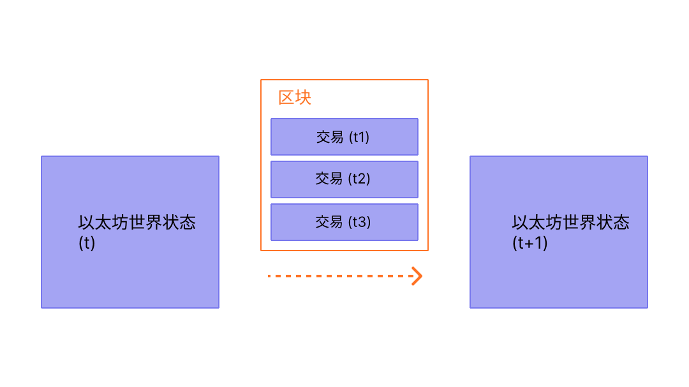

区块是包含链中前一个区块哈希的交易批次。这（在一条链中）将区块链接在一起，因为哈希是从区块数据中通过密码学推导出来的。这可以防止欺诈，因为对历史记录中任何区块的哪怕一次更改，都会使所有后续区块失效，因为所有后续的哈希都会改变，并且每个运行区块链的人都会注意到。

## 前提条件 {#prerequisites}

区块是一个对初学者非常友好的主题。但为了帮助你更好地理解本页面，我们建议你首先阅读[账户](/developers/docs/accounts/)、[交易](/developers/docs/transactions/)以及我们的[以太坊简介](/developers/docs/intro-to-ethereum/)。

## 为什么需要区块？ {#why-blocks}

为了确保[以太坊](/)网络上的所有参与者保持同步的状态并对精确的交易历史达成共识，我们将交易分批打包成区块。这意味着数十个（或数百个）交易被同时提交、达成共识并同步。

_图表改编自[以太坊 EVM 图解](https://takenobu-hs.github.io/downloads/ethereum_evm_illustrated.pdf)_

通过拉开提交的时间间隔，我们为所有网络参与者提供了足够的时间来达成共识：尽管每秒会发生数十次交易请求，但在以太坊上，每十二秒才会创建并提交一次区块。

## 区块如何工作 {#how-blocks-work}

为了保存交易历史，区块是严格排序的（创建的每个新区块都包含对其父区块的引用），并且区块内的交易也是严格排序的。除了极少数情况外，在任何给定时间，网络上的所有参与者都对区块的确切数量和历史达成共识，并致力于将当前实时的交易请求分批打包到下一个区块中。

一旦网络上随机选择的验证者组装好一个区块，它就会被传播到网络的其余部分；所有节点将此区块添加到其区块链的末尾，并选择一个新的验证者来创建下一个区块。确切的区块组装过程和提交/共识过程目前由以太坊的“权益证明 (PoS)”协议规定。

## 权益证明协议 {#proof-of-stake-protocol}

权益证明意味着以下几点：

- 验证节点必须将 32 个 ETH 质押到存款合约中，作为防止不良行为的抵押品。这有助于保护网络，因为可证明的不诚实活动会导致部分或全部质押被销毁。
- 在每个时隙（间隔十二秒）中，会随机选择一个验证者作为区块提议者。他们将交易打包在一起，执行它们并确定一个新的“状态”。他们将这些信息封装到一个区块中，并将其传递给其他验证者。
- 收到新区块消息的其他验证者会重新执行这些交易，以确保他们同意对全局状态提出的更改。假设区块有效，他们会将其添加到自己的数据库中。
- 如果验证者收到同一个时隙的两个冲突区块，他们会使用其分叉选择算法来挑选由最多质押 ETH 支持的那个区块。

[更多关于权益证明的信息](/developers/docs/consensus-mechanisms/pos)

## 区块中包含什么？ {#block-anatomy}

区块中包含大量信息。在最高层级上，区块包含以下字段：

| 字段            | 描述                                           |
| :--------------- | :---------------------------------------------------- |
| `slot`           | 该区块所属的时隙                         |
| `proposer_index` | 提议该区块的验证者 ID           |
| `parent_root`    | 前一个区块的哈希                       |
| `state_root`     | 状态对象的根哈希                     |
| `body`           | 包含多个字段的对象，定义如下 |

区块的 `body` 本身包含多个字段：

| 字段                | 描述                                      |
| :------------------- | :----------------------------------------------- |
| `randao_reveal`      | 用于选择下一个区块提议者的值   |
| `eth1_data`          | 有关存款合约的信息           |
| `graffiti`           | 用于标记区块的任意数据                |
| `proposer_slashings` | 将被罚没的验证者列表                 |
| `attester_slashings` | 将被罚没的证明者列表                  |
| `attestations`       | 针对先前时隙作出的证明列表 |
| `deposits`           | 存款合约的新存款列表     |
| `voluntary_exits`    | 退出网络的验证者列表           |
| `sync_aggregate`     | 用于服务轻客户端的验证者子集 |
| `execution_payload`  | 从执行客户端传递的交易    |

`attestations` 字段包含区块中所有证明的列表。证明有其自己的数据类型，其中包含多项数据。每个证明包含：

| 字段              | 描述                                                    |
| :----------------- | :------------------------------------------------------------- |
| `aggregation_bits` | 参与此证明的验证者列表    |
| `data`             | 具有多个子字段的容器                            |
| `signature`        | 一组验证者对 `data` 部分的聚合签名 |

`attestation` 中的 `data` 字段包含以下内容：

| 字段               | 描述                                                     |
| :------------------ | :-------------------------------------------------------------- |
| `slot`              | 该证明相关的时隙                             |
| `index`             | 证明验证者的索引                                |
| `beacon_block_root` | 被视为链头的信标区块的根哈希 |
| `source`            | 上一个已证明的检查点                                   |
| `target`            | 最新的时段边界区块                                 |

执行 `execution_payload` 中的交易会更新全局状态。所有客户端都会重新执行 `execution_payload` 中的交易，以确保新状态与新区块的 `state_root` 字段中的状态相匹配。这就是客户端如何判断新区块是否有效并可以安全地添加到其区块链中的方式。`execution payload` 本身是一个包含多个字段的对象。还有一个 `execution_payload_header`，其中包含有关执行数据的重要摘要信息。这些数据结构的组织方式如下：

`execution_payload_header` 包含以下字段：

| 字段               | 描述                                                         |
| :------------------ | :------------------------------------------------------------------ |
| `parent_hash`       | 父区块的哈希                                            |
| `fee_recipient`     | 用于支付交易费用的账户地址                      |
| `state_root`        | 应用此区块中的更改后全局状态的根哈希 |
| `receipts_root`     | 交易收据前缀树的哈希                               |
| `logs_bloom`        | 包含事件日志的数据结构                                |
| `prev_randao`       | 用于随机选择验证者的值                            |
| `block_number`      | 当前区块的编号                                     |
| `gas_limit`         | 此区块中允许的 gas 上限                                   |
| `gas_used`          | 此区块中实际使用的 gas 量                         |
| `timestamp`         | 出块时间                                                      |
| `extra_data`        | 作为原始字节的任意附加数据                              |
| `base_fee_per_gas`  | 基础费用值                                                  |
| `block_hash`        | 执行区块的哈希                                             |
| `transactions_root` | 负载中交易的根哈希                        |
| `withdrawal_root`   | 负载中提款的根哈希                         |

`execution_payload` 本身包含以下内容（请注意，这与标头相同，不同之处在于它包含实际的交易列表和提款信息，而不是交易的根哈希）：

| 字段              | 描述                                                         |
| :----------------- | :------------------------------------------------------------------ |
| `parent_hash`      | 父区块的哈希                                            |
| `fee_recipient`    | 用于支付交易费用的账户地址                      |
| `state_root`       | 应用此区块中的更改后全局状态的根哈希 |
| `receipts_root`    | 交易收据前缀树的哈希                               |
| `logs_bloom`       | 包含事件日志的数据结构                                |
| `prev_randao`      | 用于随机选择验证者的值                            |
| `block_number`     | 当前区块的编号                                     |
| `gas_limit`        | 此区块中允许的 gas 上限                                   |
| `gas_used`         | 此区块中实际使用的 gas 量                         |
| `timestamp`        | 出块时间                                                      |
| `extra_data`       | 作为原始字节的任意附加数据                              |
| `base_fee_per_gas` | 基础费用值                                                  |
| `block_hash`       | 执行区块的哈希                                             |
| `transactions`     | 要执行的交易列表                                 |
| `withdrawals`      | 提款对象列表                                          |

`withdrawals` 列表包含按以下方式构建的 `withdrawal` 对象：

| 字段            | 描述                        |
| :--------------- | :--------------------------------- |
| `address`        | 已提款的账户地址 |
| `amount`         | 提款金额                  |
| `index`          | 提款索引值             |
| `validatorIndex` | 验证者索引值              |

## 出块时间 {#block-time}

出块时间是指区块之间的时间间隔。在以太坊中，时间被划分为十二秒的单位，称为“时隙”。在每个时隙中，会选择一个验证者来提议区块。假设所有验证者都在线且功能完全正常，那么每个时隙都会有一个区块，这意味着出块时间为 12 秒。然而，有时验证者在被要求提议区块时可能处于离线状态，这意味着时隙有时可能会空缺。

这种实现方式不同于基于工作量证明 (PoW) 的系统，在后者中，出块时间是概率性的，并由协议的目标挖矿难度进行调整。以太坊的[平均出块时间](https://etherscan.io/chart/blocktime)就是一个完美的例子，通过新的 12 秒出块时间的一致性，可以清楚地推断出从工作量证明到权益证明的过渡。

## 区块大小 {#block-size}

最后需要注意的重要一点是，区块本身的大小是有限制的。每个区块的目标大小为 3000 万 gas，但区块的大小会根据网络需求增加或减少，最高可达 6000 万 gas 的区块上限（目标区块大小的 2 倍）。区块 gas 上限可以根据前一个区块的 gas 上限向上或向下调整 1/1024 的系数。因此，验证者可以通过共识来更改区块 gas 上限。区块中所有交易所消耗的 gas 总量必须小于区块 gas 上限。这很重要，因为它确保了区块不能任意大。如果区块可以任意大，那么性能较低的全节点将由于空间和速度的要求而逐渐无法跟上网络。区块越大，在下一个时隙到来之前及时处理它们所需的计算能力就越大。这是一种中心化的力量，通过限制区块大小可以抵制这种力量。

## 延伸阅读 {#further-reading}

_知道有帮助过你的社区资源吗？编辑本页面并添加它！_

## 相关主题 {#related-topics}

- [交易](/developers/docs/transactions/)
- [Gas](/developers/docs/gas/)
- [权益证明](/developers/docs/consensus-mechanisms/pos)