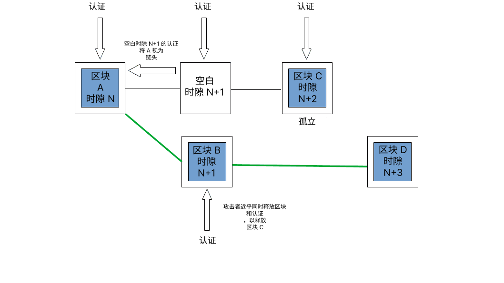

盗窃者和破坏者不断寻找机会来攻击以太坊客户端软件。 本页面概述了以太坊共识层已知的攻击向量以及如何防御这些攻击。 此页面上的信息改编自[加长版](https://mirror.xyz/jmcook.eth/YqHargbVWVNRQqQpVpzrqEQ8IqwNUJDIpwRP7SS5FXs)。

## 前言 {#prerequisites}

阅读本文需要一些[权益证明](/developers/docs/consensus-mechanisms/pos/)的基础知识。 另外，如果对以太坊[激励层](/developers/docs/consensus-mechanisms/pos/rewards-and-penalties)以及分叉选择算法 [LMD-GHOST](/developers/docs/consensus-mechanisms/pos/gasper) 有基本的了解，也会有所帮助。

## 攻击者想要什么？ {#what-do-attackers-want}

一个常见的误解是成功的攻击者可以产生新的以太币或者从任意帐户中耗尽以太币。 这些都是不可能的，因为所有的交易都由网络上的所有执行客户端来执行。 它们必须满足有效性的基本条件（例如，使用发送人私钥签名交易，发送人有足够的余额，等等），否则它们会被恢复原状。 攻击者实际上可能会针对三类结果：重组、双重最终确定性或最终确定性延迟。

**“重组”**是把区块重新调整成新的顺序，也许还会在规范链中增加或减少一些区块。 恶意重组可能会确保特定区块被包含或者被排除，从而允许通过前台运行和后台运行的交易（矿工可提取价值）进行双重支出或价值提取。 重组也能用来阻止某些交易被包含在规范链 - 审查的一种形式。 重组的最极端形式是“最终确定性逆转”，它会移除或代替之前已被最终确定的区块。 这只有在超过 ⅓ 的质押以太币总量被攻击者销毁时才可能 - 这种保证被称为“经济最终确定性” - 稍后会详细介绍。

**双重最终确定性**是一种不太可能但是会很严重的情况，两个分叉能够同时最终确定，在链中造成永久性分裂。 对于愿意冒 34% 的质押以太币总量风险的攻击者来说，这在理论上是可行的。 社区将被迫在链下进行协调，达成应该遵循哪一条链的共识，这需要社交层的力量。

**最终确定性延迟**攻击会阻止网络达到最终确定链的部分的必要条件。 如果没有最终确定性，那就很难信任构造在以太坊上的金融应用。 最终确定性延迟攻击的目的可能只是破坏以太坊而不是直接获利，除非攻击者有一些战略性空头头寸。

对社交层的攻击可能旨在破坏公众对以太坊的信任、让以太币贬值、减少使用或者削弱以太坊社区，以便让带外协作更加困难。

在确定了敌人为什么攻击以太坊后，接下来的部分看看他们是_如何_做的。

## 攻击方式 {#methods-of-attack}

### 0 层网络攻击 {#layer-0}

首先，没有积极参与以太坊（通过运行客户端软件）的个人可以针对社交层（0 层网络）进行攻击。 0 层网络是以太坊构建的基础，因此它代表了潜在的攻击面，其后果会波及堆栈的其余部分。 包括这些例子：

- 一个混淆视听的活动可以削弱社区对以太坊路线图、开发者团队、应用等的信任。 这会减少愿意参与保护网络安全的人数，降低去中心化和加密经济安全的程度。
- 针对开发者社区的攻击和/或恐吓。 这会导致开发者自愿退出，并减缓以太坊的进展。

- 过度监管也被认为是一种针对 0 层网络的攻击，因为它能够快速的抑制参与和使用。
- 知识丰富但怀有恶意的行为者渗透到开发者社区，其目的是通过避重就轻的讨论、延迟关键决策、制造垃圾邮件等来减缓进展。
- 贿赂以太坊生态系统的重要人物，以此来影响决策过程。

在很多情况下，攻击者只需要一点资金或者技术诀窍，就能让这些攻击变得特别危险。 一个 0 层网络攻击造成的影响可能是一个加密经济攻击的数倍。 例如，如果恶意的多数质押拥有者实现了审查或最终确定性逆转，那么破坏社会层可能会使带外协调社区响应变得更加困难。

对 0 层网络攻击的防御可能不是那么简单，但是可以确立一些基本原则。 其中一个是保持关于以太坊公共信息的整体高信噪比，由社区中的诚实成员创建，并且通过博客、discord 服务器、注释规范、书籍、播客和 Youtube 来进行传播。 在 ethereum.org，我们竭力保持信息的准确，并且把信息尽可能的翻译成更多的语言。 使用高质量信息和模因来填充空间是一种对误导信息的有效防御。

另一个对抗社交层攻击的重要措施是有一个清晰的使命宣言和治理协议。 以太坊将自己定位为智能合约一层网络中的去中心化和安全冠军，同时也高度重视可扩展性和可持续性。 无论以太坊社区出现什么分歧，这些核心原则都不会受到损害。 根据这些核心原则对叙述进行评估，以及在 EIP（以太坊改进提案）进展中通过连续多轮评审对其进行检查，有助于社区区分良好行为者与不良行为者，并且限制恶意行为者影响以太坊未来方向的范围。

最后，以太坊社区保持开放并欢迎所有参与者至关重要。 有门槛和排外性的社区特别容易遭受社交层攻击，因为很容易建立“我们和他们”的说法。 部落主义和有毒的极简主义会伤害社区和削弱 0 层网络安全性。 在网络安全有既得利益的以太坊人应该审视他们在网上和现实中的行为，把自己看作对以太坊 0 层网络安全的直接贡献者。

### 攻击协议 {#attacking-the-protocol}

所有人都能运行以太坊客户端软件。 为了把验证者添加到客户端，用户需要在存款合约质押 32 个以太币。 验证者允许用户通过提议和证明新区块，活跃参与以太坊网络的安全建设。 验证者现在可以发声来影响区块链的未来内容 - 他们可以表现诚实并通过奖励来增加他们的以太币储备，他们也可以冒着风险尝试操纵这个过程来给他们自己谋利。 其中一个发动攻击的方式是积累大部分的总质押并且通过它投票反对诚实的验证者。 攻击者控制的质押比例越大，他们的投票就越有力，特别是在我们稍后将探讨的某些经济里程碑。 然而，大部分攻击者并不能积累足够的以太币来启动这样的攻击，因此，他们使用一些微妙的技术操纵大部分的诚实者来实现这种攻击。

从根本上说，所有小额质押攻击都是两种验证者不当行为的细微变种：活跃不足（无法证明/提议或行动缓慢）或过度活跃（在一个时隙多次提议/证明）。 在最普通的形式中，这些行为能被分叉选择算法和激励层轻松处理，但是也存在其他一些更聪明的方法让系统做出对攻击者有利的反应。

### 使用少量以太币攻击 {#attacks-by-small-stakeholders}

#### 重组 {#reorgs}

有不少论文说明了如何仅使用少量的总质押以太币，达到重组和最终确定性延迟的以太坊攻击。 这些攻击通常依赖于攻击者向其他验证者隐瞒信息，然后以微妙的方式和/或适当的时机释放它。 它们的目的通常是替换规范链中的一些诚实的区块。 [Neuder et al 2020](https://arxiv.org/pdf/2102.02247.pdf) 展示了发动攻击的验证者如何为一个特定的时隙 `n+1` 创建和证明一个区块 (`B`)，但不让它向网络上的其他节点传播。 反之，它们会保留已被证明的区块，直到下一个时隙 `n+2`。 诚实的验证者为时隙 `n+2` 提议一个区块 (`C`)。 几乎同时，攻击者释放它们所扣留的区块 (`B`) 及其认证，然后使用它们的投票在时隙 `n+2` 证明 `B` 是链的头部，有效否认诚实区块 `C` 的存在。 当诚实区块 `D` 被释放时，分叉选择算法认为构建在 `B` 之上的 `D` 重于构建在 `C` 上的 `D`。 因此，攻击者可以在时隙 `n+2` 使用事前重组的单区块从规范链移除诚实区块 `C`。 [攻击者拥有 34%](https://www.youtube.com/watch?v=6vzXwwk12ZE) 的质押将很可能在这次攻击中成功，如[这篇笔记](https://notes.ethereum.org/plgVdz-ORe-fGjK06BZ_3A#Fork-choice-by-block-slot-pair)所解释。 不过，从理论上讲，这种攻击可以用更少的质押进行。 [Neuder et al 2020](https://arxiv.org/pdf/2102.02247.pdf) 描述这次攻击使用了 30% 的质押，但后续展示了 [2% 总质押](https://arxiv.org/pdf/2009.04987.pdf)的可行性。我们将在下一部分研究 [单一验证者](https://arxiv.org/abs/2110.10086#)使用平衡技术。

上面描述的单区块重组攻击的概念图（改编自 https://notes.ethereum.org/plgVdz-ORe-fGjK06BZ_3A#Fork-choice-by-block-slot-pair）

更加复杂的攻击可以将诚实验证者分成不同的组，不同的组对于链头部有不同的看法。 这被称为**平衡攻击**。 攻击者等待提议区块的机会，当机会到来时他们会摸棱两可并且提议两个区块。 他们会把这两个区块分别发送给各一半的诚实验证者。 分叉选择算法将会检测到摸棱两可的情况，然后区块提议者会被罚没以及从网络移除，但是这两个区块仍然存在，并且各一半的验证者会证明各自的分叉。 与此同时，剩余的恶意验证者会暂缓他们的认证。 然后，在分叉选择算法执行时，有选择性地将利于一个或另一个分叉的认证释放给足够多的验证者，从而让累积的认证权重向一个或另一个分叉倾斜。 这可以无限期地持续下去，攻击验证者在两个分叉上保持了验证者的平均分配。 由于这两个分叉都不能吸引 2/3 的绝对多数，网络不会最终确定。

**弹跳攻击**类似。 投票同样被攻击验证者扣留。 但他们没有释放投票来保持两个分叉的平均分配，而是在适当的时候使用他们的投票来证明在分叉 A 和分叉 B 之间变换的检查点的合理性。两个分叉之间的合理性翻转阻止了有成对的合理来源和目标检查点在任一链的最终确定，从而让最终确定性进程停止。

<YouTube id="xcPxwhrg3Ao"/>

弹跳攻击和平衡攻击都依赖于攻击者对网络的消息时机有良好的控制，而这是不可能的。 不过，有一些防御措施被加入到协议中，其形式是给快速信息提供额外的权重，而非慢速信息。 这被称为[提议者权重增强](https://github.com/ethereum/consensus-specs/pull/2730)。 为了应对弹跳攻击，对分叉选择算法进行了更新，这样最新被证明的检查点只能在[每个时段的前 1/3 时隙](https://ethresear.ch/t/prevention-of-bouncing-attack-on-ffg/6114)期间切换到另一条链。 这个条件阻止了攻击者保存投票以便后续实施 - 分叉选择算法只忠于它在前 1/3 时段选择的检查点，在这个时间内大部分诚实的验证者已经完成了投票。

这些措施结合在一起形成了这样一种场景：诚实的区块提议者在时隙开始时快速发送他们的区块，然后约有 1/3 时隙（4秒）的时间段，新区块可能导致分叉选择算法切换到另一条链。 在同一截止时间后，与较早到达的验证者相比，来自较慢验证者的认证会被降低权重。 这极大地支持了快速提议者和验证者决定链的头部，同时大大减少了平衡或弹跳攻击成功的可能性。

值得注意的是，被单独增强的提议者只能防御“廉价的重组”，即那些有少量质押的攻击者实施的攻击。 实际上，提议者增强本身可以被较大数量质押拥有者所利用。 [这个帖子](https://ethresear.ch/t/change-fork-choice-rule-to-mitigate-balancing-and-reorging-attacks/11127)的作者描述了攻击者如何利用 7% 质押有策略地实施他们的投票，欺骗诚实验证者在他们的分支上进行构建，从而重组出一个诚实的区块。 这种攻击需要非常理想的延迟条件设计，这不太可能。 攻击者的胜算仍然很低，更多的质押意味着冒更多的资本风险和更强力的经济抑制因素。

[专门针对“最新消息驱动”规则的平衡攻击](https://ethresear.ch/t/balancing-attack-lmd-edition/11853)也被提出，尽管有提议者增强，它仍被认为是可行的。 攻击者设置两个互相竞争的链，摸棱两可地提出他们的区块提议并把每个区块都传播给对应的一半网络，以及在分叉之间设置精确的平衡。 然后串通验证者来摸棱两可地投票并掌握好时机，让一半的网络先接收分叉 `A` 的投票，另一半的网络先接收 `B` 的投票。 因为“最新消息驱动”规则会丢弃第二个认证，只为每个验证者保留第一个，一半的网络看到给 `A` 的投票，看不到给 `B` 的投票，另一半网络看到给 `B` 的投票，看不到给 `A` 的投票。 作者描述了“最新消息驱动”规则给了对手“非凡的力量”来发动平衡攻击。

通过[更新分叉选择算法](https://github.com/ethereum/consensus-specs/pull/2845)，“最新消息驱动”攻击向量已变得不可行，因为更新后的分叉选择算法会完全丢弃模棱两可的验证者。 分叉选择算法让摸棱两可的验证者对于未来的影响非常有限。 这阻止了上述的平衡攻击，同时保持抵抗雪崩攻击的弹性。

另一类攻击，称为[**雪崩攻击**](https://ethresear.ch/t/avalanche-attack-on-proof-of-stake-ghost/11854/3)，它在一篇 [2022 年 3 月的论文](https://arxiv.org/pdf/2203.01315.pdf)中有所描述。 为了发动雪崩攻击，攻击者需要控制几个连续的区块提议者。 在每个区块提议的时隙，攻击者扣留他们的区块，把他们收集起来，直到诚实链达到与扣留区块相等的子树权重。 然后，扣留的区块会被释放，以便他们最大程度地摸棱两可。 作者认为提议者增强 - 对平衡攻击和弹跳攻击的主要防御方法 - 不能对抗某些雪崩攻击的变种。 然而，作者只论证了在高度理想的以太坊分叉选择算法版本（他们使用幽灵协议，但不是最新消息驱动）中进行攻击。

LMD-GHOST 分叉选择算法的“最新消息驱动”部分减轻了雪崩攻击。 LMD 的意思是“最新消息驱动”，它是指一个由每个验证者保存的表格，表格包含从其他验证者收到的最新消息。 如果表格中已经存在从某个验证者接收到的消息，那么来自该验证者的新消息的时隙需要比表格中已有消息的时隙更晚，该字段才会更新。 实际上，这意味着在每个时隙中，第一条被接收到的消息会被接受，其余任何摸棱两可的消息会被忽略。 换言之，共识客户端不对模棱两可进行计数 - 他们使用从每个验证者发出的第一个到达的消息，模棱两可的则会被丢弃，以防止雪崩攻击。

未来还有几个潜在的分叉选择规则升级，它们能增加由提议者增强提供的安全性。 其中一个是[视图合并](https://ethresear.ch/t/view-merge-as-a-replacement-for-proposer-boost/13739)：在时隙开始前，证明者冻结它们的分叉选择视图 `n` 秒，然后提议者会帮助它们同步网络中链的视图。 另一个潜在的升级是[单时隙最终确定性](https://notes.ethereum.org/@vbuterin/single_slot_finality)，它通过在一个时隙后最终确定链，来抵抗基于消息时机的攻击。

#### 最终确定性延迟 {#finality-delay}

在[同一篇论文](https://econcs.pku.edu.cn/wine2020/wine2020/Workshop/GTiB20_paper_8.pdf)，首次描述了低成本单区块重组攻击，也描述了最终确定性延迟（也被称为“活性失败”）攻击，它依赖于攻击者成为时段边界的区块提议者。 这非常重要，因为这些时段边界区块会成为检查点，Casper 友好确定工具使用这些检查点来最终确定链的部分。 攻击者扣留他们的区块，直到足够多的诚实验证者使用它们友好确定工具投票来支持上一个时段边界区块作为当前最终确定的目标。 然后，他们就会释放扣留的区块。 他们证明他们的区块，并且其余诚实验证者也用不同的目标检查点创建分叉。 如果他们准确把握时机，他们就会阻止最终确定性，因为这将没有 2/3 的绝对多数来证明任何一个分叉。 质押越小，就要越精准地把握时机，因为攻击者直接控制的认证会越少，并且攻击者能够控制提出特定时段边界区块的验证者的胜算就越低。

#### 长程攻击 {#long-range-attacks}

还有一种针对权益证明区块链的攻击。在这种攻击中，参与创世区块的验证者会维护一条独立的、与诚实分叉同时存在的分叉，并且最终说服诚实的验证者在很久之后的某个合适的时间切换到该链。 这类型的攻击在以太坊不可能发生，因为最终确定性小工具保证所有的验证者在固定间隙（“检查点”）同意诚实链的状态。 这种简单机制抵制了长程攻击者，因为以太坊客户端不会重组最终确定的区块。 加入网络的新节点会寻找一个被信任的最近状态哈希（一个[主观性弱](https://blog.ethereum.org/2014/11/25/proof-stake-learned-love-weak-subjectivity/)的“检查点”），并将其作为一个伪创世块，在这基础上进行构建。 由此，在新节点开始给它自己验证信息之前，创建了一个进入网络的“信任网关”。

#### 拒绝服务 {#denial-of-service}

以太坊权益证明机制在每个时隙从所有验证者中挑选出一个验证者成为区块提议者。 这可以通过一个公开的函数来计算，对手有可能在提议者提出区块前一小段时间，提前识别出下一个区块提议者。 然后，攻击者可以向区块提议者发送垃圾邮件，阻止他们与其他节点交换信息。 对于网络上其余的人来说，相当于区块提议者离线，并且时隙会变空。 这相当于一种对于特定验证者的审查，阻止他们向区块链添加信息。 实现单一秘密领导者选举 (SSLE) 或者非单一秘密领导者选举能减少拒绝服务攻击的风险，因为只有区块提议者知道自己被选中，而选举结果是无法提前获知的。 但这还没有实现，只是[研发](https://ethresear.ch/t/secret-non-single-leader-election/11789)的活跃领域。

所有这些都指向一个事实，那就是使用少数质押成功攻击以太坊非常困难。 这里所描述的可行攻击需要一个理想的分叉选择算法、不可能的网络条件，或者攻击向量已经被客户端软件小补丁修复。 当然，这不排除存在零日攻击的可能性，不过这也证明了少数质押攻击者要有效实施攻击，需要有非常高的技术能力、共识层知识以及运气。 从攻击者的角度来看，他们最好的选择可能是尽可能多地积累以太币，然后带着更大比例的总质押回来。

### 使用超过或等于总质押 33% 的攻击者 {#attackers-with-33-stake}

如果攻击者有更多质押以太币来投票，以及有更多验证者在每个时隙被选中提议区块，上述提到的所有攻击就更容易成功。 因此，一个恶意验证者的目标是控制尽可能多的质押以太币。

对于攻击者来说，33% 的质押以太币是一个基准，因为一旦超过这个数量，他们无需精确控制其他验证者行为就能阻止链最终确定。 他们可以一起消失。 如果 1/3 或更多的质押以太币恶意地证明或无法证明，那么就不存在 2/3 的绝对多数，链也无法最终确定。 对此的防御方法是怠惰惩罚。 怠惰惩罚识别那些无法证明或与大多数证明不一致的验证者。 这些无证明验证者的质押以太币将逐渐流失，直到他们集体所代表的数量少于 1/3 的总数，这样链才能再次最终确定。

怠惰惩罚的目的是让链可以再次最终确定。 不管怎样，攻击者也会失去一部分的质押以太币。 代表 33% 总质押以太币的验证者如果持续不活跃，将付出昂贵的代价，即使没有被罚没。

假设以太坊网络是异步的（即，在消息发送和接收之间存在延迟），控制 34% 总质押的攻击者就可以引起双重最终确定性。 因为当攻击者被选为区块提议者时，他们就可以模棱两可，然后联合他们所有的验证者进行双重投票。 这造成了一个区块链分叉存在的情况，每个分叉都有 34% 的质押以太币给它投票。 每个分叉只需要剩余验证者 50% 的投票，两个分叉就可以得到绝对多数所支持，在这种情况下，两条链都能最终确定（因为 34% 攻击验证者 + 剩余的 66% 的一半 = 每个分叉 67%）。 互相竞争的区块将被约 50% 的诚实验证者接收，因此为了让攻击可行，攻击者需要在一定程度上控制消息在网络传播的时机，以便他们可以将一半的诚实验证者推到每条链上。 攻击者必须销毁他们的全部质押（以目前验证者数量来说，是约 1000 万以太币的 34%）以便达到这种双重最终确定性，因为 34% 的验证者将同时进行双重投票 - 有着最大的相关性惩罚的罚没罪行。 对这种攻击的防御方法是攻击者将承担 34% 的总质押以太币被销毁的巨大成本。 从这种攻击中恢复需要以太坊社区在“带外”进行协调，选择同意哪一个分叉，然后忽略其他分叉。

### 使用约 50% 总质押的攻击者 {#attackers-with-50-stake}

拥有 50% 质押以太币的恶意验证者团队理论上可以将链分成两个相同大小的分叉，然后使用他们全部 50% 质押投出与诚实验证者团体相反的投票，以此来维持两个分叉以及阻止最终确定性。 对两个分叉的怠惰惩罚将导致两条链都会最终确定。 在这种情况下，唯一的方法就是使用社交层进行恢复。

对于一个敌对的验证者团体来说，不太可能可以持续精确控制 50% 的总质押，因为诚实验证者的数量是流动变化的，网络也会发生延迟等等 - 巨大的攻击成本以及低成功率对于理性攻击者来说是一种强力的抑制因素，尤其是用于获取_超过_ 50% 的小额额外投资可以释放非常强大的力量时。

如果攻击者拥有超过 50% 的总质押，就可以支配分叉选择算法。 这时，攻击者可以使用大多数投票来证明，而且有足够的控制权力进行短期重组，而无需欺骗诚实验证者。 诚实的验证者会效仿，因为他们的分叉选择算法也会把攻击者支持的链视为最重的，因此链可以最终确定。 这使得攻击者可以审查某些交易，以有利于他们的方式进行短距重组以及重新排序区块来提取最大的矿工可提取价值。 对此的防御手段是让攻击者付出大多数质押的巨大成本（目前略低于 190 亿美元），这会让攻击者面临风险，因为社交层可能会介入并采纳诚实的少数分支，让攻击者的质押大幅度贬值。

### 使用超过或等于 66% 总质押的攻击者 {#attackers-with-66-stake}

拥有 66% 或更多总质押以太币的攻击者，可以在无需胁迫任何诚实验证者的情况下最终确定他们所支持的链。 攻击者只需要给他们所支持的分叉进行投票并最终确定它，因为他们有绝对多数的不诚实投票。 作为绝对多数的质押拥有者，攻击者始终可以控制最终确定的区块的内容，拥有着支出、回退和再次支出、审查某些交易以及随意重组链的能力。 通过购买额外的以太币来控制 66% 而非 51%，攻击者实际上购买了事后重组和最终确定性逆转的能力（即改变过去并控制未来）。 唯一实际可操作的防御方法是攻击者需要付出 66% 总质押以太币的高昂成本，然后选择回退到社交层来协调采纳替代的分支。 我们将在下一部分详细探讨这一点。

## 人：最后的防线 {#people-the-last-line-of-defense}

如果不诚实的验证者设法最终确定他们所支持的链版本，以太坊社区将陷入困境。 规范链将在其历史记录中包含不诚实部分，同时诚实的验证者可能会因证明另一条（诚实）链而被惩罚。 注意，最终确定的但不正确的链也可能是大多数客户端的漏洞引起的。 最后，最终的回退需要依赖于社交层 - 0 层网络 - 来解决。

以太坊权益证明共识的其中一个优势是存在[一系列的防御策略](https://youtu.be/1m12zgJ42dI?t=1712)，在面对攻击的时候社区可以实施这些策略。 最起码的响应是在不实施任何惩罚的情况下强制攻击者的验证者离开网络。 为了重新进入网络，攻击者需要加入到一个激活队列，确保验证者组逐步增加。 例如，添加足够的验证者让质押的以太币翻倍需要约 200 天，攻击者要再一次尝试 51% 攻击，需要提前 200 天收买诚实的验证者。 但是，社区也可以决定更严厉地惩罚攻击者，方法是撤销以往的奖励或者销毁一定比例的（高达 100%）质押资本。

不管攻击者受到什么惩罚，社区都必须一起确认不诚实链实际上是否无效，尽管它被以太坊客户端的分叉选择算法所支持。社区应该在诚实的链上构建。 诚实的验证者可以集体同意在被社区认可的以太坊区块链分叉上进行构建，例如，该分叉可能在攻击开始之前就已经从规范链上分叉出来，或者攻击者的验证者被强行移除。 诚实的验证者受到激励来构建这条链，因为他们可以避免因无法证明（或无法正确地证明）攻击者的链而受到惩罚。 建立在以太坊上的交易所、入口和应用可能更愿意位于诚实链上，并且跟随诚实验证者的诚实区块链。

但是，这是一个重大的治理挑战。 有些用户和验证者会在切换回诚实链时无可避免地产生损失，因为攻击后被验证的区块中的交易可能会回滚，从而扰乱应用层。这很容易破坏一些相信“代码就是法律”的用户的道德原则。 交易所和应用很可能已经把脱链行为和现在可能要回滚的链上交易关联起来，并开始一连串的撤回和修订，很难公平地进行取舍，特别是如果不义之财混杂在其中，存入了去中心化金融或其他衍生品，会对诚实用户产生二次影响。 毫无疑问，那些因为精明或机缘巧合已经从不诚实链获利的一些用户甚至机构，可能会反对分叉以此保护他们的利益。 目前已经有呼吁要求社区对大于 51% 攻击的响应进行演练，以便可以快速执行合理的协调缓解措施。 Vitalik 发起一些有用的讨论，在 ethresear.ch 上：[这里](https://ethresear.ch/t/timeliness-detectors-and-51-attack-recovery-in-blockchains/6925)和[这里](https://ethresear.ch/t/responding-to-51-attacks-in-casper-ffg/6363)，以及在 Twitter 上：[这里](https://twitter.com/skylar_eth/status/1551798684727508992?s=20&t=oHZ1xv8QZdOgAXhxZKtHEw)。 协调的社会响应的目的应该是非常有针对性和具体地惩罚攻击者并尽量减少对其他用户的影响。

治理已经是一个复杂的话题。 管理 0 层网络紧急响应通过不诚实行为确定下来的链，对于以太坊社区来说毋庸置疑是一个挑战，但在以太坊历史上[已经发生过](/history/#dao-fork-summary) [2 次](/history/#tangerine-whistle)。

尽管如此，在现实世界的最后回滚中，还是有一些令人相当满意的东西。 最后，即使在我们之上有着如此惊人的技术堆栈，但如果最坏的情况发生了，现实中的人们也必将协调出一条属于他们的出路。

## 摘要 {#summary}

本页面探讨了攻击者试图利用以太坊权益证明共识协议的一些方法。 随着总质押以太币比例不断增加，探讨了攻击者可能造成的重组和最终确定性延迟。 总的来说，更富裕的攻击者成功的几率更大，因为他们的质押将变成有力的投票，从而影响未来区块的内容。 在一定阈值的质押以太币数量下，攻击者的力量会上升：

33%：最终确定性延迟

34%：最终确定性延迟、双重最终确定性

51%%：最终确定性延迟、双重最终确定性、审查、控制区块链的未来

66%：最终确定性延迟、双重最终确定性、审查、控制区块链的未来以及过去

还有一系列更加复杂的运用少量质押以太币发起的攻击，但是需要非常有经验的攻击者良好地控制消息在诚实验证者之间的传播时机，以便让形势对攻击者有利。

总的来说，尽管存在这些潜在的攻击向量，但是攻击成功的概率非常低，低于在工作量证明机制下实施的同类攻击。 这是因为攻击者需要冒着巨大的质押以太币成本风险，以便利用他们的投票力量压倒诚实的验证者。 内置的“恩威并济”激励层可以防止大多数的恶意行为，尤其是对于拥有少量质押的攻击者。 更微妙的弹跳和平衡攻击也不太可能成功，因为在现实的网络条件下，很难良好地控制消息向特定验证者传递，如果发现了已知的弹跳、平衡和雪崩攻击向量，客户端团队也能通过补丁快速修复。

34%、51% 或者 66% 攻击可能需要带外的社会协调来解决。 虽然对于社区来说是痛苦的，但是社区的带外响应能力对于攻击者来说是一种强大的抑制力量。 以太坊的社交层是最终的后盾 - 从技术性取得成功的攻击仍然会被社区同意采用诚实链所瓦解。 攻击者和以太坊社区之间存在一场竞赛 - 花费在 66% 攻击上的数十亿美元可能会被成功的社交协调所抹除，从而给攻击者留下沉重的包袱，因为它们质押的以太币将在被以太坊社区忽略的不诚实链上无法流动。 最终为攻击者带来利益的可能性非常低，这足以成为一种有效的威慑。 这就是为什么投资于维持有共同价值观和凝聚力的社交层如此重要。

## 延伸阅读 {#further-reading}

- [此页面的更详细版本](https://mirror.xyz/jmcook.eth/YqHargbVWVNRQqQpVpzrqEQ8IqwNUJDIpwRP7SS5FXs)
- [Vitalik 关于结算最终确定性的看法](https://blog.ethereum.org/2016/05/09/on-settlement-finality/)
- [有关最新消息驱动的幽灵协议的论文](https://arxiv.org/abs/2003.03052)
- [“Casper-FFG”论文](https://arxiv.org/abs/1710.09437)
- [Gasper 论文](https://arxiv.org/pdf/2003.03052.pdf)
- [提议者权重增强共识层规范](https://github.com/ethereum/consensus-specs/pull/2730)
- [ethresear.ch 的弹跳攻击](https://ethresear.ch/t/prevention-of-bouncing-attack-on-ffg/6114)
- [单一秘密领导者选举研究](https://ethresear.ch/t/secret-non-single-leader-election/11789)
