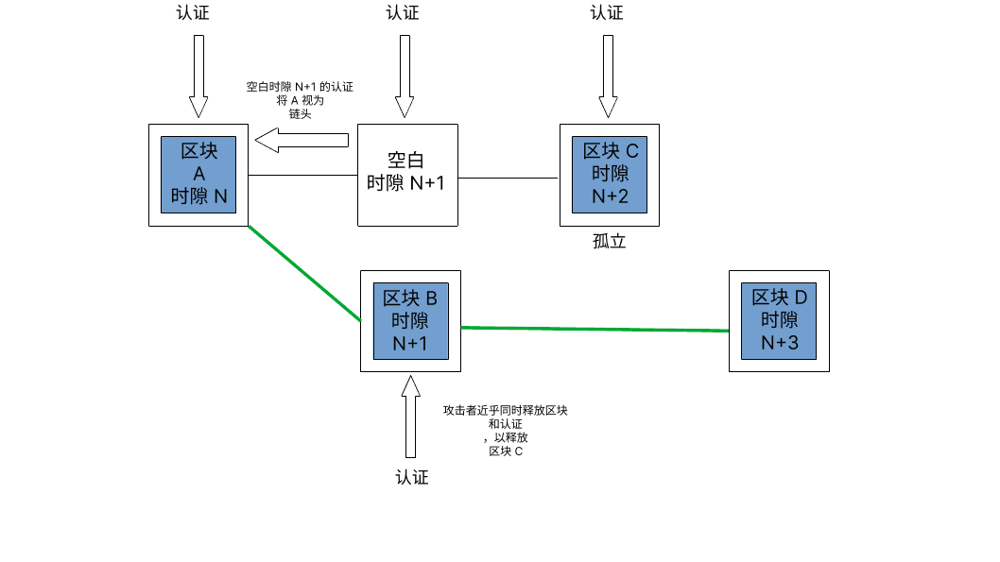

窃贼和破坏者不断寻找机会攻击[以太坊](/)的客户端软件。本页面概述了以太坊共识层上的已知攻击向量，并说明了如何防御这些攻击。本页面的信息改编自[长篇版本](https://mirror.xyz/jmcook.eth/YqHargbVWVNRQqQpVpzrqEQ8IqwNUJDIpwRP7SS5FXs)。

## 先决条件 {#prerequisites}

需要具备一些关于[权益证明 (PoS)](/developers/docs/consensus-mechanisms/pos/)的基础知识。此外，对以太坊的[激励层](/developers/docs/consensus-mechanisms/pos/rewards-and-penalties)和分叉选择算法 [LMD-GHOST](/developers/docs/consensus-mechanisms/pos/gasper) 有基本了解也会有所帮助。

## 攻击者想要什么？ {#what-do-attackers-want}

一个常见的误解是，成功的攻击者可以生成新的以太币，或从任意账户中抽走以太币。这两种情况都是不可能的，因为所有交易都由网络上的所有执行客户端执行。它们必须满足有效性的基本条件（例如，交易由发送者的私钥签名，发送者有足够的余额等），否则它们只会回退。攻击者可能实际针对的结果有三类：重组、双重最终性或最终性延迟。

<strong>“重组”</strong>是指将区块重新排列成新的顺序，可能在规范链中增加或减少一些区块。恶意重组可能会确保包含或排除特定区块，从而允许双重支付或通过抢跑和尾随交易提取价值（MEV）。重组也可用于防止某些交易被包含在规范链中——这是一种审查形式。最极端的重组形式是“最终性回转”，它会移除或替换之前已最终确定的区块。只有当攻击者销毁超过总质押以太币的 1/3 时，这才有可能发生——这种保证被称为“经济最终性”——稍后会详细介绍。

<strong>双重最终性</strong>是一种不太可能发生但非常严重的情况，即两个分叉能够同时最终确定，从而在链中造成永久性分裂。对于愿意冒 34% 总质押以太币风险的攻击者来说，这在理论上是可能的。社区将被迫在链下进行协调，并就遵循哪条链达成一致，这将需要社交层的力量。

<strong>最终性延迟</strong>攻击会阻止网络达到最终确定链段的必要条件。没有最终性，就很难信任建立在以太坊之上的金融应用程序。最终性延迟攻击的目的可能仅仅是破坏以太坊，而不是直接获利，除非攻击者有一些战略性的空头头寸。

对社交层的攻击可能旨在破坏公众对以太坊的信任、使以太币贬值、减少采用率或削弱以太坊社区，从而使带外协调变得更加困难。

在确定了对手为何可能攻击以太坊之后，以下部分将探讨他们可能_如何_进行攻击。

## 攻击方法 {#methods-of-attack}

### 零层网络攻击 {#layer-0}

首先，未积极参与以太坊（通过运行客户端软件）的个人可以通过针对社交层（零层网络）进行攻击。零层网络是以太坊构建的基础，因此它代表了一个潜在的攻击面，其后果会波及堆栈的其余部分。一些例子可能包括：

- 虚假信息活动可能会削弱社区对以太坊路线图、开发者团队、应用程序等的信任。这可能会减少愿意参与保护网络安全的个人数量，从而降低去中心化和加密经济的安全性。
- 针对开发者社区的定向攻击和/或恐吓。这可能导致开发者自愿退出，并减缓以太坊的进展。

- 过度热心的监管也可以被视为对零层网络的攻击，因为它会迅速抑制参与和采用。
- 知识渊博但心怀恶意的行为者渗透到开发者社区，其目的是通过琐碎的争论、延迟关键决策、制造垃圾信息等来减缓进展。
- 向以太坊生态系统中的关键参与者行贿以影响决策。

使这些攻击特别危险的是，在许多情况下，它们几乎不需要资金或技术知识。零层网络攻击可能是加密经济攻击的乘数。例如，如果恶意的多数利益相关者实现了审查或最终性回转，破坏社交层可能会使带外协调社区响应变得更加困难。

防御零层网络攻击可能并不简单，但可以确立一些基本原则。一是保持关于以太坊的公共信息的整体高信噪比，这些信息由诚实的社区成员通过博客、Discord 服务器、带注释的规范、书籍、播客和 YouTube 创建和传播。在 ethereum.org，我们努力维护准确的信息，并将其翻译成尽可能多的语言。用高质量的信息和模因充斥一个空间是抵御虚假信息的有效防御手段。

抵御社交层攻击的另一个重要防御措施是明确的使命宣言和治理协议。以太坊将自己定位为智能合约一层网络 (l1) 中的去中心化和安全冠军，同时也高度重视可扩展性和可持续性。无论以太坊社区出现什么分歧，这些核心原则受到的妥协都是最小的。根据这些核心原则评估一种叙事，并通过 EIP（以太坊改进提案）流程中的连续几轮审查来检验它们，可能有助于社区区分好坏行为者，并限制恶意行为者影响以太坊未来方向的范围。

最后，以太坊社区对所有参与者保持开放和欢迎是至关重要的。一个有守门人和排他性的社区特别容易受到社交攻击，因为很容易建立“我们和他们”的叙事。部落主义和有毒的极端主义会伤害社区并侵蚀零层网络的安全性。在网络安全方面拥有既得利益的以太坊支持者应将他们在网上和现实世界中的行为视为对以太坊零层网络安全的直接贡献。

### 攻击协议 {#attacking-the-protocol}

任何人都可以运行以太坊的客户端软件。要向客户端添加验证者，要求用户将 32 个以太币质押到存款合约中。验证者允许用户通过提议和证明新区块来积极参与以太坊的网络安全。验证者现在拥有了可以用来影响区块链未来内容的发言权——他们可以诚实地这样做，并通过奖励增加他们的以太币储备，或者他们可以尝试操纵这个过程以获取自己的利益，从而冒着质押被罚没的风险。发起攻击的一种方法是积累更大比例的总质押，然后利用它在投票中击败诚实的验证者。攻击者控制的质押比例越大，他们的投票权就越大，尤其是在我们稍后将探讨的某些经济里程碑上。然而，大多数攻击者将无法积累足够的以太币以这种方式进行攻击，因此他们必须使用微妙的技术来操纵诚实的多数派以某种方式行事。

从根本上说，所有小额质押攻击都是两种验证者不当行为的微妙变体：活动不足（未能证明/提议或延迟这样做）或活动过度（在一个时隙中提议/证明太多次）。在最普通的形式下，这些行为很容易被分叉选择算法和激励层处理，但有一些巧妙的方法可以利用系统为攻击者谋利。

### 使用少量 ETH 的攻击 {#attacks-by-small-stakeholders}

#### 重组 {#reorgs}

几篇论文解释了对以太坊的攻击，这些攻击仅用一小部分总质押以太币就能实现重组或最终性延迟。这些攻击通常依赖于攻击者向其他验证者隐瞒一些信息，然后在某些微妙的方式和/或在某个适当时机释放它。它们通常旨在从规范链中取代一些诚实的区块。[Neuder 等人（2020 年）](https://arxiv.org/pdf/2102.02247.pdf)展示了攻击验证者如何为特定时隙 `n+1` 创建并证明一个区块 (`B`)，但不将其传播到网络上的其他节点。相反，他们保留该已证明的区块，直到下一个时隙 `n+2`。一个诚实的验证者为时隙 `n+2` 提议一个区块 (`C`)。几乎同时，攻击者可以释放他们保留的区块 (`B`) 及其保留的证明，并通过他们对时隙 `n+2` 的投票证明 `B` 是链的头部，从而有效地否认诚实区块 `C` 的存在。当诚实区块 `D` 被释放时，分叉选择算法会看到构建在 `B` 之上的 `D` 比构建在 `C` 之上的 `D` 更重。因此，攻击者成功地使用 1 个区块的事前重组将时隙 `n+2` 中的诚实区块 `C` 从规范链中移除。正如[本说明](https://notes.ethereum.org/plgVdz-ORe-fGjK06BZ_3A#Fork-choice-by-block-slot-pair)中所解释的，[拥有 34% 质押的攻击者](https://www.youtube.com/watch?v=6vzXwwk12ZE)有很大的机会在此攻击中取得成功。然而，在理论上，这种攻击可以用更小的质押来尝试。[Neuder 等人（2020 年）](https://arxiv.org/pdf/2102.02247.pdf)描述了这种攻击在 30% 质押下的运作情况，但后来证明它在[总质押的 2%](https://arxiv.org/pdf/2009.04987.pdf) 下也是可行的，然后再次证明对于使用我们将在下一节中探讨的平衡技术的[单个验证者](https://arxiv.org/abs/2110.10086#)也是可行的。

上述单区块重组攻击的概念图（改编自 https://notes.ethereum.org/plgVdz-ORe-fGjK06BZ_3A#Fork-choice-by-block-slot-pair）

更复杂的攻击可以将诚实的验证者集分成离散的组，这些组对链的头部有不同的看法。这被称为**平衡攻击**。攻击者等待提议区块的机会，当机会到来时，他们进行双签并提议两个区块。他们将一个区块发送给一半的诚实验证者集，将另一个区块发送给另一半。双签将被分叉选择算法检测到，区块提议者将被罚没并从网络中逐出，但这两个区块仍然存在，并且大约有一半的验证者集证明每个分叉。同时，剩余的恶意验证者保留他们的证明。然后，通过在分叉选择算法执行时，选择性地向刚好足够的验证者释放有利于一个或另一个分叉的证明，他们使证明的累积权重倾向于一个或另一个分叉。这可以无限期地继续下去，攻击验证者在两个分叉之间保持验证者的均匀分布。由于两个分叉都无法吸引 2/3 的绝对多数，网络将无法最终确定。

<strong>弹跳攻击</strong>类似。攻击验证者再次保留投票。他们不是释放投票以保持两个分叉之间的均匀分布，而是在适当时机使用他们的投票来证明在分叉 A 和分叉 B 之间交替的检查点。这种在两个分叉之间反复证明的做法，阻止了在任一链上存在可以最终确定的已证明源和目标检查点对，从而停止了最终性。

<VideoWatch slug="pos-reorgs-attack-defense" />

弹跳攻击和平衡攻击都依赖于攻击者对整个网络的消息时序有非常精细的控制，这是不太可能的。尽管如此，协议中内置了防御机制，其形式是与缓慢的消息相比，给予及时消息额外的权重。这被称为[提议者权重提升](https://github.com/ethereum/consensus-specs/pull/2730)。为了防御弹跳攻击，分叉选择算法进行了更新，使得最新的已证明检查点只能在[每个时段的前 1/3 时隙](https://ethresear.ch/t/prevention-of-bouncing-attack-on-ffg/6114)内切换到替代链的检查点。这种情况阻止了攻击者积攒选票以备后用——分叉选择算法只是忠于它在时段的前 1/3 期间选择的检查点，在此期间大多数诚实的验证者都会投票。

结合起来，这些措施创造了这样一种场景：诚实的区块提议者在时隙开始后非常迅速地发出他们的区块，然后有一段大约 1/3 时隙（4 秒）的时间，该新区块可能会导致分叉选择算法切换到另一条链。在同一截止日期之后，与较早到达的证明相比，来自缓慢验证者的证明权重会降低。这在确定链的头部时强烈有利于及时的提议者和验证者，并大大降低了成功的平衡或弹跳攻击的可能性。

值得注意的是，仅靠提议者提升只能防御“廉价重组”，即由拥有少量质押的攻击者尝试的重组。事实上，提议者提升本身可以被更大的利益相关者利用。[这篇文章](https://ethresear.ch/t/change-fork-choice-rule-to-mitigate-balancing-and-reorging-attacks/11127)的作者描述了拥有 7% 质押的攻击者如何战略性地部署他们的选票，以欺骗诚实的验证者在他们的分叉上构建，从而重组掉一个诚实的区块。这种攻击是在假设极不可能的理想延迟条件下设计的。攻击者成功的几率仍然很低，而且更大的质押也意味着更多的资金处于风险之中，以及更强的经济抑制因素。

还提出了一种[专门针对 LMD 规则的平衡攻击](https://ethresear.ch/t/balancing-attack-lmd-edition/11853)，尽管有提议者提升，但该攻击被认为是可行的。攻击者通过双签他们的区块提案并将每个区块传播到大约一半的网络来建立两条竞争链，从而在分叉之间建立近似的平衡。然后，串通的验证者双签他们的选票，把握时机，使得一半的网络首先收到他们对分叉 `A` 的投票，另一半首先收到他们对分叉 `B` 的投票。由于 LMD 规则丢弃第二个证明并仅保留每个验证者的第一个证明，因此一半的网络看到对 `A` 的投票而没有对 `B` 的投票，另一半看到对 `B` 的投票而没有对 `A` 的投票。作者描述 LMD 规则赋予了对手发起平衡攻击的“非凡力量”。

这个 LMD 攻击向量通过[更新分叉选择算法](https://github.com/ethereum/consensus-specs/pull/2845)被关闭，使其完全从分叉选择考虑中丢弃双签的验证者。双签验证者的未来影响力也会被分叉选择算法打折扣。这防止了上面概述的平衡攻击，同时也保持了对雪崩攻击的弹性。

另一类攻击称为[**雪崩攻击**](https://ethresear.ch/t/avalanche-attack-on-proof-of-stake-ghost/11854/3)，在 [2022 年 3 月的一篇论文](https://arxiv.org/pdf/2203.01315.pdf)中进行了描述。要发起雪崩攻击，攻击者需要控制几个连续的区块提议者。在每个区块提议时隙中，攻击者保留他们的区块，将它们收集起来，直到诚实链达到与保留区块相等的子树权重。然后，释放保留的区块，使它们最大程度地双签。作者认为，提议者提升——抵御平衡和弹跳攻击的主要防御手段——并不能抵御某些变体的雪崩攻击。然而，作者也仅在高度理想化的以太坊分叉选择算法版本上演示了该攻击（他们使用了没有 LMD 的 GHOST）。

雪崩攻击通过 LMD-GHOST 分叉选择算法的 LMD 部分得到缓解。LMD 意为“最新消息驱动”，它指的是每个验证者保存的一个表格，其中包含从其他验证者收到的最新消息。只有当新消息来自比特定验证者表中已有的时隙更晚的时隙时，该字段才会更新。在实践中，这意味着在每个时隙中，收到的第一条消息是它接受的消息，任何额外的消息都是要被忽略的双签。换句话说，共识客户端不计算双签——它们使用来自每个验证者的最先到达的消息，而双签则被简单地丢弃，从而防止了雪崩攻击。

分叉选择规则还有其他几个潜在的未来升级，可以增加提议者提升提供的安全性。一个是[视图合并 (view-merge)](https://ethresear.ch/t/view-merge-as-a-replacement-for-proposer-boost/13739)，证明者在时隙开始前 `n` 秒冻结他们对分叉选择的视图，然后提议者帮助在整个网络中同步链的视图。另一个潜在的升级是[单时隙最终性](https://notes.ethereum.org/@vbuterin/single_slot_finality)，它通过仅在一个时隙后最终确定链来防御基于消息时序的攻击。

#### 最终性延迟 {#finality-delay}

首次描述低成本单区块重组攻击的[同一篇论文](https://econcs.pku.edu.cn/wine2020/wine2020/Workshop/GTiB20_paper_8.pdf)也描述了一种最终性延迟（又称“活性故障”）攻击，该攻击依赖于攻击者成为时段边界区块的区块提议者。这很关键，因为这些时段边界区块成为 Casper FFG 用来最终确定部分链的检查点。攻击者只需保留他们的区块，直到有足够多的诚实验证者使用他们的 FFG 投票支持前一个时段边界区块作为当前的最终确定目标。然后他们释放保留的区块。他们证明自己的区块，其余诚实的验证者也这样做，从而创建具有不同目标检查点的分叉。如果他们把握的时机恰到好处，他们将阻止最终性，因为不会有 2/3 的绝对多数证明任一分叉。质押越小，时机就需要越精确，因为攻击者直接控制的证明越少，并且攻击者控制提议给定时段边界区块的验证者的几率也越低。

#### 长程攻击 {#long-range-attacks}

还有一类专门针对权益证明 (PoS) 区块链的攻击，涉及参与创世区块的验证者在诚实链旁边维护一个单独的区块链分叉，最终在很久以后的某个适当时机说服诚实的验证者集切换到它。这种类型的攻击在以太坊上是不可能的，因为最终性小工具确保所有验证者定期（“检查点”）就诚实链的状态达成一致。这个简单的机制抵消了长程攻击者，因为以太坊客户端根本不会重组已最终确定的区块。加入网络的新节点通过找到一个受信任的近期状态哈希（一个“[弱主观性](https://blog.ethereum.org/2014/11/25/proof-stake-learned-love-weak-subjectivity)检查点”）并将其用作伪创世区块在其上构建来实现。这为进入网络的新节点在开始自行验证信息之前创建了一个“信任网关”。

#### 拒绝服务 (DoS) {#denial-of-service}

以太坊的 PoS 机制在每个时隙中从总验证者集中挑选一个验证者作为区块提议者。这可以使用公开已知的函数来计算，并且对手有可能在区块提议之前稍微提前识别出下一个区块提议者。然后，攻击者可以向区块提议者发送垃圾信息，以防止他们与对等节点交换信息。对网络的其余部分来说，区块提议者似乎离线了，该时隙将直接变为空。这可能是针对特定验证者的一种审查形式，阻止他们向区块链添加信息。实施单一秘密领导者选举 (SSLE) 或非单一秘密领导者选举将减轻 DoS 风险，因为只有区块提议者知道他们被选中，并且选择是无法提前知道的。这尚未实施，但它是[研发](https://ethresear.ch/t/secret-non-single-leader-election/11789)的一个活跃领域。

所有这些都表明，用少量质押成功攻击以太坊是非常困难的。这里描述的可行攻击需要理想化的分叉选择算法、不可能的网络条件，或者攻击向量已经通过对客户端软件进行相对较小的补丁而被关闭。当然，这并不排除在实际使用中存在零日漏洞的可能性，但它确实证明了少数质押攻击者要发挥作用所需的极高技术能力、共识层知识和运气门槛。从攻击者的角度来看，他们最好的选择可能是积累尽可能多的以太币，并带着更大比例的总质押卷土重来。

### 攻击者使用 >= 33% 的总质押 {#attackers-with-33-stake}

当攻击者拥有更多质押以太币用于投票，并且有更多验证者可能被选中在每个时隙中提议区块时，本文前面提到的所有攻击都更有可能成功。因此，恶意验证者可能旨在控制尽可能多的质押以太币。

33% 的质押以太币是攻击者的一个基准，因为只要超过这个数量，他们就有能力阻止链的最终确定，而无需精细控制其他验证者的行为。他们可以简单地一起消失。如果 1/3 或更多的质押以太币恶意证明或未能证明，那么 2/3 的绝对多数就不可能存在，链也无法最终确定。对此的防御是怠工泄漏。怠工泄漏识别出那些未能证明或证明与多数相反的验证者。这些未证明验证者拥有的质押以太币会逐渐流失，直到最终它们合计占总数的不到 1/3，以便链可以再次最终确定。怠工泄漏的目的是让链再次最终确定。然而，攻击者也会损失一部分他们的质押以太币。即使验证者没有被罚没，代表 33% 总质押以太币的验证者持续不活动也是非常昂贵的。

假设以太坊网络是异步的（即发送和接收消息之间存在延迟），控制 34% 总质押的攻击者可能会导致双重最终性。这是因为攻击者可以在被选为区块生产者时进行双签，然后用他们所有的验证者进行双重投票。这造成了一种情况，即存在区块链的分叉，每个分叉都有 34% 的质押以太币为其投票。每个分叉只需要剩余验证者中 50% 的人投票支持它，两个分叉就能得到绝对多数的支持，在这种情况下，两条链都可以最终确定（因为 34% 的攻击者验证者 + 剩余 66% 的一半 = 每个分叉上 67%）。竞争区块必须分别被大约 50% 的诚实验证者接收，因此只有当攻击者在某种程度上控制网络上传播消息的时序，以便他们可以将一半的诚实验证者推向每条链时，这种攻击才可行。攻击者必然会销毁他们的全部质押（在今天的验证者集中，大约 1000 万以太币的 34%）来实现这种双重最终性，因为他们 34% 的验证者将同时进行双重投票——这是一种可罚没的违规行为，具有最大的相关性惩罚。防御这种攻击的方法是销毁 34% 总质押以太币的巨大成本。从这种攻击中恢复需要以太坊社区进行“带外”协调，并同意遵循其中一个分叉而忽略另一个。

### 攻击者使用 ~50% 的总质押 {#attackers-with-50-stake}

在拥有 50% 质押以太币的情况下，一群恶意的验证者理论上可以将链分成两个大小相等的分叉，然后简单地使用他们全部的 50% 质押进行与诚实验证者集相反的投票，从而维持这两个分叉并阻止最终性。两个分叉上的怠工泄漏最终将导致两条链都最终确定。此时，唯一的选择是退回到社交恢复。

考虑到诚实验证者数量、网络延迟等存在一定程度的波动，敌对的验证者群体极不可能始终精确控制 50% 的总质押——发起此类攻击的巨大成本加上成功的可能性低，似乎对理性的攻击者构成了强烈的抑制，特别是当获得_超过_ 50% 的少量额外投资能解锁更多力量时。

在总质押 >50% 时，攻击者可以主导分叉选择算法。在这种情况下，攻击者将能够以多数票进行证明，从而赋予他们足够的控制权来进行短期重组，而无需欺骗诚实的客户端。诚实的验证者会效仿，因为他们的分叉选择算法也会将攻击者偏好的链视为最重的链，因此链可以最终确定。这使得攻击者能够审查某些交易、进行短程重组，并通过以对他们有利的方式重新排序区块来提取最大的 MEV。对此的防御是多数质押的巨大成本（目前略低于 190 亿美元），攻击者将其置于风险之中，因为社交层可能会介入并采用诚实的少数分叉，从而使攻击者的质押大幅贬值。

### 攻击者使用 >=66% 的总质押 {#attackers-with-66-stake}

拥有 66% 或更多总质押以太币的攻击者可以最终确定他们偏好的链，而无需胁迫任何诚实的验证者。攻击者只需投票支持他们偏好的分叉，然后最终确定它，仅仅是因为他们可以用不诚实的绝对多数进行投票。作为绝对多数的利益相关者，攻击者将始终控制已最终确定区块的内容，有权花费、倒回并再次花费、审查某些交易并随意重组链。通过购买额外的以太币来控制 66% 而不是 51%，攻击者实际上是在购买进行事后重组和最终性回转的能力（即改变过去以及控制未来）。这里唯一真正的防御是 66% 总质押以太币的巨大成本，以及退回到社交层以协调采用替代分叉的选项。我们可以在下一节中更详细地探讨这一点。

## 人：最后一道防线 {#people-the-last-line-of-defense}

如果不诚实的验证者设法最终确定了他们偏好的链版本，以太坊社区就会陷入困境。规范链的历史中包含了一个不诚实的部分，而诚实的验证者最终可能会因为证明替代（诚实）链而受到惩罚。请注意，已最终确定但不正确的链也可能由多数客户端中的错误引起。最后，最终的后备方案是依靠社交层——零层网络——来解决这种情况。

以太坊 PoS 共识的优势之一是，面对攻击，社区可以采用[一系列防御策略](https://youtu.be/1m12zgJ42dI?t=1712)。最小的响应可能是强制攻击者的验证者从网络中退出，而没有任何额外的惩罚。要重新进入网络，攻击者必须加入一个激活队列，该队列确保验证者集逐渐增长。例如，添加足够的验证者以使质押以太币数量翻倍大约需要 200 天，这实际上为诚实的验证者争取了 200 天的时间，然后攻击者才能尝试另一次 51%攻击。然而，社区也可以决定对攻击者进行更严厉的惩罚，通过撤销过去的奖励或销毁他们部分（高达 100%）的质押资金。

无论对攻击者施加什么惩罚，社区还必须共同决定，尽管不诚实的链是以太坊客户端中编码的分叉选择算法所偏好的链，但它实际上是否无效，以及社区是否应该在诚实链之上进行构建。诚实的验证者可以集体同意在社区接受的以太坊区块链分叉之上进行构建，例如，该分叉可能在攻击开始之前从规范链中分叉出来，或者强制移除了攻击者的验证者。诚实的验证者将被激励在这条链上构建，因为他们将避免因未能（正确地）证明攻击者的链而受到的惩罚。交易所、法币通道和建立在以太坊上的应用程序大概会更愿意留在诚实链上，并将跟随诚实的验证者进入诚实的区块链。

然而，这将是一个重大的治理挑战。由于切换回诚实链，一些用户和验证者无疑会遭受损失，攻击后验证的区块中的交易可能会被回滚，从而破坏应用层，而且这完全破坏了一些倾向于相信“代码即法律”的用户的道德观。交易所和应用程序很可能已将链下操作与现在可能被回滚的链上交易联系起来，从而引发一系列难以公平解开的撤回和修订，特别是如果不义之财已被混合、存入去中心化金融 (DeFi) 或其他对诚实用户产生次级影响的衍生品中。毫无疑问，一些用户，甚至可能是机构用户，已经通过精明或机缘巧合从不诚实的链中受益，并可能反对分叉以保护他们的收益。有人呼吁演练社区对 >51%攻击的响应，以便能够迅速执行明智的协调缓解措施。Vitalik 在 ethresear.ch 上[这里](https://ethresear.ch/t/timeliness-detectors-and-51-attack-recovery-in-blockchains/6925)和[这里](https://ethresear.ch/t/responding-to-51-attacks-in-casper-ffg/6363)，以及在推特上[这里](https://twitter.com/skylar_eth/status/1551798684727508992?s=20&t=oHZ1xv8QZdOgAXhxZKtHEw)进行了一些有用的讨论。协调的社会响应的目的应该是非常有针对性和具体地惩罚攻击者，并尽量减少对其他用户的影响。

治理已经是一个复杂的话题。管理对不诚实的最终确定链的零层网络紧急响应对以太坊社区来说无疑具有挑战性，但它在以太坊的历史上[已经发生过](/ethereum-forks/#dao-fork-summary)——[两次](/ethereum-forks/#tangerine-whistle)）。

尽管如此，最终的后备方案落在现实世界中，还是有一些相当令人满意的地方。最终，即使我们拥有如此惊人的技术堆栈，如果最坏的情况发生，真实的人们也不得不协调出一条出路。

## 总结 {#summary}

本页面探讨了攻击者可能试图利用以太坊权益证明共识协议的一些方式。探讨了拥有越来越大比例总质押以太币的攻击者进行的重组和最终性延迟。总的来说，更富有的攻击者有更多成功的机会，因为他们的质押转化为投票权，他们可以利用投票权来影响未来区块的内容。在质押以太币的某些阈值数量上，攻击者的力量会升级：

33%：最终性延迟

34%：最终性延迟，双重最终性

51%：最终性延迟，双重最终性，审查，控制区块链的未来

66%：最终性延迟，双重最终性，审查，控制区块链的未来和过去

还有一系列更复杂的攻击，需要少量的质押以太币，但依赖于非常复杂的攻击者对消息时序进行精细控制，以使诚实的验证者集偏向他们。

总的来说，尽管存在这些潜在的攻击向量，但成功攻击的风险很低，肯定低于工作量证明 (PoW) 的等效风险。这是因为旨在用投票权压倒诚实验证者的攻击者将面临质押以太币的巨大成本风险。内置的“胡萝卜加大棒”激励层可以防止大多数不法行为，特别是对于低质押攻击者。更微妙的弹跳和平衡攻击也不太可能成功，因为真实的网络条件使得对特定验证者子集的消息传递进行精细控制非常难以实现，并且客户端团队已经通过简单的补丁迅速关闭了已知的弹跳、平衡和雪崩攻击向量。

34%、51% 或 66% 的攻击可能需要带外社交协调来解决。虽然这对社区来说可能会很痛苦，但社区进行带外响应的能力对攻击者来说是一个强烈的抑制因素。以太坊社交层是最终的后盾——即使在技术上成功的攻击，仍然可以通过社区同意采用诚实的分叉来使其失效。攻击者和以太坊社区之间将展开一场竞赛——如果社交协调攻击进行得足够快，花费在 66% 攻击上的数十亿美元可能会被成功的社交协调攻击抹去，给攻击者留下大量缺乏流动性的质押以太币，这些以太币位于一条被以太坊社区忽略的已知不诚实链上。这最终对攻击者有利可图的可能性足够低，足以成为一种有效的威慑。这就是为什么投资于维护一个具有紧密一致价值观的凝聚力社交层如此重要。

## 延伸阅读 {#further-reading}

- [本页面的更详细版本](https://mirror.xyz/jmcook.eth/YqHargbVWVNRQqQpVpzrqEQ8IqwNUJDIpwRP7SS5FXs)
- [Vitalik 谈结算最终性](https://blog.ethereum.org/2016/05/09/on-settlement-finality)
- [LMD-GHOST 论文](https://arxiv.org/abs/2003.03052)
- [Casper FFG 论文](https://arxiv.org/abs/1710.09437)
- [Gasper 论文](https://arxiv.org/pdf/2003.03052.pdf)
- [提议者权重提升共识规范](https://github.com/ethereum/consensus-specs/pull/2730)
- [ethresear.ch 上的弹跳攻击](https://ethresear.ch/t/prevention-of-bouncing-attack-on-ffg/6114)
- [SSLE 研究](https://ethresear.ch/t/secret-non-single-leader-election/11789)