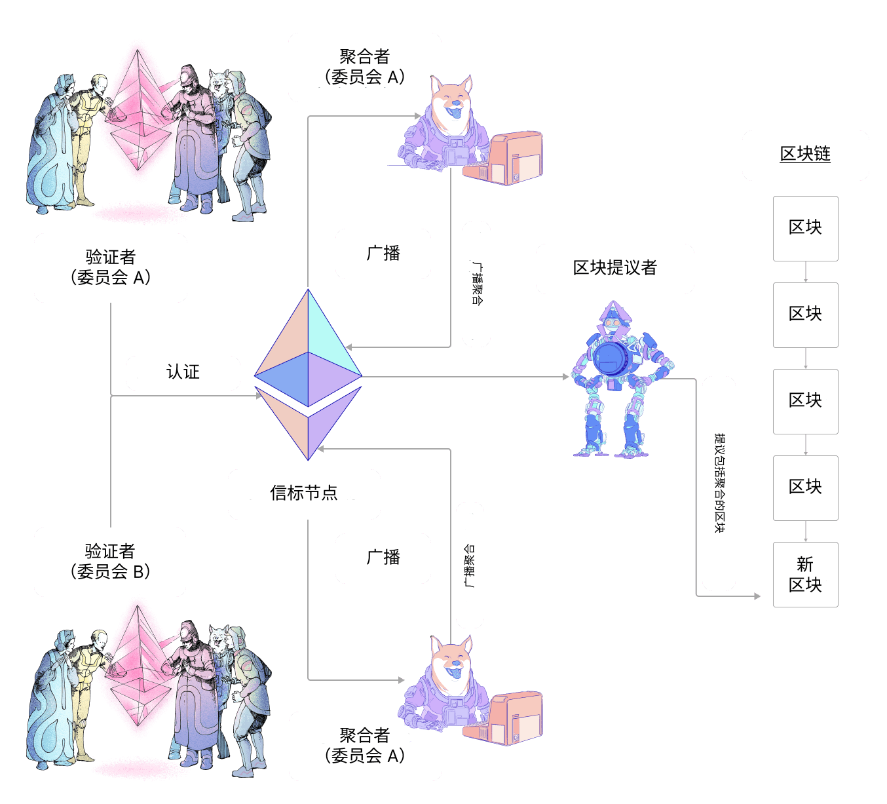

验证者需要在每个时段创建、签名并广播一个证明。本页面概述了这些证明的结构，以及它们在共识客户端之间是如何处理和通信的。

## 什么是证明？ {#what-is-an-attestation}

在每个[时段](/glossary/#epoch)（6.4 分钟）中，验证者都会向网络提议一个证明。该证明针对时段中的特定时隙。证明的目的是支持验证者对链的视图进行投票，特别是最近的已证明区块和当前时段的第一个区块（称为 `source` 和 `target` 检查点）。所有参与验证者的这些信息被组合在一起，使网络能够就区块链的状态达成共识。

证明包含以下组件：

- `aggregation_bits`：验证者的位列表，其中位置映射到他们在委员会中的验证者索引；值 (0/1) 表示验证者是否签署了 `data`（即他们是否活跃并同意区块提议者）
- `data`：与证明相关的详细信息，定义如下
- `signature`：聚合各个验证者签名的 BLS 签名

证明验证者的首要任务是构建 `data`。`data` 包含以下信息：

- `slot`：证明所指的时隙编号
- `index`：标识验证者在给定时隙中属于哪个委员会的编号
- `beacon_block_root`：验证者在链头看到的区块的根哈希（应用分叉选择算法的结果）
- `source`：最终性投票的一部分，表明验证者所看到的最近的已证明区块
- `target`：最终性投票的一部分，表明验证者所看到的当前时段的第一个区块

构建 `data` 后，验证者可以将 `aggregation_bits` 中对应于其自身验证者索引的位从 0 翻转为 1，以表明他们参与了。

最后，验证者对证明进行签名并将其广播到网络。

### 聚合证明 {#aggregated-attestation}

为每个验证者在网络中传递这些数据会产生巨大的开销。因此，各个验证者的证明在被更广泛地广播之前，会在子网内进行聚合。这包括将签名聚合在一起，以便广播的证明包含共识 `data` 以及由同意该 `data` 的所有验证者的签名组合而成的单个签名。这可以使用 `aggregation_bits` 进行检查，因为它提供了每个验证者在其委员会中的索引（其 ID 在 `data` 中提供），可用于查询各个签名。

在每个时段中，每个子网会选择 16 个验证者作为 `aggregators`。聚合者收集他们在 gossip 网络上听到的所有与他们自己的 `data` 相同的证明。每个匹配证明的发送者都记录在 `aggregation_bits` 中。然后，聚合者将证明聚合广播到更广泛的网络。

当验证者被选为区块提议者时，他们会将来自子网的聚合证明打包到新区块的最新时隙中。

### 证明包含生命周期 {#attestation-inclusion-lifecycle}

1. 生成
2. 传播
3. 聚合
4. 传播
5. 包含

证明生命周期在下面的示意图中概述：

## 奖励 {#rewards}

验证者因提交证明而获得奖励。证明奖励取决于参与标志（来源、目标和头部）、基础奖励和参与率。

每个参与标志可以是真或假，具体取决于提交的证明及其包含延迟。

最好的情况是所有三个标志都为真，在这种情况下，验证者将获得（每个正确的标志）：

`reward += base reward * flag weight * flag attesting rate / 64`

标志证明率是通过比较给定标志的所有证明验证者的有效余额总和与总活跃有效余额来衡量的。

### 基础奖励 {#base-reward}

基础奖励是根据证明验证者的数量及其质押的以太币有效余额计算的：

`base reward = validator effective balance x 2^6 / SQRT(Effective balance of all active validators)`

#### 包含延迟 {#inclusion-delay}

在验证者对链头（`block n`）进行投票时，`block n+1` 尚未被提议。因此，证明自然会**晚一个区块**被包含，所以所有投票支持 `block n` 为链头的证明都被包含在 `block n+1` 中，并且**包含延迟**为 1。如果包含延迟翻倍到两个时隙，证明奖励将减半，因为在计算证明奖励时，基础奖励乘以包含延迟的倒数。

### 证明场景 {#attestation-scenarios}

#### 缺失投票验证者 {#missing-voting-validator}

验证者最多有 1 个时段来提交他们的证明。如果在时段 0 中错过了证明，他们可以在时段 1 中提交，并带有包含延迟。

#### 缺失聚合者 {#missing-aggregator}

每个时段总共有 16 个聚合者。此外，随机验证者会订阅**两个子网，持续 256 个时段**，并在聚合者缺失时作为备份。

#### 缺失区块提议者 {#missing-block-proposer}

请注意，在某些情况下，幸运的聚合者也可能成为区块提议者。如果因为区块提议者缺失而未包含证明，下一个区块提议者将获取聚合证明并将其包含在下一个区块中。但是，**包含延迟**将增加一。

## 延伸阅读 {#further-reading}

- [Vitalik 注释的共识规范中的证明](https://github.com/ethereum/annotated-spec/blob/master/phase0/beacon-chain.md#attestationdata)
- [eth2book.info 中的证明](https://eth2book.info/capella/part3/containers/dependencies/#attestationdata)

_知道对您有帮助的社区资源吗？编辑本页面并添加它！_