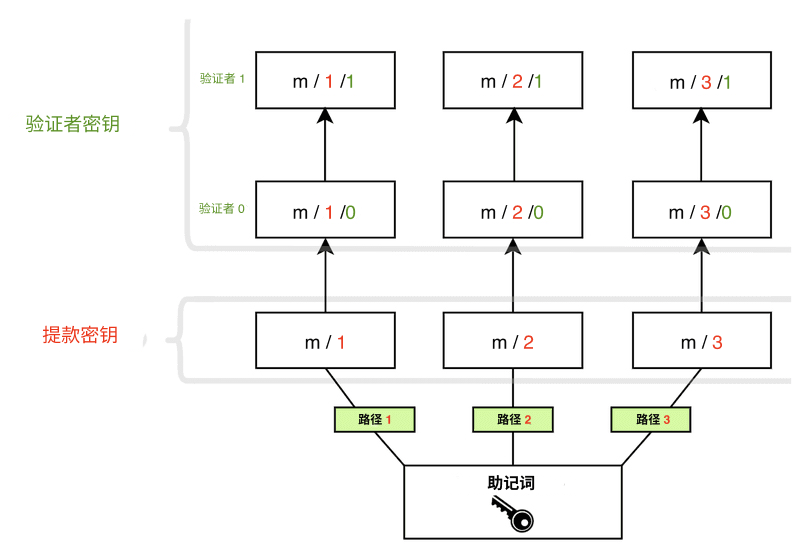

以太坊使用公钥-私钥加密法来保护用户资产的安全。 公钥被用作以太坊地址的基础 — 即，它对公众是可见的，并被用来当作唯一标识符。 私钥（或密钥）只能被帐户拥有者获取。 私钥用于‘签名’交易和数据，以便密码学能证明拥有者批准一个特定私钥的某些行为。

以太坊的密钥使用 [椭圆曲线加密法](https://en.wikipedia.org/wiki/Elliptic-curve_cryptography) 生成。

然而，在以太坊从[工作量证明](/developers/docs/consensus-mechanisms/pow)转换到[权益证明](/developers/docs/consensus-mechanisms/pos)的时候，一种新类型的密钥被加入到以太坊。 原来的密钥仍然像之前那样工作—基于椭圆曲线的密钥确保帐户安全没有变化。 然而，通过质押以太币和运行验证者来参与权益证明时，用户需要一种新类型的密钥。 这一需求是由于扩容挑战带来的，信息需要在大量验证者之间传递，这些信息需要一种密码学方法来方便汇总，以减少网络达成共识所需的沟通数量。

这种新型密钥使用 [**Boneh-Lyn-Shacham (BLS)** 签名方案](https://wikipedia.org/wiki/BLS_digital_signature)。 BLS 能够对签名进行高效聚合，同时允许对聚合的单个验证者密钥进行逆向工程，它对于管理验证者之间的行动非常理想。

## 两种类型的验证者密钥 {#two-types-of-keys}

在转换到权益证明之前，以太坊用户只有一个基于椭圆曲线的私钥来访问他们的资金。 随着权益证明的引入，那些希望成为单独质押人的用户也需要一个**验证者密钥**和一个**提款密钥**。

### 验证者密钥 {#validator-key}

验证者的签名密钥由两个元素组成：

- 验证者**私**钥
- 验证者**公**钥

验证者私钥的目的是签名链上操作，如区块提议和认证。 因此，这些密钥必须存放在热钱包中。

这种灵活性的优势是可以快速地把验证者的签名密钥从一台设备转移到另一台，然而，如果密钥丢失或者被盗，盗窃者可以通过这些方式**恶意地行动**：

- 通过以下方式罚没验证者：
  - 作为一个提议者，在同一时隙签名两个不同的信标区块
  - 作为一个证明人，签名“包围”另一份认证的认证
  - 作为一个证明人，签名两个具有相同目标的不同证明
- 促使自愿退出，从而停止验证者质押，并授权提款密钥拥有者获取以太币余额。

当用户把以太币存入到质押存款合约时，**验证者公钥**会被包含在交易数据中。 这被称为_存款数据_，它让以太坊可以识别验证者。

### 提款凭证 {#withdrawal-credentials}

每个验证者都有一个被称为_提款凭证_的属性。 此 32 字节字段的开头要么是 `0x00`，表示 BLS 提款凭证，要么是 `0x01`，表示指向执行地址的凭证。

具有 `0x00` BLS 密钥的验证者必须更新这些凭证，使其指向执行地址，以便激活从质押进行超额余额支付或全额提款。 这可以通过在初始密钥生成期间在存款数据中提供执行地址，_或者_通过稍后使用提款密钥签署并广播 `BLSToExecutionChange` 信息来实现。

### 提款密钥 {#withdrawal-key}

更新提款凭证需要更新提款密钥以指向执行地址（如果在初始存款期间没有设置的话）。 这将使超额余额支付得以开始处理，并且还将允许用户全额提取其质押的以太币。

和验证者密钥一样，提款密钥也由两个部分组成：

- 提款**私**钥
- 提款**公**钥

在将提款凭证更新为 `0x01` 类型之前丢失此密钥，意味着失去对验证者余额的访问权限。 验证者仍然可以对认证和区块进行签名，因为这些操作只需要验证者的私钥，但如果提款密钥丢失，那就几乎没有任何奖励。

把验证者密钥和以太坊帐户密钥分开，可以让一个用户运行多个验证者。


## 从助记词派生密钥 {#deriving-keys-from-seed}

如果每次质押 32 个以太币都需要一套新的 2 个完全独立的密钥，那么密钥管理将很快变得难以操作，特别是对于运行多个验证者的用户来说。 相反，多个验证者密钥可以从一个共同的密钥进行派生，并且存储这个密钥就能允许访问多个验证者密钥。

当[用户访问](https://ethereum.stackexchange.com/questions/19055/what-is-the-difference-between-m-44-60-0-0-and-m-44-60-0)自己的钱包时，[助记符](https://en.bitcoinwiki.org/wiki/Mnemonic_phrase)和路径是用户经常遇到的突出特征。 助记符是一连串的词语，作为私钥的初始种子。 当与其他数据结合时，助记符生成一个被称为‘主密钥’的哈希。 这可以被视为一棵树的根部。 根部的分支可以使用层次路径来派生，从而子节点可以作为其父节点的哈希和它们在树中的索引的组合而存在。 阅读 [BIP-32](https://github.com/bitcoin/bips/blob/master/bip-0032.mediawiki) 和 [BIP-19](https://github.com/bitcoin/bips/blob/master/bip-0039.mediawiki) 基于助记词的密钥生成标准。

这些路径有以下结构，对于和硬件钱包打过交道的用户来说应该比较熟悉：

```
m/44'/60'/0'/0`
```

路径中的斜线将私钥的组成部分分开，如下所示：

```
master_key / purpose / coin_type / account / change / address_index
```

这个逻辑可以使用户把尽可能多的验证者绑定到一个**助记词**，因为虽然树的根部是共同的，但在分支上却可以产生差异化。 用户可以从助记词**派生任意数量的密钥**。

```
      [m / 0]
     /
    /
[m] - [m / 1]
    \
     \
      [m / 2]
```

每个分支都用一个 `/` 来分割，因此 `m/2` 意味着由主密钥开始，接着是分支 2。 在下面的示意图中，一个助记词用来存储三个提款密钥，每个密钥都有两个相关的验证者。



## 延伸阅读 {#further-reading}

- [由 Carl Beekhuizen 发表的以太坊基金会博客](https://blog.ethereum.org/2020/05/21/keys/)
- [EIP-2333 BLS12-381 密钥生成](https://eips.ethereum.org/EIPS/eip-2333)
