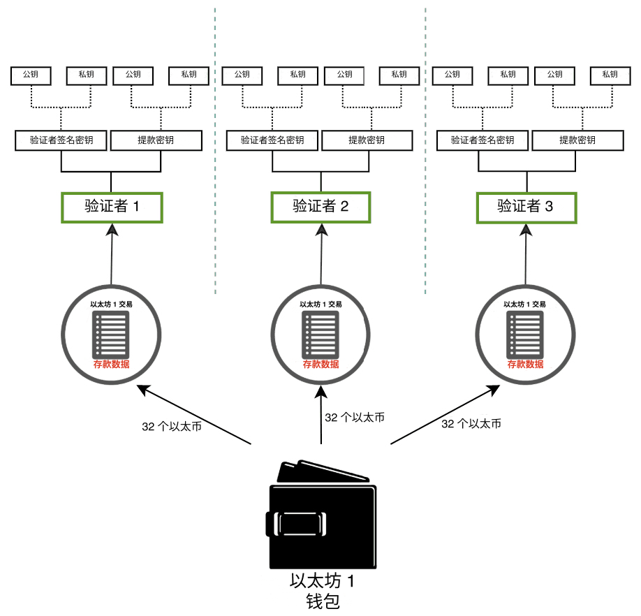
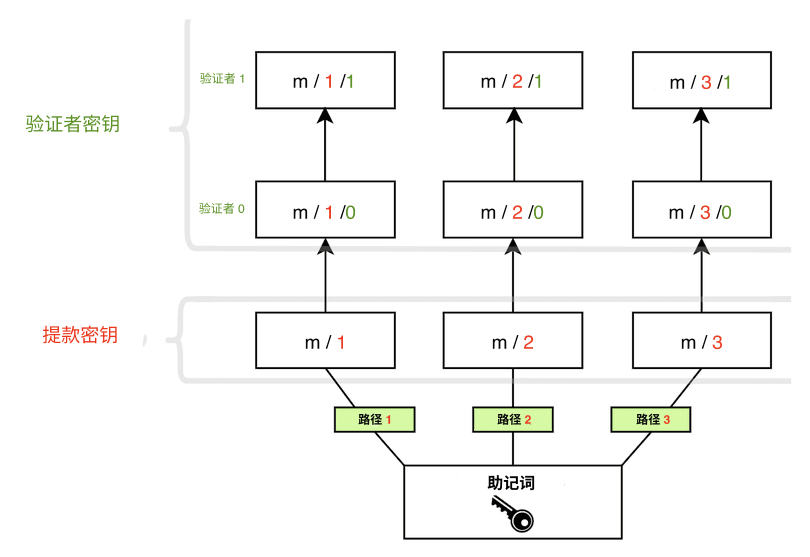

以太坊使用公钥-私钥密码学来保护用户资产。公钥被用作以太坊地址的基础——也就是说，它对公众可见，并被用作唯一标识符。私钥（或“秘钥”）应该只能由账户所有者访问。私钥用于对交易和数据进行“签名”，以便密码学能够证明持有者批准了特定私钥的某项操作。

以太坊的密钥是使用[椭圆曲线密码学](https://en.wikipedia.org/wiki/Elliptic-curve_cryptography)生成的。

然而，当以太坊从[工作量证明 (PoW)](/developers/docs/consensus-mechanisms/pow)切换到[权益证明 (PoS)](/developers/docs/consensus-mechanisms/pos)时，以太坊中添加了一种新型密钥。原始密钥的工作方式与以前完全相同——保护账户的基于椭圆曲线的密钥没有任何变化。但是，用户需要一种新型密钥，以便通过质押 ETH 和运行验证者来参与权益证明。这种需求源于大量验证者之间传递许多消息所带来的可扩展性挑战，这要求一种易于聚合的密码学方法，以减少网络达成共识所需的通信量。

这种新型密钥使用 [**Boneh-Lynn-Shacham (BLS)** 签名方案](https://wikipedia.org/wiki/BLS_digital_signature)。BLS 能够非常高效地聚合签名，同时也允许对聚合的单个验证者密钥进行逆向工程，非常适合管理验证者之间的操作。

## 两种类型的验证者密钥 {#two-types-of-keys}

在切换到权益证明之前，以太坊用户只有一个基于椭圆曲线的私钥来访问他们的资金。随着权益证明的引入，希望成为独立质押者的用户还需要一个**验证者密钥**和一个**提款密钥**。

### 验证者密钥 {#validator-key}

验证者签名密钥由两个元素组成：

- 验证者**私钥**
- 验证者**公钥**

验证者私钥的目的是对链上操作（如区块提案和证明）进行签名。因此，这些密钥必须保存在热钱包中。

这种灵活性的优点是可以非常快速地将验证者签名密钥从一台设备转移到另一台设备，但是，如果它们丢失或被盗，窃贼可能会通过以下几种方式**进行恶意操作**：

- 通过以下方式使验证者被罚没：
  - 作为提议者，为同一个时隙签名两个不同的信标区块
  - 作为证明者，签名一个“包围”另一个证明的证明
  - 作为证明者，签名两个具有相同目标的不同的证明
- 强制自愿退出，这会停止验证者的质押，并授予提款密钥所有者访问其 ETH 余额的权限

当用户向质押存款合约存入 ETH 时，**验证者公钥**包含在交易数据中。这被称为*存款数据*，它允许以太坊识别验证者。

### 提款凭证 {#withdrawal-credentials}

每个验证者都有一个称为*提款凭证*的属性。这个 32 字节字段的第一个字节标识账户类型：`0x00` 代表原始 BLS（沙佩拉升级前，不可提款）凭证，`0x01` 代表指向执行地址的旧版凭证，而 `0x02` 代表现代复利凭证类型。

拥有 `0x00` BLS 密钥的验证者必须更新这些凭证以指向执行地址，以便激活超额余额支付或从质押中全额提款。这可以通过在初始密钥生成期间在存款数据中提供执行地址来完成，*或者*在以后使用提款密钥签名并广播 `BLSToExecutionChange` 消息来完成。

[关于验证者提款凭证的更多信息](/developers/docs/consensus-mechanisms/pos/withdrawal-credentials/)

### 提款密钥 {#withdrawal-key}

如果在初始存款期间未设置，则需要提款密钥来更新提款凭证以指向执行地址。这将使超额余额支付开始被处理，并且还将允许用户全额提取其质押的 ETH。

就像验证者密钥一样，提款密钥也由两个组件组成：

- 提款**私钥**
- 提款**公钥**

在将提款凭证更新为 `0x01` 类型之前丢失此密钥意味着失去对验证者余额的访问权限。验证者仍然可以对证明和区块进行签名，因为这些操作需要验证者的私钥，但是如果提款密钥丢失，则几乎没有或根本没有激励。

将验证者密钥与以太坊账户密钥分开，使得单个用户可以运行多个验证者。



**注意**：退出质押职责并提取验证者余额目前需要使用验证者密钥签名[自愿退出消息 (VEM)](https://mirror.xyz/ladislaus.eth/wmoBbUBes2Wp1_6DvP6slPabkyujSU7MZOFOC3QpErs&1)。然而，[EIP-7002](https://eips.ethereum.org/EIPS/eip-7002) 是一项提案，未来将允许用户通过使用提款密钥签名退出消息来触发验证者退出并提取其余额。这将通过使将 ETH 委托给[质押即服务提供商](/staking/saas/#what-is-staking-as-a-service)的质押者能够保持对其资金的控制，从而减少信任假设。

## 从助记词派生密钥 {#deriving-keys-from-seed}

如果每质押 32 个 ETH 都需要一组 2 个完全独立的新密钥，那么密钥管理将很快变得难以处理，特别是对于运行多个验证者的用户而言。相反，可以从单个公共秘密中派生出多个验证者密钥，并且存储该单个秘密允许访问多个验证者密钥。

[助记词](https://en.bitcoinwiki.org/wiki/Mnemonic_phrase)和路径是用户在[访问](https://ethereum.stackexchange.com/questions/19055/what-is-the-difference-between-m-44-60-0-0-and-m-44-60-0)其钱包时经常遇到的显著特征。助记词是作为私钥初始种子的单词序列。当与附加数据结合时，助记词会生成一个称为“主密钥”的哈希。这可以被认为是一棵树的根。然后可以使用分层路径从该根派生出分支，以便子节点可以作为其父节点哈希及其在树中的索引的组合而存在。阅读有关基于助记词生成密钥的 [BIP-32](https://github.com/bitcoin/bips/blob/master/bip-0032.mediawiki) 和 [BIP-19](https://github.com/bitcoin/bips/blob/master/bip-0039.mediawiki) 标准。

这些路径具有以下结构，与硬件钱包交互过的用户会对此很熟悉：

```
m/44'/60'/0'/0`
```

此路径中的斜杠分隔私钥的组件，如下所示：

```
master_key / purpose / coin_type / account / change / address_index
```

这种逻辑使用户能够将尽可能多的验证者附加到单个**助记词**上，因为树根可以是公共的，并且可以在分支处进行区分。用户可以从助记词中**派生任意数量的密钥**。

```
[m / 0]
     /
    /
[m] - [m / 1]
    \
     \
      [m / 2]
```

每个分支由 `/` 分隔，因此 `m/2` 意味着从主密钥开始并遵循分支 2。在下面的示意图中，单个助记词用于存储三个提款密钥，每个提款密钥有两个关联的验证者。



## 延伸阅读 {#further-reading}

- [Carl Beekhuizen 撰写的以太坊基金会博客文章](https://blog.ethereum.org/2020/05/21/keys)
- [EIP-2333 BLS12-381 密钥生成](https://eips.ethereum.org/EIPS/eip-2333)
- [EIP-7002：执行层触发的退出](https://web.archive.org/web/20250125035123/https://research.2077.xyz/eip-7002-unpacking-improvements-to-staking-ux-post-merge)
- [大规模密钥管理](https://docs.ethstaker.cc/ethstaker-knowledge-base/scaled-node-operators/key-management-at-scale)