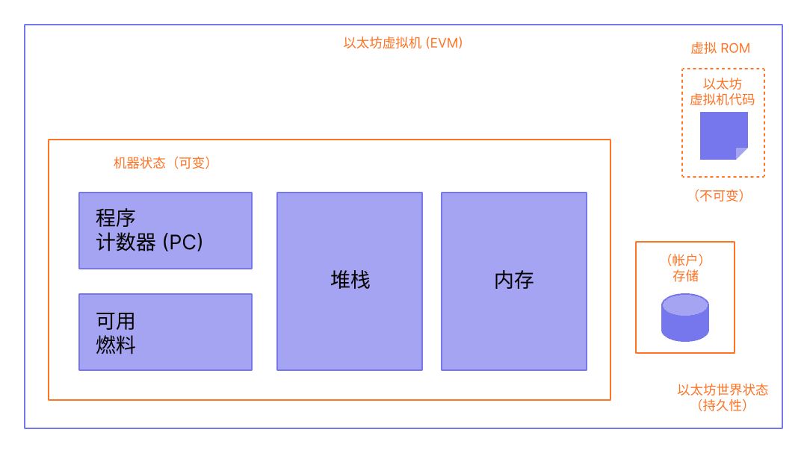

以太坊虚拟机 (EVM) 是一个去中心化虚拟环境，它在所有以太坊节点上一种安全一致地方式执行代码。 节点运行 EVM 执行智能合约，使用“[燃料](/developers/docs/gas/)”衡量执行[操作](/developers/docs/evm/opcodes/)所需的计算工作，从而确保高效的资源分配和网络安全。

## 前提条件 {#prerequisites}

若要理解 EVM，需要对计算机科学中的一些常见术语有基本的了解，例如[字节](https://wikipedia.org/wiki/Byte)、[内存](https://wikipedia.org/wiki/Computer_memory)和[堆栈](https://wikipedia.org/wiki/Stack_\(abstract_data_type\))。 熟悉[哈希函数](https://wikipedia.org/wiki/Cryptographic_hash_function)和[默克尔树](https://wikipedia.org/wiki/Merkle_tree)等加密/区块链概念也会有所帮助。

## 从账本到状态机 {#from-ledger-to-state-machine}

通常使用“分布式账本”的类比来描述像比特币这样的区块链，它使用密码学的基本工具来实现去中心化的货币。 账本保存着活动记录，而活动必须遵守一套规则，这些规则限制用户在修改账本时可以做什么和不可以做什么。 例如，比特币地址不能花费比之前收到的更多的比特币。 这些规则是比特币和许多其他区块链上所有交易的基础。

以太坊有自己的原生加密货币（以太币），其规则非常直观，但它也实现了一个更强大的功能：[智能合约](/developers/docs/smart-contracts/)。 对于此更复杂的功能，需要一个更复杂的类比。 以太坊不是一个分布式账本，而是一个分布式[状态机](https://wikipedia.org/wiki/Finite-state_machine)。 以太坊的状态是一个大型数据结构，它不仅保存了所有的账户和余额，还保存了一个_机器状态_，它可以根据一组预定义的规则在区块之间发生变化，并且可以执行任意的机器代码。 在区块中更改状态的具体规则由 EVM 定义。


_图表改编自 [Ethereum EVM illustrated](https://takenobu-hs.github.io/downloads/ethereum_evm_illustrated.pdf)_

## 以太坊状态转换函数 {#the-ethereum-state-transition-function}

EVM 的行为就像一个数学函数：在给定输入的情况下，它会产生确定性的输出。 因此，将以太坊更正式地描述为具有**状态转换函数**会很有帮助：

```
Y(S, T)= S'
```

给定一个旧的有效状态 `(S)` 和一组新的有效交易 `(T)`，以太坊状态转换函数 `Y(S, T)` 会生成一个新的有效输出状态 `S'`

### 状态 {#state}

在以太坊中，状态是一个被称为[改良默克尔帕特里夏树](/developers/docs/data-structures-and-encoding/patricia-merkle-trie/)的巨大数据结构，它保存了所有通过哈希链接的[帐户](/developers/docs/accounts/)，并可归约为存储在区块链上的单个根哈希。

### 交易 {#transactions}

交易是由帐户发出，带密码学签名的指令。 交易分为两种：一种是消息调用交易，另一种是合约创建交易。

创建合约会创建一个新的合约帐户，其中包含已编译的[智能合约](/developers/docs/smart-contracts/anatomy/)字节码。 每当另一个帐户对该合约进行消息调用时，它都会执行其字节码。

## EVM 指令 {#evm-instructions}

EVM 作为[堆栈机](https://wikipedia.org/wiki/Stack_machine)执行，堆栈深度为 1024 个项。 每个项目都是 256 位字，为了便于使用，选择了 256 位加密技术（如 Keccak-256 哈希或 secp256k1 签名）。

在执行期间，EVM 维护一个瞬态_内存_（一个字可寻址的字节数组），该内存不会在交易之间持久存在。

### 瞬态存储

瞬态存储是每笔交易的键值存储，可通过 `TSTORE` 和 `TLOAD` 操作码访问。 它在同一笔交易的所有内部调用中都会持续存在，但在交易结束时会被清除。 与内存不同，瞬态存储被建模为 EVM 状态的一部分，而不是执行框架的一部分，但它不会提交到全局状态。 瞬态存储可以在一笔交易的内部调用之间实现燃料高效的临时状态共享。

### 存储

合约包含一个与相关帐户关联的默克尔帕特里夏_存储_树（作为字可寻址字数组），是全局状态的一部分。 这种持久化存储与瞬态存储不同，后者仅在单笔交易期间可用，并且不构成帐户持久化存储树的一部分。

### 操作码

编译后的智能合约字节码作为多个 EVM [操作码](/developers/docs/evm/opcodes)执行，这些操作码执行 `XOR`、`AND`、`ADD`、`SUB` 等标准堆栈操作。 EVM 还实现了一些区块链特有的堆栈操作，例如 `ADDRESS`、`BALANCE`、`BLOCKHASH` 等。 操作码集还包括 `TSTORE` 和 `TLOAD`，它们提供对瞬态存储的访问。


_图表改编自 [Ethereum EVM illustrated](https://takenobu-hs.github.io/downloads/ethereum_evm_illustrated.pdf)_

## EVM 实现 {#evm-implementations}

EVM 的所有实现都必须遵守以太坊黄皮书中描述的规范。

在以太坊十年的历史中，EVM 经历了数次修订，并且有多种编程语言的 EVM 实现。

[以太坊执行客户端](/developers/docs/nodes-and-clients/#execution-clients)包括一个 EVM 实现。 此外，还有多个独立的实现，包括：

- [Py-EVM](https://github.com/ethereum/py-evm) - _Python_
- [evmone](https://github.com/ethereum/evmone) - _C++_
- [ethereumjs-vm](https://github.com/ethereumjs/ethereumjs-vm) - _JavaScript_
- [revm](https://github.com/bluealloy/revm) - _Rust_

## 扩展阅读 {#further-reading}

- [以太坊黄皮书](https://ethereum.github.io/yellowpaper/paper.pdf)
- [Jellopaper 又名 KEVM：K 框架中的 EVM 语义](https://jellopaper.org/)
- [米色皮书](https://github.com/chronaeon/beigepaper)
- [以太坊虚拟机操作码](https://www.ethervm.io/)
- [以太坊虚拟机操作码交互式参考](https://www.evm.codes/)
- [Solidity 文档中的简短介绍](https://docs.soliditylang.org/en/latest/introduction-to-smart-contracts.html#index-6)
- [精通以太坊 - 以太坊虚拟机](https://github.com/ethereumbook/ethereumbook/blob/openedition/13evm.asciidoc)

## 相关主题 {#related-topics}

- [燃料](/developers/docs/gas/)
