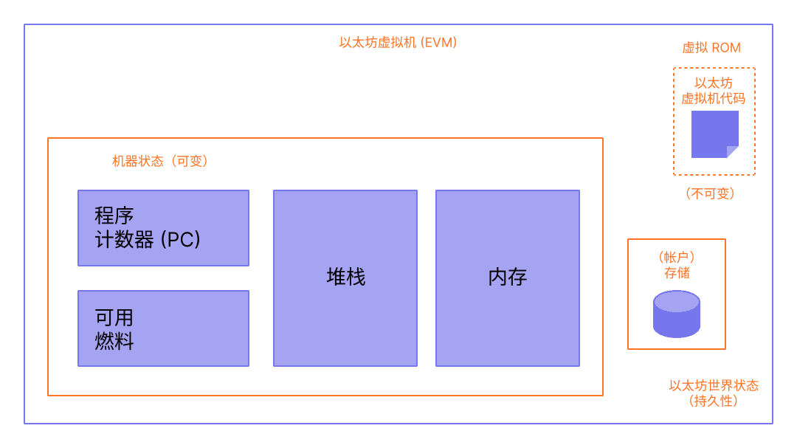

以太坊虚拟机 (EVM) 是一个去中心化的虚拟环境，在所有[以太坊](/)节点上一致且安全地执行代码。节点运行 EVM 来执行智能合约，使用“[Gas](/developers/docs/gas/)”来衡量[操作](/developers/docs/evm/opcodes/)所需的计算工作量，从而确保高效的资源分配和网络安全。

## 前提条件 {#prerequisites}

要理解 EVM，必须对计算机科学中的常见术语（如[字节](https://wikipedia.org/wiki/Byte)、[内存](https://wikipedia.org/wiki/Computer_memory)和[堆栈](<https://wikipedia.org/wiki/Stack_(abstract_data_type)>）有基本的了解。熟悉[哈希函数](https://wikipedia.org/wiki/Cryptographic_hash_function)和[默克尔树](https://wikipedia.org/wiki/Merkle_tree)等密码学/区块链概念也会有所帮助。

## 从账本到状态机 {#from-ledger-to-state-machine}

人们经常使用“分布式账本”的比喻来描述像比特币这样的区块链，它利用密码学的基础工具实现了一种去中心化货币。该账本维护着活动记录，这些记录必须遵守一组规则，这些规则规定了人们在修改账本时能做什么和不能做什么。例如，一个比特币地址花费的比特币不能超过它之前收到的比特币。这些规则构成了比特币和许多其他区块链上所有交易的基础。

虽然以太坊拥有自己的原生加密货币（以太币），并且遵循几乎完全相同的直观规则，但它还实现了一个更强大的功能：[智能合约](/developers/docs/smart-contracts/)。对于这个更复杂的功能，需要一个更复杂的比喻。以太坊不是一个分布式账本，而是一个分布式[状态机](https://wikipedia.org/wiki/Finite-state_machine)。以太坊的状态是一个大型数据结构，它不仅保存所有账户和余额，还保存一个_机器状态_，该状态可以根据预定义的一组规则在区块之间发生变化，并且可以执行任意机器代码。在区块之间改变状态的具体规则由 EVM 定义。


_图表改编自 [Ethereum EVM illustrated](https://takenobu-hs.github.io/downloads/ethereum_evm_illustrated.pdf)_

## 以太坊状态转换函数 {#the-ethereum-state-transition-function}

EVM 的行为类似于数学函数：给定一个输入，它会产生一个确定性的输出。因此，将以太坊更正式地描述为具有**状态转换函数**是非常有帮助的：

```
Y(S, T)= S'
```

给定一个旧的有效状态 `(S)` 和一组新的有效交易 `(T)`，以太坊状态转换函数 `Y(S, T)` 会产生一个新的有效输出状态 `S'`

### 状态 {#state}

在以太坊的背景下，状态是一个巨大的数据结构，称为[修改后的默克尔帕特里夏树](/developers/docs/data-structures-and-encoding/patricia-merkle-trie/)，它将所有[账户](/developers/docs/accounts/)通过哈希链接起来，并可简化为存储在区块链上的单个根哈希。

### 交易 {#transactions}

交易是来自账户的经过密码学签名的指令。交易有两种类型：导致消息调用的交易和导致合约创建的交易。

合约创建会导致创建一个包含已编译[智能合约](/developers/docs/smart-contracts/anatomy/)字节码的新合约账户。每当另一个账户对该合约进行消息调用时，它就会执行其字节码。

## EVM 指令 {#evm-instructions}

EVM 作为一个深度为 1024 个项的[堆栈机](https://wikipedia.org/wiki/Stack_machine)执行。每个项都是一个 256 位的字，选择这个大小是为了便于与 256 位密码学（如 Keccak-256 哈希或 secp256k1 签名）结合使用。

在执行期间，EVM 维护一个瞬态_内存_（作为一个按字寻址的字节数组），该内存不会在交易之间持久保存。

### 瞬态存储 {#transient-storage}

瞬态存储是一个按交易划分的键值存储，通过 `TSTORE` 和 `TLOAD` 操作码进行访问。它在同一交易期间的所有内部调用中持续存在，但在交易结束时被清除。与内存不同，瞬态存储被建模为 EVM 状态的一部分，而不是执行帧的一部分，但它不会提交到全局状态。瞬态存储能够在交易期间的内部调用之间实现节省 Gas 的临时状态共享。

### 存储 {#storage}

合约包含一个默克尔帕特里夏_存储前缀树_（作为一个按字寻址的字数组），它与相关账户关联，并且是全局状态的一部分。这种持久存储不同于瞬态存储，后者仅在单笔交易期间可用，并且不构成账户持久存储前缀树的一部分。

### 操作码 {#opcodes}

编译后的智能合约字节码作为许多 EVM [操作码](/developers/docs/evm/opcodes)执行，这些操作码执行标准的堆栈操作，如 `XOR`、`AND`、`ADD`、`SUB` 等。EVM 还实现了许多特定于区块链的堆栈操作，例如 `ADDRESS`、`BALANCE`、`BLOCKHASH` 等。操作码集还包括 `TSTORE` 和 `TLOAD`，它们提供对瞬态存储的访问。


_图表改编自 [Ethereum EVM illustrated](https://takenobu-hs.github.io/downloads/ethereum_evm_illustrated.pdf)_

## EVM 实现 {#evm-implementations}

EVM 的所有实现都必须遵守以太坊黄皮书中描述的规范。

在以太坊十年的历史中，EVM 经历了多次修订，并且有多种编程语言的 EVM 实现。

[以太坊执行客户端](/developers/docs/nodes-and-clients/#execution-clients)包含一个 EVM 实现。此外，还有多个独立的实现，包括：

- [Py-EVM](https://github.com/ethereum/py-evm) - _Python_
- [evmone](https://github.com/ethereum/evmone) - _C++_
- [ethereumjs-vm](https://github.com/ethereumjs/ethereumjs-vm) - _JavaScript_
- [revm](https://github.com/bluealloy/revm) - _Rust_

## 延伸阅读 {#further-reading}

- [以太坊黄皮书](https://ethereum.github.io/yellowpaper/paper.pdf)
- [Jellopaper（即 KEVM）：K 语言中的 EVM 语义](https://jellopaper.org/)
- [米皮书 (The Beigepaper)](https://github.com/chronaeon/beigepaper)
- [以太坊虚拟机操作码](https://www.ethervm.io/)
- [以太坊虚拟机操作码交互式参考](https://www.evm.codes/)
- [Solidity 文档中的简短介绍](https://docs.soliditylang.org/en/latest/introduction-to-smart-contracts.html#index-6)
- [精通以太坊 - 以太坊虚拟机](https://github.com/ethereumbook/ethereumbook/blob/openedition/13evm.asciidoc)

## 相关主题 {#related-topics}

- [Gas](/developers/docs/gas/)

## 教程：以太坊虚拟机 (EVM) / 以太坊上的操作码 {#tutorials}

- [理解黄皮书的 EVM 规范](/developers/tutorials/yellow-paper-evm/) _– 以太坊黄皮书中正式 EVM 规范的引导式演练。_
- [逆向工程合约](/developers/tutorials/reverse-engineering-a-contract/) _– 如何使用 EVM 操作码对已编译的智能合约进行逆向工程。_