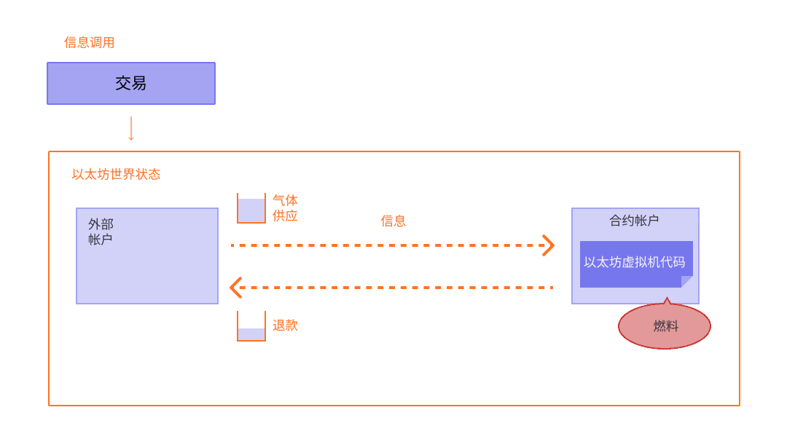

交易是来自账户的经过密码学签名的指令。账户将发起交易以更新[以太坊](/)网络的状态。最简单的交易是将 ETH 从一个账户转账到另一个账户。

## 前提条件 {#prerequisites}

为了帮助您更好地理解本页面，我们建议您首先阅读[账户](/developers/docs/accounts/)和我们的[以太坊简介](/developers/docs/intro-to-ethereum/)。

## 什么是交易？ {#whats-a-transaction}

以太坊交易是指由外部拥有账户发起的行动，换句话说，是由人而不是合约管理的账户。例如，如果 Bob 向 Alice 发送 1 ETH，则必须从 Bob 的账户中扣除，并记入 Alice 的账户。这种改变状态的行动发生在交易中。


_图表改编自[以太坊 EVM 图解](https://takenobu-hs.github.io/downloads/ethereum_evm_illustrated.pdf)_

改变 EVM 状态的交易需要广播到整个网络。任何节点都可以广播在 EVM 上执行交易的请求；发生这种情况后，验证者将执行该交易并将产生的状态变化传播到网络的其余部分。

交易需要支付费用，并且必须包含在经过验证的区块中。为了使本概述更简单，我们将在其他地方介绍 gas 费和验证。

提交的交易包含以下信息：

- `from` – 发送者的地址，将对交易进行签名。这将是一个外部拥有账户，因为合约账户无法发送交易
- `to` – 接收地址（如果是外部拥有账户，交易将转账价值。如果是合约账户，交易将执行合约代码）
- `signature` – 发送者的标识符。这是在发送者的私钥对交易进行签名并确认发送者已授权此交易时生成的
- `nonce` - 一个顺序递增的计数器，指示来自该账户的交易编号（随机数）
- `value` – 从发送者转账到接收者的 ETH 数量（以 Wei 为单位，其中 1 ETH 等于 1e+18 Wei）
- `input data` – 包含任意数据的可选字段
- `gasLimit` – 交易可以消耗的最大 Gas 单位数量（gas 上限）。[EVM](/developers/docs/evm/opcodes) 指定了每个计算步骤所需的 Gas 单位
- `maxPriorityFeePerGas` - 作为给验证者的优先费包含在内的已消耗 Gas 的最高价格
- `maxFeePerGas` - 愿意为交易支付的每单位 Gas 的最高费用（包括 `baseFeePerGas` 和 `maxPriorityFeePerGas`）

Gas 是指验证者处理交易所需的计算量。用户必须为此计算支付费用。`gasLimit` 和 `maxPriorityFeePerGas` 决定了支付给验证者的最高交易费。[了解更多关于 Gas 的信息](/developers/docs/gas/)。

交易对象看起来有点像这样：

```js
{
  from: "0xEA674fdDe714fd979de3EdF0F56AA9716B898ec8",
  to: "0xac03bb73b6a9e108530aff4df5077c2b3d481e5a",
  gasLimit: "21000",
  maxFeePerGas: "300",
  maxPriorityFeePerGas: "10",
  nonce: "0",
  value: "10000000000"
}
```

但是交易对象需要使用发送者的私钥进行签名。这证明了交易只能来自发送者，而不是欺诈性发送的。

像 Geth 这样的以太坊客户端将处理此签名过程。

示例 [JSON-RPC](/developers/docs/apis/json-rpc) 调用：

```json
{
  "id": 2,
  "jsonrpc": "2.0",
  "method": "account_signTransaction",
  "params": [
    {
      "from": "0x1923f626bb8dc025849e00f99c25fe2b2f7fb0db",
      "gas": "0x55555",
      "maxFeePerGas": "0x1234",
      "maxPriorityFeePerGas": "0x1234",
      "input": "0xabcd",
      "nonce": "0x0",
      "to": "0x07a565b7ed7d7a678680a4c162885bedbb695fe0",
      "value": "0x1234"
    }
  ]
}
```

示例响应：

```json
{
  "jsonrpc": "2.0",
  "id": 2,
  "result": {
    "raw": "0xf88380018203339407a565b7ed7d7a678680a4c162885bedbb695fe080a44401a6e4000000000000000000000000000000000000000000000000000000000000001226a0223a7c9bcf5531c99be5ea7082183816eb20cfe0bbc322e97cc5c7f71ab8b20ea02aadee6b34b45bb15bc42d9c09de4a6754e7000908da72d48cc7704971491663",
    "tx": {
      "nonce": "0x0",
      "maxFeePerGas": "0x1234",
      "maxPriorityFeePerGas": "0x1234",
      "gas": "0x55555",
      "to": "0x07a565b7ed7d7a678680a4c162885bedbb695fe0",
      "value": "0x1234",
      "input": "0xabcd",
      "v": "0x26",
      "r": "0x223a7c9bcf5531c99be5ea7082183816eb20cfe0bbc322e97cc5c7f71ab8b20e",
      "s": "0x2aadee6b34b45bb15bc42d9c09de4a6754e7000908da72d48cc7704971491663",
      "hash": "0xeba2df809e7a612a0a0d444ccfa5c839624bdc00dd29e3340d46df3870f8a30e"
    }
  }
}
```

- `raw` 是以[递归长度前缀 (RLP)](/developers/docs/data-structures-and-encoding/rlp) 编码形式表示的已签名交易
- `tx` 是 JSON 形式的已签名交易

借助签名哈希，可以通过密码学证明该交易来自发送者并已提交到网络。

### 数据字段 {#the-data-field}

绝大多数交易都是从外部拥有账户访问合约。
大多数合约都是用 Solidity 编写的，并根据[应用程序二进制接口 (ABI)](/glossary/#abi) 解释其数据字段。

前四个字节使用函数名称和参数的哈希来指定要调用的函数。
有时，您可以使用[此数据库](https://www.4byte.directory/signatures/)从选择器中识别出该函数。

调用数据的其余部分是参数，[按照 ABI 规范中的规定进行编码](https://docs.soliditylang.org/en/latest/abi-spec.html#formal-specification-of-the-encoding)。

例如，让我们看看[这笔交易](https://etherscan.io/tx/0xd0dcbe007569fcfa1902dae0ab8b4e078efe42e231786312289b1eee5590f6a1)。
使用 **Click to see More**（点击查看更多）来查看调用数据。

函数选择器是 `0xa9059cbb`。有几个[具有此签名的已知函数](https://www.4byte.directory/signatures/?bytes4_signature=0xa9059cbb)。
在本例中，[合约源代码](https://etherscan.io/address/0xa0b86991c6218b36c1d19d4a2e9eb0ce3606eb48#code)已上传到 Etherscan，因此我们知道该函数是 `transfer(address,uint256)`。

其余数据为：

```
0000000000000000000000004f6742badb049791cd9a37ea913f2bac38d01279
000000000000000000000000000000000000000000000000000000003b0559f4
```

根据 ABI 规范，整数值（例如地址，即 20 字节的整数）在 ABI 中显示为 32 字节的字，并在前面用零填充。
因此我们知道 `to` 地址是 [`4f6742badb049791cd9a37ea913f2bac38d01279`](https://etherscan.io/address/0x4f6742badb049791cd9a37ea913f2bac38d01279)。
`value` 是 0x3b0559f4 = 990206452。

### 交易描述符 {#transaction-descriptors}

由于数据字段包含不透明的十六进制字节，因此验证交易实际将执行什么操作可能极其困难。这种“盲签”漏洞通过使用[交易描述符](https://eips.ethereum.org/EIPS/eip-7730)（由 ERC-7730 定义）的**[明文签名 (Clear Signing)](https://clearsigning.org/)** 得到了解决。

ERC-7730 规范使用交易描述符（通常结构化为 JSON 文件）来丰富 ABI 和结构化消息（如 EVM 交易调用数据、EIP-712 消息和 EIP-4337 用户操作）中的数据。开发者使用这些描述符将特定的交易变量直接映射到格式化模板中，确保底层数据对应用程序保持机器可读性。

在前端，钱包使用这种格式化上下文将不透明的字节码转换为清晰的、人类可读的信息。通过自动将代币地址等值解析为可识别的代币符号，或将金额解析为小数，用户在签名之前会看到交易确切意图的通俗语言摘要（例如，“将 1000 USDC 兑换为至少 0.25 封装以太币 (WETH)”）。

## 交易类型 {#types-of-transactions}

在以太坊上，有几种不同类型的交易：

- 常规交易：从一个账户到另一个账户的交易。
- 合约部署交易：没有“to”（接收）地址的交易，其中数据字段用于合约代码。
- 执行合约：与已部署的智能合约进行交互的交易。在这种情况下，“to”地址是智能合约地址。

### 关于 Gas {#on-gas}

如前所述，执行交易需要消耗 [Gas](/developers/docs/gas/)。简单的转账交易需要 21000 单位的 Gas。

因此，如果 Bob 要以 190 Gwei 的 `baseFeePerGas`（基础费用）和 10 Gwei 的 `maxPriorityFeePerGas`（优先费）向 Alice 发送 1 ETH，Bob 将需要支付以下费用：

```
(190 + 10) * 21000 = 4,200,000 gwei
--or--
0.0042 ETH
```

Bob 的账户将被扣除 **-1.0042 ETH**（给 Alice 的 1 ETH + 0.0042 ETH 的 gas 费）

Alice 的账户将增加 **+1.0 ETH**

基础费用将被销毁 **-0.00399 ETH**

验证者保留优先费 **+0.000210 ETH**



_图表改编自[以太坊 EVM 图解](https://takenobu-hs.github.io/downloads/ethereum_evm_illustrated.pdf)_

交易中未使用的任何 Gas 都将退还给用户账户。

### 智能合约交互 {#smart-contract-interactions}

任何涉及智能合约的交易都需要 Gas。

智能合约还可以包含被称为 [`view`](https://docs.soliditylang.org/en/latest/contracts.html#view-functions) 或 [`pure`](https://docs.soliditylang.org/en/latest/contracts.html#pure-functions) 的函数，这些函数不会改变合约的状态。因此，从外部拥有账户 (EOA) 调用这些函数不需要任何 Gas。此场景的底层 RPC 调用是 [`eth_call`](/developers/docs/apis/json-rpc#eth_call)。

与使用 `eth_call` 访问时不同，这些 `view` 或 `pure` 函数通常也会在内部被调用（即从合约本身或从另一个合约调用），这确实会消耗 Gas。

## 交易生命周期 {#transaction-lifecycle}

提交交易后，会发生以下情况：

1. 通过密码学生成一个交易哈希：
   `0x97d99bc7729211111a21b12c933c949d4f31684f1d6954ff477d0477538ff017`
2. 然后，该交易被广播到网络，并添加到由所有其他待处理网络交易组成的交易池中。
3. 验证者必须选择您的交易并将其包含在区块中，以便验证该交易并将其视为“成功”。
4. 随着时间的推移，包含您交易的区块将升级为“已证明”，然后“已最终确定”。这些升级使您的交易成功且永远不会被更改的确定性大大增加。一旦区块“已最终确定”，它就只能通过耗资数十亿美元的网络级攻击来更改。

## 视觉演示 {#a-visual-demo}

观看 Austin 为您讲解交易、Gas 和挖矿。

<VideoWatch slug="transactions-eth-build" />

## 类型化交易信封 {#typed-transaction-envelope}

以太坊最初只有一种交易格式。每笔交易都包含随机数、Gas 价格、gas 上限、接收地址、价值、数据、v、r 和 s。这些字段经过 [RLP 编码](/developers/docs/data-structures-and-encoding/rlp/)，看起来像这样：

`RLP([nonce, gasPrice, gasLimit, to, value, data, v, r, s])`

以太坊已经发展到支持多种类型的交易，以允许在不影响传统交易格式的情况下实现访问列表和 [EIP-1559](https://eips.ethereum.org/EIPS/eip-1559) 等新功能。

[EIP-2718](https://eips.ethereum.org/EIPS/eip-2718) 允许这种行为。交易被解释为：

`TransactionType || TransactionPayload`

其中字段定义为：

- `TransactionType` - 0 到 0x7f 之间的数字，总共有 128 种可能的交易类型。
- `TransactionPayload` - 由交易类型定义的任意字节数组。

根据 `TransactionType` 值，交易可以分类为：

1. **类型 0（传统）交易：** 自以太坊推出以来使用的原始交易格式。它们不包含 [EIP-1559](https://eips.ethereum.org/EIPS/eip-1559) 中的功能，例如动态 gas 费计算或智能合约的访问列表。传统交易在其序列化形式中缺乏指示其类型的特定前缀，在使用[递归长度前缀 (RLP)](/developers/docs/data-structures-and-encoding/rlp) 编码时以字节 `0xf8` 开头。这些交易的 TransactionType 值为 `0x0`。

2. **类型 1 交易：** 在 [EIP-2930](https://eips.ethereum.org/EIPS/eip-2930) 中引入，作为以太坊[柏林升级](/ethereum-forks/#berlin)的一部分，这些交易包含一个 `accessList` 参数。此列表指定了交易期望访问的地址和存储键，有助于潜在地降低涉及智能合约的复杂交易的 [Gas](/developers/docs/gas/) 成本。EIP-1559 费用市场变化不包含在类型 1 交易中。类型 1 交易还包含一个 `yParity` 参数，它可以是 `0x0` 或 `0x1`，指示 secp256k1 签名的 y 值的奇偶性。它们通过以字节 `0x01` 开头来识别，其 TransactionType 值为 `0x1`。

3. **类型 2 交易**，通常被称为 EIP-1559 交易，是在以太坊的[伦敦升级](/ethereum-forks/#london)中通过 [EIP-1559](https://eips.ethereum.org/EIPS/eip-1559) 引入的交易。它们已成为以太坊网络上的标准交易类型。这些交易引入了一种新的费用市场机制，通过将交易费分为基础费用和优先费来提高可预测性。它们以字节 `0x02` 开头，并包含 `maxPriorityFeePerGas` 和 `maxFeePerGas` 等字段。由于其灵活性和效率，类型 2 交易现在是默认的，特别是在网络高度拥堵期间受到青睐，因为它们能够帮助用户更可预测地管理交易费。这些交易的 TransactionType 值为 `0x2`。

4. **类型 3（斑点）交易**是在 [EIP-4844](https://eips.ethereum.org/EIPS/eip-4844) 中引入的，作为以太坊[登昆升级](/ethereum-forks/#dencun)的一部分。这些交易旨在更有效地处理“斑点”数据（二进制大型对象），通过提供一种以较低成本将数据发布到以太坊网络的方法，特别有利于二层网络 (l2) 汇总。斑点交易包含额外的字段，例如 `blobVersionedHashes`、`maxFeePerBlobGas` 和 `blobGasPrice`。它们以字节 `0x03` 开头，其 TransactionType 值为 `0x3`。斑点交易代表了以太坊数据可用性和扩展能力的重大改进。

5. **类型 4 交易**是在 [EIP-7702](https://eips.ethereum.org/EIPS/eip-7702) 中引入的，作为以太坊[佩克特拉升级](/roadmap/pectra/)的一部分。这些交易旨在与账户抽象向前兼容。它们允许外部拥有账户 (EOA) 暂时表现得像智能合约账户，而不会损害其原始功能。它们包含一个 `authorization_list` 参数，该参数指定了 EOA 将其权限委托给的智能合约。交易完成后，EOA 的代码字段将具有被委托智能合约的地址。

## 延伸阅读 {#further-reading}

- [EIP-2718：类型化交易信封](https://eips.ethereum.org/EIPS/eip-2718)

_知道对您有帮助的社区资源吗？编辑本页面并添加它！_

## 相关主题 {#related-topics}

- [账户](/developers/docs/accounts/)
- [以太坊虚拟机 (EVM)](/developers/docs/evm/)
- [Gas](/developers/docs/gas/)