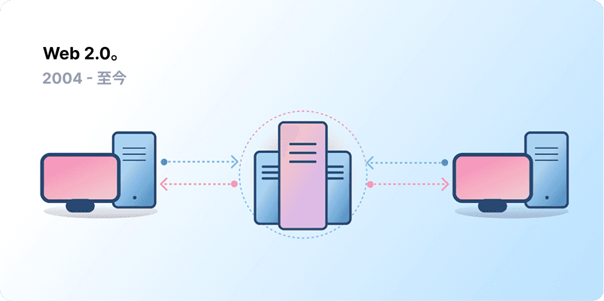
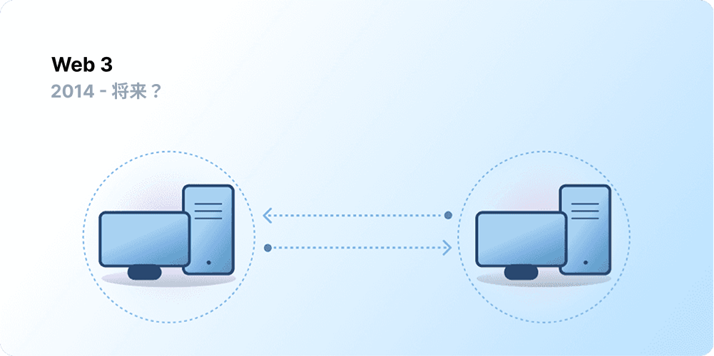

中心化帮助数十亿人接入了万维网，并为其赖以生存的稳定、强大的基础设施奠定了基础。与此同时，少数中心化实体在万维网的大片领域占据了据点，单方面决定允许和不允许什么。

Web3 就是解决这个困境的答案。Web3 拥抱去中心化，由用户构建、运营和拥有，而不是由大型科技公司垄断。Web3 将权力交还给个人，而不是公司。
在讨论 Web3 之前，让我们先回顾一下我们是如何走到这一步的。

<Divider />

## 早期的网络 {#early-internet}

大多数人认为网络是现代生活不可或缺的支柱——它被发明出来，然后就一直存在。然而，我们今天所熟知的网络与最初的设想大相径庭。为了更好地理解这一点，将网络短暂的历史大致划分为 Web 1.0 和 Web 2.0 两个时期会很有帮助。

### Web 1.0：只读 (1990-2004) {#web1}

1989 年，在日内瓦的欧洲核子研究中心 (CERN)，蒂姆·伯纳斯-李 (Tim Berners-Lee) 正忙于开发后来成为万维网的协议。他的想法是什么？创建开放、去中心化的协议，允许在地球上任何地方共享信息。

伯纳斯-李的创造的最初形态，现在被称为“Web 1.0”，大约发生在 1990 年到 2004 年之间。Web 1.0 主要是由公司拥有的静态网站，用户之间几乎没有任何互动——个人很少产生内容——导致它被称为只读网络。

### Web 2.0：读写 (2004-至今) {#web2}

Web 2.0 时期始于 2004 年社交媒体平台的出现。网络不再是只读的，而是演变成了读写的。公司不再仅仅向用户提供内容，他们也开始提供平台来分享用户生成的内容并参与用户之间的互动。随着越来越多的人上网，少数顶级公司开始控制网络上产生的不成比例的流量和价值。Web 2.0 还催生了广告驱动的收入模式。虽然用户可以创建内容，但他们并不拥有它，也无法从其货币化中受益。

<Divider />

## Web 3.0：读-写-拥有 {#web3}

“Web 3.0”的前提是由[以太坊](/)联合创始人加文·伍德在 2014 年以太坊推出后不久提出的。加文用语言表达了许多早期加密货币采用者所感受到的问题的解决方案：网络需要太多的信任。也就是说，人们今天所了解和使用的大部分网络都依赖于信任少数私营公司会为了公众的最大利益行事。

### 什么是 Web3？ {#what-is-web3}

Web3 已经成为一个包罗万象的术语，代表了一个新的、更好的互联网愿景。Web3 的核心是利用区块链、加密货币和非同质化代币 (NFT) 以所有权的形式将权力交还给用户。[2020 年推特上的一篇帖子](https://twitter.com/himgajria/status/1266415636789334016)说得最好：Web1 是只读的，Web2 是读写的，Web3 将是读-写-拥有的。

#### Web3 的核心理念 {#core-ideas}

尽管很难为 Web3 提供一个严格的定义，但有几个核心原则指导着它的创建。

- **Web3 是去中心化的：** 互联网的大片领域不再由中心化实体控制和拥有，而是将所有权分配给其构建者和用户。
- **Web3 是无需许可的：** 每个人都有平等的权限参与 Web3，没有人会被排除在外。
- **Web3 具有原生支付功能：** 它使用加密货币在网上消费和汇款，而不是依赖银行和支付处理商等过时的基础设施。
- **Web3 是无须信任的：** 它通过激励和经济机制运行，而不是依赖受信任的第三方。

### 为什么 Web3 很重要？ {#why-is-web3-important}

尽管 Web3 的杀手级功能并不是孤立的，也不能整齐地分类，但为了简单起见，我们试图将它们分开，以便更容易理解。

#### 所有权 {#ownership}

Web3 以一种前所未有的方式赋予你数字资产的所有权。例如，假设你正在玩一款 Web2 游戏。如果你购买了游戏内物品，它会直接绑定到你的账户。如果游戏创建者删除了你的账户，你将失去这些物品。或者，如果你停止玩游戏，你将失去你投资在游戏内物品上的价值。

Web3 允许通过[非同质化代币 (NFT)](/glossary/#nft) 实现直接所有权。没有人，甚至连游戏的创建者，都没有权力剥夺你的所有权。而且，如果你停止玩游戏，你可以在公开市场上出售或交易你的游戏内物品，并收回它们的价值。探索[链上游戏](/gaming/)来看看实际应用。

<Alert variant="update">
<AlertEmoji text=":eyes:"/>
<AlertContent className="flex-row items-center justify-between">
  
了解更多关于 NFT 的信息

  <ButtonLink href="/nft/">
    更多关于 NFT 的信息
  </ButtonLink>
</AlertContent>
</Alert>

#### 抗审查性 {#censorship-resistance}

平台和内容创作者之间的权力动态严重失衡。

OnlyFans 是一个用户生成的成人内容网站，拥有超过 100 万内容创作者，其中许多人将该平台作为他们的主要收入来源。2021 年 8 月，OnlyFans 宣布计划禁止露骨的色情内容。这一宣布激起了平台上创作者的愤怒，他们觉得在一个他们帮助创建的平台上被剥夺了收入。在遭到强烈反对后，该决定很快被撤销。尽管创作者赢得了这场战斗，但它凸显了 Web 2.0 创作者面临的一个问题：如果你离开一个平台，你就会失去你积累的声誉和追随者。

在 Web3 上，你的数据存在于区块链上。当你决定离开一个平台时，你可以带走你的声誉，将其插入另一个更符合你价值观的界面。

Web 2.0 要求内容创作者信任平台不会改变规则，但抗审查性是 Web3 平台的原生特性。

#### 去中心化自治组织 (DAO) {#daos}

除了在 Web3 中拥有你的数据之外，你还可以作为一个集体拥有平台，使用像公司股份一样的代币。DAO 让你协调平台的去中心化所有权，并对其未来做出决定。

DAO 在技术上被定义为商定的[智能合约](/glossary/#smart-contract)，它们自动执行对资源池（代币）的去中心化决策。拥有代币的用户对资源如何使用进行投票，代码会自动执行投票结果。

然而，人们将许多 Web3 社区定义为 DAO。这些社区都有不同程度的去中心化和代码自动化。目前，我们正在探索什么是 DAO 以及它们在未来可能如何演变。

<Alert variant="update">
<AlertEmoji text=":eyes:"/>
<AlertContent className="flex-row items-center justify-between">
  
了解更多关于 DAO 的信息

  <ButtonLink href="/dao/">
    更多关于 DAO 的信息
  </ButtonLink>
</AlertContent>
</Alert>

### 身份 {#identity}

传统上，你会为你使用的每个平台创建一个账户。例如，你可能有一个推特账户、一个 YouTube 账户和一个 Reddit 账户。想要更改你的显示名称或个人资料图片？你必须在每个账户中进行更改。在某些情况下，你可以使用社交登录，但这带来了一个熟悉的问题——审查制度。只需点击一下，这些平台就可以将你锁定在整个在线生活之外。更糟糕的是，许多平台要求你信任他们并提供个人身份信息来创建账户。

Web3 通过允许你使用以太坊地址和[以太坊域名服务 (ENS)](/glossary/#ens) 个人资料来控制你的数字身份，从而解决了这些问题。使用以太坊地址提供跨平台的单一登录，该登录是安全的、抗审查的且匿名的。

### 原生支付 {#native-payments}

Web2 的支付基础设施依赖于银行和支付处理商，将没有银行账户的人或碰巧生活在错误国家边界内的人排除在外。
Web3 使用像 [ETH](/glossary/#ether) 这样的代币直接在浏览器中汇款，并且不需要受信任的第三方。

<ButtonLink href="/what-is-ether/">
  更多关于 ETH 的信息
</ButtonLink>

## Web3 的局限性 {#web3-limitations}

尽管目前形式的 Web3 有很多好处，但生态系统仍必须解决许多局限性才能蓬勃发展。

### 可访问性 {#accessibility}

重要的 Web3 功能，如使用以太坊登录，已经可供任何人零成本使用。但是，交易的相对成本对许多人来说仍然令人望而却步。由于高昂的交易费用，Web3 不太可能在不太富裕的发展中国家得到利用。在以太坊上，这些挑战正在通过[路线图](/roadmap/)和[二层网络 (l2) 扩容解决方案](/glossary/#layer-2)得到解决。技术已经准备就绪，但我们需要在二层网络 (l2) 上有更高的采用率，才能让每个人都能访问 Web3。

### 用户体验 {#user-experience}

目前使用 Web3 的技术门槛太高。用户必须理解安全问题，看懂复杂的技术文档，并浏览不直观的用户界面。特别是[钱包提供商](/wallets/find-wallet/)正在努力解决这个问题，但在 Web3 被大规模采用之前，还需要取得更多进展。

### 教育 {#education}

Web3 引入了新的范式，需要学习与 Web 2.0 中使用的不同的心智模型。在 20 世纪 90 年代末 Web 1.0 普及的过程中，也发生过类似的教育活动；万维网的支持者使用了一系列教育技术来教育公众，从简单的隐喻（信息高速公路、浏览器、网上冲浪）到[电视广播](https://www.youtube.com/watch?v=SzQLI7BxfYI)。Web3 并不难，但它有所不同。向 Web2 用户普及这些 Web3 范式的教育举措对其成功至关重要。

Ethereum.org 通过我们的[翻译计划](/contributing/translation-program/)为 Web3 教育做出贡献，旨在将重要的以太坊内容翻译成尽可能多的语言。

### 中心化基础设施 {#centralized-infrastructure}

Web3 生态系统还很年轻，并且发展迅速。因此，它目前主要依赖于中心化基础设施（GitHub、推特、Discord 等）。许多 Web3 公司正争先恐后地填补这些空白，但构建高质量、可靠的基础设施需要时间。

## 去中心化的未来 {#decentralized-future}

Web3 是一个年轻且不断发展的生态系统。加文·伍德在 2014 年创造了这个词，但其中许多想法直到最近才成为现实。仅在过去一年里，人们对加密货币的兴趣就大幅激增，二层网络 (l2) 扩容解决方案得到改进，对新形式的治理进行了大规模实验，数字身份也发生了革命。

我们才刚刚开始用 Web3 创建一个更好的网络，但随着我们不断改善支持它的基础设施，网络的未来看起来一片光明。

## 我该如何参与 {#get-involved}

- [获取一个钱包](/wallets/)
- [寻找一个社区](/community/)
- [探索 Web3 应用程序](/apps/)
- [加入一个 DAO](/dao/)
- [在 Web3 上构建](/developers/)

## 延伸阅读 {#further-reading}

Web3 并没有严格的定义。不同的社区参与者对它有不同的看法。以下是其中一些：

- [什么是 Web3？未来的去中心化互联网解析](https://www.freecodecamp.org/news/what-is-web3) – _Nader Dabit_
- [理解 Web 3](https://medium.com/l4-media/making-sense-of-web-3-c1a9e74dcae) – _Josh Stark_
- [为什么 Web3 很重要](https://a16zcrypto.com/posts/article/why-web3-matters/) — _Chris Dixon_
- [为什么去中心化很重要](https://onezero.medium.com/why-decentralization-matters-5e3f79f7638e) - _Chris Dixon_
- [Web3 概览](https://a16z.com/wp-content/uploads/2021/10/The-web3-Readlng-List.pdf) – _a16z_
- [Web3 辩论](https://www.notboring.co/p/the-web3-debate) – _Packy McCormick_

<QuizWidget quizKey="web3" />
