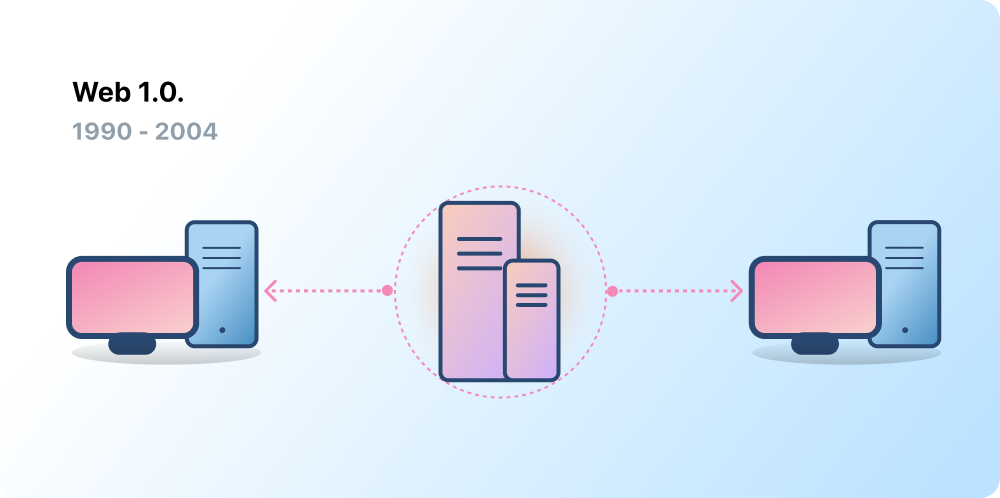
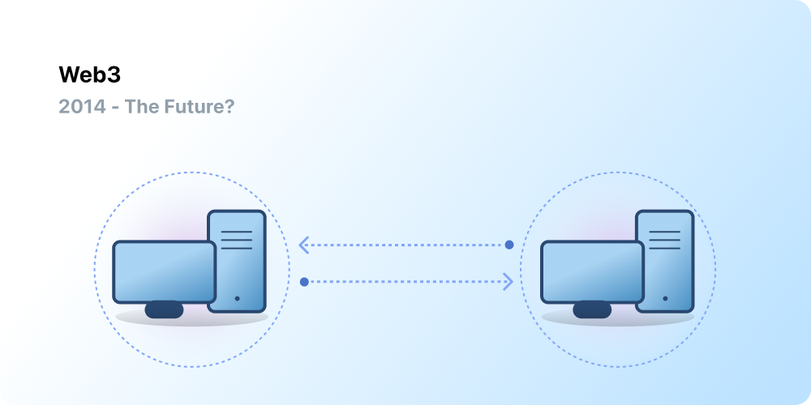

# Introduction to Web3 {#introduction}

Centralization has helped onboard billions of people to the World Wide Web and created the stable, robust infrastructure on which it lives. At the same time, a handful of centralized entities have a stronghold on large swathes of the World Wide Web, unilaterally deciding what should and should not be allowed.

Web3 is the answer to this dilemma. Instead of a Web monopolized by large technology companies, Web3 embraces decentralization and is being built, operated, and owned by its users. Web3 puts power in the hands of individuals rather than corporations.
Before we talk about Web3, let's explore how we got here.

<Divider />

## The early Web {#early-internet}

Most people think of the Web as a continuous pillar of modern life—it was invented and has just existed since. However, the Web most of us know today is quite different from originally imagined. To understand this better, it's helpful to break the Web's short history into loose periods—Web 1.0 and Web 2.0.

### Web 1.0: Read-Only (1990-2004) {#web1}

In 1989, at CERN, Geneva, Tim Berners-Lee was busy developing the protocols that would become the World Wide Web. His idea? To create open, decentralized protocols that allowed information-sharing from anywhere on Earth.

The first inception of Berners-Lee's creation, now known as 'Web 1.0', occurred roughly between 1990 to 2004. Web 1.0 was mainly static websites owned by companies, and there was close to zero interaction between users - individuals seldom produced content - leading to it being known as the read-only web.

### Web 2.0: Read-Write (2004-now) {#web2}

The Web 2.0 period began in 2004 with the emergence of social media platforms. Instead of a read-only, the web evolved to be read-write. Instead of companies providing content to users, they also began to provide platforms to share user-generated content and engage in user-to-user interactions. As more people came online, a handful of top companies began to control a disproportionate amount of the traffic and value generated on the web. Web 2.0 also birthed the advertising-driven revenue model. While users could create content, they didn't own it or benefit from its monetization.

<Divider />

## Web 3.0: Read-Write-Own {#web3}

The premise of 'Web 3.0' was coined by [Ethereum](/what-is-ethereum/) co-founder Gavin Wood shortly after Ethereum launched in 2014. Gavin put into words a solution for a problem that many early crypto adopters felt: the Web required too much trust. That is, most of the Web that people know and use today relies on trusting a handful of private companies to act in the public's best interests.

### What is Web3? {#what-is-web3}

Web3 has become a catch-all term for the vision of a new, better internet. At its core, Web3 uses blockchains, cryptocurrencies, and NFTs to give power back to the users in the form of ownership. [A 2020 post on Twitter](https://twitter.com/himgajria/status/1266415636789334016) said it best: Web1 was read-only, Web2 is read-write, Web3 will be read-write-own.

#### Core ideas of Web3 {#core-ideas}

Although it's challenging to provide a rigid definition of what Web3 is, a few core principles guide its creation.

- **Web3 is decentralized:** instead of large swathes of the internet controlled and owned by centralized entities, ownership gets distributed amongst its builders and users.
- **Web3 is permissionless:** everyone has equal access to participate in Web3, and no one gets excluded.
- **Web3 has native payments:** it uses cryptocurrency for spending and sending money online instead of relying on the outdated infrastructure of banks and payment processors.
- **Web3 is trustless:** it operates using incentives and economic mechanisms instead of relying on trusted third-parties.

### Why is Web3 important? {#why-is-web3-important}

Although Web3's killer features aren't isolated and don't fit into neat categories, for simplicity we've tried to separate them to make them easier to understand.

#### Ownership {#ownership}

Web3 gives you ownership of your digital assets in an unprecedented way. For example, say you're playing a web2 game. If you purchase an in-game item, it is tied directly to your account. If the game creators delete your account, you will lose these items. Or, if you stop playing the game, you lose the value you invested into your in-game items.

Web3 allows for direct ownership through [non-fungible tokens (NFTs)](/glossary/#nft). No one, not even the game's creators, has the power to take away your ownership. And, if you stop playing, you can sell or trade your in-game items on open markets and recoup their value.

<InfoBanner shouldSpaceBetween emoji=":eyes:">
  
Learn more about NFTs

  <ButtonLink href="/nft/">
    More on NFTs
  </ButtonLink>
</InfoBanner>

#### Censorship resistance {#censorship-resistance}

The power dynamic between platforms and content creators is massively imbalanced.

OnlyFans is a user-generated adult content site with over 1-million content creators, many of which use the platform as their primary source of income. In August 2021, OnlyFans announced plans to ban sexually explicit content. The announcement sparked outrage amongst creators on the platform, who felt they were getting robbed of an income on a platform they helped create. After the backlash, the decision got quickly reversed. Despite the creators winning this battle, it highlights a problem for Web 2.0 creators: you lose the reputation and following you accrued if you leave a platform.

On Web3, your data lives on the blockchain. When you decide to leave a platform, you can take your reputation with you, plugging it into another interface that more clearly aligns with your values.

Web 2.0 requires content creators to trust platforms not to change the rules, but censorship resistance is a native feature of a Web3 platform.

#### Decentralized autonomous organizations (DAOs) {#daos}

As well as owning your data in Web3, you can own the platform as a collective, using tokens that act like shares in a company. DAOs let you coordinate decentralized ownership of a platform and make decisions about its future.

DAOs are defined technically as agreed-upon [smart contracts](/glossary/#smart-contract) that automate decentralized decision-making over a pool of resources (tokens). Users with tokens vote on how resources get spent, and the code automatically performs the voting outcome.

However, people define many Web3 communities as DAOs. These communities all have different levels of decentralization and automation by code. Currently, we are exploring what DAOs are and how they might evolve in the future.

<InfoBanner shouldSpaceBetween emoji=":eyes:">
  
Learn more about DAOs

  <ButtonLink href="/dao/">
    More on DAOs
  </ButtonLink>
</InfoBanner>

### Identity {#identity}

Traditionally, you would create an account for every platform you use. For example, you might have a Twitter account, a YouTube account, and a Reddit account. Want to change your display name or profile picture? You have to do it across every account. You can use social sign-ins in some cases, but this presents a familiar problem—censorship. In a single click, these platforms can lock you out of your entire online life. Even worse, many platforms require you to trust them with personally identifiable information to create an account.

Web3 solves these problems by allowing you to control your digital identity with an Ethereum address and [Ethereum Name Service (ENS)](/glossary/#ens) profile. Using an Ethereum address provides a single login across platforms that is secure, censorship-resistant, and anonymous.

### Native payments {#native-payments}

Web2's payment infrastructure relies on banks and payment processors, excluding people without bank accounts or those who happen to live within the borders of the wrong country.
Web3 uses tokens like [ETH](/glossary/#ether) to send money directly in the browser and requires no trusted third party.

<ButtonLink href="/eth/">
  More on ETH
</ButtonLink>

## Web3 limitations {#web3-limitations}

Despite the numerous benefits of Web3 in its current form, there are still many limitations that the ecosystem must address for it to flourish.

### Accessibility {#accessibility}

Important Web3 features, like Sign-in with Ethereum, are already available for anyone to use at zero cost. But, the relative cost of transactions is still prohibitive to many. Web3 is less likely to be utilized in less-wealthy, developing nations due to high transaction fees. On Ethereum, these challenges are being solved through [the roadmap](/roadmap/) and [layer 2 scaling solutions](/glossary/#layer-2). The technology is ready, but we need higher levels of adoption on layer 2 to make Web3 accessible to everyone.

### User experience {#user-experience}

The technical barrier to entry to using Web3 is currently too high. Users must comprehend security concerns, understand complex technical documentation, and navigate unintuitive user interfaces. [Wallet providers](/wallets/find-wallet/), in particular, are working to solve this, but more progress is needed before Web3 gets adopted en masse.

### Education {#education}

Web3 introduces new paradigms that require learning different mental models than the ones used in Web2.0. A similar education drive happened as Web1.0 was gaining popularity in the late 1990s; proponents of the world wide web used a slew of educational techniques to educate the public from simple metaphors (the information highway, browsers, surfing the web) to [television broadcasts](https://www.youtube.com/watch?v=SzQLI7BxfYI). Web3 isn't difficult, but it is different. Educational initiatives informing Web2 users of these Web3 paradigms are vital for its success.

Ethereum.org contributes to Web3 education through our [Translation Program](/contributing/translation-program/), aiming to translate important Ethereum content to as many languages as possible.

### Centralized infrastructure {#centralized-infrastructure}

The Web3 ecosystem is young and quickly evolving. As a result, it currently depends mainly on centralized infrastructure (GitHub, Twitter, Discord, etc.). Many Web3 companies are rushing to fill these gaps, but building high-quality, reliable infrastructure takes time.

## A decentralized future {#decentralized-future}

Web3 is a young and evolving ecosystem. Gavin Wood coined the term in 2014, but many of these ideas have only recently become a reality. In the last year alone, there has been a considerable surge in the interest in cryptocurrency, improvements to layer 2 scaling solutions, massive experiments with new forms of governance, and revolutions in digital identity.

We are only at the beginning of creating a better Web with Web3, but as we continue to improve the infrastructure that will support it, the future of the Web looks bright.

## How can I get involved {#get-involved}

- [Get a wallet](/wallets/)
- [Find a community](/community/)
- [Explore Web3 applications](/dapps/)
- [Join a DAO](/dao/)
- [Build on Web3](/developers/)

## Further reading {#further-reading}

Web3 isn’t rigidly defined. Various community participants have different perspectives on it. Here are a few of them:

- [What is Web3? The Decentralized Internet of the Future Explained](https://www.freecodecamp.org/news/what-is-web3/) – _Nader Dabit_
- [Making Sense of Web 3](https://medium.com/l4-media/making-sense-of-web-3-c1a9e74dcae) – _Josh Stark_
- [Why Web3 Matters](https://future.a16z.com/why-web3-matters/) — _Chris Dixon_
- [Why Decentralization Matters](https://onezero.medium.com/why-decentralization-matters-5e3f79f7638e) - _Chris Dixon_
- [The Web3 Landscape](https://a16z.com/wp-content/uploads/2021/10/The-web3-Readlng-List.pdf) – _a16z_
- [The Web3 Debate](https://www.notboring.co/p/the-web3-debate?s=r) – _Packy McCormick_

<QuizWidget quizKey="web3" />
