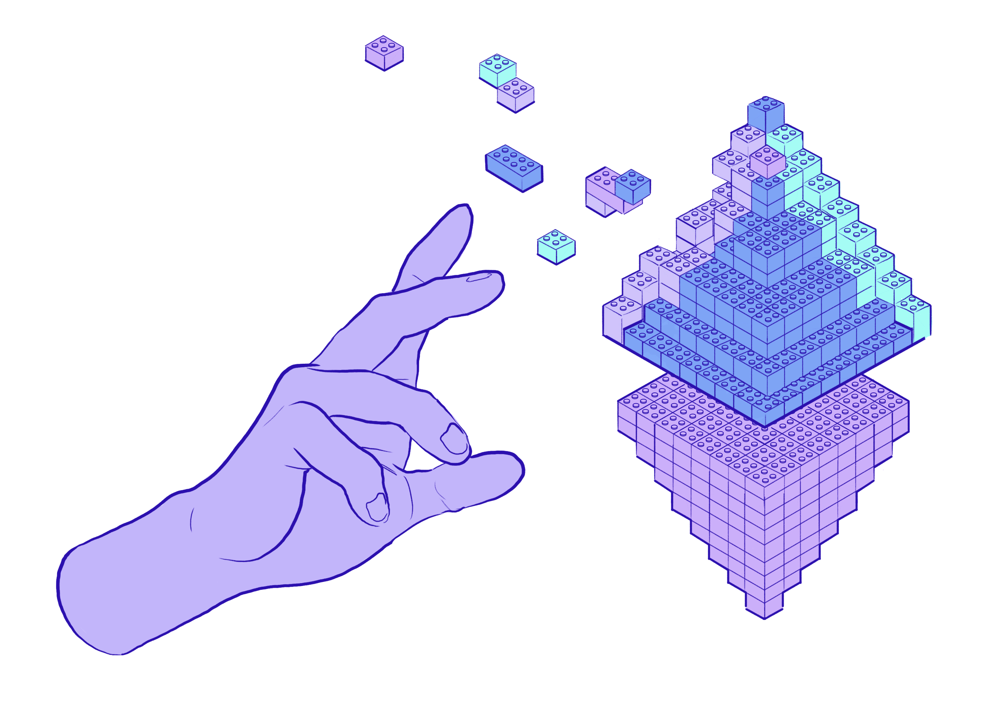

## Apps with superpowers {#apps-with-superpowers}

Ethereum applications might feel like regular apps. But behind the scenes they have some special qualities.

Once an app is published on Ethereum blockchain, it becomes unstoppable. This is because Ethereum network is decentralized across thousands of computers around the world. Nobody can take apps running on Ethereum down, because there is no single server to target. Ethereum is also neutral and so anyone anywhere in the world can use it or even connect to it and build their modifications on top of it.

## What is a dapp? {#what-is-a-dapp}

Ethereum applications have their logic running on the Ethereum blockchain instead of in centralized servers. This is why they have often been called decentralized applications or dapps in short.

<CardGrid>
  <Card title="More private" emoji=":detective:" description="You only need an Ethereum wallet to use any dapp. Your personal data are not required. This is the internet as it should have always been."/>
  <Card title="Globally accessible" emoji="🌍" description="Dapps aren’t governed by the rules of regions and app stores. Your access depends on having an internet connection – not where you live." />
  <Card title="Cheaper services" emoji=":handshake:" description="Dapps are peer-to-peer. No intermediaries taking a cut means cheaper services." />
</CardGrid>

## Why does this matter {#why-does-this-matter}

Ethereum apps can do stuff that just isn’t possible with traditional apps. Like lend money to a complete stranger with a guarantee that you’ll get your money back, plus interest. Without paying a “trustworthy” intermediary, like a lawyer, to handle the transaction. 

There are apps for everything: gaming, finance, work, messaging, storage and more. With most apps you aren’t subjected to ads or limited by restricted access.

All you need is an Ethereum wallet and a little ETH to start using any Ethereum app.

## How does it work {#how-does-it-work}

Apps are powered by smart contracts — bits of code that live on the Ethereum blockchain. Unlike traditional apps, they don’t need a company to run them.

| Feature | Traditional apps | Ethereum apps |
| ------- | ---------------- | ------------- |
| **Who controls it?** | A company | Nobody |
| **Runs on** | Private company servers | Public Ethereum blockchain |
| **Can it be censored?** | Yes | No |
| **Who owns your data?** | Usually not you | You own your data |

<WhatAreAppsStories />

## Ethereum apps are like legos {#ethereum-apps-are-like-legos}

When apps are all built on Ethereum, they are all compatible. A token for one app, will work on a completely different one. This is like being able to publish tweets to your facebook wall. In fact often you can reuse the same profile in many different Ethereum apps without the need to register everywhere separately.

<BrowseApps />

## Further reading

- [Ethereum for beginners](/what-is-ethereum)
- [What is a smart contract?](/developers/docs/smart-contracts/)
- [Technical dapp documentation](/developers/docs/dapps/)

## Frequently asked questions

<ExpandableCard title="What does dapp stand for?" visible>
  
Dapp stands for decentralized applications. Those are applications built on blockchain networks like Ethereum. They are called decentralized because underlying network is decentralized.

</ExpandableCard>

<ExpandableCard title="Do I buy coins on a dapp?" visible>
  
Some applications do let you trade or buy crypto tokens, but not all apps are for that. If you are looking to buy your first tokens visit <a href="/get-eth">Get ETH</a>.

</ExpandableCard>

<ExpandableCard title="What is the best crypto wallet?" visible>
  
Crypto wallet lets you hold your tokens and manage your Ethereum account. There many great wallets, each serving a different purpose. To find out which wallet is best for you, visit our <a href="/wallets/find-wallet">list of wallets</a>.

</ExpandableCard>