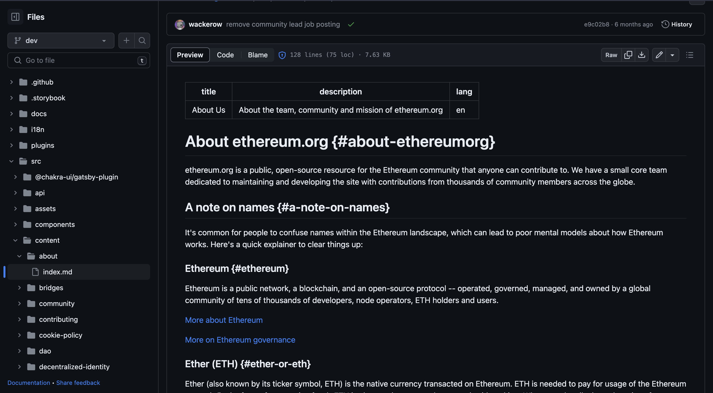
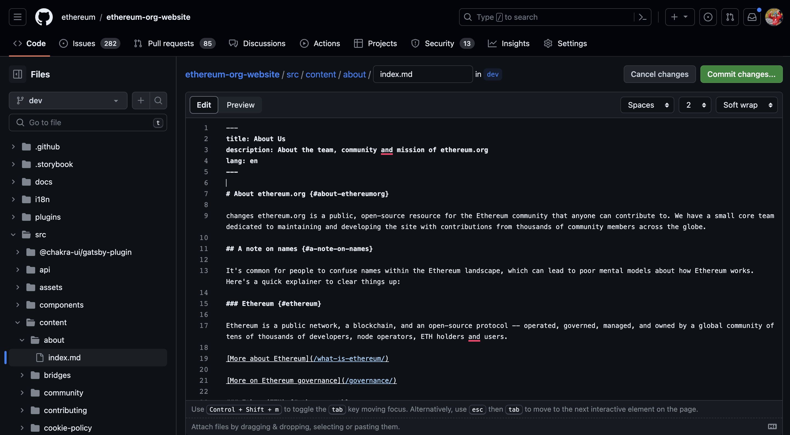
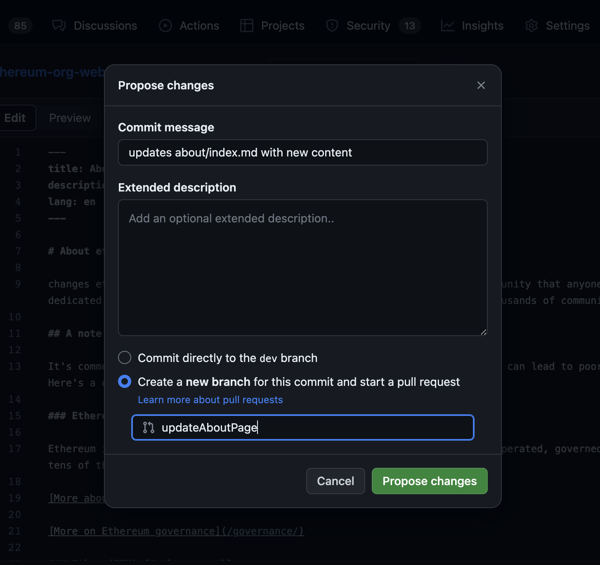
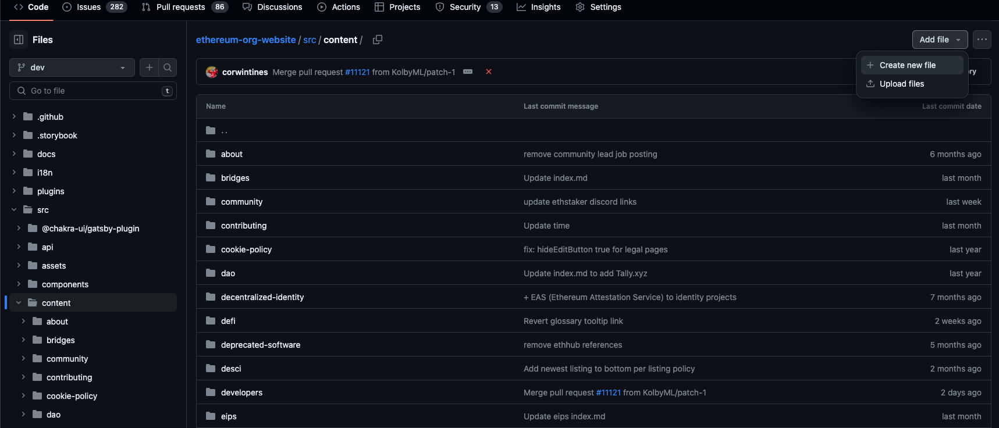
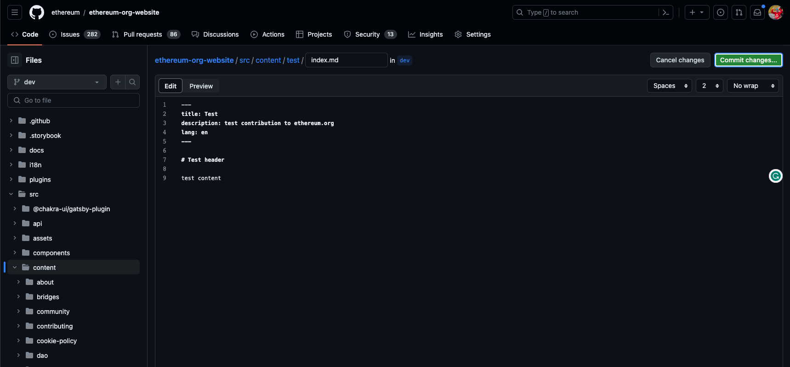
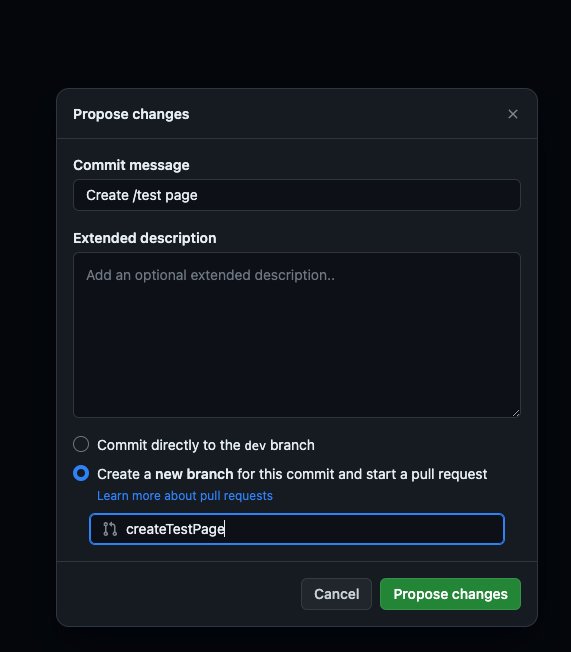

# Content contributions to ethereum.org {#content-contributions}

Ethereum.org is an education portal for Ethereum, and that starts with the content being contributed by the community. We encourage contributions for new content, and updating existing content to keep it up to date.

Before contributing to content, make sure you are familiar with our [style guide](/contributing/style-guide/).

You're first content contribution of the year earns you a POAP. [More information on our POAP](https://ethereum.org/en/contributing/#claim-gitpoap).

## Markdown content in `/src/content` {#markdown-content}

Most of the content on ethereum.org is written in markdown. A cheat sheet on markdown syntax can be found [here](https://www.markdownguide.org/cheat-sheet).

These markdown files are found in [`/src/content` of the project repository](https://github.com/ethereum/ethereum-org-website/tree/dev/src/content). Each folder has an `index.md` for the content and corresponds to a page on ethereum.org. For example, this page [https://ethereum.org/contributing/content](/contributing/content) can be found in the [`/src/content/contributing/content/index.md`](https://github.com/ethereum/ethereum-org-website/tree/dev/src/content/contributing/content/index.md) file.

#### A note on the developer docs {#a-note-on-the-developer-docs}

Many pages on ethereum.org are in the developer docs section of the website. Like all the other pages described above, these are found in the content folder under `/src/content/developers/docs/{folder_for_page_you_are_looking_for}`.

### How to edit a markdown page {#how-to-edit-a-markdown-page}

#### In GitHub {#how-to-edit-a-markdown-page-in-github}

Find the page you are looking to edit in [`/src/content/`](https://github.com/ethereum/ethereum-org-website/tree/dev/src/content) folder. The structure of the content folder maps to the url of ethereum.org. For this example, lets edit the about page.

We can find the about page at [https://github.com/ethereum/ethereum-org-website/blob/dev/src/content/about/index.md](https://github.com/ethereum/ethereum-org-website/blob/dev/src/content/about/index.md) which will change the `/about` page ([https://ethereum.org/about](/about)). As you can see the mapping of where the content is corresponds to the URL of the website.



Hit the edit button in the top left, and make any content changes for the page. After you have finished making your changes, you can select `Commit changes...` to commit your contribution.



Make sure you you add an informative description, and branch name.



Once you have done this, make a pull request into the `dev` branch from your newly created branch and we will review it!

#### Locally cloned repository {#how-to-edit-a-markdown-page-locally-cloned-repository}

Find the page you are looking to edit in [`/src/content/`](https://github.com/ethereum/ethereum-org-website/tree/dev/src/content) folder. The structure of the content folder maps to the url of ethereum.org. For this example, lets edit the about page. More on code contributions and working with the repository can be found on our [code contributions](/contributing/code) page.

Make a branch off of your forks `dev` branch. Make sure you have a descriptive branch name.

We can find the about page in the [`/src/content/about/index.md`](https://github.com/ethereum/ethereum-org-website/blob/dev/src/content/about/index.md) file, which will change the `/about` page ([https://ethereum.org/about](/about)). As you can see, the mapping of where the content is corresponds to the URL of the website.

Make changes to the [`/src/content/about/index.md`](https://github.com/ethereum/ethereum-org-website/blob/dev/src/content/about/index.md) file, and save. Then commit and push your changes up to your branch. Example terminal command:

```sh
git add <path>
git commit -m "<descriptive commit message>"
git push origin <branch name>
```

Lastly, make a pull request into the `dev` branch from your forks branch and we will review it.

### How to create a markdown page {#how-to-create-a-markdown-page}

#### In GitHub {#how-to-create-a-markdown-page-in-github}

In the [`/src/content/`](https://github.com/ethereum/ethereum-org-website/tree/dev/src/content) folder, create a folder with the structure of the url. For example, [`/src/content/about/index.md`](https://github.com/ethereum/ethereum-org-website/blob/dev/src/content/about/index.md) maps to the `/about` ([https://ethereum.org/about](/about)) page on the website.

Click on the `Add file` button in the top right, and select `Create new file`



Type the path out for the new page. Remember, the path in this folder maps to the URL. In this example, we will create /test, by typing `test/index.md` in the text area. After doing that, write your content in markdown. At the start of this page, make sure to include the necessary frontmatter text, description, and lang.



After you have written your content, click `Commit changes...` in the top right to commit your new page contribution. Make sure you you add an informative description, and branch name.



Once you have done this, make a pull request into the `dev` branch from your newly created branch and we will review it!

#### Locally cloned repository {#how-to-create-a-markdown-page-locally-cloned-repository}

In the [`/src/content/`](https://github.com/ethereum/ethereum-org-website/tree/dev/src/content) folder, create a folder with the structure of the url. For example, [`/src/content/about/index.md`(https://github.com/ethereum/ethereum-org-website/blob/dev/src/content/about/index.md) maps to the `/about` ([https://ethereum.org/about](/about)) page on the website.

For the purpose of this example, create a folder for the `/test` page with an `index.md` file. This should create the structure `/src/content/test/index.md` Remember, the path in this structure maps to the URL. After doing that, write your content in markdown. At the start of the page, make sure to include the necessary frontmatter text, description, and lang.

```markdown
---
title: Content contributions
description: Content contribution to ethereum.org
lang: en
---

# Test header

Test content
```

Commit your changes and push them up to your branch.

```sh
git add <path>
git commit -m "<descriptive commit message>"
git push origin <branch name>
```

Lastly, make a pull request into the `dev` branch from your fork and we will review it.

### Custom header ID's for translations {#custom-header-ids}

All markdown pages should include custom header IDs for each header. For example:


```markdown
## Here is a header {#here-is-a-header}

Content...
```

The `{#here-is-a-header}` tag will be parsed into an `id` for this header, and is used for hash links to take a user directly to this section. For example: [https://ethereum.org/about#a-note-on-names](https://ethereum.org/about#a-note-on-names) will take a user directly to the `A note on names` section of the about page.

This custom ID is intentionally _not translated_ during the translation process, allowing the link to work for any language, since the link ID will not change from language-to-language.

If this is not included, a new ID will be generated for each language, breaking the portability of these links between languages.

These ID's should be unique to the page. Typically a "kebab-cased" version of the header label itself is used, but this is not required, and should be changed for any recurring header labels (ie: multiple "Example" sub-sections should _not_ all be named `{#example}`).
