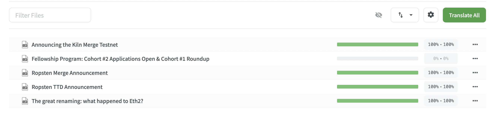

# Ethereum Foundation blog translations {#blog-translations}

[The **Ethereum Foundation (EF)** blog](https://blog.ethereum.org/) is the primary way most teams within the EF communicate to the community. Many use the blog to post announcements, updates, reports, roundups, and other public communication.

In line with the key values of the [ethereum.org Translation Program mission and vision](/contributing/translation-program/mission-and-vision) (accessibility, inclusivity, empowerment, and building the global Ethereum community), we want to provide the Ethereum Foundation blog posts in as many languages as possible.

Anyone can contribute to translating the EF blog. If you want to get involved, keep reading to learn how to join the project in Crowdin and start translating.

## How to translate {#how-to-translate}

<InfoBanner shouldCenter emoji=":light_bulb:">
  We encourage you to check out the ethereum.org translation style guide. It contains some of the most important guidelines, instructions, and tips for translators to help translate the blog. While initially written for ethereum.org translators, most of the style guide is also relevant to blog translations.
    
  <Link to="/contributing/translation-program/translators-guide/">View the translation style guide</Link>

</InfoBanner>

### Join the blog translations project in Crowdin {#join-crowdin}

You'll need to log in to your Crowdin account or sign up if you don’t already have one. All that is required to sign up is an e-mail account and password.

<ButtonLink to="https://crowdin.com/project/ethereum-foundation-blog/invite">
  Start translating
</ButtonLink>

### Open the language you want to translate and find a blog post to work on {#pick-language-and-post}

Each post is uploaded to Crowdin as an individual file. The files are named after the blog post title, so it should be fairly straightforward if you're looking for a specific post to translate.

Blog posts are prioritized based on their date of publication. Please follow the numerical order when translating to ensure that recently published posts get translated first (1 → 2 → 3 → ⋯).

### Translate {#translate}

After selecting a blog post to translate, the online editor will open automatically. If you have never used Crowdin, use this quick guide to learn the basics.

_To ensure that the most relevant blog posts are being translated, Crowdin contains primarily new or recently published posts. If you'd like to suggest a currently unavailable blog post for translation, please email us at [translations@ethereum.org](mailto:translations@ethereum.org)._

For a more in-depth guide to using Crowdin, visit our [how to translate page](/contributing/translation-program/how-to-translate).

Thank you for your getting involved and helping us make the Ethereum Foundation blog accessible to everyone!
