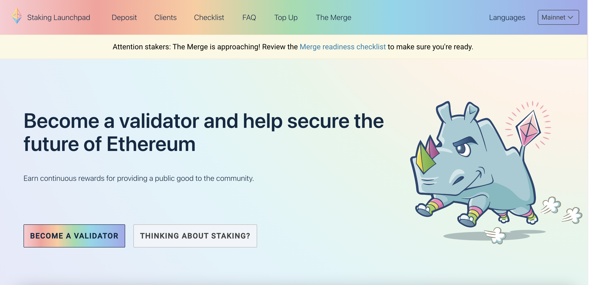
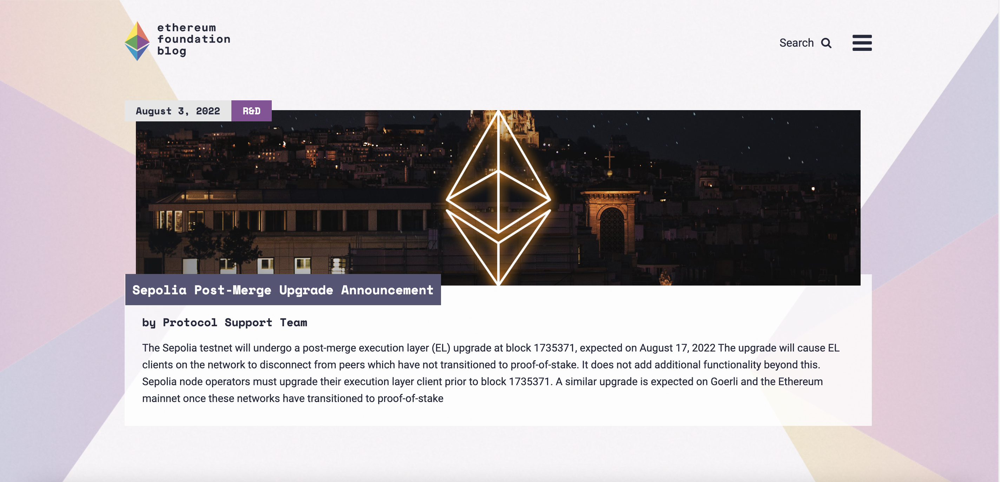

# Programa de traducción {#translation-program}

El Programa de Traducción es un esfuerzo de colaboración para traducir ethereum.org a diferentes idiomas con el fin de hacer el sitio web más accesible a miles de millones de personas que no hablan inglés en todo el mundo.

## Ayúdenos a traducir {#help-us-translate}

El Programa de Traducción de ethereum.org está abierto y ¡cualquiera puede contribuir!

1. Deberá iniciar sesión en su cuenta de Crowdin o registrarse.
2. Seleccione el idioma al que desea contribuir.
3. Antes de empezar, consulte la guía [Cómo traducir](/contributing/translation-program/how-to-translate/) para aprender a utilizar Crowdin, y la [Guía de estilo de traducción](/contributing/translation-program/translators-guide/) para obtener consejos y buenas prácticas.
4. No se aprobarán las traducciones automáticas.
5. Todas las traducciones se revisan antes de añadirse al sitio, por lo que habrá un breve retraso antes de que se publiquen.

<ButtonLink to="https://crowdin.com/project/ethereum-org/invite">
  Start translating
</ButtonLink>

## Acerca del Programa de Traducción {#about-us}

La comunidad Ethereum pretende ser global e inclusiva, pero gran parte de su contenido sólo está dirigido a angloparlantes, dejando fuera a los 6.000 millones de personas que no hablan inglés. Para que ethereum.org actúe como portal de Ethereum para la comunidad mundial, creemos que es esencial proporcionar a los no angloparlantes contenidos de Ethereum en su lengua materna.

El Programa de Traducción de ethereum.org tiene como objetivo hacer Ethereum accesible a todo el mundo mediante la traducción de ethereum.org y otros contenidos de Ethereum a tantos idiomas como sea posible.

Más información sobre el Programa de Traducción de ethereum.org [misión y visión](/contributing/translation-program/mission-and-vision).

### Nuestros progresos {#our-progress}

- [**4,300 +** translators](/contributing/translation-program/contributors/)
- [**50** languages live on site](/languages/)
- [**2.8 million** words translated in 2022](/contributing/translation-program/acknowledgements/)

<TranslationChartImage />

### Agradecimientos {#acknowledgements}

Ethereum.org es traducido por miles de miembros de la comunidad y ellos son la pieza clave del Programa de Traducción.
Queremos reconocer a nuestros traductores y apoyarles en su carrera profesional. Estos son algunos de nuestros reconocimientos a los traductores:

#### Certificado {#certificate}

Si has contribuido al Programa de Traducción y al menos 5.000 de tus palabras traducidas han sido aprobadas, puedes optar a un certificado de traductor de ethereum.org. [Más sobre certificados](/contributing/translation-program/acknowledgements/#certificate)

#### POAPs {#poaps}

Todos nuestros traductores pueden optar a un POAP (Proof of Attendance Protocol) - un NFT que acredita su contribución al Programa de Traducción de ethereum.org. [Más información sobre los POAP](/contributing/translation-program/acknowledgements/#poap)

#### Agradecimientos al traductor {#translator-acknowledgements}

Reconocimientos públicos a nuestros mejores traductores mediante [tablas de clasificación](/contributing/translation-program/acknowledgements/) y una [lista de todos los colaboradores del Programa de Traducción](/contributing/translation-program/contributors/).

#### Recompensas {#rewards}

En el pasado, hemos recompensado retroactivamente a nuestros colaboradores más activos con entradas para conferencias sobre Ethereum como [Devcon](https://devcon.org/en/) y [Devconnect](https://devconnect.org/), así como con merchandising exclusivo de ethereum.org.

Pensamos constantemente en formas nuevas e innovadoras de recompensar a nuestros colaboradores, ¡así que permanezca atento!

### En qué estamos trabajando {#our-projects}

Nuestra comunidad de colaboradores está traduciendo activamente múltiples sitios web y recursos de gran impacto para la comunidad global de Ethereum.

#### Ethereum.org {#ethereumorg}

[Ethereum.org](/) es un recurso educativo clave para la comunidad Ethereum y es el objetivo principal del Programa de Traducción. Dado el tamaño, el alcance y la extensión del sitio web, es el sitio más impactante para traducir y recomendamos empezar por aquí.

Participa:

- Únete al [proyecto de traducción de ethereum.org en Crowdin](https://crowdin.com/project/ethereum-org/invite)

#### Lanzadera de apuestas Ethereum {#ethereum-staking-launchpad}

El [Staking Launchpad](https://launchpad.ethereum.org/en/) permite a los usuarios de Ethereum convertirse en validadores y ayudar a asegurar el futuro de Ethereum apostando ETH.

Participa:

- Visita la [Launchpad translations page](/contributing/translation-program/launchpad-translations/)
- Únase al [proyecto de traducciones de Launchpad en Crowdin](https://crowdin.com/project/ethereum-staking-launchpad)

#### Blog de la Fundación Ethereum {#ethereum-foundation-blog}

El [blog de la Fundación Ethereum](https://blog.ethereum.org/) es la principal herramienta de publicación para muchos equipos apoyados por la Fundación Ethereum y es la fuente de anuncios, actualizaciones, informes, resúmenes y otras comunicaciones públicas para la comunidad Ethereum.

Participa:

- Visita la página [Blog translations](/contributing/translation-program/blog-translations/)
- Únete al proyecto [Blog translations project in Crowdin](https://crowdin.com/project/ethereum-foundation-blog)

### Guías y recursos {#guides-and-resources}

Si estás contribuyendo al Programa de Traducción o pensando en participar, deberías consultar las siguientes guías de traducción:

- Translation Style Guide](/contributing/translation-program/translators-guide/) _- instrucciones y consejos para los traductores de ethereum.org_.
- Translation FAQs](/contributing/translation-program/faq/) _- preguntas y respuestas frecuentes sobre el Programa de Traducción de ethereum.org_
- Crowdin online editor guide](https://support.crowdin.com/online-editor/) _- una guía detallada para utilizar el editor en línea Crowdin y algunas de las características avanzadas de Crowdin_
- Content buckets](/contributing/translation-program/content-buckets/) _- qué páginas se incluyen en cada content bucket de ethereum.org_

Para otras herramientas de traducción útiles, comunidades de traductores y entradas de blog del Programa de Traducción, visite la [página de recursos](/contributing/translation-program/resources/).

## Póngase en contacto {#get-in-touch}

¿Tiene alguna pregunta? ¿O quieres colaborar con nuestro equipo y otros traductores? Por favor, publícalo en el canal #translations de nuestro [ethereum.org Discord server](https://discord.gg/6WX7E97)

También puedes ponerte en contacto con nosotros en translations@ethereum.org

## Poner en marcha su propio programa de traducción {#starting-a-translation-program}

Nos dedicamos a traducir el contenido de Ethereum a tantos idiomas como sea posible y a poner el contenido educativo a disposición de todo el mundo.
En línea con nuestro enfoque en las traducciones, queremos ayudar a otros proyectos Ethereum a organizar, gestionar y mejorar sus propios esfuerzos de traducción.

Por esta razón, hemos creado un [Translation Program playbook](/contributing/translation-program/playbook/) que contiene algunos consejos y mejores prácticas que hemos recogido en el proceso de traducción de ethereum.org.

¿Quieres seguir colaborando o utilizar algunos de nuestros recursos de traducción? ¿Tienes algún comentario sobre el libro de jugadas? Nos encantaría saber de ti en translations@ethereum.org.
