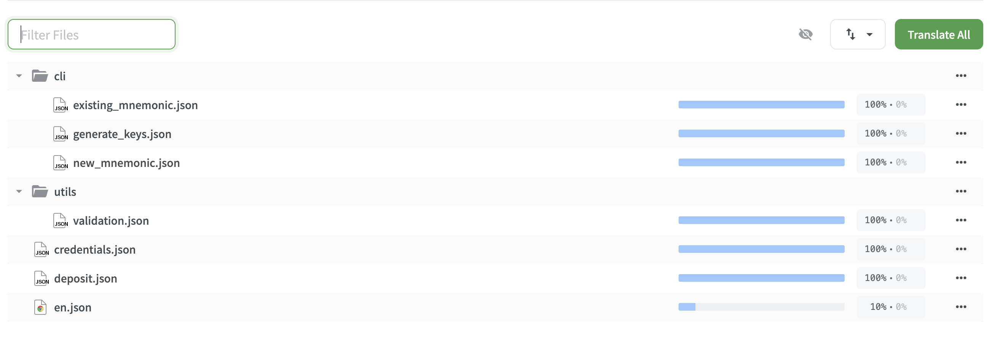

# Staking Launchpad translations {#launchpad-translations}

The [Staking Launchpad](https://launchpad.ethereum.org/) is a website that contains instructions on becoming an Ethereum validator, interfaces to deposit ETH to the staking contract and top up your validator, validator checklist, and information about different Ethereum clients.

With the aim of making staking more accessible and diverse, and make it easier for non-English speakers to spin up validators, we are actively translating the Launchpad and it is currently available in 20 languages.

## How to translate {#how-to-translate}

<InfoBanner shouldCenter emoji=":light_bulb:">
  We encourage you to check out the ethereum.org Translation style guide. It contains some of the most important guidelines, instructions, and tips for translators to help localize the blog. While originally written for ethereum.org translators, most of the style guide is relevant to blog translations as well.
  {" "}<Link to="/contributing/translation-program/translators-guide/">View the Translation Style Guide</Link>
</InfoBanner>

1. **Join the Launchpad translations project in Crowdin**  
   You will need to log in to your Crowdin account or sign up if you don’t already have one. All that is required to sign up is an e-mail account and password.

<ButtonLink to="https://crowdin.com/project/ethereum-staking-launchpad/invite">
  Start translating
</ButtonLink>

2. **Open the language you want to translate and click ''Translate All''**  
   The Launchpad contains 7 source files, all of which should be translated. You can check the progress of each document on the right – if translation progress is below 100%, please contribute!

   

3. **Translate**  
   After selecting the file you want to translate, it will open in the online editor. If you have never used Crowdin before, you can use this quick guide to go over the basics.

For a more in-depth guide to using Crowdin, please visit the [How to translate](/contributing/translation-program/how-to-translate) section.

Thank you for your getting involved and helping us make the Launchpad accessible to everyone!