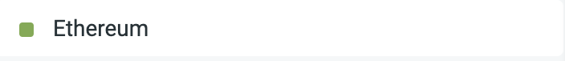
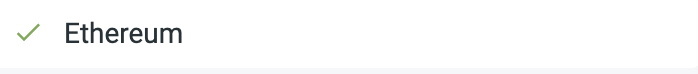

Welcome to the first ever ethereum.org Translatathon!

A translatathon is a collaborative and competitive hackathon-style event where individuals and teams compete for prizes by translating ethereum.org content into different languages.

The goal is to translate website content and help make ethereum.org more accessible to non-English speakers, raise awareness of the importance of localization and the [Translation program](/contributing/translation-program/), onboard new contributors and give back to our community, while fostering a sense of community by teaming up, collaborating on translations, and competing against other teams.

We invite you to join us in breaking down language barriers and making ethereum.org content available to a truly global audience. By participating in the Translatathon, you’ll have an opportunity to meet and collaborate with like-minded individuals from across the globe, compete for exciting prizes, and contribute to making Ethereum content more accessible to the world!

## Overview {#overview}

### When {#when}

- Application period: August 1st - August 15th
- Translation period: August 16th - August 22nd
- Evaluation & QA period: August 23rd - August 30th
- Results announcement: August 31st

### Where {#where}

The translations and review process will take place in the [ethereum.org project on Crowdin](https://crowdin.com/project/ethereum-org), a localization management platform where all of our localization processes take place.

All of the Translatathon participants will be required to join the project in Crowdin and translate directly on the platform, where you can translate as individuals or collaborate as part of a team.

Office hours, workshops, team formation and FAQ sessions will be hosted on the [ethereum.org Discord](https://www.ethereum.org/discord), where you’ll also be able to find all the relevant information on the Translathon, follow along with announcements and updates, and reach out to other participants and the ethereum.org team.

### How {#how}

#### Application period {#applications}

The application period will be open from **August 1st** to **August 15th**

All participants in the Translatathon are required to apply in order to participate and compete for prizes.

During this period, we will be organizing several team formation calls on the Discord, where participants will be able to form teams and apply to compete in the ‘Teams’ category.

Participants planning to compete as a team need to fill out the [Team registration form](https://teams.paperform.co/) by the end of the application period, adding links to the Crowdin profiles of each team member.

#### Categories {#categories}

The Translatathon will be split into two categories: **Teams** and **Individuals**

Teams will be able to participate by collaborating on translations, competing only against other teams, and the final scores will be calculated based on the sum of translated words by all team members and the content buckets they translated. Teams can have up to a total of 3 members.

Team members can translate into different languages!

Individuals will participate in the Translatathon as normal, competing only against other individuals, and the final scores will be calculated based on their number of translated words and the content buckets they translated.

**Only translations, submitted during the Translation period - starting 15th of August at 4:00am UTC and ending 23rd of August at 4:00am UTC - will count towards the final score.**

## Step-by-step instructions {#instructions}

1. Learn more about the Translatathon and read up on the timeline, process, requirements, and evaluation process

2. Apply to participate [here](https://translatathon.paperform.co/)

3. Join the team formation and Onboarding calls on the [ethereum.org Discord](https://www.ethereum.org/discord)

4. If you’re planning to participate as part of a team, fill out the [Team registration form](https://teams.paperform.co/)

5. Check out the resources on [how to join the project and how to use Crowdin](/contributing/translation-program/how-to-translate/), and read through the [Translation style guide](/contributing/translation-program/translators-guide/) for in-depth guidelines on translating ethereum.org content

6. Translate!

<InfoBanner shouldCenter emoji=":heavy_exclamation_mark:">
  When translating, do not use machine translation or submit low-quality translations, since all translations will be reviewed, and <strong>participants found using machine translation or submitting inaccurate translations will be disqualified from competing for prizes!</strong>
</InfoBanner>

## Details and submission criteria {#details}

### Requirements and scoring {#requirements-scoring}

With the translation process taking place in Crowdin, the deliverable for Translathon participants is simply the content you have translated in the [ethereum.org project](https://crowdin.com/project/ethereum-org). No need to manually submit anything.

In order for your submissions to be counted, make sure that you are only translating untranslated and unapproved strings.

This means that you should only be translating files that are less than 100% translated, and strings with no existing translations. They can be easily identified by the red square (as shown in the image below).

Untranslated string (translate this!):

Translated strings (do not translate):

String with an approved translation (do not translate):

The files for translation are already categorized by priority in Crowdin, with initial content buckets containing the most high-traffic pages.

You can read more about content buckets [here](/contributing/translation-program/how-to-translate/#find-document), and check the exact distribution of pages across different content buckets [here](/contributing/translation-program/content-buckets/).

We always recommend contributors to translate the content buckets in order, starting with 1) Homepage → 2) Essentials → 3) Exploring → 4) Use Ethereum pages, etc., but during the Translatathon, this will be especially important and could heavily influence your score, since the higher priority buckets will have a higher multiplier when calculating the final score.

Full breakdown of multipliers by content bucket:

- Content buckets 1-8: 1.2x points multiplier
- Content buckets 9-15: 1.1x points multiplier
- Content buckets 16-28: 1x points multiplier
- Remix translations: 0.8x points multiplier

### Prizes {#prizes}

The total prize pool for the Translatathon is 30,000$.

A detailed breakdown of prizes will be announced at the end of the application period.

### Evaluation process {#evaluation-process}

We work with [Acolad](https://www.acolad.com/), a leading localization agency, on all review and QA processes for ethereum.org content.

As part of the evaluation process for the Translatathon, all translations will be subject to a QA and feedback step, where professional linguists will evaluate submissions by individual translators based on quality and accuracy.

We will also be running anti-machine translation measures, with Crowdin providing some tools that automatically detect machine translations.

While translation quality will not play a critical role in the scoring, any participants found using machine translation or suggesting low-quality and inaccurate translations will be disqualified and not eligible to compete for prizes!

If you are participating in the Translatathon as part of a team, try to pick your teammates wisely. Any team members that are disqualified based on the above criteria will results in your team losing points, putting you at a disadvantage against other teams.

The evaluation period will take one week after the translation period ends, and results & winners will be announced on August 31st.

All translations will also be subject to a thorough review before being added to the website.

## Terms & conditions {#Terms-and-Conditions}

_The Translatathon is an experimental initiative by ethereum.org to incentivize and reward contributions to the ethereum.org Translation program. We reserve the right to modify the rules or cancel the event at any time, and the eligibility, score, and distribution of prizes are at the sole and final discretion of the ethereum.org team._

- By submitting the application form, you consent to sharing all the mandatory information with the organizers. All of the information you provide will be kept private between yourself and the ethereum.org team, but your Crowdin username and profile image will be used in public announcements of the results and winners.

- Using machine translation or suggesting incorrect and inaccurate translations will lead to disqualification and make you ineligible to compete for prizes. The ethereum.org team reserves the right to disqualify participants based on the above, and all such decisions are final.

- Any suggested translations for strings that have already been translated or reviewed will not be counted towards your final score.

- Prize winners will be subject to KYC before receiving prizes, and any taxes this might incur are the sole responsibility of the participant.

- We are unable to issue prizes to participants from countries that are on sanctions lists (e.g. North Korea, Syria, Iran, and Cuba).

## Frequently asked questions {#FAQ}

<ExpandableCard title="Who can I contact if I need help or have questions, feedback, or ideas?" eventCategory="/translation-program/translatathon" eventName="clicked Who can I contact if I need help or have questions, feedback, or ideas?">

- In Crowdin, you can send a direct message to <a href="https://crowdin.com/profile/ethdotorg">Ethereum.org Team</a>
- On the <a href="/discord/">ethereum.org Discord</a>, you can send a message in the <strong>#translatathon</strong> & <strong>#translate</strong> channels
- You can send an email to <strong>translations@ethereum.org</strong>

</ExpandableCard>

<ExpandableCard title="Which languages can I translate into?" eventCategory="/translation-program/translatathon" eventName="clicked Which languages can I translate into?">

You can translate into any language! It is recommended to only translate into your native language to ensure sufficient quality, but in short, all language available in Crowdin are in scope for the Translatathon.

In case you would like to translate into a language that is not available in the <a href="https://crowdin.com/project/ethereum-org">ethereum.org project in Crowdin</a>, please send a message to <a href="https://crowdin.com/profile/ethdotorg">Ethereum.org Team</a> in Crowdin, or send a message in the <strong>#translatathon</strong> or <strong>#translate</strong> channels on the <a href="/discord/">ethereum.org Discord</a> and we’ll add the language to the project.

</ExpandableCard>

<ExpandableCard title="I want to participate as part of a team. Do I need to apply as an individual as well?" eventCategory="/translation-program/translatathon" eventName="clicked I want to participate as part of a team. Do I need to apply as an individual as well?">

Yes, all Translatathon participants are required to submit the individual application form to participate.

Only one member of a team needs to submit the team registration form, so we can keep track of teams and their members.

</ExpandableCard>

<ExpandableCard title="Which tools can I use to assist me with the translation?" eventCategory="/translation-program/translatathon" eventName="clicked Which tools can I use to assist me with the translation?">

Machine translation is strictly forbidden, but the project in Crowdin has a built-in Translation memory and Glossary that you can use to assist you in the process, or check definitions and established translations for specific terms.

You can learn more about navigating Crowdin and using the Translation memory and Glossary <a href="https://support.crowdin.com/online-editor/#section-4">here</a>.

</ExpandableCard>

<ExpandableCard title="How can I find teammates to compete in the Teams category?" eventCategory="/translation-program/translatathon" eventName="clicked How can I find teammates to compete in the Teams category?">

If you are already connected with other translators or people who would be interested in participating, you can simply <a href="https://teams.paperform.co/">apply to register as a team</a> and add the Crowdin accounts for everyone that will be part of the team.

You can also invite your friends and form a team with them.

Finally, we’ll be hosting team formation calls on the <a href="/discord/">ethereum.org Discord</a>, where you can connect with other individuals looking for teammates.

</ExpandableCard>

<ExpandableCard title="What should I do if my language is 100% translated?" eventCategory="/translation-program/translatathon" eventName="clicked What should I do if my language is 100% translated?">

If the ethereum.org content in Crowdin has been 100% translated into your language, congratulations!

Once the Translatathon is over, all the translated content will be fully reviewed and added to the website.

However, despite your language being completely translated, you can still participate in the Translatathon by translating <a href="https://crowdin.com/project/remix-translation">Remix content</a>.
These translations will be used in the Remix IDE documentation and have a lower score multiplier than ethereum.org content.

</ExpandableCard>
