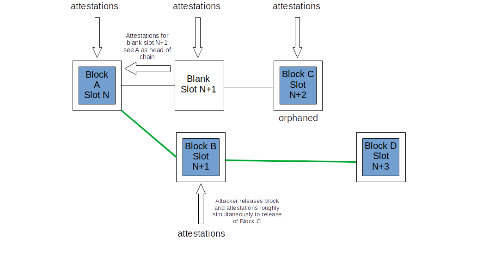

Thieves and saboteurs are constantly seeking opportunities to attack Ethereum’s client software. This page outlines the known attack vectors on Ethereum’s consensus layer and outlines how those attacks can be defended. The information on this page is adapted from a [longer form version](https://mirror.xyz/jmcook.eth/YqHargbVWVNRQqQpVpzrqEQ8IqwNUJDIpwRP7SS5FXs).

## Prerequisites {#prerequisites}

Some basic knowledge of [proof-of-stake](/developers/docs/consensus-mechanisms/pos/) is required. Also, it will be helpful to have a basic understanding of Ethereum's [incentive layer](/docs/consensus-mechanisms/pos/rewards-and-penalties) and fork-choice algorithm, [LMD-GHOST](/docs/consensus-mechanisms/pos/gasper).

## What do attackers want? {#what-do-attackers-want}

A common misconception is that a successful attacker can generate new ether, or drain ether from arbitrary accounts. Neither of these are possible because all transactions are executed by all the execution clients on the network. They must satisfy basic conditions of validity (e.g. transactions are signed by sender’s private key, sender has sufficient balance, etc) or else they simply revert. There are three classes of outcome that an attacker might realistically target: reorgs, double finality or finality delay.

A **“reorg”** is a reshuffling of blocks into a new order, perhaps with some addition or subtraction of blocks in the canonical chain. A malicious reorg might ensure specific blocks are included or excluded, allowing double-spending or value extraction by front-running and back-running transactions (MEV). Re-orgs could also be used to prevent certain transactions from being included in the canonical chain - a form of censorship. The most extreme form of reorg is “finality reversion” which removes or replaces blocks that have previously been finalized. This is only possible if more than ⅓ of the total staked ether is destroyed by the attacker - this guarantee is known as “economic finality” - more on this later.

**Double finality** is the unlikely but severe condition where two forks are able to finalize simultaneously, creating a permanent schism in the chain. This is theoretically possible for an attacker willing to risk 34% of the total staked ether. The community would be forced to coordinate off-chain and come to an agreement about which chain to follow, which would require strength in the social layer.

A **finality delay** attack prevents the network from reaching the necessary conditions finalizing sections of the chain. Without finality, it is hard to trust financial applications built on top of Ethereum. The aim of a finality delay attack is likely simply to disrupt Ethereum rather than to directly profit, unless the attacker has some strategic short position(s).

An attack on the social layer might aim to undermine public trust in Ethereum, devalue ether, reduce adoption or to weaken the Ethereum community to make out-of-band coordination more difficult.

Having established why an adversary might attack Ethereum, the following sections examine _how_ they might go about it.

## Methods of Attack {#methods-of-attack}

### Layer 0 Attacks {#layer-0}

First of all, individuals that are not actively participating in Ethereum (by running client software) can attack by targeting the social layer (Layer 0). Layer 0 is the foundation upon which Ethereum is built, and as such it represents a potential surface for attacks with consequences that ripple through the rest of the stack. Some examples might include:

- A misinformation campaign could erode the trust the community has in Ethereum’s roadmap, teams of developers, apps etc. This could then decrease the number of individuals willing to participate in securing the network, degrading both decentralization and crypto-economic security.
- Targeted attacks and/or intimidation directed at the developer community. This could lead to voluntary exit of developers and slow down Ethereum’s progress.

- Over-zealous regulation could also be considered to be an attack on Layer 0, since it could rapidly disincentivize participation and adoption.
- Infiltration of knowledgeable but malicious actors into the developer community whose aim is to slow down progress by bike-shedding discussions, delaying key decisions, creating spam etc.
- Bribes made to key players in the Ethereum ecosystem to influence decision making.

What makes these attacks especially dangerous is that in many cases very little capital or technical know-how is required. A Layer 0 attack could be a multiplier on a crypto-economic attack. For example, if censorship or finality reversion were achieved by a malicious majority stakeholder, undermining the social layer might make it more difficult to coordinate a community response out-of-band.

Defending against Layer 0 attacks is probably not straightforward, but some basic principles can be established. One is maintaining an overall high signal to noise ratio for public information about Ethereum, created and propagated by honest members of the community through blogs, discord servers, annotated specs, books, podcasts and Youtube. Here at ethereum.org we try hard to maintain accurate information and translate it into as many languages as possible. Flooding a space with high quality information and memes is an effective defense against misinformation.

Another important fortification against social layer attacks is a clear mission statement and governance protocol. Ethereum has positioned itself as the decentralization and security champion among smart-contract layer 1’s, while also highly valuing scalability and sustainability. Whatever disagreements arise in the Ethereum community, these core principles are minimally compromised. Appraising a narrative against these core principles, and examining them through successive rounds of review in the EIP (Ethereum Improvement Proposal) process, might help the community to distinguish good from bad actors and limits the scope for malicious actors to influence the future direction of Ethereum.

Finally, it is critical that the Ethereum community remains open and welcoming to all participants. A community with gatekeepers and exclusivity is one especially vulnerable to social attack because it is easy to build “us and them” narratives. Tribalism and toxic maximalism hurt the community and erode Layer 0 security. Ethereans with a vested interest in the security of the network should view their conduct online and in meatspace as a direct contributor to the security of Ethereum’s Layer 0.

### Attacking the protocol {#attacking-the-protocol}

Anyone can run Ethereum’s client software. To add a validator to a client, a user is required to stake 32 ether into the deposit contract. A validator allows a user to actively participate in Ethereum’s network security by proposing and attesting to new blocks. The validator now has a voice they can use to influence the future contents of the blockchain - they can do so honestly and grow their stash of ether via rewards or they can try to manipulate the process to their own advantage, risking their stake. One way to mount an attack is to accumulate a greater proportion of the total stake and then use it to outvote honest validators. The greater the proportion of the stake controlled by the attacker the greater their voting power, especially at certain economic milestones that we will explore later. However, most attackers will not be able to accumulate sufficient ether to attack in this way, so instead they have to use subtle techniques to manipulate the honest majority into acting a certain way.

Fundamentally, all small-stake attacks are subtle variations on two types of validator misbehavior: under-activity (failing to attest/propose or doing so late) or over-activity (proposing/attesting too many times in a slot). In their most vanilla forms these actions are easily handled by the fork-choice algorithm and incentive layer, but there are clever ways to game the system to an attacker’s advantage.

### Attacks using small amounts of ETH {#attacks-by-small-stakeholders}

#### reorgs {#reorgs}

Several papers have explained attacks on Ethereum that achieve reorgs or finality delay with only a small proportion of the total staked ether. These attacks generally rely upon the attacker withholding some information from other validators and then releasing it in some nuanced way and/or at some opportune moment. They usually aim to displace some honest block(s) from the canonical chain. [Neuder et al 2020](https://arxiv.org/pdf/2102.02247.pdf) showed how an attacking validator can create and attest to a block (`B`) for a particular slot `n+1` but refrain from propagating it to other nodes on the network. Instead, they hold on to that attested block until the next slot `n+2`. An honest validator proposes a block (`C`) for slot `n+2`. Almost simultaneously, the attacker can release their withheld block (`B`) and their withheld attestations for it, and also attest to `B` being the head of the chain with their votes for slot `n+2`, effectively denying the existence of honest block `C`. When honest block `D` is released, the fork choice algorithm sees `D` building on top of `B` being heavier than `D` building on `C`. The attacker has therefore managed to remove the honest block `C` in slot `n+2` from the canonical chain using a 1-block ex ante reorg. [An attacker with 34%](https://www.youtube.com/watch?v=6vzXwwk12ZE) of the stake has a very good chance of succeeding in this attack, as explained [in this note](https://notes.ethereum.org/plgVdz-ORe-fGjK06BZ_3A#Fork-choice-by-block-slot-pair). In theory, though, this attack could be attempted with smaller stakes. [Neuder et al 2020](https://arxiv.org/pdf/2102.02247.pdf) described this attack working with a 30% stake, but it was later shown to be viable with [2% of the total stake](https://arxiv.org/pdf/2009.04987.pdf) and then again for a [single validator](https://arxiv.org/abs/2110.10086#) using balancing techniques we will examine in the next section.

A conceptual diagram of the one-block reorg attack described above (adapted from https://notes.ethereum.org/plgVdz-ORe-fGjK06BZ_3A#Fork-choice-by-block-slot-pair)

A more sophisticated attack can split the honest validator set into discrete groups that have different views of the head of the chain. This is known as a **balancing attack**. The attacker waits for their chance to propose a block, and when it arrives they equivocate and propose two. They send one block to half of the honest validator set and the other block to the other half. The equivocation would be detected by the fork-choice algorithm and the block proposer would be slashed and ejected from the network, but the two blocks would still exist and would have about half the validator set attesting to each fork. Meanwhile, the remaining malicious validators hold back their attestations. Then, by selectively releasing the attestations favoring one or other fork to just enough validators just as the fork-choice algorithm executes, they tip the accumulated weight of attestations in favour of one or other fork. This can continue indefinitely, with the attacking validators maintaining an even split of validators across the two forks. Since neither fork can attract a 2/3 supermajority the Beacon Chain would not finalize.

**Bouncing attacks** are similar. Votes are again withheld by the attacking validators. Instead of releasing the votes to keep an even split between two forks, they use their votes at opportune moments to justify checkpoints that alternate between fork A and fork B. This flip-flopping of justification between two forks prevents there from being pairs of justified source and target checkpoints that can be finalized on either chain, halting finality.

<YouTube id="xcPxwhrg3Ao"/>

Both bouncing and balancing attacks rely upon the attacker having very fine control over message timing across the network, which is unlikely. Nevertheless, defenses are built into the protocol in the form of additional weighting given to prompt messages compared to slow ones. This is known as [proposer-weight boosting](https://github.com/ethereum/consensus-specs/pull/2730). To defend against bouncing attacks the fork-choice algorithm was updated so that the latest justified checkpoint can only switch to that of an alternative chain during the [first 1/3 of the slots in each epoch](https://ethresear.ch/t/prevention-of-bouncing-attack-on-ffg/6114). This condition prevents the attacker from saving up votes to deploy later - the fork choice algorithm simply stays loyal to the checkpoint it chose in the first 1/3 of the epoch during which time most honest validators would have voted.

Combined, these measures create a scenario in which an honest block proposer emits their block very rapidly after the start of the slot, then there is a period of ~1/3 of a slot (4 seconds) where that new block might cause the fork-choice algorithm to switch to another chain. After that same deadline, attestations that arrive from slow validators are down-weighted compared to those that arrived earlier. This strongly favors prompt proposers and validators in determining the head of the chain and substantially reduces the likelihood of a successful balancing or bouncing attack.

It is worth noting, that proposer boosting alone only defends against “cheap reorgs”, i.e. those attempted by an attacker with a small stake. In fact, proposer-boosting itself can be gamed by larger stakeholders. The authors of [this post](https://ethresear.ch/t/change-fork-choice-rule-to-mitigate-balancing-and-reorging-attacks/11127) describe how an attacker with 7% of the stake can deploy their votes strategically to trick honest validators to build on their fork, reorging out an honest block. This attack was devised assuming ideal latency conditions that are very unlikely. The odds are still very long for the attacker, and the greater stake also means more capital at risk and a stronger economic disincentive.

A [balancing attack specifically targeting the LMD rule](https://ethresear.ch/t/balancing-attack-lmd-edition/11853) was also proposed, which was suggested to be viable in spite of proposer boosting. An attacker sets up two competing chains by equivocating their block proposal and propagating each block to about half the network each, setting up an approximate balance between the forks. Then, the colluding validators equivocate their votes, timing it so that half the network receive their votes for Fork `A` first and the other half receives their votes for Fork `B` first. Since the LMD rule discards the second attestation and keeps only the first for each validator, half the network sees votes for `A` and none for `B`, the other half sees votes for `B` and none for `A`. The authors describe the LMD rule giving the adversary “remarkable power” to mount a balancing attack.

This LMD attack vector was closed by [updating the fork choice algorithm](https://github.com/ethereum/consensus-specs/pull/2845) so that it discards equivocating validators from the fork choice consideration altogether. Equivocating validators also have their future influence discounted by the fork choice algorithm. This prevents the balancing attack outlined above while also maintaining resilience against avalanche attacks.

Another class of attack, called [**avalanche attacks**](https://ethresear.ch/t/avalanche-attack-on-proof-of-stake-ghost/11854/3), was described in a [March 2022 paper](https://arxiv.org/pdf/2203.01315.pdf). To mount an avalanche attack, the attacker needs to control several consecutive block proposers. In each of the block proposal slots, the attacker withholds their block, collecting them up until the honest chain reaches an equal subtree weight with the withheld blocks. Then, the withheld blocks are released so that they equivocate maximally. The authors suggest that proposer boosting - the primary defense against balancing and bouncing attacks - does not protect against some variants of avalanche attack. However, the authors also only demonstrated the attack on a highly idealized version of Ethereum’s fork-choice algorithm (they used GHOST without LMD).

The avalanche attack is mitigated by the LMD portion of the LMD-GHOST fork choice algorithm. LMD means “latest-message-driven” and it refers to a table kept by each validator containing the latest message received from other validators. That field is only updated if the new message is from a later slot than the one already in the table for a particular validator. In practice, this means that in each slot, the first message received is the one that it accepted and any additional messages are equivocations to be ignored. Put another way, the consensus clients don’t count equivocations - they use the first-arriving message from each validator and equivocations are simply discarded, preventing avalanche attacks.

There are several other potential future upgrades to the fork choice rule that could add to the security provided by proposer-boost. One is [view-merge](https://ethresear.ch/t/view-merge-as-a-replacement-for-proposer-boost/13739), where attesters freeze their view of the fork choice `n` seconds before the beginning of a slot and the proposer then helps to synchronize the view of the chain across the network. Another potential upgrade is [single-slot finality](https://notes.ethereum.org/@vbuterin/single_slot_finality), which protects against attacks based on message timing by finalizing the chain after just one slot.

#### Finality Delay {#finality-delay}

[The same paper](https://econcs.pku.edu.cn/wine2020/wine2020/Workshop/GTiB20_paper_8.pdf) that first described the low-cost single block reorg attack also described a finality delay (a.k.a “liveness failure”) attack that relies on the attacker being the block proposer for an epoch-boundary block. This is critical because these epoch boundary blocks become the checkpoints that Casper FFG uses to finalize portions of the chain. The attacker simply withholds their block until enough honest validators use their FFG votes in favor of the previous epoch-boundary block as the current finalization target. Then they release their withheld block. They attest to their block and the remaining honest validators do too creating forks with different target checkpoints. If they timed it just right, they will prevent finality because there will not be a 2/3 supermajority attesting to either fork. The smaller the stake, the more precise the timing needs to be because the attacker controls fewer attestations directly, and the lower the odds of the attacker controlling the validator proposing a given epoch-boundary block.

#### Long range attacks {#long-range-attacks}

There is also a class of attack specific to proof-of-stake blockchains that involves a validator that participated in the genesis block maintaining a separate fork of the blockchain alongside the honest one, eventually convincing the honest validator set to switch over to it at some opportune time much later. This type of attack is not possible on Ethereum because of the finality gadget that ensures all validators agree on the state of the honest chain at regular intervals (“checkpoints”). This simple mechanism neutralizes long range attackers because Ethereum clients simply will not reorg finalized blocks. New nodes joining the network do so by finding a trusted recent state hash (a “[weak subjectivity](https://blog.ethereum.org/2014/11/25/proof-stake-learned-love-weak-subjectivity/) checkpoint”) and using it as a pseudo-genesis block to build on top of. This creates a ‘trust gateway’ for a new node entering the network before it can start to verify information for itself.

#### Denial of Service {#denial-of-service}

Ethereum’s PoS mechanism picks a single validator from the total validator set to be a block proposer in each slot. This can be computed using a publicly known function and it is possible for an adversary to identify the next block proposer slightly in advance of their block proposal. Then, the attacker can spam the block proposer to prevent them swapping information with their peers. To the rest of the network, it would appear that the block proposer was offline and the slot would simply go empty. This could be a form of censorship against specific validators, preventing them from adding information to the blockchain. Implementing single secret leader elections (SSLE) or non-single secret leader elections will mitigate DoS risks because only the block proposer ever knows they have been selected and the selection is not knowable in advance. This is not yet implemented, but is an active area of [research and development](https://ethresear.ch/t/secret-non-single-leader-election/11789).

All of this points to the fact that it is very difficult to successfully attack Ethereum with a small stake. The viable attacks that have been described here require an idealized fork-choice algorithm, improbable network conditions, or the attack vectors have already been closed with relatively minor patches to the client software. This, of course, does not rule out the possibility of zero-days existing out in the wild, but it does demonstrate the extremely high bar of technical aptitude, consensus layer knowledge and luck required for a minority-stake attacker to be effective. From an attacker’s perspective their best bet might be to accumulate as much ether as possible and to return armed with a greater proportion of the total stake.

### Attackers using >= 33% of the total stake {#attackers-with-33-stake}

All of the attacks mentioned previously in this article become more likely to succeed when the attacker has more staked ether to vote with, and more validators that might be chosen to propose blocks in each slot. A malicious validator might therefore aim to control as much staked ether as possible.

33% of the staked ether is a benchmark for an attacker because with anything greater than this amount they have the ability to prevent the chain from finalizing without having to finely control the actions of the other validators. They can simply all disappear together. If 1/3 or more of the staked ether is maliciously attesting or failing to attest, then a 2/3 supermajority cannot exist and the chain cannot finalize. The defense against this is the inactivity leak. The inactivity leak identifies those validators that are failing to attest or attesting contrary to the majority. The staked ether owned by these non-attesting validators is gradually bled-away until eventually they collectively represent less than 1/3 of the total so that the chain can finalize again.

The purpose of the inactivity leak is to get the chain finalizing again. However, the attacker also loses a portion of their staked ether. Persistent inactivity across validators representing 33% of the total staked ether is very expensive even though the validators are not slashed.

Assuming that the Ethereum network is asynchronous (i.e. there are delays between messages being sent and received), an attacker controlling 34% of the total stake could cause double finality. This is because the attacker can equivocate when they are chosen to be a block producer, then double vote with all of their validators. This creates a situation where a fork of the blockchain exists, each with 34% of the staked ether voting for it. Each fork only requires 50% of the remaining validators to vote in its favor for both forks to be supported by a supermajority, in which case both chains can finalize (because 34% of attackers validators + half of remaining 66% = 67% on each fork). The competing blocks would each have to be received by about 50% of the honest validators so this attack is viable only when the attacker has some degree of control over the timing of messages propagating over the network so that they can nudge half the honest validators onto each chain. The attacker would necessarily destroy their entire stake (34% of ~10 million ether with today’s validator set) to achieve this double finality because 34% of their validators would be double-voting simultaneously - a slashable offense with the maximum correlation penalty. The defense against this attack is the very large cost of destroying 34% of the total staked ether. Recovering from this attack would require the Ethereum community to coordinate “out-of-band” and agree to follow one or other of the forks and ignore the other.

### Attackers using ~50% of the total stake {#attackers-with-50-stake}

At 50% of the staked ether, a mischievous group of validators could theoretically split the chain into two equally sized forks and then simply use their entire 50% stake to vote contrarily to the honest validator set, thereby maintaining the two forks and preventing finality. The inactivity leak on both forks would eventually lead both chains to finalize. At this point, the only option is to fall back on a social recovery.

It is very unlikely that an adversarial group of validators could consistently control precisely 50% of the total stake given a degree of flux in honest validator numbers, network latency etc - the huge cost of mounting such an attack combined with the low likelihood of success appears to be a strong disincentive for a rational attacker, especially when a small additional investment in obtaining _more than_ 50% unlocks a lot more power.

At >50% of the total stake the attacker could dominate the fork choice algorithm. In this case, the attacker would be able to attest with the majority vote, giving them sufficient control to do short reorgs without needing to fool honest clients. The honest validators would follow suit because their fork choice algorithm would also see the attacker’s favored chain as the heaviest, so the chain could finalize. This enables the attacker to censor certain transactions, do short-range reorgs and extract maximum MEV by reordering blocks in their favor. The defense against this is the huge cost of a majority stake (currently just under $19 billion USD) which is put at risk by an attacker because the social layer is likely to step in and adopt an honest minority fork, devaluing the attacker’s stake dramatically.

### Attackers using >=66% of the total stake {#attackers-with-66-stake}

An attacker with 66% or more of the total staked ether can finalize their preferred chain without having to coerce any honest validators. The attacker can simply vote for their preferred fork and then finalize it, simply because they can vote with a dishonest supermajority. As the supermajority stakeholder, the attacker would always control the contents of the finalized blocks, with the power to spend, rewind and spend again, censor certain transactions and reorg the chain at will. By purchasing additional ether to control 66% rather than 51%, the attacker is effectively buying the ability to do ex post reorgs and finality reversions (i.e. change the past as well as control the future). The only real defenses here are the enormous cost of 66% of the total staked ether, and the option to fall back to the social layer to coordinate adoption of an alternative fork. We can explore this in more detail in the next section.

## People: the last line of defense {#people-the-last-line-of-defense}

If the dishonest validators manage to finalize their preferred version of the chain, the Ethereum community is put in a difficult situation. The canonical chain includes a dishonest section baked into its history, while honest validators can end up being punished for attesting to an alternative (honest) chain. Note that a finalized but incorrect chain could also arise from a bug in a majority client. In the end, the ultimate fallback is to rely on the social layer - Layer 0 - to resolve the situation.

One of the strengths of Ethereum’s PoS consensus is that there are a [range of defensive strategies](https://youtu.be/1m12zgJ42dI?t=1712) that the community can employ in the face of an attack. A minimal response could be to forcibly exit the attackers’ validators from the network without any additional penalty. To re-enter the network the attacker would have to join an activation queue that ensures the validator set grows gradually. For example, adding enough validators to double the amount of staked ether takes about 200 days, effectively buying the honest validators 200 days before the attacker can attempt another 51% attack. However,the community could also decide to penalize the attacker more harshly, by revoking past rewards or burning some portion (up to 100%) of their staked capital.

Whatever the penalty imposed on the attacker, the community also has to decide together whether the dishonest chain, despite being the one favored by the fork choice algorithm coded into the Ethereum clients, is in fact invalid and that the community should build on top of the honest chain instead. Honest validators could collectively agree to build on top of a community-accepted fork of the Ethereum blockchain that might, for example, have forked off the canonical chain before the attack started or have the attackers’ validators forcibly removed. Honest validators would be incentivized to build on this chain because they would avoid the penalties applied to them for failing (rightly) to attest to the attacker’s chain. Exchanges, on-ramps and applications built on Ethereum would presumably prefer to be on the honest chain and would follow the honest validators to the honest blockchain.

However, this would be a substantial governance challenge. Some users and validators would undoubtedly lose out as a result of the switch back to the honest chain, transactions in blocks validated after the attack could potentially be rolled back, disrupting the application layer, and it quite simply undermines the ethics of some users who tend to believe “code is law”. Exchanges and applications will most likely have linked off-chain actions to on-chain transactions that may now be rolled back, starting a cascade of retractions and revisions that would be hard to unpick fairly, especially if ill-gotten gains have been mixed, deposited into DeFi or other derivatives with secondary effects for honest users. Undoubtedly some users, perhaps even institutional ones, would have already benefited from the dishonest chain either by being shrewd or by serendipity, and might oppose a fork to protect their gains. There have been calls to rehearse the community response to >51% attacks so that a sensible coordinated mitigation could be executed quickly. There is some useful discussion by Vitalik on ethresear.ch [here](https://ethresear.ch/t/timeliness-detectors-and-51-attack-recovery-in-blockchains/6925) and [here](https://ethresear.ch/t/responding-to-51-attacks-in-casper-ffg/6363) and on Twitter [here](https://twitter.com/skylar_eth/status/1551798684727508992?s=20&t=oHZ1xv8QZdOgAXhxZKtHEw). The aim of a coordinated social response should be to be very targeted and specific about punishing the attacker and minimizing effects for other users.

Governance is already a complicated topic. Managing a Layer-0 emergency response to a dishonest finalizing chain would undoubtedly be challenging for the Ethereum community, but it [has happened](https://ethereum.org/en/history/#dao-fork-summary) - [twice](https://ethereum.org/en/history/#tangerine-whistle) - in Ethereum’s history).

Nevertheless, there is something fairly satisfying in the final fallback sitting in meatspace. Ultimately, even with this phenomenal stack of technology above us, if the worst were ever to happen real people would have to coordinate their way out of it.

## Summary {#summary}

This page explored some of the ways attackers might attempt to exploit Ethereum’s proof-of-stake consensus protocol. Reorgs and finality delays were explored for attackers with increasing proportions of the total staked ether. Overall, a richer attacker has more chance of success because their stake translates to voting power they can use to influence the contents of future blocks. At certain threshold amounts of staked ether, the attacker’s power levels up:

33%: finality delay

34%: finality delay, double finality

51%: finality delay, double finality, censorship, control over blockchain future

66%: finality delay, double finality, censorship, control over blockchain future and past

There are also a range of more sophisticated attacks that require small amounts of staked ether but rely upon a very sophisticated attacker having fine control over message timing to sway the honest validator set in their favor.

Overall, despite these potential attack vectors the risk of a successful attack is low, certainly lower than proof-of-work equivalents. This is because of the huge cost of the staked ether put at risk by an attacker aiming to overwhelm honest validators with their voting power. The built-in “carrot and stick” incentive layer protects against most malfeasance, especially for low-stake attackers. More subtle bouncing and balancing attacks are also unlikely to succeed because real network conditions make the fine control of message delivery to specific subsets of validators very difficult to achieve, and client teams have quickly closed the known bouncing, balancing and avalanche attack vectors with simple patches.

34%, 51% or 66% attacks would likely require out-of-band social coordination to resolve. While this would likely be painful for the community, the ability for a community to respond out-of-band is a strong disincentive for an attacker. The Ethereum social layer is the ultimate backstop - a technically successful attack could still be neutered by the community agreeing to adopt an honest fork. There would be a race between the attacker and the Ethereum community - the billions of dollars spent on a 66% attack would probably be obliterated by a successful social coordination attack if it was delivered quickly enough, leaving the attacker with heavy bags of illiquid staked ether on a known dishonest chain ignored by the Ethereum community. The likelihood that this would end up being profitable for the attacker is sufficiently low as to be an effective deterrent. This is why investment in maintaining a cohesive social layer with tightly aligned values is so important.

## Further Reading {#further-reading}

- [More detailed version of this page](https://mirror.xyz/jmcook.eth/YqHargbVWVNRQqQpVpzrqEQ8IqwNUJDIpwRP7SS5FXs)
- [Vitalik on settlement finality](https://blog.ethereum.org/2016/05/09/on-settlement-finality/)
- [LMD GHOST paper](https://arxiv.org/abs/2003.03052)
- [Casper-FFG paper](https://arxiv.org/abs/1710.09437)
- [Gasper paper](https://arxiv.org/pdf/2003.03052.pdf)
- [Proposer weight boosting consensus specs](https://github.com/ethereum/consensus-specs/pull/2730)
- [Bouncing attacks on ethresear.ch](https://ethresear.ch/t/prevention-of-bouncing-attack-on-ffg/6114)
- [SSLE research](https://ethresear.ch/t/secret-non-single-leader-election/11789)
