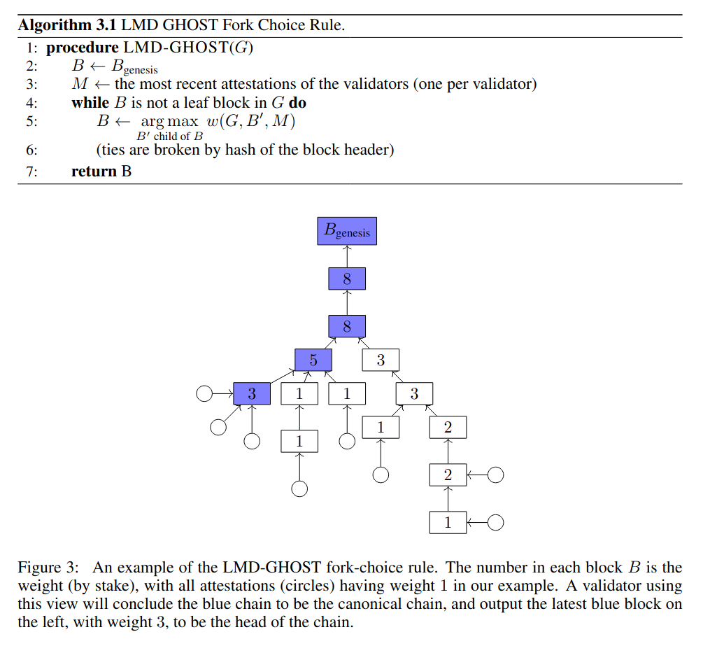
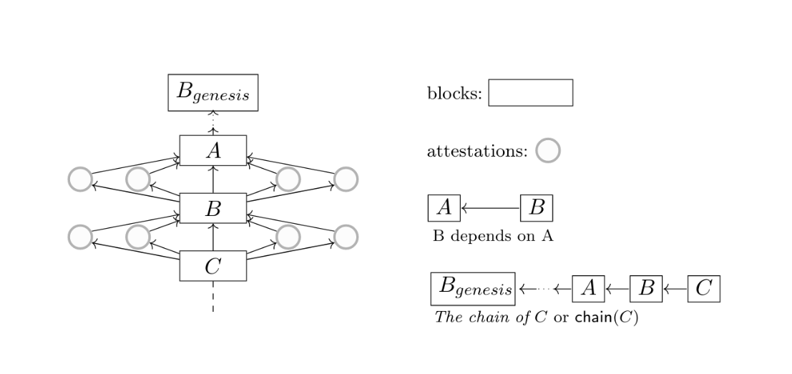

Ethereum will soon undergo one of the most significant upgrades to its architecture since its inception - the merge from [proof-of-work (PoW)](/developers/docs/consensus-mechanisms/pow/) to proof-of-stake. This will fundamentally change the way the network comes to consensus about the true state of the blockchain. The new protocol brings with it significant benefits in terms of decentralisation, sustainability, energy consumption, efficiency and economics. This transition has been a core part of the Ethereum roadmap since its inception, but making the transition without compromising the security or scaleabilty of the network has proven to be a major technical challenge. This page will introduce the concept of proof-of-stake and explain how it will be used to secure the Ethereum blockchain.

## What is Consensus {#consensus}

Ethereum is a distributed system with copies of the entire blockchain existing on thousands of computers (nodes) simultaneously. In order for Ethereum to exist as a singleton ["state-machine"](https://www.freecodecamp.org/news/state-machines-basics-of-computer-science-d42855debc66/) these nodes must agree that the network exists in a particular definitive state. Ethereum's state comprises the "world state" that describes everything relating to the accounts, balances, transactions and information existing on the network, and the "machine state" that describes the properties of the state machine itself (gas available, program counter, memory contents, stack contents, etc). For more on state, see the [Ethereum yellow paper](https://ethereum.github.io/yellowpaper/paper.pdf). Ethereum's state updates after each block as transactions are executed. As blocks are added to the blockchain, a definitive history of the state emerges.

The way the nodes come to agreement about which state is truthful is known as the consensus mechanism. The PoW consensus mechanism currently used by Ethereum trusts the version of the blockchain that has had the most work done on it (usually the "longest chain"). This work comes from miners who solve computational puzzles, giving them the right to submit a block. The requirement that the miner has expended energy to do this work is a security mechanism against spam or fraudulent blocks being submitted to the blockchain. The crucial concept is that the miner demonstrably has "skin in the game", i.e. they have a strong economic disincentive to defraud the network. Fundamentally, a consensus mechanism is an application of game theory and economics that ensures only honest state-changes can occur on a network.

To better understand consensus, we recommend you first read up on [consensus mechanisms](/developers/docs/consensus-mechanisms/).

## What is proof-of-stake (PoS)? {#what-is-pos}

Proof of stake (PoS) is another mechanism for securing the blockchain. The economic incentive to propose valid, truthful blocks to the blockchain comes not from investment in mining hardware and expended energy as in PoW, but from staked crypto. Miners do not exist in PoS networks. Instead, node operators that wish to add blocks to the blockchain are called validators. On Ethereum, these validators submit ETH to the network to make themselves eligible to propose blocks. Good behaviour is rewarded with ETH payments. Bad behaviour results in staked ETH being destroyed and potentially exclusion of a validator from the network, producing a strong economic incentive to validate truthfully.

## Benefits of PoS {#benefits-of-PoS}

### Decentralisation

PoW requires significant investment in mining hardware and electricity to power that hardware. While GPU-based PoW is quite decentralised because GPUs are relatively easily available and straightforward to use, as the value of the mined asset increases there is a strong incentive to engage in a hardware arms-race, requiring continuous investment in increasingly expensive, hard-to-maintain and costly-to-run hardware in order to retain reasonable odds of successfully mining blocks. Eventually this [promotes centralization](https://blog.ethereum.org/2014/06/19/mining/) because fewer individuals can afford and manage suitable mining rig. With PoS, on the other hand, there is only a one-off capital investment that is equal across the nodes. Anyone with 32 ETH can become a validator and earn validator rewards. While this prices out many ETH holders, there are hundreds of thousands of wallets owning more than 32 ETH that could choose to become validators. The operating costs are negligible under PoS and it is much easier to validate anonymously as it can be achieved on modest laptops, even over a VPN. For these reasons, PoS promotes decentralization of the network.

### Scalability

PoS alone does not improve Ethereum's scalabilty, but it does enable sharding without compromising security. Sharding is the partitioning of the blockchain into multiple smaller chains that can all process blocks, introducing a degree of parallelization to the network. Ethereum will divide into 64 shards, giving a minimum of 64x increase in transaction speed compared to the PoW chain. Achieving this sharding is possible on a PoW chain, but only by sacrificing the network security because each shard requires less hash power to attack. Under PoS, however, random selection of block-proposing validators minimises the chance that any single validator controls enough staked ETH to compromise a block.

### Security

The threat of a 51% attack exists under PoS as it does under PoW. However, PoS offers [more security for the same cost](https://vitalik.ca/general/2020/11/06/pos2020.html). Under PoW the cost of an attack on the network is the cost of obtaining and using sufficient computing power to outrun the other miners on the network. This cost is much higher for ASIC mining than GPU mining, but it is technically feasible for a persistent attacker with sufficient computing power to [permanently invalidate a PoW chain](https://vitalik.ca/general/2020/11/06/pos2020.html).

For PoS, the cost of mounting an attack is much greater since staked funds can be slashed and the buy-in cost for another attempt to attack the network is another 32 ETH per attacking node. An attacker would require 51% of all the assets staked on the network - a huge amount of value which they would put at risk of slashing. Holding that amount of ETH is in itself an incentive to act honestly, as dishonest actions on that scale would likely cause ETH to devalue. It is therefore extremely risky, likely not economically viable, for an attacker to mount a 51% attack on PoS Ethereum.

In the evet that an attacker or group if attackers did decide to take th eself-destructive action of mounting a 51% attcak on PoS Ethereum, there are several defensive actions that would be taken to restore harmony to the network. These defensive actions are specific to four distinct flavours of 51% attack:

    1. Finality reversion: validators attempt to replace an already-finalized block
    2. Invalid chain finalization: validators finalize an invalid block.
    3. Liveness denial: validators stop finalizing blocks.
    4. Censorship: validators block some or all transactions or blocks from entering the chain.

Finality reversion can be remediated by honest validators coordinating to favor the earliest finalized block. Fraud proofs and data availability proofs protect against finalizing invalid blocks. [Reducing the weights of non-participatory validators](https://arxiv.org/pdf/1710.09437.pdf) in block consensus protects against liveness denial, so that consensus favors more reliable validators. Censorship is the most difficult problem but it can be recovered quickly using a minority user-activated soft fork. This is an action taken by a miniroty of honest validators that believe they are being censored by an attacking majority. The minority effectively cease to add blocks to the majority chain, but instead fork off into a separate branch where honest validators dominate, slashing the attacker's staked funds in the process (this works because validators are penalised for inactivity) The new chain is then assumed to become the dominant chain as a rational community will want honest block validation. Random shuffling of validators across shards also decreases the likelihood that any particular shard can be overtaken by an attacker.

### Sustainability

Transitioning from PoW to PoS eliminates the need for brute-force PoW computation to secure the network. Since these computations comprise the vast majority of the energy expended on maintaining the network, eliminating them results in a drastic decrease in Ethereum's energy consumption. it has been estimated that the transition from PoW to PoS will reduce Ethereum's total energy consumption [by more than 99.9%.](https://blog.ethereum.org/2021/05/18/country-power-no-more/) This will make Ethereum the only truly low-carbon, fully decentralised, secure and scalable multi-purpose blockchain.

## Pros and cons {#pros-and-cons}

| Pros                                                                                                                                                                                                                                                                      | Cons                                                                                      |
| ------------------------------------------------------------------------------------------------------------------------------------------------------------------------------------------------------------------------------------------------------------------------- | ----------------------------------------------------------------------------------------- |
| Staking makes it easier for you to run a node. It doesn't require huge investments in hardware or energy, and if you don't have enough ETH to stake, you can join staking pools.                                                                                          | Proof-of-stake is still in its infancy, and less battle-tested, compared to proof-of-work |
| Staking is more decentralized. It allows for increased participation, and more nodes doesn't mean increased % returns, like with mining.                                                                                                                                  |                                                                                           |
| Staking allows for secure sharding. Shard chains allow Ethereum to create multiple blocks at the same time, increasing transaction throughput. Sharding the network in a proof-of-work system would simply lower the power needed to compromise a portion of the network. |                                                                                           |

## How does PoS work? {#how-does-pos-work}

Anyone with 32 ETH can become a network validator. The role of a validator is two-fold: 1) to collate and order transactions from the mempool into blocks and add them to the blockchain; 2) to "attest" to the validity of blocks proposed by other validators.

Once a validator has locked away ("staked") at least 32 ETH as collateral in the network they become eligible to undertake these two tasks. The validator is incentivized to propose and truthful blocks with both a "carrot" and a "stick". The carrot comes from ETH rewards distributed to validators that propose and attest truthful blocks. The stick comes from the risk of the staked ETH being decremented for bad behaviour.

Each block is proposed by a random choice of validator. Other validators are then randomly assigned to check the block is honest. This requires the validator to check that that state transition between a source and a target block can genuinely arise from the trasactions included in the blocks. The validator then signs a vote - called an "attestation" in favour of the block being added to the blockchain. A validator can only make a single attestation and only vote to add blocks to the head of the chain. If a sufficient number of validators attest to a block, it is added to the chain. However, scenarios can arise where multiple block compete for a position on the blockchain. In this case, a consensus mechanism is required to determine which fork is the right one.

### Consensus

Under PoS, consensus is reached using a protocol called "Gasper". This protocol is a successor to a previous protocol known as "casper" which itself developed as two separate projects: one was a gadget ([Casper-FFG: Friendly Finality Gadget](https://github.com/ethereum/research/blob/master/papers/casper-basics/casper_basics.pdf)) that sat atop an existing blockchain and provided PoS finality to every 50th block. The other was [Casper CBC ("Correct-by-Construction")](https://blockgeeks.com/guides/ethereum-casper/#Casper_CBC) which was a full consensus protocol that implemented an algorthm called LMD-GHOST (latest message driven greediest heaviest observed subtree) to select the truthful branch of the blockchain. Later, the GHOST algorithm was integrated with Casper-FFG to form Gasper, which was then implemented as the consensus mechanism on the [Beacon Chain](https://ethos.dev/beacon-chain/) and will likely be the consensus mechanism for the fully PoS Ethereum.

There are three main components to the consensus mechanism: 1) A fork-choice rule that determines which branch of the blockchain is truthful; 2) A concept of finality that determines when blocks become an immutable piece of the bockchain's history; 3) Slashing conditions that determine when and how a maliious actor's stake is destroyed.

In Gasper, the fork-choice rule is a modified version of LMD-GHOST that grows the blockchain on the branch with the most activity - in this context meaning the most votes - known as attestations - from validators. Each attestation adds "weight" to a block, and the branch with the greatest total weight is assumed to be the truthful one.

_Schematic of LMD-GHOST from the Gasper white paper_

Gasper picks out certain blocks from the chain and a subset ("committee") of validators to check them. One validator from the committee proposes block, then all the other validators attest to their expectation of the head of the chain using a slightly modified version of LMD-GHOST. The expected block and the proposed block should match. If a sufficient majority (2/3 of the balance of all active validators) attest then the block is "justified". Justified blocks become finalized when a certain number of justified blocks exist on top of them (the details will be explained when we introduce the concept of time and pacing in the later section on the beacon chain).

### Slashing and Penalties

Staked ETH acts as collateral ensuring honest behaviour of validators. There are two ways in validators can lose some of this staked ETH: slashing and penalties. Penalties are incurred for relatively minor infractions such as inactivity (validators being online but failing to vote on blocks) and various vote-casting errors. The magnitude of the penalty varies but often equates to the validator missing out on the reward they would otherwise have received for attesting a block. Penalties are effectively incurred for laziness.

Slashing is a more severe action that results in the forceful removal of a vaidator from the network and an associated loss of their staked ETH. There are [three ways](https://consensys.net/blog/codefi/rewards-and-penalties-on-ethereum-20-phase-0/) a validator can be slashed, all of which amount to the dishonest proposal or attestation of blocks:

1. By proposing and signing two different blocks for the same slot
2. By attesting to a block that "surrounds" another one (effectively changing history)
3. By "double voting" by attesting to two candidates for the same block

If these actions are detected, the validator is slashed. This means they are removed from the network 36 days after the action is detected. Over this 36 day period there is a gradual bleeding of their staked ETH in the form of a penalty applied at each epoch. This is also puntuated by several additional slashing events including a fixed immediate penalty issued immediately after the malicious action was detected and a one-time penalty incurred on Day 18. The magnitude of these slashing penalties can vary, and any remaining ETH can be withdrawn by the slashed validator on their exist from the network on Day 36. The slashed validator is not allowed to return to the network.

## The Beacon Chain {#the-beacon-chain}

The beacon chain is a PoS chain currently running alongside the main Ethereum PoW chain. It stores and manages the registry of validators and acts as the coordination layer, randomly shuffling and assigning roles to validators, finalizing checkpoints and coordinating votes on block inclusion. The Beacon chain has been running smoothly since November 2020. The launch of the Beacon chain delivered not only the chain itself but also the consensus algorithm (Gasper) and functional validator nodes with staked ETH. At the time of writing (September 2021) there is almost [750 million ETH staked on the Beacon chain, across more than 235,000 validator nodes](https://beaconscan.com/statistics).

However, the Beacon chain is destined to be both the [brains and the scaffolding](https://notes.ethereum.org/@djrtwo/Bkn3zpwxB?type=view) for the sharded PoS Ethereum 2.0, continuously scanning the blockchain, rewarding and penalising validators, slashing ETH from attackers and finalizing the definitive history of the network. The beacon chain will provide the "beating heartbeat" of Ethereum 2.0 because it sets the rhythm for the system's consensus mechanism. This rhythm is organized into two units of time: slots and epochs. Slots are opportunities for bocks to be added to the beacon chain and they occur once every 12 seconds. Unlike block time, slots can go unfilled, but when the system is running optimally, blocks are added in every available slot. Epochs are units of 32 slots. Slots and epochs set the pace of the blockchain. In its ultimate form, Ethereum 2.0 will be scaled horizontally by partitioning the blockchain into 64 "shards", each validated by a randomly selected subset of nodes.

The Beacon chain will synchronize activity across all 64 shards according to the pace of slots and epochs. Every 12 seconds, with sufficient attestation, a block can be added to each shard and to the Beacon chain. This works by having 64 "crosslinks" in each block on the Beacon chain. These crosslinks are references to shard blocks and they enable the Beacon chain to keep track of the head of each shard. A block-proposer is therefore really a validator that can generate a crosslink between a shard block and the Beacon chain. Finality of each shard block is achieved when the block containing its crosslink is finalised on the Beacon chain.

_Schematic from the Gasper white paper showing the ideal scenario where a valid block is added to the chain in each 12 second slot, with all validators attesting. This will result in a crosslink being added to the latest block on the Beacon chain for this shard block._

The Beacon will therefore coordinate and synchronize all activity across the 64 blockchain shards. However, this vision has not yet been implemented. At the time of writing, the Beacon chain cannot execute byte code because it does not have a virtual machine equivalent to Ethereum 1's [EVM](/developers/docs/evm). It was long intended that execution would be the final phase of development for Ethereum 2 because scalabilty through sharding was considered a prerequisite. However, the emergence of effective layer-2 scaling solutions has led to a reorganisation of the roadmap, and an executable Beacon chain is now a near-term goal for Ethereum 2 developers that also hastens the merge from PoW to PoS.

## The merge {the-merge}

The [merge](/eth2/merge/) is the name given to the moment when Ethereum transitions fully from PoW to PoS by merging the full state of the Ethereum 1 chain into a shard on Ethereum 2. Precisely how this should be achieved has been the topic of much debate, with a previously simple roadmap built of three phases (0: beacon chain; 1: sharding; 2: execution) being replaced with a more web-like plan that moves the transition to full-PoS forwards in time. In the original roadmap, individual shards were responsible for ordering and executing data, effectively sharding EVM computation as well as data. However, the new path will preserve the current EVM and integrate it directly into the existing Beacon chain - creating an executable Beacon chain - allowing mining to be turned off much earlier. Scalabilty comes primarily from [rollups](/glossary/#rollups) which only interact with the main chain enough to inherit its security, with sharding of data coming later. The rapid development of rollups could provide the scalability Ethereum needs in advance of sharded Ethereum 2.0 being delivered, removing a significant technical barrier to the merge.

_Vitalik Buterin's proposed rollup-centric roadmap_

The roadmap is complex and major technical challenges remain, but a successful merge in the near future has never been more likely. In the words of [Ben Edginton](https://www.theblockcrypto.com/post/90818/ethereum-2-eth2-whats-next-2021):

"Can we weave all these threads into a coherent tapestry? I believe that if any community can make this work, it’s the Ethereum community."

## Further Reading {#further-reading}

- [What is Proof of Stake](https://consensys.net/blog/blockchain-explained/what-is-proof-of-stake/) _ConsenSys_
- [The Beacon Chain Ethereum 2.0 explainer you need to read first](https://ethos.dev/beacon-chain/) _Ethos.dev_
- [The latest research and proposals relating to ETH 2](https://ethresear.ch/c/the-merge/38)
- [Outline of Eth2 roadmap](https://www.gemini.com/cryptopedia/ethereum-2-0-blockchain-roadmap-proof-of-stake-pos#section-ethereum-2-0-building-a-more-secure-user-friendly-and-scalable-blockchain)
- [Gasper white paper](https://arxiv.org/pdf/2003.03052.pdf)
- [Beacon chain primer](https://consensys.net/blog/news/the-ethereum-2-0-beacon-chain-explained/)
- [Vitalik on "Why Proof of Stake"](https://vitalik.ca/general/2020/11/06/pos2020.html)
- [Vitalik on "PoS FAQ"](https://vitalik.ca/general/2017/12/31/pos_faq.html#what-would-the-equivalent-of-a-51%25-attack-against-casper-look-like)
- [ETH 2 rewards and penalties](https://consensys.net/blog/codefi/rewards-and-penalties-on-ethereum-20-phase-0/)

## Related Topics {#related-topics}

- [Proof of work](/developers/docs/consensus-mechanisms/pow/)
