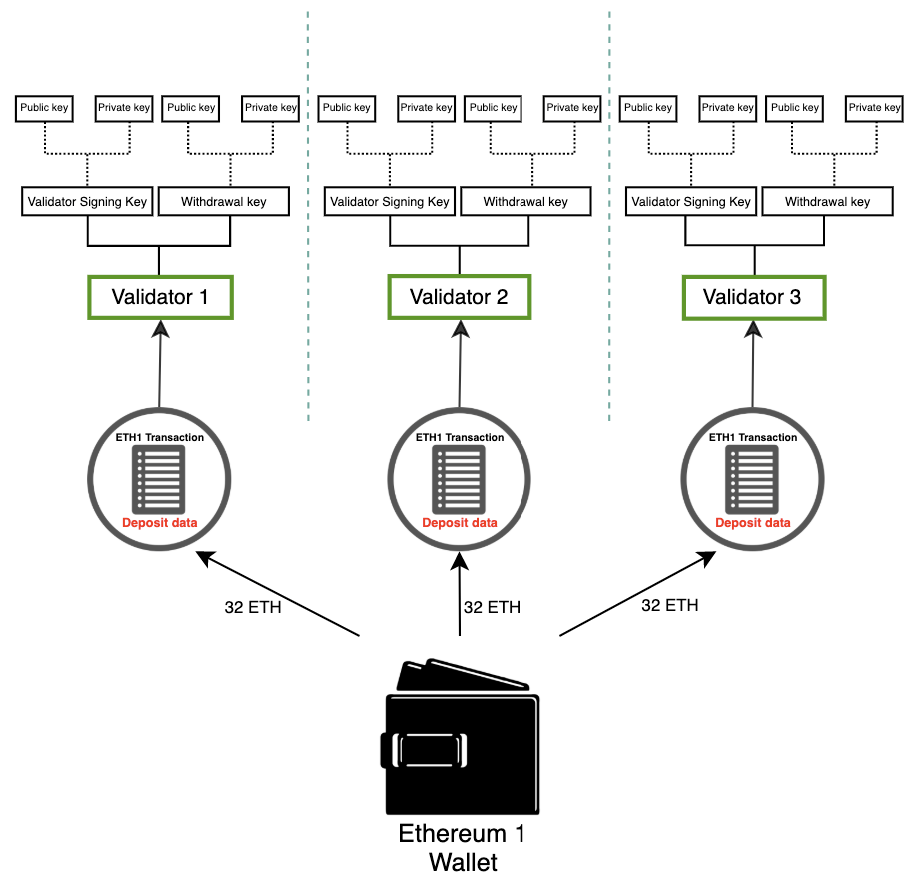

Ethereum secures user assets using public-private key cryptography. The public key is used as the basis for an Ethereum address—that is, it is visible to the general public and used as a unique identifier. The private (or 'secret') key should only ever be accessible to an account owner. The private key is used to 'sign' transactions and data so that cryptography can prove that the holder approves some action of a specific private key.

Ethereum's keys are generated using [elliptic-curve cryptography](https://en.wikipedia.org/wiki/Elliptic-curve_cryptography).

However, when Ethereum switched from [proof-of-work](/developers/docs/consensus-mechanisms/pow) to [proof-of-stake](/developers/docs/consensus-mechanisms/pos) a new type of key was added to Ethereum. The original keys still work exactly the same as before—there were no changes to the elliptic-curve-based keys securing accounts. However, users needed a new type of key for participating in proof-of-stake by staking ETH and running validators. This need arose from scalability challenges associated with many messages passing between large numbers of validators that required a cryptographic method that could easily be aggregated to reduce the amount of communication required for the network to come to consensus.

This new type of key uses the [Boneh-Lyn-Shacham (BLS) signature scheme](https://wikipedia.org/wiki/BLS_digital_signature). BLS enables a very efficient aggregation of signatures but also allows reverse engineering of aggregated individual validator keys and is ideal for managing actions between validators.

## The two types of validator keys {#two-types-of-keys}

Before the switch to proof-of-stake, Ethereum users only had a single elliptic-curve-based private key to access their funds. With the introduction of proof-of-stake, users that wished to be solo stakers also required a **validator key** and a **withdrawal key**.

### The validator key {#validator-key}

The validator signing key consists of two elements:

- Validator **private** key
- Validator **public** key

The purpose of the validator private key is to sign on-chain operations such as block proposals and attestations. Because of this, these keys must be held in a hot wallet.

This flexibility has the advantage of moving validator signing keys very quickly from one device to another, however, if they have gotten lost or stolen, a thief may be able to **act maliciously** in a few ways:

- Get the validator slashed by:
  - Being a proposer and signing two different beacon blocks for the same slot
  - Being an attester and signing an attestation that "surrounds" another one
  - Being an attester and signing two different attestations having the same target
- Force a voluntary exit, which stops the validator from staking, and grants access to its ETH balance to the withdrawal key owner

The **validator public key** is included in the transaction data when a user deposits ETH to the staking deposit contract. This is known as the _deposit data_ and it allows Ethereum to identify the validator.

### The withdrawal key {#withdrawal-key}

The withdrawal key will be required to move the validator balance after this is enabled in the upcoming Shanghai upgrade. Just like the validator keys, the withdrawal keys also consist of two components:

- Withdrawal **private** key
- Withdrawal **public** key

Losing this key means losing access to the validator balance. However, the validator can still sign attestations and blocks since these actions require the validator's private key, but there is little to no incentive if the withdrawal keys are lost.

Separating the validator keys from the Ethereum account keys enables multiple validators to be run by a single user.



## Deriving keys from a seed phrase {#deriving-keys-from-seed}

If every 32 ETH staked required a new set of 2 completely independent keys, key management would quickly become unwieldy, especially for users running multiple validators. Instead, multiple validator keys can be derived from a single common secret and storing that single secret allows access to multiple validator keys.

[Mnemonics](https://en.bitcoinwiki.org/wiki/Mnemonic_phrase) and paths are prominent features that users often encounter when [they access](https://ethereum.stackexchange.com/questions/19055/what-is-the-difference-between-m-44-60-0-0-and-m-44-60-0) their wallets. The mnemonic is a sequence of words that act as an initial seed for a private key. When combined with additional data, the mnemonic generates a hash known as the 'master key'. This can be thought of as the root of a tree. Branches from this root can then be derived using a hierarchical path so that child nodes can exist as combinations of their parent node's hash and their index in the tree. Read about [BIP-32](https://github.com/bitcoin/bips/blob/master/bip-0032.mediawiki) and [BIP-19](https://github.com/bitcoin/bips/blob/master/bip-0039.mediawiki) standards for mnemonic-based key generation.

These paths have the following structure, which will be familiar to users who have interacted with hardware wallets:

```
m/44'/60'/0'/0`
```

The slashes in this path separate components of the private key as follows:

```
master_key / purpose / coin_type / account / change / address_index
```

This logic enables users to attach as many validators as possible to a single **mnemonic phrase** because the tree root can be common, and differentiation can happen at the branches. The user can **derive any number of keys** from the mnemonic phrase.

```
      [m / 0]
     /
    /
[m] - [m / 1]
    \
     \
      [m / 2]
```

Each branch is separated by a `/` so `m/2` means start with the master key and follow branch 2. In the schematic below a single mnemonic phrase is used to store three withdrawal keys, each with two associated validators.


## Further reading {#further-reading}

- [Ethereum Foundation blog post by Carl Beekhuizen](https://blog.ethereum.org/2020/05/21/keys/)
- [EIP-2333 BLS12-381 key generation](https://eips.ethereum.org/EIPS/eip-2333)
