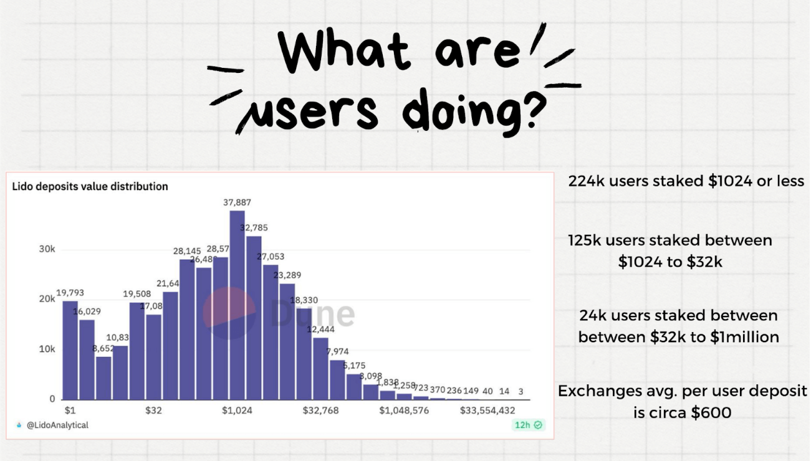

In the dynamic world of decentralized finance (DeFi), Liquid Staking Derivatives (LSDs) have carved out a niche, promising both liquidity and participation in network security. Newer LSD projects should focus their attention more on user experience in order to succeed.

## The Staking Pool Challenge  {#the-staking-pool-challenge}
Newer staking pools often find themselves in a tight spot when competing against established players in the market. These larger players command substantial liquidity, making it **challenging for new entrants** to attract users and offer competitive yields.

A few major players have established a stronghold in the LST (Liquid Staking Tokens) market. This dominance poses a significant barrier for newer pools trying to carve out their niche. In an attempt to differentiate themselves, many new pools are turning to intricate staking setups, but this might not be a good approach. 

**Is your attention being misdirected around your LSD strategy when there are other potential unique selling points to consider?**

<iframe width="560" height="315" src="https://www.youtube.com/embed/1xw3CL_YxuY?si=InGDNhRcK1PcyQWC" title="YouTube video player" frameborder="0" allow="accelerometer; autoplay; clipboard-write; encrypted-media; gyroscope; picture-in-picture; web-share" referrerpolicy="strict-origin-when-cross-origin" allowfullscreen></iframe>

## Understanding User Behavior  {#understanding-user-behavior}

Surprisingly, **65% of users do nothing with their LST** (October 2023). This finding highlights a potential gap in user interest. While projects discuss complex Liquid Staking Strategies, even the most simple ones are often **not attractive to users**.

The conventional one-size-fits-all communication approach fails to recognize the diverse needs and contexts of individual users. For instance:

- 224k users staked $1024 or less
- 125k users staked between $1024 and $32k
- 24k users staked between $32k to $1 million
- Exchange users average around $600 

A user with 1 ETH and 100 ETH has a **different risk profile/strategy** they are thinking about. **This creates an opportunity to offer a tailored and targeted product to the unique needs of specific user segment**.

## The Importance of UX  {#importance-of-ux}
The disparity in how investors understand and use Liquid staking points to a need for better UX design. The concept of rebasing (1 LSD = 1 ETH) versus reward-bearing LSDs (1 LSD = ? ETH) can be confusing. Issues like full deposit queues further complicate the user's journey. 

A well-designed UX can demystify these concepts and make the investment process more intuitive and accessible.

**Where are your users? How can you get in front of them? How can you understand their desires?**
Consider Coinbase's trajectory: starting without a liquid staking option, it has grown to one of the premier staking pools by focusing on user accessibility and convenience, despite its higher fees.

## User Research  {#user-research}

Most projects should ask these questions:

- Do your users value your LST strategies?
- How are users utilizing their LST?
- What could prompt them to switch from a competitor?
- Which aspects do users prioritize?
- Who are the target segments for your staking pool?
- Which new communication avenues could you explore to reach untapped user groups?

As the DeFi landscape evolves, the imperative for LSD projects to cultivate clear, straightforward, and user-centric platforms becomes increasingly apparent. Tuning into and addressing user behaviors and preferences is critical to developing successful, enduring staking pools amidst DeFi's competitive ecosystem.
