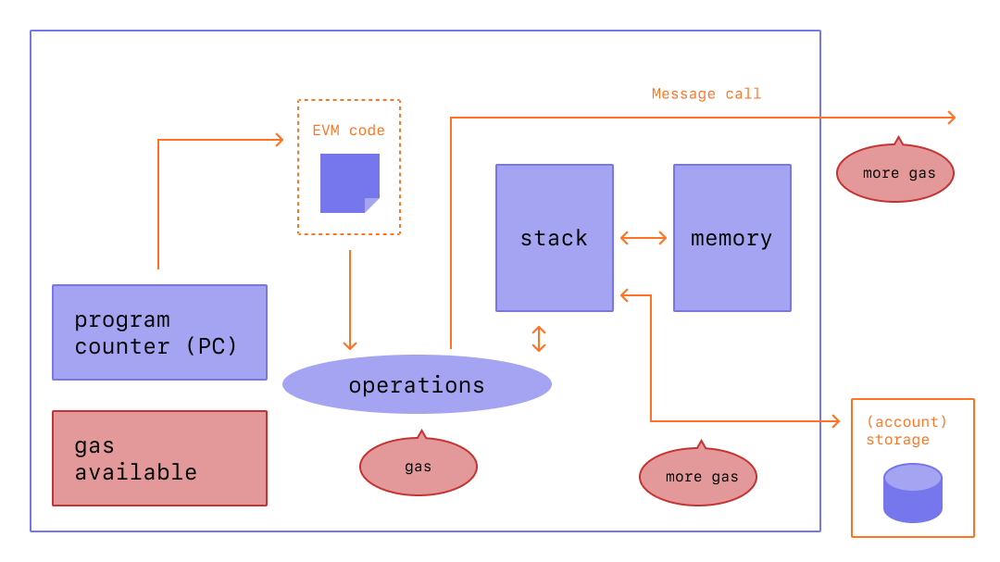

Gas is essential to the Ethereum network. It is the fuel that allows it to operate, in the same way that a car needs gasoline to run.

## Prerequisites {#prerequisites}

To better understand this page, we recommend you first read up on [transactions](/developers/docs/transactions/) and the [EVM](/developers/docs/evm/).

## What is gas? {#what-is-gas}

Gas refers to the unit that measures the amount of computational effort required to execute specific operations on the Ethereum network.

Since each Ethereum transaction requires computational resources to execute, each transaction requires a fee. Gas refers to the fee required to conduct a transaction on Ethereum successfully.

_Diagram adapted from [Ethereum EVM illustrated](https://takenobu-hs.github.io/downloads/ethereum_evm_illustrated.pdf)_

Gas fees are paid in Ethereum's native currency, ether (ETH). Gas prices are denoted in gwei, which itself is a denomination of ETH - each gwei is equal to 0.000000001 ETH (10-9 ETH). For example, instead of saying that your gas costs 0.000000001 ether, you can say your gas costs 1 gwei. The word 'gwei' itself means 'giga-wei', and it is equal to 1,000,000,000 wei. Wei itself (named after [Wei Dai](https://wikipedia.org/wiki/Wei_Dai), creator of [b-money](https://www.investopedia.com/terms/b/bmoney.asp)) is the smallest unit of ETH.

## Prior to the London upgrade {#pre-london}

The way transaction fees on the Ethereum network were calculated changed with [the London Upgrade](/history/#london) of August 2021. Here is a recap of how things used to work:

Let's say Alice had to pay Bob 1 ETH.
In the transaction, the gas limit is 21,000 units, and the gas price is 200 gwei.

Total fee would have been: `Gas units (limit) * Gas price per unit`
i.e `21,000 * 200 = 4,200,000 gwei` or 0.0042 ETH

## After the London upgrade {#post-london}

Let's say Jordan has to pay Taylor 1 ETH. In the transaction, the gas limit is 21,000 units and the base fee is 10 gwei. Jordan includes a tip of 2 gwei.

The total fee would now be: `units of gas used * (base fee + priority fee)` where the `base fee` is a value set by the protocol and the `priority fee` is a value set by the user as a tip to the validator.

i.e `21,000 * (10 + 2) = 252,000 gwei` or 0.000252 ETH.

When Jordan sends the money, 1.000252 ETH will be deducted from Jordan's account.
Taylor will be credited 1.0000 ETH.
Validator receives the tip of 0.000042 ETH.
Base fee of 0.00021 ETH is burned.

Additionally, Jordan can also set a max fee (`maxFeePerGas`) for the transaction. The difference between the max fee and the actual fee is refunded to Jordan, i.e. `refund = max fee - (base fee + priority fee)`. Jordan can set a maximum amount to pay for the transaction to execute and not worry about overpaying "beyond" the base fee when the transaction is executed.

### Block size {#block-size}

Before the London Upgrade, Ethereum had fixed-sized blocks. In times of high network demand, these blocks operated at total capacity. As a result, users often had to wait for high demand to reduce to get included in a block, which led to a poor user experience.

The London Upgrade introduced variable-size blocks to Ethereum. Each block has a target size of 15 million gas, but the size of blocks will increase or decrease in accordance with network demand, up until the block limit of 30 million gas (2x the target block size). The protocol achieves an equilibrium block size of 15 million on average through the process of _tâtonnement_. This means if the block size is greater than the target block size, the protocol will increase the base fee for the following block. Similarly, the protocol will decrease the base fee if the block size is less than the target block size. The amount by which the base fee is adjusted is proportional to how far the current block size is from the target. [More on blocks](/developers/docs/blocks/).

### Base fee {#base-fee}

Every block has a base fee which acts as a reserve price. To be eligible for inclusion in a block the offered price per gas must at least equal the base fee. The base fee is calculated independently of the current block and is instead determined by the blocks before it - making transaction fees more predictable for users. When the block is mined this base fee is "burned", removing it from circulation.

The base fee is calculated by a formula that compares the size of the previous block (the amount of gas used for all the transactions) with the target size. The base fee will increase by a maximum of 12.5% per block if the target block size is exceeded. This exponential growth makes it economically non-viable for block size to remain high indefinitely.

| Block Number | Included Gas | Fee Increase | Current Base Fee |
| ------------ | -----------: | -----------: | ---------------: |
| 1            |          15M |           0% |         100 gwei |
| 2            |          30M |           0% |         100 gwei |
| 3            |          30M |        12.5% |       112.5 gwei |
| 4            |          30M |        12.5% |       126.6 gwei |
| 5            |          30M |        12.5% |       142.4 gwei |
| 6            |          30M |        12.5% |       160.2 gwei |
| 7            |          30M |        12.5% |       180.2 gwei |
| 8            |          30M |        12.5% |       202.7 gwei |

Relative to the pre-London gas auction market, this transaction-fee-mechanism change causes fee prediction to be more reliable. Following the table above - to create a transaction on block number 9, a wallet will let the user know with certainty that the **maximum base fee** to be added to the next block is `current base fee * 112.5%` or `202.7 gwei * 112.5% = 228.1 gwei`.

It's also important to note it is unlikely we will see extended spikes of full blocks because of the speed at which the base fee increases proceeding a full block.

| Block Number | Included Gas | Fee Increase | Current Base Fee |
| ------------ | -----------: | -----------: | ---------------: |
| 30           |          30M |        12.5% |      2705.6 gwei |
| ...          |          ... |        12.5% |              ... |
| 50           |          30M |        12.5% |     28531.3 gwei |
| ...          |          ... |        12.5% |              ... |
| 100          |          30M |        12.5% |  10302608.6 gwei |

### Priority fee (tips) {#priority-fee}

Before the London Upgrade, miners would receive the total gas fee from any transaction included in a block.

With the new base fee getting burned, the London Upgrade introduced a priority fee (tip) to incentivize miners to include a transaction in the block. Without tips, miners would find it economically viable to mine empty blocks, as they would receive the same block reward. Under normal conditions, a small tip provides miners a minimal incentive to include a transaction. For transactions that need to get preferentially executed ahead of other transactions in the same block, a higher tip will be necessary to attempt to outbid competing transactions.

### Max fee {#maxfee}

To execute a transaction on the network, users can specify a maximum limit they are willing to pay for their transaction to be executed. This optional parameter is known as the `maxFeePerGas`. For a transaction to be executed, the max fee must exceed the sum of the base fee and the tip. The transaction sender is refunded the difference between the max fee and the sum of the base fee and tip.

### Calculating fees {#calculating-fees}

One of the main benefits of the London upgrade is improving the user's experience when setting transaction fees. For wallets that support the upgrade, instead of explicitly stating how much you are willing to pay to get your transaction through, wallet providers will automatically set a recommended transaction fee (base fee + recommended priority fee) to reduce the amount of complexity burdened onto their users.

## EIP-1559 {#eip-1559}

The implementation of [EIP-1559](https://github.com/ethereum/EIPs/blob/master/EIPS/eip-1559.md) in the London Upgrade made the transaction fee mechanism more complex than the previous gas price auction, but it has the advantage of making gas fees more predictable, resulting in a more efficient transaction fee market. Users can submit transactions with a `maxFeePerGas` corresponding to how much they are willing to pay for the transaction to be executing, knowing that they will not pay more than the market price for gas (`baseFeePerGas`), and get any extra, minus their tip, refunded.

This video explains EIP-1559 and the benefits it brings:

<YouTube id="MGemhK9t44Q" />

If you are interested, you can read the exact
[EIP-1559 specifications](https://github.com/ethereum/EIPs/blob/master/EIPS/eip-1559.md).

Continue down the rabbit hole with these [EIP-1559 Resources](https://hackmd.io/@timbeiko/1559-resources).

## Why do gas fees exist? {#why-do-gas-fees-exist}

In short, gas fees help keep the Ethereum network secure. By requiring a fee for every computation executed on the network, we prevent bad actors from spamming the network. In order to avoid accidental or hostile infinite loops or other computational wastage in code, each transaction is required to set a limit to how many computational steps of code execution it can use. The fundamental unit of computation is "gas".

Although a transaction includes a limit, any gas not used in a transaction is returned to the user (i.e. `max fee - (base fee + tip)` is returned).

_Diagram adapted from [Ethereum EVM illustrated](https://takenobu-hs.github.io/downloads/ethereum_evm_illustrated.pdf)_

## What is gas limit? {#what-is-gas-limit}

Gas limit refers to the maximum amount of gas you are willing to consume on a transaction. More complicated transactions involving [smart contracts](/developers/docs/smart-contracts/) require more computational work, so they require a higher gas limit than a simple payment. A standard ETH transfer requires a gas limit of 21,000 units of gas.

For example, if you put a gas limit of 50,000 for a simple ETH transfer, the EVM would consume 21,000, and you would get back the remaining 29,000. However, if you specify too little gas, for example, a gas limit of 20,000 for a simple ETH transfer, the EVM will consume your 20,000 gas units attempting to fulfill the transaction, but it will not complete. The EVM then reverts any changes, but since the miner has already done 20k gas units worth of work, that gas is consumed.

## Why can gas fees get so high? {#why-can-gas-fees-get-so-high}

High gas fees are due to the popularity of Ethereum. Performing any operation on Ethereum requires consuming gas, and gas space is limited per block. Fees include calculations, storing or manipulating data, or transferring tokens, consuming different amounts of "gas" units. As dapp functionality grows more complex, the number of operations a smart contract performs also grows, meaning each transaction takes up more space of a limited size block. If there's too much demand, users must offer a higher tip amount to try and outbid other users' transactions. A higher tip can make it more likely that your transaction will get into the next block.

Gas price alone does not actually determine how much we have to pay for a particular transaction. To calculate the transaction fee, we have to multiply the gas used by the base gas fee, which is measured in gwei.

## Initiatives to reduce gas costs {#initiatives-to-reduce-gas-costs}

The Ethereum [scalability upgrades](/upgrades/) should ultimately address some of the gas fee issues, which will, in turn, enable the platform to process thousands of transactions per second and scale globally.

Layer 2 scaling is a primary initiative to greatly improve gas costs, user experience and scalability. [More on layer 2 scaling](/developers/docs/scaling/#layer-2-scaling).

## Strategies for you to reduce gas costs {#strategies-for-you-to-reduce-gas-costs}

If you are looking to reduce gas costs for your ETH, you can set a tip to indicate the priority level of your transaction. Miners will 'work on' and execute transactions that offer a higher tip per gas, as they get to keep the tips that you pay and will be less inclined to execute transactions with lower tips set.

If you want to monitor gas prices, so you can send your ETH for less, you can use many different tools such as:

- [Etherscan](https://etherscan.io/gastracker) _Transaction gas price estimator_
- [Blocknative ETH Gas Estimator](https://chrome.google.com/webstore/detail/blocknative-eth-gas-estim/ablbagjepecncofimgjmdpnhnfjiecfm) _Gas estimating Chrome extension supporting both Type 0 legacy transactions and Type 2 EIP-1559 transactions._

- [ETH Gas Station](https://ethgasstation.info/) _Consumer oriented metrics for the Ethereum gas market_
- [Cryptoneur Gas Fees Calculator](https://www.cryptoneur.xyz/gas-fees-calculator) _Calculate gas fees in your local currency for different transaction types on Mainnet, Arbitrum, and Polygon._

## Related tools {#related-tools}

- [Blocknative's Gas Platform](https://www.blocknative.com/gas) _Gas estimation API powered by Blocknative's global mempool data platform_

## Further reading {#further-reading}

- [Ethereum Gas Explained](https://defiprime.com/gas)
- [Reducing the gas consumption of your Smart Contracts](https://medium.com/coinmonks/8-ways-of-reducing-the-gas-consumption-of-your-smart-contracts-9a506b339c0a)
- [Proof of Stake versus Proof of Work](https://blockgeeks.com/guides/proof-of-work-vs-proof-of-stake/)

## Related topics {#related-topics}

- [Mining](/developers/docs/consensus-mechanisms/pow/mining/)
