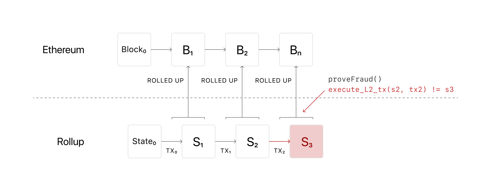

Layer 2 is a collective term for solutions designed to help scale your application by handling transactions off the main Ethereum chain (layer 1). Transaction speed suffers when the network is busy which can make the user experience poor for certain types of dapps. And as the network gets busier, gas prices increase as transaction senders aim to outbid each other. This can make using Ethereum very expensive.

## Prerequisites {#prerequisites}

You should have a good understanding of all the foundational topics. Implementing layer 2 solutions are advanced as the technology is less battle-tested.

## Why is layer 2 needed? {#why-is-layer-2-needed}

- Some use-cases, like blockchain games, make no sense with current transaction times
- It can be unnecessarily expensive to use blockchain applications
- Any updates to scalability should not be at the expense of decentralization of security – layer 2 builds on top of Ethereum.

## Types of Layer 2 solution {#types}

- [Rollups](#rollups)
  - [ZK rollups](#zk-rollups)
  - [Optimistic rollups](#optimistic-rollups)
- [State channels](#channels)
- [Plasma](#plasma)
- [Validium](#validium)
- [Sidechains](#sidechains)
- [Hybrid solutions](#hybrid-solutions)

Most layer 2 solutions are centered around a server or cluster of servers, each of which may be referred to as a node, validator, operator, sequencer, block producer, or similar term. Depending on the implementation, these layer 2 nodes may be run by the businesses or entities that use them, or by a 3rd party operator, or by a large group of individuals (similar to mainnet). Generally speaking, transactions are submitted to these layer 2 nodes instead of being submitted directly to layer 1 ([mainnet](/glossary/#mainnet)); the layer 2 instance then batches them into groups before anchoring them to layer 1, after which they are secured by layer 1 and cannot be altered. The details of how this is done vary significantly between different layer 2 technologies and implementations.

A specific Layer 2 instance may be open and shared by many applications, or may be deployed by one company and dedicated to supporting only their application.

## Rollups {#rollups}

Rollups are solutions that bundle or "roll up" sidechain transactions into a single transaction and generate a cryptographic proof, known as a SNARK (succinct non-interactive argument of knowledge). Only this proof is submitted to the main chain.

_Sidechains are Ethereum-compatible, independent blockchains._

In other words, rollups mean that all state and execution is handled in sidechains – signature verification, contract execution, etc. The main Ethereum chain (layer 1) only stores transaction data.

Rollup solutions require relayers who have staked a bond in the rollup contract. This incentivises them to relay rollups accurately.

**Useful for:**

- reducing fees for users
- open participation
- fast transaction throughput

There are two types of rollups with different security models:

- Zero knowledge: runs computation off-chain and submits a [**validity proof**](/glossary/#validity-proof) to the chain
- Optimistic: assumes transactions are valid by default and only runs computation, via a [**fraud proof**](/glossary/#fraud-proof), in the event of a challenge

### Zero knowledge rollups {#zk-rollups}

Zero knowledge rollups, also known as ZK-Rollups, bundle hundreds of transfers off-chain into a single transaction via a smart contract. From the data submitted, the smart contract can verify all of the transfers that are included. This is known as a validity proof.

With a ZK rollup, validating a block is quicker and cheaper because less data is included. You don't need all the transaction data to verify the transaction, just the proof.

The sidechain where ZK rollups happen can be optimised to reduce transaction size further. For instance, an account is represented by an index rather than an address, which reduces a transaction from 32 bytes to just 4 bytes. Transactions are also written to Ethereum as calldata, reducing gas.

#### Pros and cons {#zk-pros-and-cons}

| Pros                                                                                                               | Cons                                                                                                                                                                                                              |
| ------------------------------------------------------------------------------------------------------------------ | ----------------------------------------------------------------------------------------------------------------------------------------------------------------------------------------------------------------- |
| No delay as proofs are already considered valid when submitted to the main chain.                                  | Limited to simple transfers, not compatible with the EVM.                                                                                                                                                         |
| Less vulnerable to the economic attacks that [Optimistic rollups](#optimistic-pros-and-cons) can be vulnerable to. | Validity proofs are intense to compute – not worth it for applications with little on-chain activity.                                                                                                             |
|                                                                                                                    | Slower subjective [finality](/glossary/#finality) time (10-30 min to generate a ZK proof) (but faster to full finality because there is no dispute time delay like in [Optimistic rollups](#optimistic-rollups)). |

#### Use ZK rollups {#use-zk-rollups}

- [Loopring](https://loopring.org/#/)
- [Starkware](https://starkware.co/)
- [Matter Labs zkSync](https://matter-labs.io/)
- [Aztec 2.0](https://aztec.network/)

### Optimistic rollups {#optimistic-rollups}

Optimistic rollups use a side chain that sits in parallel to the main Ethereum chain. They can offer improvements in scalability because they don't do any computation by default. Instead, after a transaction they propose the new state to mainnet. Or "notarise" the transaction.

With Optimistic rollups transactions are written to the main Ethereum chain as calldata, optimising them further by reducing the gas cost.

As computation is the slow, expensive part of using Ethereum, Optimistic rollups can offer up to 10-100x improvements in scalability dependent on the transaction. This number will increase even more with the introduction of the Eth2 upgrade: [shard chains](/en/eth2/shard-chains). This is because there will be more data available in the event that a transaction is disputed.

#### Disputing transactions {#disputing-transactions}

Optimistic rollups don't actually compute the transaction, so there needs to be a mechanism in place to ensure transactions are legitimate and not fraudulent. This is where fraud proofs come in. If someone notices a fraudulent transaction, the rollup will execute a fraud-proof and run the transaction's computation, using the available state data. This means you may have longer wait times for transaction confirmation than a ZK-rollup, because it could be challenged.

The gas you need to run the computation of the fraud proof is even reimbursed. Ben Jones from Optimism describes the bonding system in place:

"_anyone who might be able to take an action that you would have to prove fraudulent to secure your funds requires that you post a bond. You basically take some ETH and lock it up and you say "Hey, I promise to tell the truth"... If I don't tell the truth and fraud is proven, this money will be slashed. Not only does some of this money get slashed but some of it will pay for the gas that people spent doing the fraud proof_"

So you get reimbursed for proving fraud.

#### Pros and cons {#optimistic-pros-and-cons}

| Pros                                                                                                             | Cons                                                                                                             |
| ---------------------------------------------------------------------------------------------------------------- | ---------------------------------------------------------------------------------------------------------------- |
| Anything you can do on Ethereum layer 1, you can do with Optimistic rollups as it's EVM and Solidity compatible. | Long wait times for on-chain transaction due to potential fraud challenges.                                      |
| All transaction data is stored on the layer 1 chain, meaning it's secure and decentralized.                      | Potentially vulnerable to attacks if the value in an Optimistic rollup exceeds the amount in an operator's bond. |

#### Use Optimistic rollups {#use-optimistic-rollups}

- [Optimism](https://optimism.io/)
- [Offchain Labs Arbitrum Rollup](https://offchainlabs.com/)
- [Fuel Network](https://fuel.sh/)

<!-- #### The Optimism virtual machine (OVM)

What makes Optimistic rollups particularly exciting is that the chain works the same as the main Ethereum chain because it's based on [the EVM](/en/developers/docs/evm/). It doesn't use Ethereum, it is Ethereum. This means if you want to use Optimistic rollups, it's just a matter of deploying it to the OVM. It looks, feels, and acts just like the Ethereum main chain–you write contracts in Solidity, and interact with the chain via the Web3 API.

The OVM also has a bunch of features that allow for a really seamless experience moving code from the EVM. In fact you can move Solidity contracts onto a cheaper and faster solution with just a few lines of code.

[Check out the OVM documentation](http://docs.optimism.io/) -->

## Channels {#channels}

Channels allow participants to transact `x` number of times off-chain while only submitting two transaction to the network on chain. This allows for extremely high transaction throughput

**Useful for**:

- lots of state updates
- when number of participants is known upfront
- when participants are always available

Participants must lock a portion of Ethereum's state, like an ETH deposit, into a multisig contract. A multisig contract is a type of contract that requires the signatures (and thus agreement) of multiple private keys to execute.

Locking the state in this way is the first transaction and opens up the channel. The participants can then transact quickly and freely off-chain. When the interaction is finished, a final on-chain transaction is submitted, unlocking the state.

### State channels {#state-channels}

State channel tic tac toe:

1. Create a multisig smart contract “Judge” on the Ethereum main-chain that understands the rules of tic-tac-toe, and can identify Alice and Bob as the two players in our game. This contract holds the 1ETH prize.

2. Then, Alice and Bob begin playing the game, opening the state channel. Each moves creates an off-chain transaction containing a “nonce”, which simply means that we can always tell later in what order the moves happened.

3. When there's a winner, they close the channel by submitting the final state (e.g. a list of transactions) to the Judge contract, paying only a single transaction fee. The Judge ensures that this “final state” is signed by both parties, and waits a period of time to ensure that no one can legitimately challenge the result, and then pays out the 1ETH award to Alice.

There are two types of channels right now:

- State channels – as described above
- Payment channels – Simplified state channels that only deal with payments. They allow off-chain transfers between two participants, as long as the net sum of their transfers does not exceed the deposited tokens.

#### Pros and cons {#channels-pros-and-cons}

| Pros                                                                            | Cons                                                                                                                                                |
| ------------------------------------------------------------------------------- | --------------------------------------------------------------------------------------------------------------------------------------------------- |
| Instant withdrawal/settling on mainnet (if both parties to a channel cooperate) | Time and cost to set up and settle a channel - not so good for occasional one-off transactions between arbitrary users.                             |
| Extremely high throughput is possible                                           | Need to periodically watch the network (liveness requirement) or delegate this responsibility to someone else to ensure the security of your funds. |
| Lowest cost per transaction - good for streaming micropayments                  | Have to lockup funds in open payment channels                                                                                                       |
|                                                                                 | Don't support open participation                                                                                                                    |

#### Use State channels {#use-state-channels}

- [Connext](https://connext.network/)
- [Raiden](https://raiden.network/)
- [Perun](https://perun.network/)
- [Statechannels.org](https://statechannels.org/)

## Plasma {#plasma}

A plasma chain is a separate blockchain that is anchored to the main Ethereum chain, and uses fraud proofs (like [Optimistic rollups](#optimistic-rollups)) to arbitrate disputes.

| Pros                                                                                                                  | Cons                                                                                                                                                                        |
| --------------------------------------------------------------------------------------------------------------------- | --------------------------------------------------------------------------------------------------------------------------------------------------------------------------- |
| High throughput, low cost per transaction.                                                                            | Does not support general computation. Only basic token transfers, swaps, and a few other transaction types are supported via predicate logic.                               |
| Good for transactions between arbitrary users (no overhead per user pair if both are established on the plasma chain) | Need to periodically watch the network (liveness requirement) or delegate this responsibility to someone else to ensure the security of your funds.                         |
|                                                                                                                       | Relies on one or more operators to store data and serve it upon request.                                                                                                    |
|                                                                                                                       | Withdrawals are delayed by several days to allow for challenges. For fungible assets this can be mitigated by liquidity providers, but there is an associated capital cost. |

### Use Plasma {#use-plasma}

- [OMG Network](https://omg.network/)
- [Matic Network](https://matic.network/)
- [Gluon](https://gluon.network/)
- [Gazelle](https://gzle.io/)
- [LeapDAO](https://ipfs.leapdao.org/)

## Validium {#validium}

Uses validity proofs like [ZK-rollups](#zk-rollups) but data is not stored on the main layer 1 Ethereum chain. This can lead to 10k transactions per second per validium chain and multiple chains can be run in parallel.

| Pros                                                                                                      | Cons                                                                                                                                     |
| --------------------------------------------------------------------------------------------------------- | ---------------------------------------------------------------------------------------------------------------------------------------- |
| No withdrawal delay (no latency to on-chain/cross-chain tx); consequent greater capital efficiency.       | Limited support for general computation/smart contracts; specialized languages required.                                                 |
| Not vulnerable to certain economic attacks faced by fraud-proof based systems in high-value applications. | High computational power required to generate ZK proofs; not cost effective for low throughput applications.                             |
|                                                                                                           | Slower subjective finality time (10-30 min to generate a ZK proof) (but faster to full finality because there is no dispute time delay). |

### Use Validium {#use-validium}

- [Starkware](https://starkware.co/)
- [Matter Labs zkPorter](https://matter-labs.io/)
- [Loopring](https://loopring.org/#/)

## Sidechains {#sidechains}

A sidechain is a separate blockchain which runs in parallel to mainnet and operates independently. It has its own consensus algorithm ([Proof of Authority](https://en.wikipedia.org/wiki/Proof_of_authority), [Delegated proof-of-stake](https://en.bitcoinwiki.org/wiki/DPoS), [Byzantine fault tolerance](https://decrypt.co/resources/byzantine-fault-tolerance-what-is-it-explained), and so on). It is connected to the main chain by a two-way bridge.

| Pros                                             | Cons                                                                                           |
| ------------------------------------------------ | ---------------------------------------------------------------------------------------------- |
| Established technology.                          | Less decentralized .                                                                           |
| Supports general computation, EVM compatibility. | Uses a separate consensus mechanism. Not secured by layer 1 (so technically it’s not layer 2). |
|                                                  | A quorum of sidechain validators can commit fraud.                                             |

### Use Sidechains {#use-sidechains}

- [Skale](https://skale.network/)
- [POA Network](https://www.poa.network/)

## Hybrid solutions {#hybrid-solutions}

Combine the best parts of multiple layer 2 technologies, and may offer configurable tradeoffs.

### Use Hybrid solutions {#use-hybrid-solutions}

- [Offchain Labs Arbitrum SCSC](https://offchainlabs.com/arbitrum.pdf)
- [Celer](https://www.celer.network/)

## Further reading {#further-reading}

- [Validium And The Layer 2 Two-By-Two — Issue No. 99](https://www.buildblockchain.tech/newsletter/issues/no-99-validium-and-the-layer-2-two-by-two)
- [Evaluating Ethereum layer 2 Scaling Solutions: A Comparison Framework](https://medium.com/matter-labs/evaluating-ethereum-layer 2-scaling-solutions-a-comparison-framework-b6b2f410f955)
- [Adding Hybrid PoS-Rollup Sidechain to Celer’s Coherent Layer-2 Platform on Ethereum](https://medium.com/celer-network/adding-hybrid-pos-rollup-sidechain-to-celers-coherent-layer-2-platform-d1d3067fe593)
- [Zero-Knowledge Blockchain Scalability](https://ethworks.io/assets/download/zero-knowledge-blockchain-scaling-ethworks.pdf)

**State channels**

- [EthHub on state channels](https://docs.ethhub.io/ethereum-roadmap/layer-2-scaling/state-channels/)
- [Making Sense of Ethereum’s Layer 2 Scaling Solutions: State Channels, Plasma, and Truebit](https://medium.com/l4-media/making-sense-of-ethereums-layer-2-scaling-solutions-state-channels-plasma-and-truebit-22cb40dcc2f4) _– Josh Stark, Feb 12 2018_
- [State Channels - an explanation](https://www.jeffcoleman.ca/state-channels/) _Nov 6, 2015 - Jeff Coleman_
- [Basics of State Channels](https://education.district0x.io/general-topics/understanding-ethereum/basics-state-channels/) _District0x_

**Payment channels**

- [EthHub on payment channels](https://docs.ethhub.io/ethereum-roadmap/layer-2-scaling/payment-channels/)

**ZK rollups**

- [EthHub on zk-rollups](https://docs.ethhub.io/ethereum-roadmap/layer-2-scaling/zk-rollups/)

**Optimistic rollups**

- [EthHub on optimistic rollups](https://docs.ethhub.io/ethereum-roadmap/layer-2-scaling/optimistic-rollups/)
- [OVM Deep Dive](https://medium.com/ethereum-optimism/ovm-deep-dive-a300d1085f52)

**Sidechains**

- [EthHub on sidechains](https://docs.ethhub.io/ethereum-roadmap/layer-2-scaling/sidechains/)
- [Scaling Ethereum Dapps through Sidechains](https://medium.com/loom-network/dappchains-scaling-ethereum-dapps-through-sidechains-f99e51fff447) _Feb 8, 2018 - Georgios Konstantopoulos_
