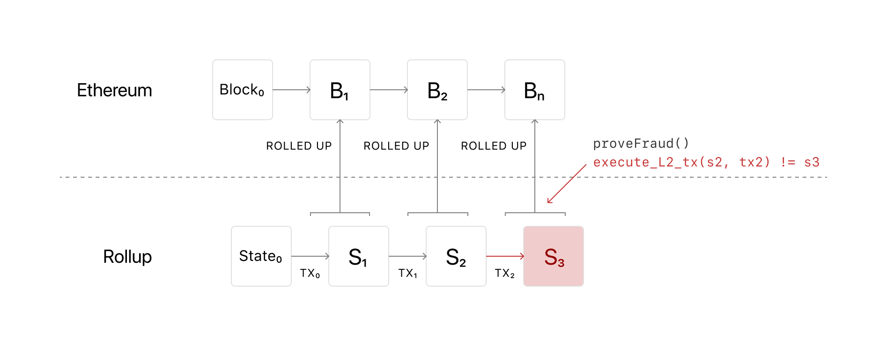

## Prerequisites {#prerequisites}

You should have a good understanding of all the foundational topics and a high-level understanding of [Ethereum scaling](/developers/docs/scaling/). Implementing scaling solutions such as rollups is an advanced topic as the technology is less battle-tested and continues to be researched and developed.

Looking for a more beginner-friendly resource? See our [introduction to layer 2](/layer-2/).

## Optimistic rollups {#optimistic-rollups}

Optimistic rollups sit in parallel to the main Ethereum chain on layer 2. They can offer improvements in scalability because they don't do any computation by default. Instead, after a transaction, they propose the new state to Mainnet or "notarise" the transaction.

With Optimistic rollups, transactions are written to the main Ethereum chain as `calldata`, optimising them further by reducing the gas cost.

As computation is the slow, expensive part of using Ethereum, Optimistic rollups can offer up to 10-100x improvements in scalability dependent on the transaction. This number will increase even more with the introduction of [shard chains](/upgrades/shard-chains) as more data will be available if a transaction is disputed.

### Disputing transactions {#disputing-transactions}

Optimistic rollups don't compute the transaction, so there needs to be a mechanism to ensure transactions are legitimate and not fraudulent. This is where fraud proofs come in. If someone notices a fraudulent transaction, the rollup will execute a fraud-proof and run the transaction's computation, using the available state data. This means you may have longer wait times for transaction confirmation than a ZK-rollup because the transaction could get challenged.

The gas you need to run the computation of the fraud proof is even reimbursed. Ben Jones from Optimism describes the bonding system in place:

"_anyone who might be able to take an action that you would have to prove fraudulent to secure your funds requires that you post a bond. You basically take some ETH and lock it up and you say "Hey, I promise to tell the truth"... If I don't tell the truth and fraud is proven, this money will be slashed. Not only does some of this money get slashed but some of it will pay for the gas that people spent doing the fraud proof_"

So you can see the incentives: participants get penalized for conducting fraud and reimbursed for proving fraud.

### Pros and cons {#optimistic-pros-and-cons}

| Pros                                                                                                             | Cons                                                                        |
| ---------------------------------------------------------------------------------------------------------------- | --------------------------------------------------------------------------- |
| Anything you can do on Ethereum layer 1, you can do with Optimistic rollups as it's EVM and Solidity compatible. | Long wait times for on-chain transaction due to potential fraud challenges. |
| All transaction data is stored on the layer 1 chain, meaning it's secure and decentralized.                      | An operator can influence transaction ordering.                             |

### A visual explanation of optimistic rollups {#optimistic-video}

Watch Finematics explain optimistic rollups:

<YouTube id="7pWxCklcNsU" start="263" />

### Use Optimistic rollups {#use-optimistic-rollups}

Multiple implementations of Optimistic rollups exist that you can integrate into your dapps:

<RollupProductDevDoc rollupType="optimistic" />

**Optimistic rollups reading**

- [Everything you need to know about Optimistic Rollup](https://research.paradigm.xyz/rollups)
- [EthHub on optimistic rollups](https://docs.ethhub.io/ethereum-roadmap/layer-2-scaling/optimistic_rollups/)
- [The Essential Guide to Arbitrum](https://newsletter.banklesshq.com/p/the-essential-guide-to-arbitrum)
- [How does Optimism's Rollup really work?](https://research.paradigm.xyz/optimism)
- [OVM Deep Dive](https://medium.com/ethereum-optimism/ovm-deep-dive-a300d1085f52)
- [More on layer 2](/layer-2/)
