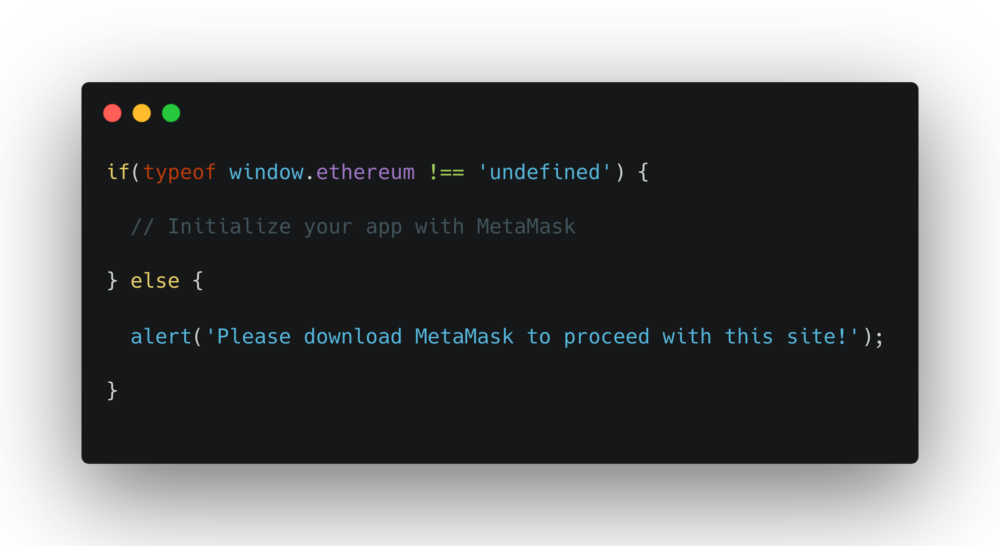
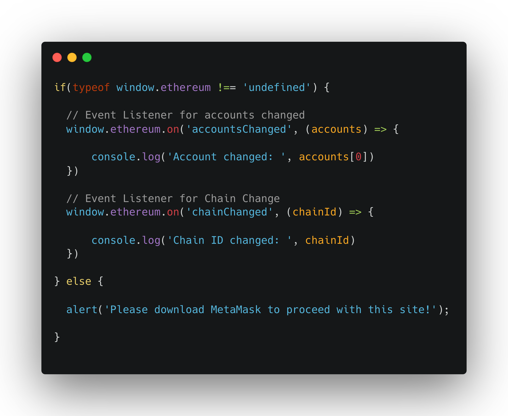
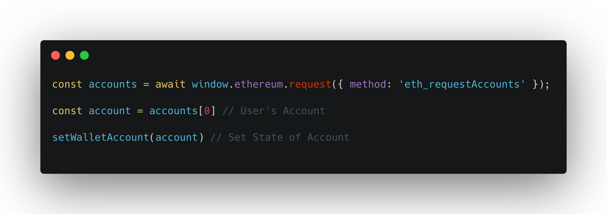

This tutorial will guide you step by step through some important topics on working with MetaMask to give you the basics for a good foundation. If you wish to view the open souce project I've made with React.js to transact with MetaMask, please visit [https://github.com/blakewood84/metamask-transactions](https://github.com/blakewood84/metamask-transactions)!

## Initializing Your Application {#initialize-your-application}

The first and most important step is initializing your app to support MetaMask. To do this you must check if MetaMask exists by calling `window.ethereum` in the browser. The code below will check if MetaMask exists by seeing if `window.ethereum === 'undefined'`. If `window.ethereum` is infact undefined, then we will alert the user to please install MetaMask:

    

Please see (Getting Started)[https://docs.metamask.io/guide/getting-started.html] - MetaMask Documentation for more details.

I like to use this initialization process to add *Event Listeners* to check for changes that the user is making to MetaMask. The two most important ones I like to setup are Accounts Changed (if a user switches their Account) and Chain Changed (if a user changes the chain in their MetaMask). In the below example, I am using React to set the state of the Account and Chain ID according to events in MetaMask.

    

As your see we are setting up 2 Event Listeners, we are listening for any changes to MetaMask the user makes with their Account and Chain ID. For a better understanding of what the Chain IDs mean and which chain they are referring to please check out: Please see (API Reference - Chain IDs)[https://docs.metamask.io/guide/ethereum-provider.html#chain-ids].

Also for more on Event Listeners please check out (API Reference - Events)[https://docs.metamask.io/guide/ethereum-provider.html#events].

## Connecting MetaMask to your Application {#connecting-metamask-to-app}

For me I feel like there are a few things to know here. One is that you'll have to determine the flow of how you'll want to "connect" MetaMask to your app. MetaMask never truly connects to your application, but is more like an API giving you information when you request it. MetaMask will infact have a Connected button with a green dot to show you that MetaMask has transacted with your application successfully, but it's never truly on point. Below I have some steps that I've used to connect my application successfuly to MetaMask, how to Disconnect, and how to Reconnect and show the user an Account Request again after you've told them they've logged out.

### 1. Connecting to MetaMask for the first time: 

To connect MetaMask for the first time you'll want to somehow think state of the user's account address as it pertains to your application. The best way to do this is like so: If you've grabbed the user's account # from MetaMask, then they are connected sucessfully.

To make a sucessful request to MetaMask and ask for the user's account from their wallet (they choose), we call a request method: `window.ethereum.request({ method: 'method', params: [] })`

Below is a request called `eth_request_accounts` which will trigger a user to login to their MetaMask wallet and connect:

    

Sometimes requests may or may not have params. A good place to check out all the request methods and details on each is the (API Playground)[https://metamask.github.io/api-playground/api-documentation/].