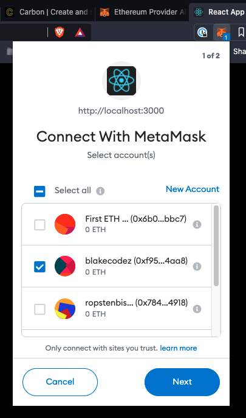
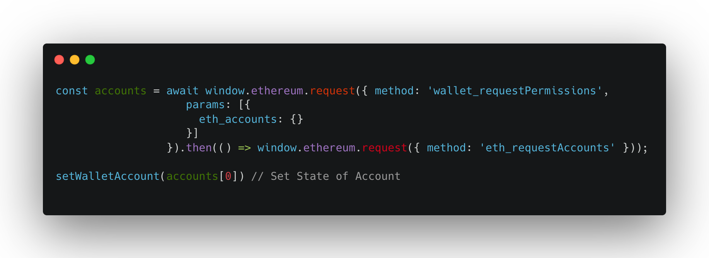
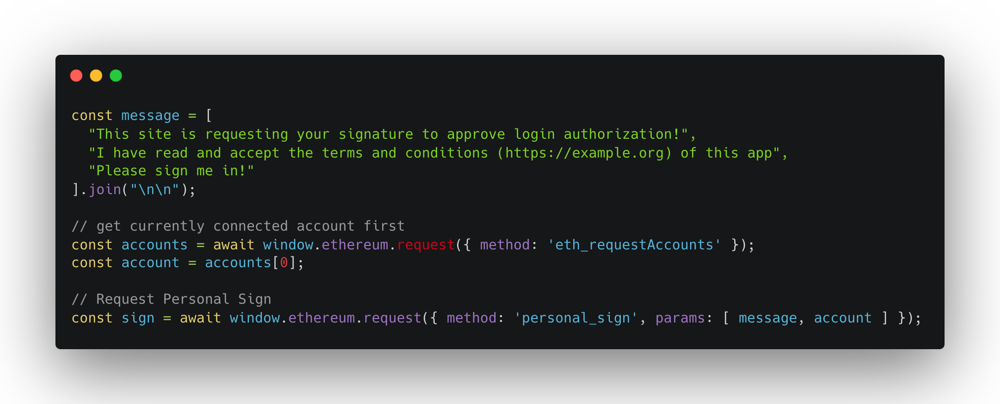
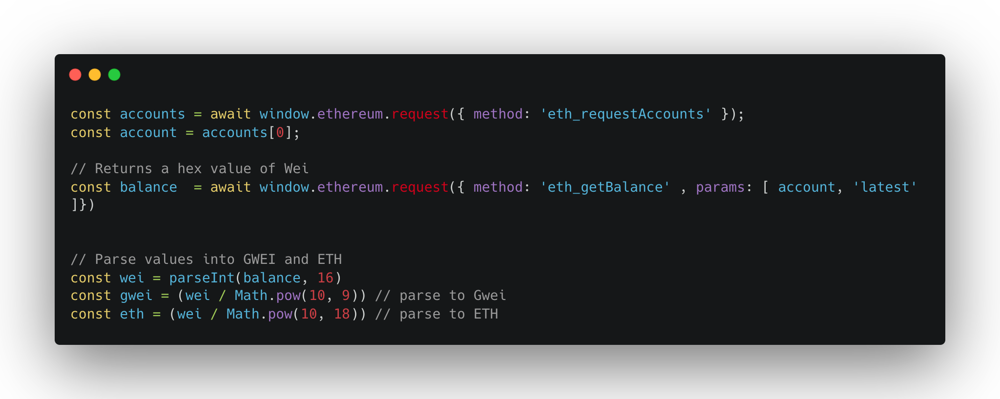
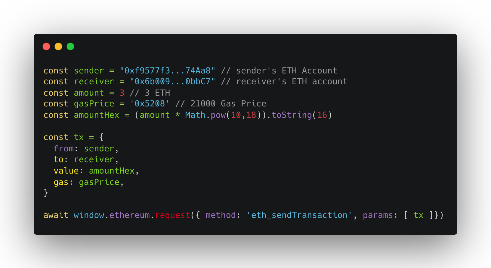
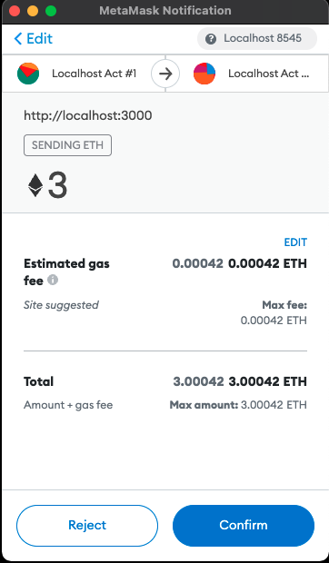

This tutorial will guide you step by step through some important topics on working with MetaMask to give you the basics for a good foundation. If you wish to view the open souce project I've made with React.js to transact with MetaMask, please visit [https://github.com/blakewood84/metamask-transactions](https://github.com/blakewood84/metamask-transactions)!

## Initializing Your Application {#initialize-your-application}

The first and most important step is initializing your app to support MetaMask. To do this you must check if MetaMask exists by calling `window.ethereum` in the browser. The code below will check if MetaMask exists by seeing if `window.ethereum === 'undefined'`. If `window.ethereum` is infact undefined, then we will alert the user to please install MetaMask:

    

Please see (Getting Started)[https://docs.metamask.io/guide/getting-started.html] - MetaMask Documentation for more details.

I like to use this initialization process to add **Event Listeners** to check for changes that the user is making to MetaMask. The two most important ones I like to setup are Accounts Changed (if a user switches their Account) and Chain Changed (if a user changes the chain in their MetaMask). In the below example, I am using React to set the state of the Account and Chain ID according to events in MetaMask.

    

As your see we are setting up 2 Event Listeners, we are listening for any changes to MetaMask the user makes with their Account and Chain ID. For a better understanding of what the Chain IDs mean and which chain they are referring to please check out: Please see [API Reference - Chain IDs](https://docs.metamask.io/guide/ethereum-provider.html#chain-ids). Also check out [chainlist.org](https://chainlist.org/) for more info on Chain IDs.

Also for more on Event Listeners please check out [API Reference - Events](https://docs.metamask.io/guide/ethereum-provider.html#events).

## Connecting MetaMask to your Application {#connecting-metamask-to-app}

For me I feel like there are a few things to know here. One is that you'll have to determine the flow of how you'll want to "connect" MetaMask to your app. MetaMask never truly connects to your application, but is more like an API giving you information when you request it. MetaMask will infact have a Connected button with a green dot to show you that MetaMask has transacted with your application successfully, but it's never truly on point. Below I have some steps that I've used to connect my application successfuly to MetaMask, how to Disconnect, and how to Reconnect and show the user an Account Request again after you've told them they've logged out.

### 1. Connecting to MetaMask for the first time: 

To connect MetaMask for the first time you'll want to somehow think state of the user's account address as it pertains to your application. The best way to do this is like so: If you've grabbed the user's account # from MetaMask, then they are connected sucessfully.

To make a sucessful request to MetaMask and ask for the user's account from their wallet (they choose), we call a request method: `window.ethereum.request({ method: 'method', params: [] })`

Below is a request called `eth_request_accounts` which will trigger a user to login to their MetaMask wallet and connect:

    

Once this request goes out for the 1st time you will see the following:

    

#### *Note:
Sometimes MetaMask won't show the modal pop up and give you the account straight away. This depends on if MetaMask currently thinks your app is already connected to it's provider. There are work arounds for this I will show you in a few steps below. 

Also, sometimes requests may or may not have params. A good place to check out all the request methods and details on each is the [API Playground](https://metamask.github.io/api-playground/api-documentation/).

### 2. Disconnecting MetaMask:

There is not for sure way to do this currently other than by erasing the state of your application. You should let your application make the choice of whether or not MetaMask is connected. For myself, I erase the account # from state to simply say I'm disconnected. If I wont to reconnect and show the Modal pop up to pick an account again I will do the following below...

### 3. Reconnecting MetaMask:

Sometimes in your user flow, you may want a user to be able to disconnect their current wallet, and choose another one via the pop up Modal MetaMask provides. Sometimes simply them changing it themselves might not be enough. In this case you can trigger a reconnect which will always cause a modal to pop up and force the user to choose an account:

    

This code will pop up another Connect With MetaMask modal and force the user to choose another account. This will help give the feel that the user is having to choose another account again and your application is controlling the flow.

## Personal Sign / Authentication {#personal-sign-authentication}

If you are familiar with [Open Sea](https://opensea.io) you will heave seen a Personal Sign request sooner or later:

    

A personal sign is a signature request the MetaMask provider provides, and by clicking sign, you've successfully made a signed request with your wallet. This can be good for Authentication flows in your decentralized application.

You can implement personal sign by using the following code:

    

First you need to create a message to be passed into the params followed by the account. Once you have both of these you're ready to make a **personal_sign** request!

Please check [Signing Data](https://docs.metamask.io/guide/signing-data.html#signing-data-with-metamask) for more info on Signing Data.

## Get an Account's Token Balance {#get-token-balance}

Sometimes you'll want to get a user's token balance and one good way to do this is using the MetaMask provider in the browser. MetaMask will make the transaction for you using the ETH Json RPC and the desired chain a user's account is connected to.

Check out the following code: 

    

The Above code is requesting the user's ETH balance by calling `eth_getBalance`. For params we are passing in the user's account, and also passing in the *'latest'* value to tell the provider we want the latest account balance. MetaMask will transact with the user's connected chain on their wallet and return their balance. If the wrong chain is connected, no balance will exists. This is why having a Chain ID Event Listener is good to control the flow of accounts / chains changing in the wallet. 

I won't go into too much detail about the math here, but to get Gwei (gas) you would divide by 10^9 power, and converting to Ether or ETH 10^18 power when using WEI.

* **Just a small note**, a good place to look for more information on this for me was the actual JSON RPC API from **eth.wiki** - [JSON RPC API](https://eth.wiki/json-rpc/API#eth_getbalance). This has a bunch of cool finds in here for transacting with ETH chains.

## Send Transaction {#send-transaction}

Sending tokens and ETH between accounts using MetaMask is quite simple. The following code will send a transaction between two parties as long as your provider the following: **sender's address, receiver's address, and the amount** (converted to Hex):

    

The gas price is a set hex of 21000 in WEI for gas. The amountHex will turn your amount into the appropriate Hex value to send in the transaction. We need all these values in our **tx** constant. Then we send the request by using `eth_sendTransaction`. Running the code should have the following result in MetaMask: 

    

## Conclusion {#conclusion}

Hopefully this provided you some helpful explanations on using your MetaMask with your application. If you'd like to check out all of this working in an actual project please check out this Github Repo: [blakewood84/metamask-transactions](https://github.com/blakewood84/metamask-transactions) using React.js to run the project.

    

Your feedback is definitely welcome, please reach out anytime via [LinkedIn](https://www.linkedin.com/in/blakewoodjr/).

Praying you success on your journey! Keep on coding! Bless...