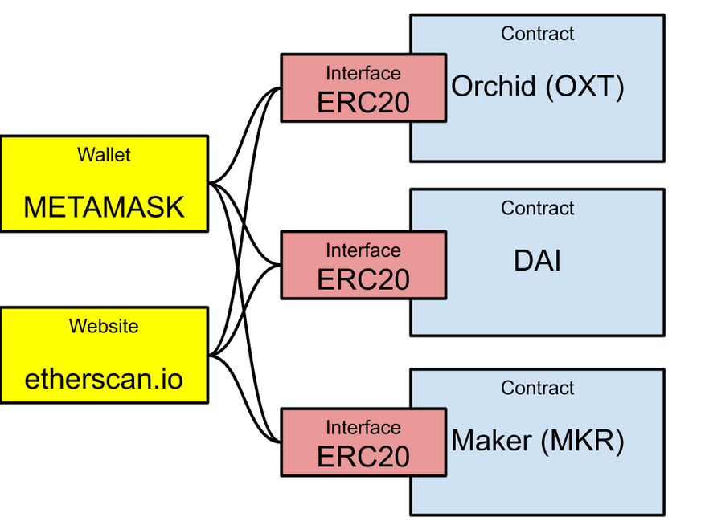

## Introduction {#introduction}

One of the most common uses for Ethereum is for a group to create a tradable token, in a sense their own currency. These tokens typically follow a standard,
[ERC-20](/developers/docs/standards/tokens/erc-20/). This standard makes it possible to write tools, such as liquidity pools and wallets, that work with all ERC-20
tokens. In this article we will analyze the
[OpenZeppelin Solidity ERC20 implementation](https://github.com/OpenZeppelin/openzeppelin-contracts/blob/master/contracts/token/ERC20/ERC20.sol), as well as the
[interface definition](https://github.com/OpenZeppelin/openzeppelin-contracts/blob/master/contracts/token/ERC20/IERC20.sol).

This is annotated source code. If you want to implement ERC-20,
[read this tutorial](https://docs.openzeppelin.com/contracts/2.x/erc20-supply).

## The Interface {#the-interface}

The purpose of a standard like ERC-20 is to allow many tokens implementations that are interoperable across applications, like wallets and decentralized exchanges. To achieve that, we create an
[interface](https://www.geeksforgeeks.org/solidity-basics-of-interface/). Any code that needs to use the token contract
can use the same definitions in the interface and be compatible with all token contracts that use it, whether it is a wallet such as
MetaMask, a dapp such as etherscan.io, or a different contract such as liquidity pool.



If you are an experienced programmer, you probably remember seeing similar constructs in [Java](https://www.w3schools.com/java/java_interface.asp)
or even in [C header files](https://gcc.gnu.org/onlinedocs/cpp/Header-Files.html).

This is a definition of the [ERC-20 Interface](https://github.com/OpenZeppelin/openzeppelin-contracts/blob/master/contracts/token/ERC20/IERC20.sol)
from OpenZeppelin. It is a translation of the [human readable standard](https://eips.ethereum.org/EIPS/eip-20) into Solidity code. Of course, the
interface itself does not define _how_ to do anything. That is explained in the contract source code below.

&nbsp;

```solidity
// SPDX-License-Identifier: MIT
```

Solidity files are supposed to includes a license identifier. [You can see the list of licenses here](https://spdx.org/licenses/). If you need a different
license, just explain it in the comments.

&nbsp;

```solidity
pragma solidity >=0.6.0 <0.8.0;
```

The Solidity language is still evolving quickly, and new versions may not be compatible with old code
([see here](https://docs.soliditylang.org/en/v0.7.0/070-breaking-changes.html)). Therefore, it is a good idea to specify not just a minimum
version of the language, but also a maximum version, the latest with which you tested the code.

&nbsp;

```solidity
/**
 * @dev Interface of the ERC20 standard as defined in the EIP.
 */
```

The `@dev` in the comment is part of the [NatSpec format](https://docs.soliditylang.org/en/develop/natspec-format.html), used to produce
documentation from the source code.

&nbsp;

```solidity
interface IERC20 {
```

By convention, interface names start with `I`.

&nbsp;

```solidity
    /**
     * @dev Returns the amount of tokens in existence.
     */
    function totalSupply() external view returns (uint256);
```

This function is `external`, meaning [it can only be called from outside the contract](https://docs.soliditylang.org/en/v0.7.0/cheatsheet.html#index-2).
It returns the total supply of tokens in the contract. This value is returned using the most common type in Ethereum, unsigned 256 bits (256 bits is the
native word size of the EVM). This function is also a `view`, which means that it does not change the state, so it can be executed on a single node instead of having
every node in the blockchain run it. This kind of function does not generate a transaction and does not cost [gas](/developers/docs/gas/).

**Note:** In theory it might appear that a contract's creator could cheat by returning a smaller total supply than the real value, making each token appear
more valuable than it actually is. However, that fear ignores the true nature of the blockchain. Everything that happens on the blockchain can be verified by
every node. To achieve this, every contract's machine language code and storage is available on every node. While you are not required to publish the Solidity
code for your contract, nobody would take you seriously unless you publish the source code and the version of Solidity with which it was complied, so it can
be verified against the machine language code you provided.
For example, see [this contract](https://etherscan.io/address/0xa530F85085C6FE2f866E7FdB716849714a89f4CD#code).

&nbsp;

```solidity
    /**
     * @dev Returns the amount of tokens owned by `account`.
     */
    function balanceOf(address account) external view returns (uint256);
```

As the name says, `balanceOf` returns the balance of an account. Ethereum accounts are identified in Solidity using the `address` type, which holds 160 bits.
It is also `external` and `view`.

&nbsp;

```solidity
    /**
     * @dev Moves `amount` tokens from the caller's account to `recipient`.
     *
     * Returns a boolean value indicating whether the operation succeeded.
     *
     * Emits a {Transfer} event.
     */
    function transfer(address recipient, uint256 amount) external returns (bool);
```

The `transfer` function transfers a tokens from the caller to a different address. This involves a change of state, so it isn't a `view`.
When a user calls this function it creates a transaction and costs gas. It also emits an event, `Transfer`, to inform everybody on
the blockchain of the event.

The function has two types of output for two different types of callers:

- Users that call the function directly from a user interface. Typically the user submits a transaction
  and does not wait for a response, which could take an indefinite amount of time. The user can see what happened
  by looking for the transaction receipt (which is identified by the transaction hash) or by looking for the
  `Transfer` event.
- Other contracts, which call the function as part of an overall transaction. Those contracts get the result immediately,
  because they run in the same transaction, so they can use the function return value.

The same type of output is created by the other functions that change the contract's state.

&nbsp;

Allowances permit an account to spend some tokens that belong to a different owner.
This is useful, for example, for contracts that act as sellers. Contracts cannot
monitor for events, so if a buyer were to transfer tokens to the seller contract
directly that contract wouldn't know it was paid. Instead, the buyer permits the
seller contract to spend a certain amount, and the seller transfers that amount.
This is done through a function the seller contract calls, so the seller contract
can know if it was successful.

```solidity
    /**
     * @dev Returns the remaining number of tokens that `spender` will be
     * allowed to spend on behalf of `owner` through {transferFrom}. This is
     * zero by default.
     *
     * This value changes when {approve} or {transferFrom} are called.
     */
    function allowance(address owner, address spender) external view returns (uint256);
```

The `allowance` function lets anybody query to see what is the allowance that one
address (`owner`) lets another address (`spender`) spend.

&nbsp;

```solidity
    /**
     * @dev Sets `amount` as the allowance of `spender` over the caller's tokens.
     *
     * Returns a boolean value indicating whether the operation succeeded.
     *
     * IMPORTANT: Beware that changing an allowance with this method brings the risk
     * that someone may use both the old and the new allowance by unfortunate
     * transaction ordering. One possible solution to mitigate this race
     * condition is to first reduce the spender's allowance to 0 and set the
     * desired value afterwards:
     * https://github.com/ethereum/EIPs/issues/20#issuecomment-263524729
     *
     * Emits an {Approval} event.
     */
    function approve(address spender, uint256 amount) external returns (bool);
```

The `approve` function creates an allowance. Make sure to read the message about
how it can be abused. In Ethereum you control the order of your own transactions,
but you cannot control the order in which other people's transactions will
be executed, unless you don't submit your own transaction until you see the
other side's transaction had happened.

&nbsp;

```solidity
    /**
     * @dev Moves `amount` tokens from `sender` to `recipient` using the
     * allowance mechanism. `amount` is then deducted from the caller's
     * allowance.
     *
     * Returns a boolean value indicating whether the operation succeeded.
     *
     * Emits a {Transfer} event.
     */
    function transferFrom(address sender, address recipient, uint256 amount) external returns (bool);
```

Finally, `transferFrom` is used by the spender to actually spend the allowance.

&nbsp;

```solidity

    /**
     * @dev Emitted when `value` tokens are moved from one account (`from`) to
     * another (`to`).
     *
     * Note that `value` may be zero.
     */
    event Transfer(address indexed from, address indexed to, uint256 value);

    /**
     * @dev Emitted when the allowance of a `spender` for an `owner` is set by
     * a call to {approve}. `value` is the new allowance.
     */
    event Approval(address indexed owner, address indexed spender, uint256 value);
}
```

These events are emitted when the state of the ERC-20 contract changes.

## The Actual Contract {#the-actual-contract}

This is the actual contract that implements the ERC-20 standard,
[taken from here](https://github.com/OpenZeppelin/openzeppelin-contracts/blob/master/contracts/token/ERC20/ERC20.sol).
It is not meant to be used as-is, but you can
[inherit](https://www.tutorialspoint.com/solidity/solidity_inheritance.htm) from it to extend it to something usable.

```solidity
// SPDX-License-Identifier: MIT
pragma solidity >=0.6.0 <0.8.0;
```

&nbsp;

### Import Statements {#import-statements}

In addition to the interface definitions above, the contract definition imports two other files:

```solidity

import "../../GSN/Context.sol";
import "./IERC20.sol";
import "../../math/SafeMath.sol";
```

- `GSN/Context.sol` is the definitions required to use [OpenGSN](https://www.opengsn.org/), a system that allows users without ether
  to use the blockchain. Note that this is an old version, if you want to integrate with OpenGSN
  [use this tutorial](https://docs.opengsn.org/javascript-client/tutorial.html).
- [The SafeMath library](https://ethereumdev.io/using-safe-math-library-to-prevent-from-overflows/), which is used to make
  addition and subtraction without overflows. This is necessary because otherwise a person might somehow have one token, spend
  two tokens, and then have 2^256-1 tokens.

&nbsp;

This comment explains the purpose of the contract.

```solidity
/**
 * @dev Implementation of the {IERC20} interface.
 *
 * This implementation is agnostic to the way tokens are created. This means
 * that a supply mechanism has to be added in a derived contract using {_mint}.
 * For a generic mechanism see {ERC20PresetMinterPauser}.
 *
 * TIP: For a detailed writeup see our guide
 * https://forum.zeppelin.solutions/t/how-to-implement-erc20-supply-mechanisms/226[How
 * to implement supply mechanisms].
 *
 * We have followed general OpenZeppelin guidelines: functions revert instead
 * of returning `false` on failure. This behavior is nonetheless conventional
 * and does not conflict with the expectations of ERC20 applications.
 *
 * Additionally, an {Approval} event is emitted on calls to {transferFrom}.
 * This allows applications to reconstruct the allowance for all accounts just
 * by listening to said events. Other implementations of the EIP may not emit
 * these events, as it isn't required by the specification.
 *
 * Finally, the non-standard {decreaseAllowance} and {increaseAllowance}
 * functions have been added to mitigate the well-known issues around setting
 * allowances. See {IERC20-approve}.
 */

```

### Contract Definition {#contract-definition}

```solidity
contract ERC20 is Context, IERC20 {
```

This line specifies the inheritance, in this case from `IERC20` from above and `Context`, for OpenGSN.

&nbsp;

```solidity

    using SafeMath for uint256;

```

This line attaches the `SafeMath` library to the `uint256` type. You can find this library
[here](https://github.com/OpenZeppelin/openzeppelin-contracts/blob/master/contracts/utils/math/SafeMath.sol).

### Variable Definitions {#variable-definitions}

These definitions specify the contract's state variables. There variables are declared `private`, but
that only means that other contracts on the blockchain can't read them. _There are no
secrets on the blockchain_, the software on every node has the state of every contract
at every block. By convention, state variables are named `_<something>`.

The first two variables are [mappings](https://www.tutorialspoint.com/solidity/solidity_mappings.htm),
meaning they behave roughly the same as [associative arrays](https://wikipedia.org/wiki/Associative_array),
except that the keys are numeric values. Storage is only allocated for entries that have values different
from the default (zero).

```solidity
    mapping (address => uint256) private _balances;
```

The first mapping, `_balances`, is addresses and their respective balances of this token. To access
the balance, use this syntax: `_balances[<address>]`.

&nbsp;

```solidity
    mapping (address => mapping (address => uint256)) private _allowances;
```

This variable, `_allowances`, stores the allowances explained earlier. The first index is the owner
of the tokens, and the second is the contract with the allowance. To access the amount address A can
spend from address B's account, use `_allowances[B][A]`.

&nbsp;

```solidity
    uint256 private _totalSupply;
```

As the name suggests, this variable keeps track of the total supply of tokens.

&nbsp;

```solidity
    string private _name;
    string private _symbol;
    uint8 private _decimals;
```

These three variables are used to improve readability. The first two are self-explanatory, but `_decimals`
isn't.

On one hand, ethereum does not have floating point or fractional variables. On the other hand,
humans like being able to divide tokens. One reason people settled on gold for currency was that
it was hard to make change when somebody wanted to buy a duck's worth of cow.

The solution is to keep track of integers, but count instead of the real token a fractional token that is
nearly worthless. In the case of ether, the fractional token is called wei, and 10^18 wei is equal to one
ETH. At writing, 10,000,000,000,000 wei is approximately one US or Euro cent.

Applications need to know how to display the token balance. If a user has 3,141,000,000,000,000,000 wei, is that
3.14 ETH? 31.41 ETH? 3,141 ETH? In the case of ether it is defined 10^18 wei to the ETH, but for your
token you can select a different value. If dividing the token doesn't make sense, you can use a
`_decimals` value of zero. If you want to use the same standard as ETH, use the value **18**.

### The Constructor {#the-constructor}

```solidity
    /**
     * @dev Sets the values for {name} and {symbol}, initializes {decimals} with
     * a default value of 18.
     *
     * To select a different value for {decimals}, use {_setupDecimals}.
     *
     * All three of these values are immutable: they can only be set once during
     * construction.
     */
    constructor (string memory name_, string memory symbol_) public {
        _name = name_;
        _symbol = symbol_;
        _decimals = 18;
    }
```

The constructor is called when the contract is first created. By convention, function parameters are named `<something>_`.

### User Interface Functions {#user-interface-functions}

```solidity
    /**
     * @dev Returns the name of the token.
     */
    function name() public view returns (string memory) {
        return _name;
    }

    /**
     * @dev Returns the symbol of the token, usually a shorter version of the
     * name.
     */
    function symbol() public view returns (string memory) {
        return _symbol;
    }

    /**
     * @dev Returns the number of decimals used to get its user representation.
     * For example, if `decimals` equals `2`, a balance of `505` tokens should
     * be displayed to a user as `5,05` (`505 / 10 ** 2`).
     *
     * Tokens usually opt for a value of 18, imitating the relationship between
     * ether and wei. This is the value {ERC20} uses, unless {_setupDecimals} is
     * called.
     *
     * NOTE: This information is only used for _display_ purposes: it in
     * no way affects any of the arithmetic of the contract, including
     * {IERC20-balanceOf} and {IERC20-transfer}.
     */
    function decimals() public view returns (uint8) {
        return _decimals;
    }
```

These functions, `name`, `symbol`, and `decimals` help user interfaces know about your contract so they'll be able to display it properly.

The return type is `string memory`, meaning return a string that is stored in memory. Variables, such as
strings, can be stored in three locations:

|          | Lifetime      | Contract Access | Gas Cost                                                       |
| -------- | ------------- | --------------- | -------------------------------------------------------------- |
| Memory   | Function call | Read/Write      | Tens or hundreds (higher for higher locations)                 |
| Calldata | Function call | Read Only       | Can't be used as a return type, only a function parameter type |
| Storage  | Until changed | Read/Write      | High (800 for read, 20k for write)                             |

In this case, `memory` is the best choice.

### Read Token Information {#read-token-information}

These are functions that provide information about the token, either the total supply or an
account's balance.

```solidity
    /**
     * @dev See {IERC20-totalSupply}.
     */
    function totalSupply() public view override returns (uint256) {
        return _totalSupply;
    }
```

The `totalSupply` function returns the total supply of tokens.

&nbsp;

```solidity
    /**
     * @dev See {IERC20-balanceOf}.
     */
    function balanceOf(address account) public view override returns (uint256) {
        return _balances[account];
    }
```

Read an account's balance. Note that anybody is allowed to get anybody else's account
balance. There is no point in trying to hide this information, because it is available on every
node anyway. _There are no secrets on the blockchain._

### Transfer Tokens {#transfer-tokens}

```solidity
    /**
     * @dev See {IERC20-transfer}.
     *
     * Requirements:
     *
     * - `recipient` cannot be the zero address.
     * - the caller must have a balance of at least `amount`.
     */
    function transfer(address recipient, uint256 amount) public virtual override returns (bool) {
```

The `transfer` function is called to transfer tokens from the sender's account to a different one. Note
that even though it returns a boolean value, that value is always **true**. If the transfer
fails the contract reverts the call.

&nbsp;

```solidity
        _transfer(_msgSender(), recipient, amount);
        return true;
    }
```

The `_transfer` function does the actual work. It is a private function that can only be called by
other contract functions. By convention private functions are named `_<something>`, same as state
variables.

Normally in Solidity we use `msg.sender` for the message sender. However, that breaks
[OpenGSN](http://opengsn.org/). If we want to allow etherless transactions with our token, we
need to use `_msgSender()`. It returns `msg.sender` for normal transactions, but for etherless ones
return the original signer and not the contract that relayed the message.

### Allowance Functions {#allowance-functions}

These are the functions that implement the allowance functionality: `allowance`, `approve`, `transferFrom`,
and `_approve`. Additionally, the OpenZeppelin implementation goes beyond the basic standard to include some features that improve
security: `increaseAllowance`, and `decreaseAllowance`.

#### The allowance function {#allowance}

```solidity
    /**
     * @dev See {IERC20-allowance}.
     */
    function allowance(address owner, address spender) public view virtual override returns (uint256) {
        return _allowances[owner][spender];
    }
```

The `allowance` function allows everybody to check any allowance.

#### The approve function {#approve}

```solidity
    /**
     * @dev See {IERC20-approve}.
     *
     * Requirements:
     *
     * - `spender` cannot be the zero address.
     */
    function approve(address spender, uint256 amount) public virtual override returns (bool) {
```

This function is called to create an allowance. It is similar to the `transfer` function above:

- The function just calls an internal function (in this case, `_approve`) that does the real work.
- The function either returns `true` (if successful) or reverts (if not).

&nbsp;

```solidity
        _approve(_msgSender(), spender, amount);
        return true;
    }
```

We use internal functions to minimize the number of places where state changes happen. _Any_ function that changes the
state is a potential security risk that needs to be audited for security. This way we have less chances to get it wrong.

#### The transferFrom function {#transferFrom}

This is the function that a spender calls to spend an allowance. This requires two operations: transfer the amount
being spent and reduce the allowance by that amount.

```solidity
    /**
     * @dev See {IERC20-transferFrom}.
     *
     * Emits an {Approval} event indicating the updated allowance. This is not
     * required by the EIP. See the note at the beginning of {ERC20}.
     *
     * Requirements:
     *
     * - `sender` and `recipient` cannot be the zero address.
     * - `sender` must have a balance of at least `amount`.
     * - the caller must have allowance for ``sender``'s tokens of at least
     * `amount`.
     */
    function transferFrom(address sender, address recipient, uint256 amount) public virtual
                                                override returns (bool) {
        _transfer(sender, recipient, amount);
```

&nbsp;

The `a.sub(b, "message")` function call does two things. First, it calculates `a-b`, which is the new allowance.
Second, it checks that this result is not negative. If it is negative the call reverts with the provided message. Note that when a call reverts any processing done previously during that call is ignored so we don't need to
undo the `_transfer`.

```solidity
        _approve(sender, _msgSender(), _allowances[sender][_msgSender()].sub(amount,
             "ERC20: transfer amount exceeds allowance"));
        return true;
    }
```

#### OpenZeppelin safety additions {#openzeppelin-safety-additions}

It is dangerous to set a non-zero allowance to another non-zero value,
because you only control the order of your own transactions, not anybody else's. Imagine you
have two users, Alice who is naive and Bill who is dishonest. Alice wants some service from
Bill, which she thinks costs five tokens - so she gives Bill an allowance of five tokens.

Then something changes and Bill's price rises to ten tokens. Alice, who still wants the service,
sends a transaction that sets Bill's allowance to ten. The moment Bill sees this new transaction
in the transaction pool he sends a transaction that spends Alice's five tokens and has a much
higher gas price so it will be mined faster. That way Bill can spend first five tokens and then,
once Alice's new allowance is mined, spend ten more for a total price of fifteen tokens, more than
Alice meant to authorize. This technique is called
[front-running](https://consensys.github.io/smart-contract-best-practices/attacks/#front-running)

| Alice Transaction | Alice Nonce | Bill Transaction              | Bill Nonce | Bill's Allowance | Bill Total Income from Alice |
| ----------------- | ----------- | ----------------------------- | ---------- | ---------------- | ---------------------------- |
| approve(Bill, 5)  | 10          |                               |            | 5                | 0                            |
|                   |             | transferFrom(Alice, Bill, 5)  | 10,123     | 0                | 5                            |
| approve(Bill, 10) | 11          |                               |            | 10               | 5                            |
|                   |             | transferFrom(Alice, Bill, 10) | 10,124     | 0                | 15                           |

To avoid this problem, these two functions (`increaseAllowance` and `decreaseAllowance`) allow you
to modify the allowance by a specific amount. So if Bill had already spent five tokens, he'll just
be able to spend five more. Depending on the timing, there are two ways this can work, both of
which end with Bill only getting ten tokens:

A:

| Alice Transaction          | Alice Nonce | Bill Transaction             | Bill Nonce | Bill's Allowance | Bill Total Income from Alice |
| -------------------------- | ----------: | ---------------------------- | ---------: | ---------------: | ---------------------------- |
| approve(Bill, 5)           |          10 |                              |            |                5 | 0                            |
|                            |             | transferFrom(Alice, Bill, 5) |     10,123 |                0 | 5                            |
| increaseAllowance(Bill, 5) |          11 |                              |            |          0+5 = 5 | 5                            |
|                            |             | transferFrom(Alice, Bill, 5) |     10,124 |                0 | 10                           |

B:

| Alice Transaction          | Alice Nonce | Bill Transaction              | Bill Nonce | Bill's Allowance | Bill Total Income from Alice |
| -------------------------- | ----------: | ----------------------------- | ---------: | ---------------: | ---------------------------: |
| approve(Bill, 5)           |          10 |                               |            |                5 |                            0 |
| increaseAllowance(Bill, 5) |          11 |                               |            |         5+5 = 10 |                            0 |
|                            |             | transferFrom(Alice, Bill, 10) |     10,124 |                0 |                           10 |

```solidity
    /**
     * @dev Atomically increases the allowance granted to `spender` by the caller.
     *
     * This is an alternative to {approve} that can be used as a mitigation for
     * problems described in {IERC20-approve}.
     *
     * Emits an {Approval} event indicating the updated allowance.
     *
     * Requirements:
     *
     * - `spender` cannot be the zero address.
     */
    function increaseAllowance(address spender, uint256 addedValue) public virtual returns (bool) {
        _approve(_msgSender(), spender, _allowances[_msgSender()][spender].add(addedValue));
        return true;
    }
```

The `a.add(b)` function is a safe add. In the unlikely case that `a`+`b`>=`2^256` it does not wrap around
the way normal addition does.

```solidity

    /**
     * @dev Atomically decreases the allowance granted to `spender` by the caller.
     *
     * This is an alternative to {approve} that can be used as a mitigation for
     * problems described in {IERC20-approve}.
     *
     * Emits an {Approval} event indicating the updated allowance.
     *
     * Requirements:
     *
     * - `spender` cannot be the zero address.
     * - `spender` must have allowance for the caller of at least
     * `subtractedValue`.
     */
    function decreaseAllowance(address spender, uint256 subtractedValue) public virtual returns (bool) {
        _approve(_msgSender(), spender, _allowances[_msgSender()][spender].sub(subtractedValue,
                "ERC20: decreased allowance below zero"));
        return true;
    }
```

### Functions that Modify Token Information {#functions-that-modify-token-information}

These are the four functions that do the actual work: `_transfer`, `_mint`, `_burn`, and `_approve`.

#### The \_transfer function {#\_transfer}

```solidity
    /**
     * @dev Moves tokens `amount` from `sender` to `recipient`.
     *
     * This is internal function is equivalent to {transfer}, and can be used to
     * e.g. implement automatic token fees, slashing mechanisms, etc.
     *
     * Emits a {Transfer} event.
     *
     * Requirements:
     *
     * - `sender` cannot be the zero address.
     * - `recipient` cannot be the zero address.
     * - `sender` must have a balance of at least `amount`.
     */
    function _transfer(address sender, address recipient, uint256 amount) internal virtual {
```

This function, `_transfer`, transfers tokens from one account to another. It is called by both
`transfer` (for transfers from the sender's own account) and `transferFrom` (for using allowances
to transfer from somebody else's account).

&nbsp;

```solidity
        require(sender != address(0), "ERC20: transfer from the zero address");
        require(recipient != address(0), "ERC20: transfer to the zero address");
```

Nobody actually owns address zero in Ethereum (that is, nobody knows a private key whose matching public key
is transformed to the zero address). When people use that address, it is usually a software bug - so we
fail if the zero address is used as the sender or the recipient.

&nbsp;

```solidity
        _beforeTokenTransfer(sender, recipient, amount);

```

There are two ways to use this contract:

1. Use it as a template for your own code
1. [Inherit from it](https://www.bitdegree.org/learn/solidity-inheritance), and override only those functions that you need to modify

The second method is much better because the OpenZeppelin ERC-20 code has already been audited and shown to be secure. When you use inheritance
it is clear what are the functions you modify, and to trust your contract people only need to audit those specific functions.

It is often useful to perform a function each time tokens change hands. However,`_transfer` is a very important function and it is
possible to write it insecurely (see below), so it is best not to override it. The solution is `_beforeTokenTransfer`, a
[hook function](https://wikipedia.org/wiki/Hooking). You can override this function, and it will be called on each transfer.

&nbsp;

```solidity
        _balances[sender] = _balances[sender].sub(amount, "ERC20: transfer amount exceeds balance");
        _balances[recipient] = _balances[recipient].add(amount);
```

These are the lines that actually do the transfer. Note that there is **nothing** between them, and that we subtract
the transferred amount from the sender before adding it to the recipient. This is important because if there was a
call to a different contract in the middle, it could have been used to cheat this contract. This way the transfer
is atomic, nothing can happen in the middle of it.

&nbsp;

```solidity
        emit Transfer(sender, recipient, amount);
    }
```

Finally, emit a `Transfer` event. Events are not accessible to smart contracts, but code running outside the blockchain
can listen for events and react to them. For example, a wallet can keep track of when the owner gets more tokens.

#### The \_mint and \_burn functions {#\_mint-and-\_burn}

These two functions (`_mint` and `_burn`) modify the total supply of tokens.
They are internal and there is no function that calls them in this contract,
so they are only useful if you inherit from the contract and add your own
logic to decide under what conditions to mint new tokens or burn existing
ones.

**NOTE:** Every ERC-20 token has its own business logic that dictates token management.
For example, a fixed supply contract might only call `_mint`
in the constructor and never call `_burn`. A contract that sells tokens
will call `_mint` when it is paid, and presumably call `_burn` at some point
to avoid runaway inflation.

```solidity
    /** @dev Creates `amount` tokens and assigns them to `account`, increasing
     * the total supply.
     *
     * Emits a {Transfer} event with `from` set to the zero address.
     *
     * Requirements:
     *
     * - `to` cannot be the zero address.
     */
    function _mint(address account, uint256 amount) internal virtual {
        require(account != address(0), "ERC20: mint to the zero address");
        _beforeTokenTransfer(address(0), account, amount);
        _totalSupply = _totalSupply.add(amount);
        _balances[account] = _balances[account].add(amount);
        emit Transfer(address(0), account, amount);
    }
```

Make sure to update `_totalSupply` when the total number of tokens changes.

&nbsp;

```
    /**
     * @dev Destroys `amount` tokens from `account`, reducing the
     * total supply.
     *
     * Emits a {Transfer} event with `to` set to the zero address.
     *
     * Requirements:
     *
     * - `account` cannot be the zero address.
     * - `account` must have at least `amount` tokens.
     */
    function _burn(address account, uint256 amount) internal virtual {
        require(account != address(0), "ERC20: burn from the zero address");

        _beforeTokenTransfer(account, address(0), amount);

        _balances[account] = _balances[account].sub(amount, "ERC20: burn amount exceeds balance");
        _totalSupply = _totalSupply.sub(amount);
        emit Transfer(account, address(0), amount);
    }
```

The `_burn` function is almost identical to `_mint`, except it goes in the other direction.

#### The \_approve function {#\_approve}

This is the function that actually specifies allowances. Note that it allows an owner to specify
an allowance that is higher than the owner's current balance. This is OK because the balance is
checked at the time of transfer, when it could be different from the balance when the allowance is
created.

```solidity
    /**
     * @dev Sets `amount` as the allowance of `spender` over the `owner` s tokens.
     *
     * This internal function is equivalent to `approve`, and can be used to
     * e.g. set automatic allowances for certain subsystems, etc.
     *
     * Emits an {Approval} event.
     *
     * Requirements:
     *
     * - `owner` cannot be the zero address.
     * - `spender` cannot be the zero address.
     */
    function _approve(address owner, address spender, uint256 amount) internal virtual {
        require(owner != address(0), "ERC20: approve from the zero address");
        require(spender != address(0), "ERC20: approve to the zero address");

        _allowances[owner][spender] = amount;
```

&nbsp;

Emit an `Approval` event. Depending on how the application is written, the spender contract can be told about the
approval either by the owner or by a server that listens to these events.

```solidity
        emit Approval(owner, spender, amount);
    }

```

### Modify The Decimals Variable {#modify-the-decimals-variable}

```solidity


    /**
     * @dev Sets {decimals} to a value other than the default one of 18.
     *
     * WARNING: This function should only be called from the constructor. Most
     * applications that interact with token contracts will not expect
     * {decimals} to ever change, and may work incorrectly if it does.
     */
    function _setupDecimals(uint8 decimals_) internal {
        _decimals = decimals_;
    }
```

This function modifies the `_decimals` variable which is used to tell user interfaces how to interpret the amount.
You should call it from the constructor. It would be dishonest to call it at any subsequent point, and applications
are not designed to handle it.

### Hooks {#hooks}

```solidity

    /**
     * @dev Hook that is called before any transfer of tokens. This includes
     * minting and burning.
     *
     * Calling conditions:
     *
     * - when `from` and `to` are both non-zero, `amount` of ``from``'s tokens
     * will be to transferred to `to`.
     * - when `from` is zero, `amount` tokens will be minted for `to`.
     * - when `to` is zero, `amount` of ``from``'s tokens will be burned.
     * - `from` and `to` are never both zero.
     *
     * To learn more about hooks, head to xref:ROOT:extending-contracts.adoc#using-hooks[Using Hooks].
     */
    function _beforeTokenTransfer(address from, address to, uint256 amount) internal virtual { }
}
```

This is the hook function to be called during transfers. It is empty here, but if you need
it to do something you just override it.

# Conclusion {#conclusion}

For review, here are some of the most important ideas in this contract (in my opinion, yours is likely to vary):

- _There are no secrets on the blockchain_. Any information that a smart contract can access
  is available to the whole world.
- You can control the order of your own transactions, but not when other people's transaction
  happen. This is the reason that changing an allowance can be dangerous, because it lets
  the spender spend the sum of both allowances.
- Values of type `uint256` wrap around. In other words, _0-1=2^256-1_. If that is not desired
  behavior, you have to check for it (or use the SafeMath library that does it for you). Note that this changed in
  [Solidity 0.8.0](https://docs.soliditylang.org/en/breaking/080-breaking-changes.html).
- Do all state changes of a specific type in a specific place, because it makes auditing easier.
  This is the reason that we have, for example, `_approve`, which is called by `approve`, `transferFrom`,
  `increaseAllowance`, and `decreaseAllowance`
- State changes should be atomic, without any other action in their middle (as you can see
  in `_transfer`). This is because during the state change you have an inconsistent state. For example,
  between the time you deduct from the balance of the sender and the time you add to the balance of the
  recipient there are less token in existence than there should be. This could be potentially abused if there
  are operations between them, especially calls to a different contract.

Now that you've seen how the OpenZeppelin ERC-20 contract is written, and especially how it is
made more secure, go and write your own secure contracts and applications.
