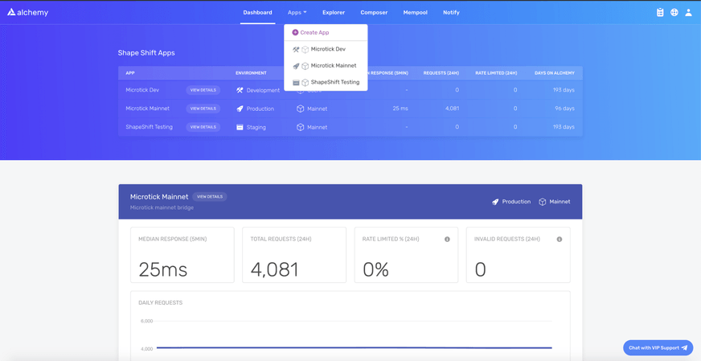
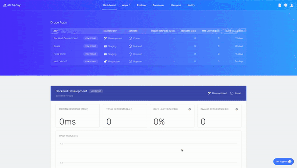

This is a beginners guide to getting started with Ethereum development. For this tutorial we'll be using [Alchemy](https://alchemyapi.io/), the leading blockchain developer platform powering millions of users from 70% of the top blockchain apps, including Maker, 0x, MyEtherWallet, Dharma, and Kyber. Alchemy will give us access to an API endpoint on the Ethereum chain so we can read and write transactions.

We’ll take you from signing up with Alchemy to writing your first web3 script! No blockchain development experience necessary!

## 1. Sign Up for a Free Alchemy Account {#sign-up-for-a-free-alchemy-account}

Creating an account with Alchemy is easy, [sign up for free here](https://auth.alchemyapi.io/signup).

## 2. Create an Alchemy App {#create-an-alchemy-app}

To communicate with the Ethereum chain and to use Alchemy’s products, you need an API key to authenticate your requests.

You can [create API keys from the dashboard](http://dashboard.alchemyapi.io/). To make a new key, navigate to “Create App” as shown below:

Special thanks to [_ShapeShift_](https://shapeshift.com/) _for letting us show their dashboard!_



Fill in the details under “Create App” to get your new key. You can also see apps you previously made and those made by your team here. Pull existing keys by clicking on “View Key” for any app.


You can also pull existing API keys by hovering over “Apps” and selecting one. You can “View Key” here, as well as “Edit App” to whitelist specific domains, see several developer tools, and view analytics.



## 3. Make a Request from the Command Line {#make-a-request-from-the-command-line}

Interact with the Ethereum blockchain through Alchemy using JSON-RPC and curl.

For manual requests, we recommend interacting with the `JSON-RPC` via `POST` requests. Simply pass in the `Content-Type: application/json` header and your query as the `POST` body with the following fields:

- `jsonrpc`: The JSON-RPC version—currently, only `2.0` is supported.
- `method`: The ETH API method. [See API reference.](https://docs.alchemyapi.io/documentation/alchemy-api-reference/json-rpc)
- `params`: A list of parameters to pass to the method.
- `id`: The ID of your request. Will be returned by the response so you can keep track of which request a response belongs to.

Here is an example you can run from the command line to retrieve the current gas price:

```bash
curl https://eth-mainnet.alchemyapi.io/v2/demo \
-X POST \
-H "Content-Type: application/json" \
-d '{"jsonrpc":"2.0","method":"eth_gasPrice","params":[],"id":73}'
```

_**NOTE:** Replace [https://eth-mainnet.alchemyapi.io/v2/demo](https://eth-mainnet.alchemyapi.io/jsonrpc/demo) with your own API key `https://eth-mainnet.alchemyapi.io/v2/**your-api-key`._

**Results:**

```json
{ "id": 73,"jsonrpc": "2.0","result": "0x09184e72a000" // 10000000000000 }
```

## 4. Set up your Web3 Client {#set-up-your-web3-client}

**If you have an existing client,** change your current node provider URL to an Alchemy URL with your API key: `“https://eth-mainnet.alchemyapi.io/v2/your-api-key"`

**_NOTE:_** The scripts below need to be run in a **node context** or **saved in a file**, not run from the command line. If you don’t already have Node or npm installed, check out this quick [set-up guide for macs](https://app.gitbook.com/@alchemyapi/s/alchemy/guides/alchemy-for-macs).

There are tons of [Web3 libraries](https://docs.alchemyapi.io/guides/getting-started#other-web3-libraries) you can integrate with Alchemy, however, we recommend using [Alchemy Web3](https://docs.alchemy.com/reference/api-overview), a drop-in replacement for web3.js, built and configured to work seamlessly with Alchemy. This provides multiple advantages such as automatic retries and robust WebSocket support.

To install AlchemyWeb3.js, **navigate to your project directory** and run:

**With Yarn:**

```
yarn add @alch/alchemy-web3
```

**With NPM:**

```
npm install @alch/alchemy-web3
```

To interact with Alchemy’s node infrastructure, run in NodeJS or add this to a JavaScript file:

```js
const { createAlchemyWeb3 } = require("@alch/alchemy-web3")
const web3 = createAlchemyWeb3(
  "https://eth-mainnet.alchemyapi.io/v2/your-api-key"
)
```

## 5. Write your first Web3 Script! {#write-your-first-web3-script}

Now to get our hands dirty with a little web3 programming we’ll write a simple script that prints out the latest block number from the Ethereum Mainnet.

**1. If you haven’t already, in your terminal create a new project directory and cd into it:**

```
mkdir web3-example
cd web3-example
```

**2. Install the Alchemy web3 (or any web3) dependency into your project if you have not already:**

```
npm install @alch/alchemy-web3
```

**3. Create a file named `index.js` and add the following contents:**

> You should ultimately replace `demo` with your Alchemy HTTP API key.

```js
async function main() {
  const { createAlchemyWeb3 } = require("@alch/alchemy-web3")
  const web3 = createAlchemyWeb3("https://eth-mainnet.alchemyapi.io/v2/demo")
  const blockNumber = await web3.eth.getBlockNumber()
  console.log("The latest block number is " + blockNumber)
}
main()
```

Unfamiliar with the async stuff? Check out this [Medium post](https://medium.com/better-programming/understanding-async-await-in-javascript-1d81bb079b2c).

**4. Run it in your terminal using node**

```
node index.js
```

**5. You should now see the latest block number output in your console!**

```
The latest block number is 11043912
```

**Woo! Congrats! You just wrote your first web3 script using Alchemy 🎉**

Not sure what to do next? Try deploying your first smart contract and get your hands dirty with some solidity programming in our [Hello World Smart Contract Guide](https://docs.alchemyapi.io/tutorials/hello-world-smart-contract), or test your dashboard knowledge with the [Dashboard Demo App](https://docs.alchemyapi.io/tutorials/demo-app)!

_[Sign up with Alchemy for free](https://auth.alchemyapi.io/signup), check out our [documentation](https://docs.alchemyapi.io/), and for the latest news, follow us on [Twitter](https://twitter.com/AlchemyPlatform)_.
