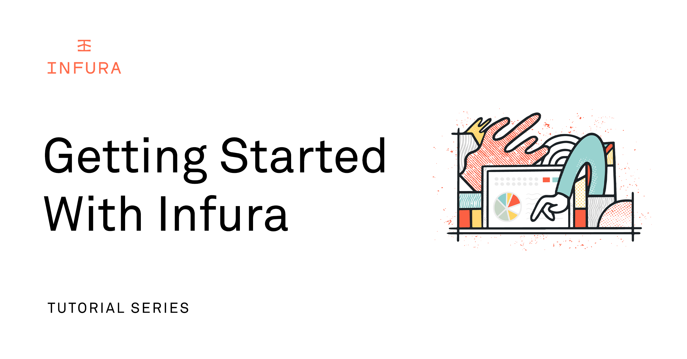

# First Steps in your Web3 Developer Journey with Ethereum using Infura

## Starting your developer journey in Web3 with Infura: Using the Infura Ethereum API, IPFS API and other Features!

Welcome to [Infura](https://infura.io/register)! We provide developers with simple, rock-solid, scalable access to Web3 tools and infrastructure. Our [Ethereum](https://infura.io/product/ethereum) and [IPFS API](https://infura.io/product/ipfs) suite serves and supports thousands of decentralized applications([dApps](https://ethereum.org/en/dapps/)) every day.

Major pieces of [web3](https://consensys.net/blog/blockchain-explained/what-is-web3-here-are-some-ways-to-explain-it-to-a-friend/) infrastructure run on Infura such as [Metamask](https://metamask.io/), [Uniswap](https://uniswap.org/) and [MakerDAO](https://makerdao.com/en/).  So when making the decision on how your dApp will access the blockchain, you can rest assured that Infura will grow with your dApp and provide the scalability and up-time that your users demand.

In this post, we’ll walk you through how to get started with Infura so you can connect to the Ethereum blockchain and focus on building awesome software!

**Topics covered:**

1.  Signing up for an [account](https://infura.io/register) and creating a new project
2.  Send a transaction to your Metamask wallet
3.  IPFS Operations
4.  Deploying a NFT smart contract
5.  Minting an NFT

**Learning Outcomes**

By the end of this article you will be able to use a React/Typescript project to programmatically send and lookup transactions on the Ethereum network, upload IPFS data and mint NFTs!

Let’s get started on your Web3 developer journey!

## Module One: Register and Create an Infura Project

First, let's [create an account](https://infura.io/register). [Protecting user information](https://consensys.net/privacy-policy/) is one of our core values. All you need is an email address to register!

Infura only uses your email address to communicate with you about critical service updates, new product and features releases and other event news.

For more information, check out the [Infura Docs](https://docs.infura.io/infura/getting-started)!

### Module 1.1: Create a Project

Verify your email, login and then you’ll be taken to your [Infura Dashboard](https://infura.io/dashboard).

**From this environment, you can:**

- Create projects([Docs](https://docs.infura.io/infura/getting-started#2.-create-a-project))
- View dapp analytics([Docs](https://docs.infura.io/infura/dashboard-stats))
- Access support and helpful resources([Support Resources](https://infura.io/support/ticket))
- Setup project security([Docs](https://infura.io/support/ticket))

Once you’re in, navigate to your Ethereum workspace and click “Create New Key”.

Check out the Infura Docs for more info on [creating a new project](https://docs.infura.io/infura/getting-started#2.-create-a-project).

### Module 1.2: Executing your First Request

Let’s test our new API credentials and query the Ethereum Mainnet for the current block number.

In your console, execute the following curl command:

    curl https://mainnet.infura.io/v3/[YOUR_API_KEY] \-X POST \-H "Content-Type: application/json" \-d '{"jsonrpc":"2.0","method":"eth_blockNumber","params":[],"id":1}'

Check out other [Ethereum JSON-RPC methods you can try](https://docs.infura.io/infura/networks/ethereum/json-rpc-methods)!

Learn more about [securing your project in the Infura Docs](https://docs.infura.io/infura/networks/ethereum/how-to/secure-a-project).

## Module Two: Send a Transaction using your Metamask Wallet

In this module, we are going to show you how to connect to an Infura Ethereum node with a React/Typescript application using [web3.js](https://web3js.readthedocs.io/en/v1.8.0/).

Keep in mind that all requests are `POST` requests. Check out this [Github Repository to follow along](https://github.com/anataliocs/Getting-Started-With-Infura)!

We will connect to your MetaMask wallet, send a transaction, and then review a transaction, all using the [Infura API](https://docs.infura.io/infura/networks/ethereum/json-rpc-methods).

Learn more about [Ethereum transactions](https://docs.infura.io/infura/networks/ethereum/concepts/transaction-types)!

**We will accomplish the following in Module Two:**

- Connect to your wallet
- Display the current balance of your wallet
- Send a transaction from one wallet address to another
- View the details of the transaction on the blockchain
- Review [code implementation](https://github.com/anataliocs/Getting-Started-With-Infura)

### Module 2.1: Configuration and Setup

Download and install the [Metamask wallet](https://metamask.io/).

Check out this article for [more information on getting started with Metamask](https://metamask.zendesk.com/hc/en-us/articles/360015489531-Getting-started-with-MetaMask)!

Get some testnet ETH for Sepolia using: [Infura's Free Faucet](https://www.infura.io/faucet).

**Setup your `.env` file in your project root directory:**

    # Send Transaction Variables
    NEXT_PUBLIC_ETHEREUM_NETWORK=goerli
    NEXT_PUBLIC_INFURA_PROJECT_ID=NEXT_PUBLIC_INFURA_PROJECT_SECRET=

**Clone the project locally:**

    git clone [emailprotected]:anataliocs/Getting-Started-With-Infura.git

Check out the project [README for more details on how to setup your local developer environment](https://github.com/anataliocs/Getting-Started-With-Infura/blob/main/README.md).

**Install dependencies:**

Install the [Yarn package manager here](https://yarnpkg.com/).

    yarn

**Run your app locally:**

    yarn dev

### Module 2.2: Execute a Transaction with Infura in the Browser

Navigate to [http://localhost:3000/](http://localhost:3000/) in a browser.

Ensure the _"Goerli"_ testnet is chosen in Metamask:

Then navigate to:  [http://localhost:3000/transaction/connect](http://localhost:3000/transaction/connect)

Click “_CONNECT WALLET”_ and follow the Metamask prompt to connect your wallet to the dapp.

Then click _“NEXT”_ to move to the transaction screen.

Enter in another ETH wallet address and the amount in ETH to transfer.

You can use this faucet donation address for example: _0x6Cc9397c3B38739daCbfaA68EaD5F5D77Ba5F455_

Then click submit and approve the transaction in Metamask. Copy the broadcasted transaction hash then click _“NEXT”_

Finally, you can review the transaction details. For additional information, click the _“View on [Etherscan](https://goerli.etherscan.io/)”_ link.

[Etherscan](https://etherscan.io/) is a Block Explorer and analytics platform for Ethereum.

Here is an example [transaction on Etherscan](https://goerli.etherscan.io/tx/0xdf72ce0e951feff3833f3f5fa09ad39ffb521e69bce75af15d181c097a336ba1).

Check out the [Getting Started with Infura Github Repository README for more info](https://github.com/anataliocs/Getting-Started-With-Infura/blob/main/README.md).

You can learn more about [sending Ethereum transaction in this tutorial](https://docs.infura.io/infura/tutorials/ethereum/send-a-transaction)!

### Module 2.3: Transaction Code Implementation

Now let’s dive into the [code](https://github.com/anataliocs/Getting-Started-With-Infura) and see what is happening behind the scenes to execute this Ethereum transaction on Infura.

The app is executing [Ethereum JSON RPC](https://docs.infura.io/infura/networks/ethereum/json-rpc-methods) calls based on the config parameters from your `.env` file.

**Setup Infura as a web3.js HttpProvider**

First off, the app server configures the Infura Ethereum node endpoint as a [HttpProvider](https://web3js.readthedocs.io/en/v1.7.5/web3-eth.html#providers).

On [line 4 of utils/transaction.ts](https://github.com/anataliocs/Getting-Started-With-Infura/blob/main/utils/transaction.ts#L4), we can see the `web3.js` library creating a new instance of `HttpProvider`:

**transaction.ts**

    // Configure the connection to an Ethereum node
    export const web3 = new Web3(
        new Web3.providers.HttpProvider(
            `https://${process.env.NEXT_PUBLIC_ETHEREUM_NETWORK}.infura.io/v3/${process.env.NEXT_PUBLIC_INFURA_PROJECT_ID}`)
    );

The `web3.js` library will now use your Infura endpoint for [Ethereum JSON RPC](https://docs.infura.io/infura/networks/ethereum/json-rpc-methods) calls.

**Getting your current ETH Balance**

After connecting your wallet, the app uses the [eth_getBalance](https://docs.infura.io/infura/networks/ethereum/json-rpc-methods/eth_getbalance) endpoint to display your balance.

On [line 24 of pages/api/transactions/getBalance.ts](https://github.com/anataliocs/Getting-Started-With-Infura/blob/main/pages/api/transactions/getBalance.ts#L24), we can see the following:

- Use `web3.js` to get the current balance of your wallet
- Convert that value from Wei to ETH using `web3.js`
- Return your wallet balance denominated in ETH

**getBalance.ts**

    const balanceWei = await web3.eth.getBalance(accountAddress);
    const balanceEther = await web3.utils.fromWei(balanceWei, 'ether');
    const balanceEtherNumber: number = +balanceEther;

    return res.status(200).json({
    	balance: balanceEtherNumber,
    });

This balance is then displayed!

On [line 81 of components/ConnectWallet.tsx](https://github.com/anataliocs/Getting-Started-With-Infura/blob/main/components/ConnectWallet.tsx#L81), the `walletBalance` is read from the Redux store and displayed

**ConnectWallet.tsx**

    

    	<EthereumIcon className={styles.card__balance_ethIcon} />
    	{parseFloat(walletBalance.toFixed(4))}
    

**Broadcast Transaction**

On the next page, after you enter in the destination address and the amount of ETH to send, the transaction is validated and broadcast to the Ethereum network.

The transfer web form is expressed on [line 130 of pages/transaction/transfer.tsx](http://pages/transaction/transfer.tsx).

**transfer.tsx**

    <TextInput
    	label="Address" id="toAddress" value={transferToAddress}
    	onChange={(event) => {
    		const target = event.target as HTMLInputElement;
    		setTransferToAddress(target.value);
    	}}
    	helperText="The address you want to send ETH to"
    	containerClassName={styles.card__input}
    	labelClassName={styles.card__input1_label}
    />
    <TextInput
    	label="Amount" id="amount" type="number"  value={transferAmount}
    	onChange={(event) => {
    		const target = event.target as HTMLInputElement;
    		setTransferAmount(target.value);
    	}}
    	helperText="Enter the amount in ETH"
    	containerClassName={styles.card__input}
    	labelClassName={styles.card__input2_label}
    	step="any"
    />

Sending a transaction uses the [eth_sendTransaction](https://docs.infura.io/infura/networks/ethereum/json-rpc-methods/eth_sendtransaction) endpoint.

Then the `handleTransactionSubmit` function handles sending the request.

On [line 44 of pages/transaction/transfer.tsx](https://github.com/anataliocs/Getting-Started-With-Infura/blob/main/pages/transaction/transfer.tsx#L44), the `eth_sendTransaction` request is submitted asynchronously and then a transaction hash is returned.

**transfer.tsx**

    const txHash = await ethereum.request({
    	method: 'eth_sendTransaction',
    	params: [
    		{
    			from: account,
    			to: transferToAddress,
    			value: amt,
    		},
    	],
    });

**Get the Transaction Details**

After the transaction completes successfully, on [line 27 of pages/api/transactions/getTransaction.ts](https://github.com/anataliocs/Getting-Started-With-Infura/blob/main/pages/api/transactions/getTransaction.ts#L27), the backend uses the [web3.js library](https://web3js.readthedocs.io/en/v1.7.5/) to execute the request and get the transaction details which are then stored in [Redux](https://redux.js.org/).

[Redux](https://redux.js.org/) is a library to help manage state in [React](https://reactjs.org/) applications.

**getTransactions.ts**

    const transaction = await Web3.eth.getTransaction(txHash);

    if (transaction) {
    	useTransactionStore.setState({
    	transaction: transaction,
    });

**Display Transaction Details**

The following transaction details are then displayed:

- Transaction Hash
- Transaction From Address
- Transaction To Address

**transfer.tsx**

    

    	

    	<ReadOnly
    		label="Transaction Hash"
    		value={transaction.hash}
    		copyable
    	/>
    	<HelpText className={styles.helpText}>
    		Copy the transaction hash to review the transaction in the
    		next step
    	</HelpText>
    	

    <ReadOnly label="Sent From" value={transaction.from} />
    <ReadOnly label="Sent To" value={transaction.to} />
    

After clicking _“Next”_, you then can review the transaction, entering in the transaction hash to again display the transaction data.

Check out the Infura docs to learn about other [Ethereum JSON RPC endpoints](https://docs.infura.io/infura/networks/ethereum/json-rpc-methods).

You can dive deeper into [Ethereum Developer Onboarding and learn more about Ethereum on our Developer Portal](https://consensys.net/developers/onboarding-step-1/).

## Module Three: Uploading and Pinning Image data to IPFS

Now let’s walk through uploading and pinning image data to IPFS using Infura.

**We will accomplish the following in Module Three:**

- Upload and pin data to IPFS
- Retrieve IPFS data
- Review [code implementation](https://github.com/anataliocs/Getting-Started-With-Infura)

### Module 3.1: Update your .env config

First, we will need to create a new project on Infura and then update your `.env` file with your [Infura IPFS](https://docs.infura.io/infura/networks/ipfs) project.

Go to your Infura dashboard and just like in Module 1, create a new project.  Except this time select IPFS for network.

Navigate to your project root directory and execute the command:

    vi .env

Then scroll down in your `.env` file and update the IPFS variables with the info from your Infura IPFS project:

    # IPFS Variables
    NEXT_PUBLIC_INFURA_IPFS_ENDPOINT=
    NEXT_PUBLIC_INFURA_IPFS_PROJECT_ID=
    NEXT_PUBLIC_INFURA_IPFS_PROJECT_SECRET=

### Module 3.2: Upload and Pin Image Data to IPFS with Infura

Navigate to [http://localhost:3000/ipfs/upload](http://localhost:3000/ipfs/upload) in a browser.

Select an Image file to upload, enter in the name, description and metadata.

To learn more about NFT metadata check out these links:

- [https://docs.opensea.io/docs/metadata-standards](https://docs.opensea.io/docs/metadata-standards)
- [https://www.nftstandards.wtf/NFT/NFT+Metadata](https://www.nftstandards.wtf/NFT/NFT+Metadata)
- [https://www.nftstandards.wtf/NFT+Standards+Wiki+-+READ.me](https://www.nftstandards.wtf/NFT+Standards+Wiki+-+READ.me)

After clicking upload, the image will be uploaded to IPFS via Infura and then the following fields will be displayed:

- Image
- File Name
- File Size
- Name
- IPFS Hash

Copy the generated `IPFS` Hash and click _“NEXT”_.

### Module 3.3: Retrieve IPFS Data with Infura

After clicking next you will be brought to the display page.

Enter in the generated IPFS hash from the previous step and click _“SUBMIT”_.

The app will then lookup the file data from IPFS and display it for you!

### Module 3.4: Code Implementation of IPFS Image Upload

Now let’s take a look at the code used to accomplish this operation.

**IPFS Upload Form**

First up, is the form used to upload the file.

The IPFS upload webform is defined on [line 286 of components/IPFSUploadForm.tsx](https://github.com/anataliocs/Getting-Started-With-Infura/blob/main/components/IPFSUploadForm.tsx#L286).

These snippets of code demonstrate how the web form handles:

- File upload
- File details fields
- Metadata

**IPFSUploadForm.tsx - File upload**

    …
    

    	<h1 className={styles.ipfs__header}>Upload Document</h1>
    	
 e.preventDefault()}
    		onDrop={(e) => handleFileDrop(e)}
    	>
    	{!fileData && (
    		
 e.preventDefault()}
    			onDrop={(e) => handleFileDrop(e)}
    		>
    	

    		Drag and drop a file to upload
    	

    	<input
    		type="file"
    		className={styles['ipfs__file-input']}
    		onChange={(e) => handleFileSelect(e.currentTarget.files)}
    	/>
    	

    		File types supported png, jpg, json
    	

    	<UploadIcon />
    

    )}

    	{!!fileData && (
    		

    		
File Added

    		{imagePreview()}
    		
{fileData.name}
    		

    		

    			{calculateFileSize(fileData.size)}
    		

    		<IconButton
    			onClick={handleFileReset}
    			className={styles['ipfs__close-icon']}
    			flat
    		>
    		<CloseWithBGIcon />
    		</IconButton>
    		

    	)}
    

    …

**IPFSUploadForm.tsx - File details**

    
File Details

    

    	<TextInput
    		label="Name"
    		id="ipfs-name"
    		type="text"
    		placeholder="Enter Name"
    		onChange={(e) => setMetaName(e.currentTarget.value)}
    		value={metaName}
    		containerClassName={styles['ipfs__input-row']}
    		labelClassName="bg-[#0E0E0E]"
    	/>
    	<TextInput
    		label="Description"
    		id="ipfs-description"
    		type="text"
    		placeholder="Enter Description"
    		onChange={(e) =>
            	setMetaDescription(e.currentTarget.value)}
    		value={metaDescription}
    		containerClassName={styles['ipfs__input-row']}
    		labelClassName="bg-[#0A0A0A]"
    	/>
    

**IPFSUploadForm.tsx - File metadata**

    
Metadata

    	{metaDataList.map((data, index) => {return (
    	

    		<TextInput
    			label="Attribute Name"
    			id={`meta-name-${index}`}
    			type="text"
    			placeholder="Enter Attribute Name"
    			value={data[MetaDataKeys.traitType]}
    			onChange={(e) =>
    			setMetaItem(e, index, MetaDataKeys.traitType)}
    			containerClassName={styles['ipfs__meta-input']}
    			labelClassName="bg-[#060606]"
    		/>

    		<TextInput
    			label="Attribute Value"
    			id={`meta-value-${index}`}
    			type="text"
    			placeholder="Enter Attribute Value"
    			value={data[MetaDataKeys.value]}
    			onChange={(e) =>
    			setMetaItem(e, index, MetaDataKeys.value)}
    			containerClassName={styles['ipfs__meta-input']}
    			labelClassName="bg-[#060606]"
    		/>
    		{addSubtractButton(index)}
    	

    	);
    	})}

    <PrimaryButton
    	className={styles['ipfs__primary-btn']}
    	onClick={handleFileUpload}
    	disabled={isLoading || !uploadReady()}
    	isLoading={isLoading}
    >
    Upload
    </PrimaryButton>

This form will handle validation and failure conditions as well.

**IPFS Upload Operation**

Now let’s look at how the actual `IPFS` upload is performed.  We are using the [IFPS Upload JavaScript HTTP RPC API client library](https://github.com/ipfs/js-ipfs/tree/master/packages/ipfs-http-client). This client library is built with [TypeScript](https://www.typescriptlang.org/) and implements the [IPFS Core API](https://github.com/ipfs/js-ipfs/tree/master/docs/core-api) which is compatible with an embedded `js-ipfs` node or any remote IPFS node. There are also a set of utility functions.

This library is imported via [NPM](https://www.npmjs.com/).  Check out more info about the [ipfs-http-client NPM package](https://www.npmjs.com/package/ipfs-http-client).

The specific version of the library is defined in the `package.json` file.

**package.json**

    "ipfs-http-client": "^56.0.2",

**Import and Define the IPFS Http Client**

The `IPFSHTTPClient` is imported into `IPFSUploadForm.tsx`.

The `IPFSHTTPClient` is import statement is defined on [line 11 of components/IPFSUploadForm.tsx](https://github.com/anataliocs/Getting-Started-With-Infura/blob/main/components/IPFSUploadForm.tsx#L11).

**IPFSUploadForm.tsx**

    import { IPFSHTTPClient } from 'ipfs-http-client';

Then the client is defined as constant to be used later.

The `IPFS` client instantiation is defined on [line 66 of components/IPFSUploadForm.tsx](https://github.com/anataliocs/Getting-Started-With-Infura/blob/main/components/IPFSUploadForm.tsx#L66).

**IPFSUploadForm.tsx**

    const client: IPFSHTTPClient | undefined = useMemo(() => {
    	return ipfs_client();
    }, []);

**Use Client to perform IPFS Upload**

The `ipfs_add` function of the client is invoked, passing in the upload data and errors are logged to console.

Learn more about the [IPFS Core API function to import a file or data into IPFS](https://github.com/ipfs/js-ipfs/blob/master/docs/core-api/FILES.md#ipfsadddata-options).

**IPFSUploadForm.tsx**

    const ipfs_add = async (
    	uploadData: File | string
    ): Promise<AddResult | undefined> => {
    	if (client) {
    		try {
    			const response: AddResult = await client.add(uploadData);
    		return response;
    		} catch (err) {
    			console.log(err);
    		}
    		}
    	};

**Display IFPS Details**

Next, let’s take a look at how the uploaded and pinned IPFS file details are displayed after a successful upload.

**Display IPFS File Web Form**

After successfully uploading the file and hitting the next button, you will navigate to the Display File Form.

The display file form is defined on [line 144 of pages/ipfs/display.tsx](https://github.com/anataliocs/Getting-Started-With-Infura/blob/main/pages/ipfs/display.tsx#L141).

**display.tsx**

    const hashForm = (): JSX.Element => {
    	return (
    		

    		<h1 className={styles.ipfs__header}>Display File</h1>
    		<TextInput
    			label="IPFS Hash"
    			id="ipfs-hash"
    			type="text"
    			placeholder="Enter IPFS Hash"
    			value={metaHash}
    			onChange={(e) => setMetaHash(e.currentTarget.value)}
    			containerClassName={styles['ipfs__input-row']}
    			labelClassName="bg-[#121212]"
    		/>
    	<PrimaryButton
    		className={styles['ipfs__primary-btn']}
    			onClick={() => requestAllData()}
    			disabled={isLoading || metaHash === ''}
    			isLoading={isLoading}
    	>
    	Submit
    	</PrimaryButton>
    	

    	);
    };

**Lookup IPFS File Data via Hash**

The hash you generated during the upload step will now be used to lookup the IPFS data. The `ipfs-http-client` is imported and instantiated in the same manner as in `IPFSUploadForm.tsx`.

After entering in the IPFS hash and clicking submit, the `IPFS HTTP Client` cat function is invoked.

This functionality is defined on [line 75 of pages/ipfs/display.tsx](https://github.com/anataliocs/Getting-Started-With-Infura/blob/main/pages/ipfs/display.tsx#L75).

This call returns an async iterable that yields `Uint8Array` objects with the contents of path which are then parsed and stored to be displayed.

Learn more about the [IPFS Core API function to returns a file addressed by a valid IPFS Path](https://github.com/ipfs/js-ipfs/blob/master/docs/core-api/FILES.md#ipfscatipfspath-options).

**display.tsx**

    const ipfs_get = async (hash: string): Promise<Uint8Array | undefined> => {
    	if (client) {
    		try {
    			const response: Uint8Array[] = [];
    			let responseLength = 0;
    			for await (const buf of client.cat(hash)) {
    			response.push(buf);
    			responseLength += buf.length;
    		}
    	if (responseLength) {
    		const mergedArray = new Uint8Array(responseLength);
    		let offset = 0;
    		response.map((el) => {
    		mergedArray.set(el, offset);
    		offset += el.length;
    	});
    	return mergedArray;
    	}
    	} catch (err) {
    		setError('Unexpected error occured, please try again.');
    	}
    	}
    };

**Display Data returned by IPFS Cat Function**

Finally, we take the response from our `IPFS HTTP Client` call and display that data.

The display elements are defined on [line 167 of pages/ipfs/display.tsx](https://github.com/anataliocs/Getting-Started-With-Infura/blob/main/pages/ipfs/display.tsx#L167).

**display.tsx**

    const resultDisplay = (): JSX.Element | undefined => {
    	if (!metadata || !objectUrl) {
    		return;
    	}

    return (
    	

    	<h1 className={styles.ipfs__header}>Display File</h1>
    	
Image

    	

    	
Details

    	

    	

    	<ReadOnly
    		className={styles['ipfs__grid-data--left']}
    		label="Name"
    		value={metadata.name}
    	/>
    	<ReadOnly label="Size" value={getAttributeValue('fileSize')} />
    	

    	

    		<ReadOnly
    			label="IPFS Hash"
    			value={getAttributeValue('objectHash')}
    			copyable
    		/>
    	

    	

    		<ReadOnly label="Description" value={metadata.description} />
    	

    

    
Attributes

    

    	{filteredAttributes().map((el: MetaData, index: number) => {
    	return (
    	

    		

    		{el[MetaDataKeys.traitType]}
    		

    		
{el[MetaDataKeys.value]}

    	

    	);
    })}

    

    

    

    	

    	Congrats on finishing the tutorial, to view more
    	information on your
    	file view on IPFS
    	

    	<Link
    	href={`https://ipfs.infura.io/ipfs/${getAttributeValue(
    	'objectHash'
    	)}`}
    	target="_blank"
    	className={`mt-3 flex flex-row items-center justify-center
    	hover-within:text-white ${styles.settings__documentation_link}`}
    	>

    View file on IPFS
    <ChevronRight />
    </Link>
    

    

    );
    };

Now you know how to leverage the `IPFS HTTP client` to upload and retrieve `IPFS` data using Infura!

In the next module, we will use this `IPFS` data to mint an `NFT` on testnet.

Module Four: Minting a NFT on Testnet

---

Now let’s actually mint a NFT on testnet with Infura. You can learn more about [NFT standards such as ERC-721 and ERC-1155](https://blog.infura.io/post/comparing-nft-standards-erc-721-vs-erc-721a-vs-erc-1155) in another article on the Infura blog!

Interested in learning more about the basics of NFTs? Check out our video, [NFT Crash Course](https://www.youtube.com/watch?v=fXEIUREpDgA), featured on [Microsoft Inspire 2022](https://inspire.microsoft.com/en-US/home).

**We will accomplish the following in Module Four:**

- Deploy a NFT smart contract
- Mint a NFT
- Review the code implementation

### Module 4.1: Deploy NFT Smart Contract and Update .env File

First, we need to deploy our NFT contract to a Ethereum [testnet](https://ethereum.org/en/developers/docs/networks/#ethereum-testnets). Alternatively, you can use the hash of an already existing deployed version of this contract.

Navigate to your project root directory and execute the following command:

    truffle migrate -—network goerli

This will deploy your smart contract to the `goerli` test network. Copy the hash of the deployed contract.

[Truffle](https://trufflesuite.com/) is a development environment, testing framework and asset pipeline for Ethereum and other EVM-compatible blockchains.

Learn more about [deploying smart contracts using Truffle in this tutorial](https://docs.infura.io/infura/tutorials/ethereum/deploy-a-contract-using-truffle).

Then open up your `.env` file and update the _“Minting variable section”._

    WALLET_MNEMONIC=
    NEXT_PUBLIC_MINTING_ETHEREUM_NETWORK=goerli
    NEXT_PUBLIC_MINTING_INFURA_PROJECT_ID=
    NEXT_PUBLIC_SMART_CONTRACT_ADDRESS=

If you are not interested in deploying the contract you can use this pre-deployed contract hash in your `.env` file: _[0x2C017A0E568B158a34e86D463e515BED2DDBB3f2](https://goerli.etherscan.io/address/0x2C017A0E568B158a34e86D463e515BED2DDBB3f2)_

### Module 4.2: Mint an NFT with Infura in the Browser

Navigate to [http://localhost:3000/mint/upload](http://localhost:3000/mint/upload) in your browser.

Similar to the previous module, we will start by uploading an image to IPFS. Fill out the relevant fields and click _“UPLOAD”_.

After successfully performing an upload, you will get an IPFS Hash that you need to copy for the next step. Copy that hash and click _“NEXT”_.

On the next page, enter in your `IFPS` url and click submit.

Your Metamask wallet will then prompt you to confirm the transaction. Then finally, you will see the details of the NFT you just minted!

### Module 4.3: Mint an NFT Code Implementation Walkthrough

First, a similar upload web form is used to upload to IPFS as the previous module. Then let’s check out the code used to mint an NFT.

After the IPFS upload, the next screen prompts you to input the IPFS metadata `tokenURI`.

This web form is defined [on line 105 of pages/mint/mint.tsx](https://github.com/anataliocs/Getting-Started-With-Infura/blob/main/pages/mint/mint.tsx#L105).

**mint.tsx**

    const addTokenForm = () => {
    return (
    	

    	<h1 className={styles.mint__header}>Mint NFT</h1>
    	<TextInput
    		label="Metadata token URI"
    		id="token-uri"
    		type="text"
    		placeholder="Enter IPFS metadata token URI"
    		value={tokenURI}
    		onChange={(e) => setTokenURI(e.currentTarget.value)}
    		containerClassName={styles['mint__input-row']}
    		labelClassName="bg-[#121212]"
    	/>

    	<PrimaryButton
    		className={styles['mint__primary-btn']}
    		onClick={() => submitForMinting()}
    		disabled={isLoading || tokenURI === ''}
    		isLoading={isLoading}
    	>

    	Submit
    	</PrimaryButton>
    	

    );
    };

After clicking submit, the `submitForMinting()` function is executed which calls `performMinting()`.

The function to perform the mint is defined [on line of 45 of pages/mint/mint.tsx](https://github.com/anataliocs/Getting-Started-With-Infura/blob/main/pages/mint/mint.tsx#L45).

This function gets an instance of the NFT smart contract then executes the mint function passing in the `address` and `tokenURI`.

**mint.tsx**

    const performMinting = async (): Promise<string> => {
    const { ethereum } = window;
    if (!ethereum) {
    	throw 'We could not detect your wallet.
        Please download the MetaMask extension.';
    }

    const smartContractAddress = process.env.NEXT_PUBLIC_SMART_CONTRACT_ADDRESS;
    await ethereum.request({
    	method: 'eth_requestAccounts',
    });

    const nftContract = new web3.eth.Contract(
    	NFTDemoContract.abi as AbiItem[],
    	smartContractAddress
    );

    try {
    	const tx = {
    	to: smartContractAddress,
    	from: ethereum.selectedAddress,
    	gas: '200000',
    	data: nftContract.methods
    	.mint(ethereum.selectedAddress, tokenURI)
    	.encodeABI(),
    };

    const receipt = await ethereum.request({
    	method: 'eth_sendTransaction',
    	params: [tx],
    });

    return receipt;
    } catch (err) {
    	throw 'Oops, something went wrong minting your NFT.';
    }
    };

**Working with NFTs with Traditional Web2 REST APIs**

You can also use the [Infura NFT API](https://infura.io/use-cases/nft) to mint NFTs without the need for smart contracts using our `REST API`. Check out the [NFT Dashboard project on Github](https://github.com/anataliocs/Infura-NFT-Dashboard) to learn more about using the `[NFT API](https://docs.infura.io/infura/infura-custom-apis/nft-sdk)` in a `Java/React` project.

# Next steps

Congratulations! You’ve completed the Getting Started with Infura developer journey!

You’ve learned a lot over the course of completing the modules in this article. You should be proud of yourself!

- You can now use a React/Typescript project to programmatically send and lookup transactions on the Ethereum network
- Upload IPFS data
- Deploy Solidity Smar Contracts
- Mint NFTs
- And more!

In the next article, we will go over Infura notifications, [filters and subscriptions](https://docs.infura.io/infura/networks/ethereum/concepts/filters-and-subscriptions), [Dashboard stats](https://docs.infura.io/infura/dashboard-stats), [Ethereum archive data](https://docs.infura.io/infura/features/archive-data), other L1 blockchains, [Ethereum L2s](https://docs.infura.io/infura/tutorials/layer-2-networks) and more!

### Additional Resources to Continue your Web3 Developer Journey

Check out these resources to continue building your web3 developer skillset and to learn more about the ecosystem.

You can follow along with additional [Infura Tutorials here](https://docs.infura.io/infura/tutorials/ethereum)!

If you’re looking for a formal Ethereum developer program you can look into our [ConsenSys Developer Bootcamp](https://consensys.net/academy/bootcamp/).

There are also many free ConsenSys and community resources available as well!

If you need to ramp up on [Unix/Linux environments, command line, code editors, Git, Javascript, Node.js and web frameworks check out ConsenSys Basic Training](https://courses.consensys.net/courses/bootcamp-basic-training).

Also, check out the [LearnWeb3 DAO](https://learnweb3.io/) for a detailed, project-oriented approach to learning Web3 development and earn some NFTs along the way!

**Check out our ConsenSys Developer Portal Articles**

- [Get set up with MetaMask, connect to a testnet, and send your first transaction on the Ethereum blockchain](https://consensys.net/developers/onboarding-step-1/)
- [Get set up with Truffle, Ganache, create your own smart contract, and explore Remix](https://consensys.net/developers/onboarding-step-1/)
- [Get set up with Infura, write a smart contract, connect to Ropsten, and tie everything together with React](https://consensys.net/developers/onboarding-step-3/)

**Newsletters**

- [ConsenSys' Newsletters](https://consensys.net/newsletters/) (SIGNAL, STATE OF CHANGE, ENTERPRISE)
- [The Defiant](https://thedefiant.substack.com/) on substack
- [WeekInEthereum news](https://weekinethereumnews.com/)
- [Ethhub](https://ethhub.substack.com/) on substack
- [Decrypt](https://decrypt.co/news)
- [Daily Gwei by Anthony Sassano](https://thedailygweifr.substack.com/)
- [Rapture by Mattison](https://rapture.ghost.io/)

**YouTube**

- [Infura](https://www.youtube.com/c/Infura)
- [Eat the Blocks](https://www.youtube.com/c/EatTheBlocks)
- [Finematics](https://www.youtube.com/c/Finematics)
- [Whiteboard Crypto](https://www.youtube.com/c/WhiteboardCrypto)
- [The Defiant](https://www.youtube.com/c/TheDefiant)
- [Web3 Unleashed with Emily Lin](https://www.youtube.com/playlist?list=PLVGaL7nFtvpBnLGcWnNRQsIAB3Fs-0Exx)

And finally, check out [Speedrun Ethereum by Austin Griffith of the Ethereum Foundation](https://speedrunethereum.com/)!

Good luck on your continuing developer journey into Web3!

---

_Inspired to join the revolutionary world of blockchain? Check out_ [_https://consensys.net/careers/_](https://consensys.net/careers/) _today!_

_Want to get started on your journey as a Web3 developer?_ [_https://infura.io/register_](https://infura.io/register?utm_source=github&utm_medium=devcommunity&utm_campaign=2022_Jul_devrel-sample-projects_content_content)

_Read more stories like this at:_ [_https://blog.infura.io/_](https://blog.infura.io/)

_**Follow Infura:**_

- **[_https://twitter.com/infura_io_](https://twitter.com/infura_io)**
- **[_https://discord.gg/RF7N6RHaV8_](https://discord.gg/RF7N6RHaV8)**
- **[_https://www.linkedin.com/company/infuraio/_](https://www.linkedin.com/company/infuraio/)**
- **[_https://github.com/INFURA_](https://github.com/INFURA)**
- **[_https://www.youtube.com/c/Infura_](https://www.youtube.com/c/Infura)**

Chris Anatalio
Platform Advocate for Infura
