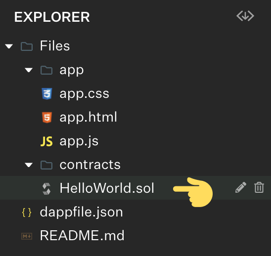
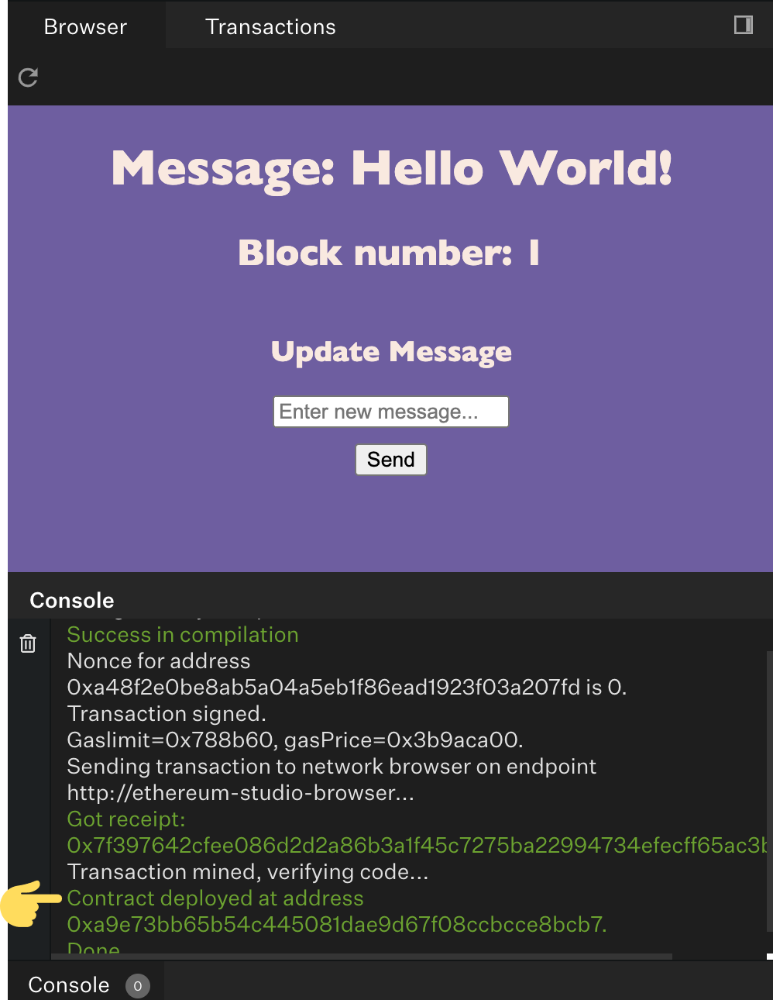

<InfoBanner emoji=":wave:"> Use Ethereum studio to code along with this tutorial.{" "}<a href="https://studio.ethereum.org/5f575dc426b4730012368389?openFile=README.md">Launch Studio</a></InfoBanner>

This tutorial will teach you how to:

- Deploy an Ethereum smart contract written in the Solidity programming language.
- Fetch your contract's state from the blockchain and render it to a frontend using a JavaScript library.
- Update state variables of your deployed contract by interacting with your app in the IDE's Browser.

## Introduction to the Ethereum Studio IDE

Ethereum Studio is a web-based IDE where you can write, deploy and test smart contracts, and build a frontend application to interact with them.

On the left side of this IDE, you can find the Explorer panel (the folder icon). Here you can view the file structure of your project. You can toggle the folder icon on the far left to hide or display this panel.

On the right side this IDE, you can find the Preview panel, where you can view this project's application in the Browser tab. You can toggle the panel icon on the far right to hide or display this preview.

## The smart contract

First, let's take a look at the smart contract.

Use the Explore panel to navigate to the Files/contracts/HelloWorld.sol file.

Every smart contract runs at an address on the Ethereum blockchain. You must compile and deploy a smart contract to an address before it can run. When using Studio, your browser simulates the network, but there are several test networks and one main network for the Ethereum blockchain.

1. **Compile**

Before you deploy the `HelloWorld.sol` contract, you should understand compilation. [Solidity](https://solidity.readthedocs.io/en/latest/) is a compiled language, and you need to convert the Solidity code into bytecode before the contract can run. Ethereum Studio automatically compiles the code every time you save your changes (manually by clicking the floppy disk icon at the top of a file) or when performing a deployment.

2. **Deploy**

Now let's deploy the `HelloWorld.sol` contract. Again, in the left panel of the IDE, you can find the Deploy panel (the rocket icon). Here you can configure and deploy your contract to your local network.

Configuring the contract allows you to set the name of the contract as well as the contract's `message` variable by specifying the initial value sent to the constructor function. Configure the contract within the Deploy panel by selecting the "Configure" option.

Then deploy the contract by selecting the "Deploy" button within the Deploy panel.

You should now see the deployed contract's message `variable` displayed on the IDE's Browser as well as output from the transaction in the IDE's console (on the lower right side of the IDE).

3. **Interact**

Now look at the Interaction panel on the left side of this IDE (the mouse icon).

Here you view and interact with your deployed contract using its functions. Try updating the message variable using the update function. This creates a new Ethereum transaction and you should see the message update in the IDE's Browser.

## The web app (dapp)

Often when creating an Ethereum smart contract, it's useful to create a web application for users to interact with. We call these applications "dapps". Dapps on Ethereum are web applications backed by Ethereum smart contracts. Instead of using a centralized server or database, these applications rely on the blockchain as a backend for program logic and storage.

Dapps typically use a JavaScript convenience library that provides an API to make integrations with smart contract easier for developers. In this project, you are using web3.js.

This tutorial won't cover the HTML or CSS since it's not specific to a dapp, although it's worth noting that this application uses jQuery to manipulate the HTML (of Files/app/app.html) that is ultimately rendered in the IDE's Browser.

Let's take a look at our application logic.

Use the Explore panel to navigate to the Files/app/app.js file.
Return here once you've read through the file.

## Interact

Now that you have an understanding of the logic, let's use the app UI to interact with the contract!

Try using the form in the IDE's Browser to set the `message` variable on the contract. Submitting the form should trigger the JavaScript function, `setMessage`, which creates an Ethereum transaction to call the `update` function on the smart contract. The new state is then read from the contract and updated in the Browser.

**Congratulations! You've made it through our first tutorial. You've taken your first big step towards developing on Ethereum.**
