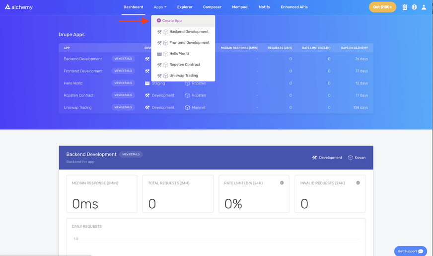
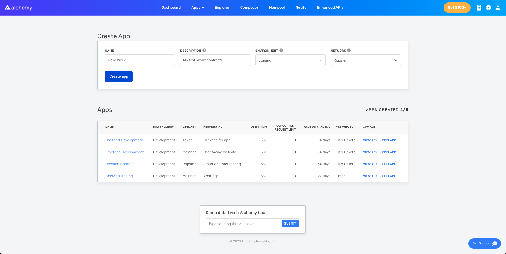
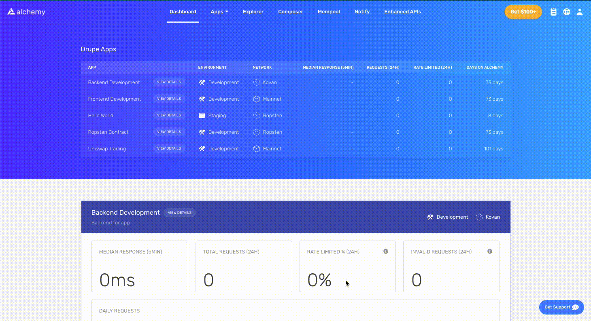
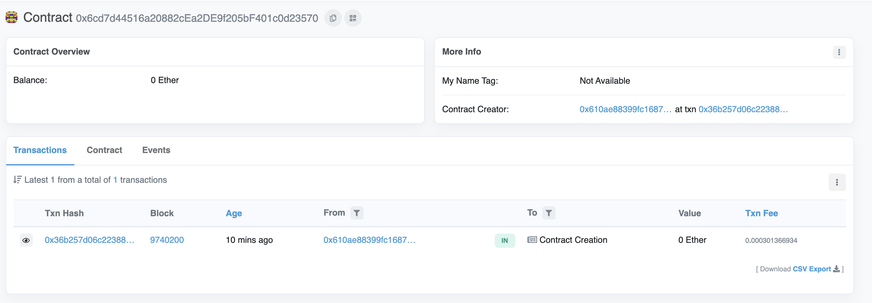
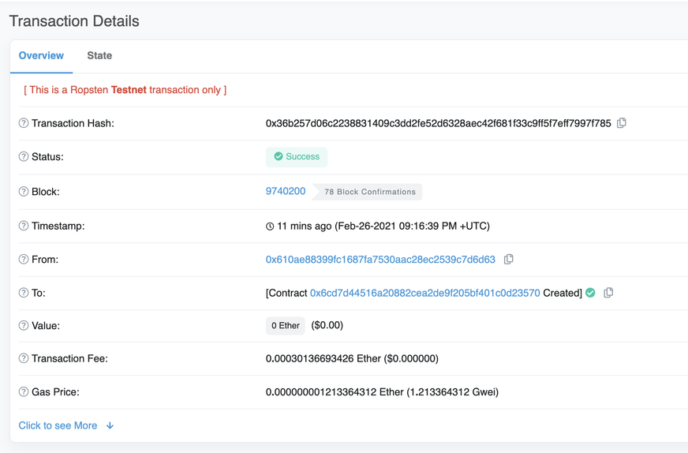

If you are new to blockchain development and don’t know where to start, or if you just want to understand how to deploy and interact with smart contracts, this guide is for you. We will walk through creating and deploying a simple smart contract on the Goerli test network using a virtual wallet [MetaMask](https://metamask.io/), [Solidity](https://docs.soliditylang.org/en/v0.8.0/), [Hardhat](https://hardhat.org/), and [Alchemy](https://alchemyapi.io/eth) (don’t worry if you don’t understand what any of this means yet, we will explain it).

In [part 2](https://docs.alchemy.com/docs/interacting-with-a-smart-contract) of this tutorial we’ll go through how we can interact with our smart contract once it’s deployed here, and in [part 3](https://docs.alchemy.com/docs/submitting-your-smart-contract-to-etherscan) we’ll cover how to publish it on Etherscan.

If you have questions at any point feel free to reach out in the [Alchemy Discord](https://discord.gg/gWuC7zB)!

## Step 1: Connect to the Ethereum network {#step-1}

There are many ways to make requests to the Ethereum chain. For simplicity, we’ll use a free account on Alchemy, a blockchain developer platform and API that allows us to communicate with the Ethereum chain without having to run our own nodes. The platform also has developer tools for monitoring and analytics that we’ll take advantage of in this tutorial to understand what’s going on under the hood in our smart contract deployment. If you don’t already have an Alchemy account, [you can sign up for free here](https://dashboard.alchemyapi.io/signup).

## Step 2: Create your app (and API key) {#step-2}

Once you’ve created an Alchemy account, you can generate an API key by creating an app. This will allow us to make requests to the Goerli test network. If you’re not familiar with testnets, check out [this page](/developers/docs/networks/).

1.  Navigate to the “Create App” page in your Alchemy Dashboard by hovering over “Apps” in the nav bar and clicking “Create App”



2. Name your app “Hello World”, offer a short description, select “Staging” for the Environment (used for your app bookkeeping), and choose “Goerli” for your network.



3. Click “Create app” and that’s it! Your app should appear in the table below.

## Step 3: Create an Ethereum account (address) {#step-3}

We need an Ethereum account to send and receive transactions. For this tutorial, we’ll use MetaMask, a virtual wallet in the browser used to manage your Ethereum account address. More on [transactions](/developers/docs/transactions/).

You can download and create a MetaMask account for free [here](https://metamask.io/download.html). When you are creating an account, or if you already have an account, make sure to switch over to the “Goerli Test Network” in the upper right (so that we’re not dealing with real money).


## Step 4: Add ether from a Faucet {#step-4}

In order to deploy oursmart contract to the test network, we’ll need some fake Eth. To get Eth you can go to the [Goerli faucet](https://goerlifaucet.com/) and log into your Alchemy account and enter your wallet address, then click “Send Me Eth.” It may take some time to receive your fake Eth due to network traffic. (At the time of writing this, it took around 30 minutes.) You should see Eth in your Metamask account soon after!

## Step 5: Check your Balance {#step-5}

To double check our balance is there, let’s make an [eth_getBalance](https://docs.alchemyapi.io/alchemy/documentation/alchemy-api-reference/json-rpc#eth_getbalance) request using [Alchemy’s composer tool](https://composer.alchemyapi.io?composer_state=%7B%22network%22%3A0%2C%22methodName%22%3A%22eth_getBalance%22%2C%22paramValues%22%3A%5B%22%22%2C%22latest%22%5D%7D). This will return the amount of ETH in our wallet. After you input your MetaMask account address and click “Send Request”, you should see a response like this:

```json
{ "jsonrpc": "2.0", "id": 0, "result": "0x2B5E3AF16B1880000" }
```

> **NOTE:** This result is in wei not ETH. Wei is used as the smallest denomination of ether. The conversion from wei to ETH is: 1 eth = 10<sup>18</sup> wei. So if we convert 0x2B5E3AF16B1880000 to decimal we get 5\*10¹⁸ which equals 5 ETH.
>
> Phew! Our fake money is all there <Emoji text=":money_mouth_face:" size={1} />.

## Step 6: Initialize our project {#step-6}

First, we’ll need to create a folder for our project. Navigate to your command line and type:

```
mkdir hello-world
cd hello-world
```

Now that we’re inside our project folder, we’ll use `npm init` to initialize the project. If you don’t already have npm installed, follow [these instructions](https://docs.alchemyapi.io/alchemy/guides/alchemy-for-macs#1-install-nodejs-and-npm) (we’ll also need Node.js so download that too!).

```
npm init
```

It doesn’t really matter how you answer the installation questions, here is how we did it for reference:

```
package name: (hello-world)
version: (1.0.0)
description: hello world smart contract
entry point: (index.js)
test command:
git repository:
keywords:
author:
license: (ISC)
About to write to /Users/.../.../.../hello-world/package.json:

{
  "name": "hello-world",
  "version": "1.0.0",
  "description": "hello world smart contract",
  "main": "index.js",
  "scripts": {
     "test": "echo \\"Error: no test specified\\" && exit 1"
  },
  "author": "",
  "license": "ISC"
}
```

Approve the package.json and we’re good to go!

## Step 7: Download [Hardhat](https://hardhat.org/getting-started/#overview) {#step-7}

Hardhat is a development environment to compile, deploy, test, and debug your Ethereum software. It helps developers when building smart contracts and dapps locally before deploying to the live chain.

Inside our `hello-world` project run:

```
npm install --save-dev hardhat
```

Check out this page for more details on [installation instructions](https://hardhat.org/getting-started/#overview).

## Step 8: Create Hardhat project {#step-8}

Inside our project folder run:

```
npx hardhat
```

You should then see a welcome message and option to select what you want to do. Select “create an empty hardhat.config.js”:

```
888    888                      888 888               888
888    888                      888 888               888
888    888                      888 888               888
8888888888  8888b.  888d888 .d88888 88888b.   8888b.  888888
888    888     "88b 888P"  d88" 888 888 "88b     "88b 888
888    888 .d888888 888    888  888 888  888 .d888888 888
888    888 888  888 888    Y88b 888 888  888 888  888 Y88b.
888    888 "Y888888 888     "Y88888 888  888 "Y888888  "Y888

👷 Welcome to Hardhat v2.0.11 👷‍?

What do you want to do? …
Create a sample project
❯ Create an empty hardhat.config.js
Quit
```

This will generate a `hardhat.config.js` file for us which is where we’ll specify all of the set up for our project (on step 13).

## Step 9: Add project folders {#step-9}

To keep our project organized we’ll create two new folders. Navigate to the root directory of your project in your command line and type:

```
mkdir contracts
mkdir scripts
```

- `contracts/` is where we’ll keep our hello world smart contract code file
- `scripts/` is where we’ll keep scripts to deploy and interact with our contract

## Step 10: Write our contract {#step-10}

You might be asking yourself, when the heck are we going to write code?? Well, here we are, on step 10.

Open up the hello-world project in your favorite editor (we like [VSCode](https://code.visualstudio.com/)). Smart contracts are written in a language called Solidity which is what we will use to write our HelloWorld.sol smart contract.‌

1.  Navigate to the “contracts” folder and create a new file called HelloWorld.sol
2.  Below is a sample Hello World smart contract from the Ethereum Foundation that we will be using for this tutorial. Copy and paste in the contents below into your HelloWorld.sol file, and be sure to read the comments to understand what this contract does:

```solidity
// Specifies the version of Solidity, using semantic versioning.
// Learn more: https://solidity.readthedocs.io/en/v0.5.10/layout-of-source-files.html#pragma
pragma solidity ^0.7.0;

// Defines a contract named `HelloWorld`.
// A contract is a collection of functions and data (its state). Once deployed, a contract resides at a specific address on the Ethereum blockchain. Learn more: https://solidity.readthedocs.io/en/v0.5.10/structure-of-a-contract.html
contract HelloWorld {

   // Declares a state variable `message` of type `string`.
   // State variables are variables whose values are permanently stored in contract storage. The keyword `public` makes variables accessible from outside a contract and creates a function that other contracts or clients can call to access the value.
   string public message;

   // Similar to many class-based object-oriented languages, a constructor is a special function that is only executed upon contract creation.
   // Constructors are used to initialize the contract's data. Learn more:https://solidity.readthedocs.io/en/v0.5.10/contracts.html#constructors
   constructor(string memory initMessage) {

      // Accepts a string argument `initMessage` and sets the value into the contract's `message` storage variable).
      message = initMessage;
   }

   // A public function that accepts a string argument and updates the `message` storage variable.
   function update(string memory newMessage) public {
      message = newMessage;
   }
}
```

This is a super simple smart contract that stores a message upon creation and can be updated by calling the `update` function.

## Step 11: Connect MetaMask & Alchemy to your project {#step-11}

We’ve created a MetaMask wallet, Alchemy account, and written our smart contract, now it’s time to connect the three.

Every transaction sent from your virtual wallet requires a signature using your unique private key. To provide our program with this permission, we can safely store our private key (and Alchemy API key) in an environment file.

> To learn more about sending transactions, check out [this tutorial](/developers/tutorials/sending-transactions-using-web3-and-alchemy/) on sending transactions using web3.

First, install the dotenv package in your project directory:

```
npm install dotenv --save
```

Then, create a `.env` file in the root directory of our project, and add your MetaMask private key and HTTP Alchemy API URL to it.

- Follow [these instructions](https://metamask.zendesk.com/hc/en-us/articles/360015289632-How-to-Export-an-Account-Private-Key) to export your private key
- See below to get HTTP Alchemy API URL



Copy Alchemy API URL

Your `.env` should look like this:

```
API_URL = "https://eth-goerli.alchemyapi.io/v2/your-api-key"
PRIVATE_KEY = "your-metamask-private-key"
```

To actually connect these to our code, we’ll reference these variables in our `hardhat.config.js` file on step 13.

<InfoBanner isWarning={true}>
Don't commit <code>.env</code>! Please make sure never to share or expose your <code>.env</code> file with anyone, as you are compromising your secrets in doing so. If you are using version control, add your <code>.env</code> to a <a href="https://git-scm.com/docs/gitignore">gitignore</a> file.
</InfoBanner>

## Step 12: Install Ethers.js {#step-12-install-ethersjs}

Ethers.js is a library that makes it easier to interact and make requests to Ethereum by wrapping [standard JSON-RPC methods](/developers/docs/apis/json-rpc/) with more user friendly methods.

Hardhat makes it super easy to integrate [Plugins](https://hardhat.org/plugins/) for additional tooling and extended functionality. We’ll be taking advantage of the [Ethers plugin](https://hardhat.org/plugins/nomiclabs-hardhat-ethers.html) for contract deployment ([Ethers.js](https://github.com/ethers-io/ethers.js/) has some super clean contract deployment methods).

In your project directory type:

```
npm install --save-dev @nomiclabs/hardhat-ethers "ethers@^5.0.0"
```

We’ll also require ethers in our `hardhat.config.js` in the next step.

## Step 13: Update hardhat.config.js {#step-13-update-hardhatconfigjs}

We’ve added several dependencies and plugins so far, now we need to update `hardhat.config.js` so that our project knows about all of them.

Update your `hardhat.config.js` to look like this:

```
require('dotenv').config();

require("@nomiclabs/hardhat-ethers");
const { API_URL, PRIVATE_KEY } = process.env;

/**
* @type import('hardhat/config').HardhatUserConfig
*/
module.exports = {
   solidity: "0.7.3",
   defaultNetwork: "goerli",
   networks: {
      hardhat: {},
      goerli: {
         url: API_URL,
         accounts: [`0x${PRIVATE_KEY}`]
      }
   },
}
```

## Step 14: Compile our contract {#step-14-compile-our-contracts}

To make sure everything is working so far, let’s compile our contract. The `compile` task is one of the built-in hardhat tasks.

From the command line run:

```
npx hardhat compile
```

You might get a warning about `SPDX license identifier not provided in source file` , but no need to worry about that — hopefully everything else looks good! If not, you can always message in the [Alchemy discord](https://discord.gg/u72VCg3).

## Step 15: Write our deploy script {#step-15-write-our-deploy-scripts}

Now that our contract is written and our configuration file is good to go, it’s time to write our contract deploy script.

Navigate to the `scripts/` folder and create a new file called `deploy.js` , adding the following contents to it:

```
async function main() {
   const HelloWorld = await ethers.getContractFactory("HelloWorld");

   // Start deployment, returning a promise that resolves to a contract object
   const hello_world = await HelloWorld.deploy("Hello World!");
   console.log("Contract deployed to address:", hello_world.address);}

main()
  .then(() => process.exit(0))
  .catch(error => {
    console.error(error);
    process.exit(1);
  });
```

Hardhat does an amazing job of explaining what each of these lines of code does in their [Contracts tutorial](https://hardhat.org/tutorial/testing-contracts.html#writing-tests), we’ve adopted their explanations here.

```
const HelloWorld = await ethers.getContractFactory("HelloWorld");
```

A `ContractFactory` in ethers.js is an abstraction used to deploy new smart contracts, so `HelloWorld` here is a factory for instances of our hello world contract. When using the `hardhat-ethers` plugin `ContractFactory` and `Contract` instances are connected to the first signer by default.

```
const hello_world = await HelloWorld.deploy();
```

Calling `deploy()` on a `ContractFactory` will start the deployment, and return a `Promise` that resolves to a `Contract`. This is the object that has a method for each of our smart contract functions.

## Step 16: Deploy our contract {#step-16-deploy-our-contract}

We’re finally ready to deploy our smart contract! Navigate to the command line and run:

```
npx hardhat run scripts/deploy.js --network goerli
```

You should then see something like:

```
Contract deployed to address: 0x6cd7d44516a20882cEa2DE9f205bF401c0d23570
```

If we go to the [Goerli etherscan](https://goerli.etherscan.io/) and search for our contract address we should able to see that it has been deployed successfully. The transaction will look something like this:



The `From` address should match your MetaMask account address and the To address will say “Contract Creation” but if we click into the transaction we’ll see our contract address in the `To` field:



Congrats! You just deployed a smart contract to the Ethereum chain 🎉

To understand what’s going on under the hood, let’s navigate to the Explorer tab in our [Alchemy dashboard](https://dashboard.alchemyapi.io/explorer). If you have multiple Alchemy apps make sure to filter by app and select “Hello World”.


Here you’ll see a handful of JSON-RPC calls that Hardhat/Ethers made under the hood for us when we called the `.deploy()` function. Two important ones to call out here are [`eth_sendRawTransaction`](https://docs.alchemyapi.io/alchemy/documentation/alchemy-api-reference/json-rpc#eth_sendrawtransaction), which is the request to actually write our contract onto the Goerli chain, and [`eth_getTransactionByHash`](https://docs.alchemyapi.io/alchemy/documentation/alchemy-api-reference/json-rpc#eth_gettransactionbyhash) which is a request to read information about our transaction given the hash (a typical pattern when
transactions). To learn more about sending transactions, check out this tutorial on [sending transactions using Web3](/developers/tutorials/sending-transactions-using-web3-and-alchemy/)

That’s all for part 1 of this tutorial, in part 2 we’ll actually [interact with our smart contract](https://docs.alchemyapi.io/alchemy/tutorials/hello-world-smart-contract#part-2-interact-with-your-smart-contract) by updated our initial message, and in part 3 we’ll [publish our smart contract to Etherscan](https://docs.alchemyapi.io/alchemy/tutorials/hello-world-smart-contract#optional-part-3-publish-your-smart-contract-to-etherscan) so everyone will know how to interact with it.

**Want to learn more about Alchemy? Check out our [website](https://alchemyapi.io/eth). Never want to miss an update? Subscribe to our newsletter [here](https://www.alchemyapi.io/newsletter)! Be sure to also follow our [Twitter](https://twitter.com/alchemyplatform) and join our [Discord](https://discord.com/invite/u72VCg3)**.
