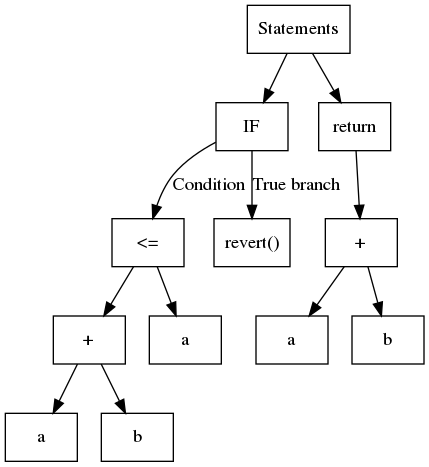
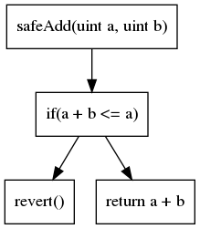

## How to use Slither {#how-to-use-slither}

The aim of this tutorial is to show how to use Slither to automatically find bugs in smart contracts.

- [Installation](#installation)
- [Command line usage](#command-line)
- [Introduction to static analysis](#static-analysis): Brief introduction to static analysis
- [API](#api-basics): Python API description

## Installation {#installation}

Slither requires Python >= 3.6. It can be installed through pip or using docker.

Slither through pip:

```bash
pip3 install --user slither-analyzer
```

Slither through docker:

```bash
docker pull trailofbits/eth-security-toolbox
docker run -it -v "$PWD":/home/trufflecon trailofbits/eth-security-toolbox
```

_The last command runs eth-security-toolbox in a docker that has access to your current directory. You can change the files from your host, and run the tools on the files from the docker_

Inside docker, run:

```bash
solc-select 0.5.11
cd /home/trufflecon/
```

### Running a script {#running-a-script}

To run a python script with python 3:

```bash
python3 script.py
```

### Command line {#command-line}

**Command line versus user-defined scripts.** Slither comes with a set of predefined detectors that find many common bugs. Calling Slither from the command line will run all the detectors, no detailed knowledge of static analysis needed:

```bash
slither project_paths
```

In addition to detectors, Slither has code review capabilities through its [printers](https://github.com/crytic/slither#printers) and [tools](https://github.com/crytic/slither#tools).

Use [crytic.io](https://github.com/crytic) to get access to private detectors and GitHub integration.

## Static analysis {#static-analysis}

The capabilities and design of the Slither static analysis framework has been described in blog posts ([1](https://blog.trailofbits.com/2018/10/19/slither-a-solidity-static-analysis-framework/), [2](https://blog.trailofbits.com/2019/05/27/slither-the-leading-static-analyzer-for-smart-contracts/)) and an [academic paper](https://github.com/trailofbits/publications/blob/master/papers/wetseb19.pdf).

Static analysis exists in different flavors. You most likely realize that compilers like [clang](https://clang-analyzer.llvm.org/) and [gcc](https://lwn.net/Articles/806099/) depend on these research techniques, but it also underpins ([Infer](https://fbinfer.com/), [CodeClimate](https://codeclimate.com/), [FindBugs](http://findbugs.sourceforge.net/) and tools based on formal methods like [Frama-C](https://frama-c.com/) and [Polyspace](https://www.mathworks.com/products/polyspace.html).

We won't be exhaustively reviewing static analysis techniques and researcher here. Instead, we'll focus on what is needed to understand how Slither works so you can more effectively use it to find bugs and understand code.

- [Code representation](#code-representation)
- [Code analysis](#analysis)
- [Intermediate representation](#intermediate-representation)

### Code representation {#code-representation}

In contrast to a dynamic analysis, which reasons about a single execution path, static analysis reasons about all the paths at once. To do so, it relies on a different code representation. The two most common ones are the abstract syntax tree (AST) and the control flow graph (CFG).

### Abstract Syntax Trees (AST) {#abstract-syntax-trees-ast}

AST are used every time the compiler parses code. It is probably the most basic structure upon which static analysis can be performed.

In a nutshell, an AST is a structured tree where, usually, each leaf contains a variable or a constant and internal nodes are operands or control flow operations. Consider the following code:

```solidity
function safeAdd(uint a, uint b) pure internal returns(uint){
    if(a + b <= a){
        revert();
    }
    return a + b;
}
```

The corresponding AST is shown in:



Slither uses the AST exported by solc.

While simple to build, the AST is a nested structure. At times, this is not the most straightforward to analyze. For example, to identify the operations used by the expression `a + b <= a`, you must first analyze `<=` and then `+`. A common approach is to use the so-called visitor pattern, which navigates through the tree recursively. Slither contains a generic visitor in [`ExpressionVisitor`](https://github.com/crytic/slither/blob/master/slither/visitors/expression/expression.py).

The following code uses `ExpressionVisitor` to detect if the expression contains an addition:

```python
from slither.visitors.expression.expression import ExpressionVisitor
from slither.core.expressions.binary_operation import BinaryOperationType

class HasAddition(ExpressionVisitor):

    def result(self):
        return self._result

    def _post_binary_operation(self, expression):
        if expression.type == BinaryOperationType.ADDITION:
            self._result = True

visitor = HasAddition(expression) # expression is the expression to be tested
print(f'The expression {expression} has a addition: {visitor.result()}')
```

### Control Flow Graph (CFG) {#control-flow-graph-cfg}

The second most common code representation is the control flow graph (CFG). As its name suggests, it is a graph-based representation which exposes all the execution paths. Each node contains one or multiple instructions. Edges in the graph represent the control flow operations (if/then/else, loop, etc). The CFG of our previous example is:



The CFG is the representation on top of which most of the analyses are built.

Many other code representations exist. Each representation has advantages and drawbacks according to the analysis you want to perform.

### Analysis {#analysis}

The simplest type of analyses you can perform with Slither are syntactic analyses.

### Syntax analysis {#syntax-analysis}

Slither can navigate through the different components of the code and their representation to find inconsistencies and flaws using a pattern matching-like approach.

For example the following detectors look for syntax-related issues:

- [State variable shadowing](https://github.com/crytic/slither/wiki/Detector-Documentation#state-variable-shadowing): iterates over all the state variables and check if any shadow a variable from an inherited contract ([state.py#L51-L62](https://github.com/crytic/slither/blob/0441338e055ab7151b30ca69258561a5a793f8ba/slither/detectors/shadowing/state.py#L51-L62))

- [Incorrect ERC20 interface](https://github.com/crytic/slither/wiki/Detector-Documentation#incorrect-erc20-interface): look for incorrect ERC20 function signatures ([incorrect_erc20_interface.py#L34-L55](https://github.com/crytic/slither/blob/0441338e055ab7151b30ca69258561a5a793f8ba/slither/detectors/erc/incorrect_erc20_interface.py#L34-L55))

### Semantic analysis {#semantic-analysis}

In contrast to syntax analysis, a semantic analysis will go deeper and analyze the “meaning” of the code. This family includes some broad types of analyses. They lead to more powerful and useful results, but are also more complex to write.

Semantic analyses are used for the most advanced vulnerability detections.

#### Data dependency analysis {#fixed-point-computation}

A variable `variable_a` is said to be data-dependent of `variable_b` if there is a path for which the value of `variable_a` is influenced by `variable_b`.

In the following code, `variable_a` is dependent of `variable_b`:

```solidity
// ...
variable_a = variable_b + 1;
```

Slither comes with built-in [data dependency](https://github.com/crytic/slither/wiki/data-dependency) capabilities, thanks to its intermediate representation (discussed in a later section).

An example of data dependency usage can be found in the [dangerous strict equality detector](https://github.com/crytic/slither/wiki/Detector-Documentation#dangerous-strict-equalities). Here Slither will look for strict equality comparison to a dangerous value ([incorrect_strict_equality.py#L86-L87](https://github.com/crytic/slither/blob/6d86220a53603476f9567c3358524ea4db07fb25/slither/detectors/statements/incorrect_strict_equality.py#L86-L87)), and will inform the user that it should use `>=` or `<=` rather than `==`, to prevent an attacker to trap the contract. Among other, the detector will consider as dangerous the return value of a call to `balanceOf(address)` ([incorrect_strict_equality.py#L63-L64](https://github.com/crytic/slither/blob/6d86220a53603476f9567c3358524ea4db07fb25/slither/detectors/statements/incorrect_strict_equality.py#L63-L64)), and will use the data dependency engine to track its usage.

#### Fixed-point computation {#fixed-point-computation}

If your analysis navigates through the CFG and follows the edges, you are likely to see already visited nodes. For example, if a loop is presented as shown below:

```solidity
for(uint i; i < range; ++){
    variable_a += 1
}
```

Your analysis will need to know when to stop. There are two main strategies here: (1) iterate on each node a finite number of times, (2) compute a so-called _fixpoint_. A fixpoint basically means that analyzing this node does not provide any meaningful information.

An example of fixpoint used can be found in the reentrancy detectors: Slither explores the nodes, and look for externals calls, write and read to storage. Once it has reached a fixpoint ([reentrancy.py#L125-L131](https://github.com/crytic/slither/blob/master/slither/detectors/reentrancy/reentrancy.py#L125-L131)), it stops the exploration, and analyze the results to see if a reentrancy is present, through different reentrancy patterns ([reentrancy_benign.py](https://github.com/crytic/slither/blob/b275bcc824b1b932310cf03b6bfb1a1fef0ebae1/slither/detectors/reentrancy/reentrancy_benign.py), [reentrancy_read_before_write.py](https://github.com/crytic/slither/blob/b275bcc824b1b932310cf03b6bfb1a1fef0ebae1/slither/detectors/reentrancy/reentrancy_read_before_write.py), [reentrancy_eth.py](https://github.com/crytic/slither/blob/b275bcc824b1b932310cf03b6bfb1a1fef0ebae1/slither/detectors/reentrancy/reentrancy_eth.py)).

Writing analyses using efficient fixed point computation requires a good understanding of how the analysis propagates its information.

### Intermediate representation {#intermediate-representation}

An intermediate representation (IR) is a language meant to be more amenable to static analysis than the original one. Slither translates Solidity to its own IR: [SlithIR](https://github.com/crytic/slither/wiki/SlithIR).

Understanding SlithIR is not necessary if you only want to write basic checks. However, it will come in handy if you plan to write advanced semantic analyses. The [SlithIR](https://github.com/crytic/slither/wiki/Printer-documentation#slithir) and [SSA](https://github.com/crytic/slither/wiki/Printer-documentation#slithir-ssa) printers will help you to understand how the code is translated.

## API Basics {#api-basics}

Slither has an API that lets you explore basic attributes of the contract and its functions.

To load a codebase:

```python
from slither import Slither
slither = Slither('/path/to/project')

```

### Exploring contracts and functions {#exploring-contracts-and-functions}

A `Slither` object has:

- `contracts (list(Contract)`: list of contracts
- `contracts_derived (list(Contract)`: list of contracts that are not inherited by another contract (subset of contracts)
- `get_contract_from_name (str)`: Return a contract from its name

A `Contract` object has:

- `name (str)`: Name of the contract
- `functions (list(Function))`: List of functions
- `modifiers (list(Modifier))`: List of functions
- `all_functions_called (list(Function/Modifier))`: List of all the internal functions reachable by the contract
- `inheritance (list(Contract))`: List of inherited contracts
- `get_function_from_signature (str)`: Return a Function from its signature
- `get_modifier_from_signature (str)`: Return a Modifier from its signature
- `get_state_variable_from_name (str)`: Return a StateVariable from its name

A `Function` or a `Modifier` object has:

- `name (str)`: Name of the function
- `contract (contract)`: the contract where the function is declared
- `nodes (list(Node))`: List of the nodes composing the CFG of the function/modifier
- `entry_point (Node)`: Entry point of the CFG
- `variables_read (list(Variable))`: List of variables read
- `variables_written (list(Variable))`: List of variables written
- `state_variables_read (list(StateVariable))`: List of state variables read (subset of variables`read)
- `state_variables_written (list(StateVariable))`: List of state variables written (subset of variables`written)
