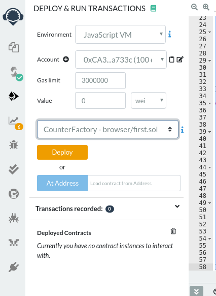

In the previous tutorials we learnt a lot [how to deploy your first smart contract](/developers/tutorials/deploying-your-first-smart-contract/) and add some features to it like [control access with modifiers](https://ethereumdev.io/organize-your-code-and-control-access-to-your-smart-contract-with-modifiers/) or [error handling in Solidity](https://ethereumdev.io/handle-errors-in-solidity-with-require-and-revert/). In this tutorial we’ll learn how to deploy a smart contract from an existing contract and interact with it.

We’ll make a contract that enables anyone to have his own `Counter` smart contract by creating a factory for it, its name will be `CounterFactory`. First here is the code of our initial `Counter` smart contract:

```solidity
pragma solidity 0.5.17;

contract Counter {

    uint256 private _count;
    address private _owner;
    address private _factory;


     modifier onlyOwner(address caller) {
        require(caller == _owner, "You're not the owner of the contract");
        _;
    }

    modifier onlyFactory() {
        require(msg.sender == _factory, "You need to use the factory");
        _;
    }

     constructor(address owner) public {
        _owner = owner;
        _factory = msg.sender;
    }

     function getCount() public view returns (uint256) {
        return _count;
    }

    function increment(address caller) public onlyFactory onlyOwner(caller) {
        _count++;
    }

}
```

Note that we slightly modified the contract code to keep a track of the address of the factory and the address of the contract owner. When you call a contract code from another contract, the msg.sender will refer to the address of our contract factory. This is **a really important point to understand** as using a contract to interact with other contracts is a common practice. You should therefore take care of who is the sender in complex cases.

For this we also added an `onlyFactory` modifier that make sure that the state changing function can only be called by the factory that will pass the original caller as a parameter.

Inside of our new `CounterFactory` that will manage all the other Counters, we’ll add a mapping that will associate an owner to the address of his counter contract:

```solidity
mapping(address => Counter) _counters;
```

In Ethereum, mapping are equivalent of objects in javascript, they enable to map a key of type A to a value of type B. In this case we map the address of an owner with the instance of its Counter.

Instantiating a new Counter for someone will look like this:

```solidity
  function createCounter() public {
      require (_counters[msg.sender] == Counter(0));
      _counters[msg.sender] = new Counter(msg.sender);
  }
```

We first check if the person already owns a counter. If he does not own a counter we instantiate a new counter by passing his address to the `Counter` constructor and assign the newly created instance to the mapping.

To get the count of a specific Counter it will look like this:

```solidity
function getCount(address account) public view returns (uint256) {
    require (_counters[account] != Counter(0));
    return (_counters[account].getCount());
}

function getMyCount() public view returns (uint256) {
    return (getCount(msg.sender));
}
```

The first function check if the Counter contract exists for a given address and then calls the `getCount` method from the instance. The second function: `getMyCount` is just a short end to pass the msg.sender directly to the `getCount` function.

The `increment` function is quite similar but pass the original transaction sender to the `Counter` contract:

```solidity
function increment() public {
      require (_counters[msg.sender] != Counter(0));
      Counter(_counters[msg.sender]).increment(msg.sender);
  }
```

Note that if called to many times, our counter could possibly victim of an overflow. You should use the [SafeMath library](https://ethereumdev.io/using-safe-math-library-to-prevent-from-overflows/) as much as possible to protect from this possible case.

To deploy our contract, you will need to provide both the code of the `CounterFactory` and the `Counter`. When deploying for example in Remix you’ll need to select CounterFactory.

Here is the full code:

```solidity
pragma solidity 0.5.17;

contract Counter {

    uint256 private _count;
    address private _owner;
    address private _factory;


     modifier onlyOwner(address caller) {
        require(caller == _owner, "You're not the owner of the contract");
        _;
    }

    modifier onlyFactory() {
        require(msg.sender == _factory, "You need to use the factory");
        _;
    }

     constructor(address owner) public {
        _owner = owner;
        _factory = msg.sender;
    }

     function getCount() public view returns (uint256) {
        return _count;
    }

    function increment(address caller) public onlyFactory onlyOwner(caller) {
        _count++;
    }

}

contract CounterFactory {

    mapping(address => Counter) _counters;

    function createCounter() public {
        require (_counters[msg.sender] == Counter(0));
        _counters[msg.sender] = new Counter(msg.sender);
    }

    function increment() public {
        require (_counters[msg.sender] != Counter(0));
        Counter(_counters[msg.sender]).increment(msg.sender);
    }

    function getCount(address account) public view returns (uint256) {
        require (_counters[account] != Counter(0));
        return (_counters[account].getCount());
    }

    function getMyCount() public view returns (uint256) {
        return (getCount(msg.sender));
    }

}
```

After compiling, in the Remix deploy section you’ll select the factory to be deployed:



Then you can play with your contract factory and check the value changing. If you’d like to call the smart contract from a different address you’ll need to change the address in the Account select of Remix.
