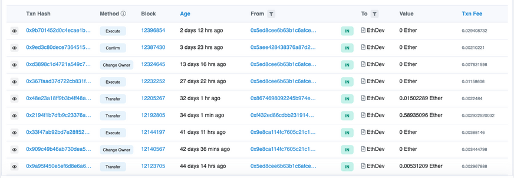
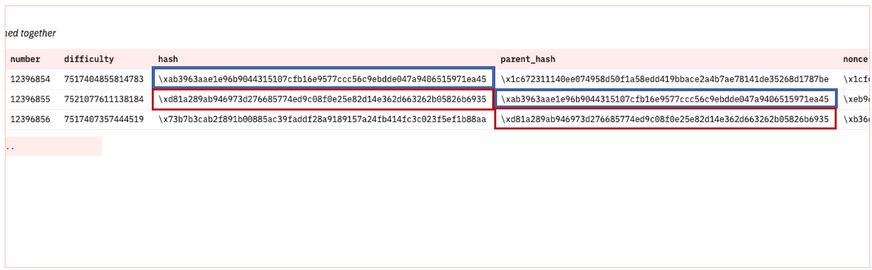
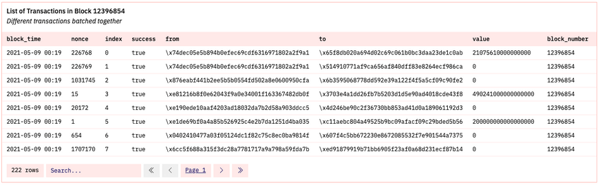
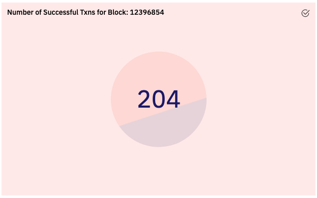
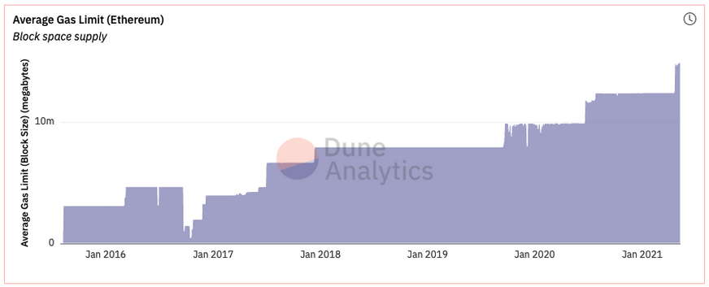
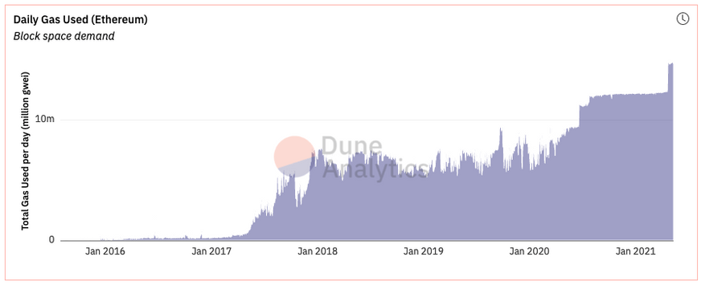
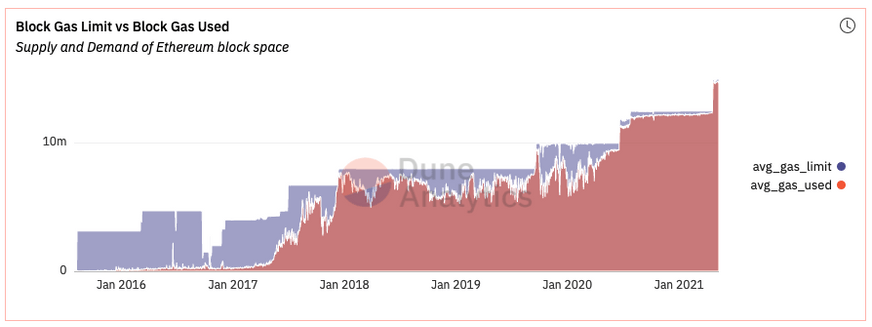
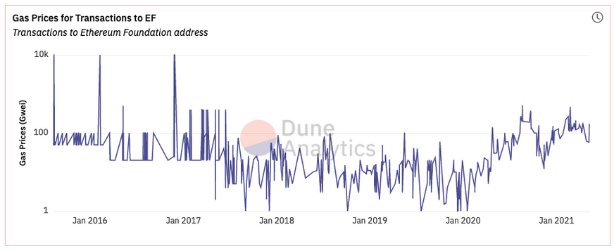

Many Ethereum tutorials target developers, but there’s a lack of educational resources for data analyst or for people who wish to see on-chain data without running a client or node.

This tutorial helps readers understand fundamental Ethereum concepts including transactions, blocks and gas by querying on-chain data with structured query language (SQL) through an interface provided by [Dune Analytics](https://dune.xyz/home).

On-chain data can help us understand Ethereum, the network, and as an economy for computing power and should serve as a base for understanding challenges facing Ethereum today (i.e., rising gas prices) and, more importantly, discussions around scaling solutions.

### Transactions {#transactions}

A user’s journey on Ethereum starts with initializing a user-controlled account or an entity with an ETH balance. There are two account types - user-controlled or a smart contract (see [ethereum.org](/developers/docs/accounts/)).

Any account can be viewed on a block explorer like [Etherscan](https://etherscan.io/). Block explorers are a portal to Ethereum’s data. They display, in real-time, data on blocks, transactions, miners, accounts and other on-chain activity (see [here](/developers/docs/data-and-analytics/block-explorers/)).

However, a user may wish to query the data directly to reconcile the information provided by external block explorers. [Dune Analytics](https://duneanalytics.com/) provides this capability to anyone with some knowledge of SQL.

For reference, the smart contract account for the Ethereum Foundation (EF) can be viewed on [Etherscan](https://etherscan.io/address/0xde0b295669a9fd93d5f28d9ec85e40f4cb697bae).

One thing to note is that all accounts, including the EF’s, has a public address that can be used to send and receive transactions.

The account balance on Etherscan comprises regular transactions and internal transactions. Internal transactions, despite the name, are not _actual_ transactions that change the state of the chain. They are value transfers initiated by executing a contract ([source](https://ethereum.stackexchange.com/questions/3417/how-to-get-contract-internal-transactions)). Since internal transactions have no signature, they are **not** included on the blockchain and cannot be queried with Dune Analytics.

Therefore, this tutorial will focus on regular transactions. This can be queried as such:

```sql
WITH temp_table AS (
SELECT
    hash,
    block_number,
    block_time,
    "from",
    "to",
    value / 1e18 AS ether,
    gas_used,
    gas_price / 1e9 AS gas_price_gwei
FROM ethereum."transactions"
WHERE "to" = '\xde0B295669a9FD93d5F28D9Ec85E40f4cb697BAe'
ORDER BY block_time DESC
)
SELECT
    hash,
    block_number,
    block_time,
    "from",
    "to",
    ether,
    (gas_used * gas_price_gwei) / 1e9 AS txn_fee
FROM temp_table
```

This will yield the same information as provided on Etherscan's transaction page. For comparison, here are the two sources:

#### Etherscan {#etherscan}



[EF's contract page on Etherscan.](https://etherscan.io/address/0xde0B295669a9FD93d5F28D9Ec85E40f4cb697BAe)

#### Dune Analytics {#dune-analytics}


You can find dashboard [here](https://duneanalytics.com/paulapivat/Learn-Ethereum). Click on the table to see the query (also see above).

### Breaking Down Transactions {#breaking_down_transactions}

A submitted transaction includes several pieces of information including ([source](/developers/docs/transactions/)):

- **Recipient**: The receiving address (queried as "to")
- **Signature**: While a sender's private keys signs a transaction, what we can query with SQL is a sender's public address ("from").
- **Value**: This is the amount of ETH transferred (see `ether` column).
- **Data**: This is arbitrary data that's been hashed (see `data` column)
- **gasLimit** – the maximum amount of gas units that can be consumed by the transaction. Units of gas represent computational steps
- **maxPriorityFeePerGas** - the maximum amount of gas to be included as a tip to the miner
- **maxFeePerGas** - the maximum amount of gas willing to be paid for the transaction (inclusive of baseFeePerGas and maxPriorityFeePerGas)

We can query these specific pieces of information for transactions to the Ethereum Foundation public address:

```sql
SELECT
    "to",
    "from",
    value / 1e18 AS ether,
    data,
    gas_limit,
    gas_price / 1e9 AS gas_price_gwei,
    gas_used,
    ROUND(((gas_used / gas_limit) * 100),2) AS gas_used_pct
FROM ethereum."transactions"
WHERE "to" = '\xde0B295669a9FD93d5F28D9Ec85E40f4cb697BAe'
ORDER BY block_time DESC
```

### Blocks {#blocks}

Each transaction will change the state of the Ethereum virtual machine ([EVM](/developers/docs/evm/)) ([source](/developers/docs/transactions/)). Transactions are broadcasted to the network to be verified and included in a block. Each transaction is associated with a block number. To see the data, we could query a specific block number: 12396854 (the most recent block among Ethereum Foundation transactions as of this writing, 11/5/21).

Moreover, when we query the next two blocks, we can see that each block contains the hash of the previous block (i.e., parent hash), illustrating how the blockchain is formed.

Each block contains a reference to it parent block. This is shown below between the `hash` and `parent_hash` columns ([source](/developers/docs/blocks/)):



Here is the [query](https://duneanalytics.com/queries/44856/88292) on Dune Analytics:

```sql
SELECT
   time,
   number,
   hash,
   parent_hash,
   nonce
FROM ethereum."blocks"
WHERE "number" = 12396854 OR "number" = 12396855 OR "number" = 12396856
LIMIT 10
```

We can examine a block by querying time, block number, difficulty, hash, parent hash, and nonce.

The only thing this query does not cover is _list of transaction_ which requires a separate query below and _state root_. A full or archival node will store all transactions and state transitions, allowing for clients to query the state of the chain at any time. Because this requires large storage space, we can separate chain data from state data:

- Chain data (list of blocks, transactions)
- State data (result of each transaction’s state transition)

State root falls in the latter and is _implicit_ data (not stored on-chain), while chain data is explicit and stored on the chain itself ([source](https://ethereum.stackexchange.com/questions/359/where-is-the-state-data-stored)).

For this tutorial, we'll be focusing on on-chain data that _can_ be queried with SQL via Dune Analytics.

As stated above, each block contains a list of transactions, we can query this by filtering for a specific block. We'll try the most recent block, 12396854:

```sql
SELECT * FROM ethereum."transactions"
WHERE block_number = 12396854
ORDER BY block_time DESC`
```

Here's the SQL output on Dune:



This single block being added to the chain changes the state of the Ethereum virtual machine ([EVM](/developers/docs/evm/)). Dozens sometimes, hundreds of transactions are verified at once. In this specific case, 222 transactions were included.

To see how many were actually successful, we would add another filter to count successful transactions:

```sql
WITH temp_table AS (
    SELECT * FROM ethereum."transactions"
    WHERE block_number = 12396854 AND success = true
    ORDER BY block_time DESC
)
SELECT
    COUNT(success) AS num_successful_txn
FROM temp_table
```

For block 12396854, out of 222 total transactions, 204 were successfully verified:



Transactions requests occur dozens of times per second, but blocks are committed approximately once every 15 seconds ([source](/developers/docs/blocks/)).

To see that there is one block produced approximately every 15 seconds, we could take the number of seconds in a day (86400) divided by 15 to get an estimated average number of blocks per day (~ 5760).

The chart for Ethereum blocks produced per day (2016 - present) is:


The average number of blocks produced daily over this time period is ~5,874:


The queries are:

```sql
# query to visualize number of blocks produced daily since 2016

SELECT
    DATE_TRUNC('day', time) AS dt,
    COUNT(*) AS block_count
FROM ethereum."blocks"
GROUP BY dt
OFFSET 1

# average number of blocks produced per day

WITH temp_table AS (
SELECT
    DATE_TRUNC('day', time) AS dt,
    COUNT(*) AS block_count
FROM ethereum."blocks"
GROUP BY dt
OFFSET 1
)
SELECT
    AVG(block_count) AS avg_block_count
FROM temp_table
```

The average number of blocks produced per day since 2016 is slightly above that number at 5,874. Alternatively, dividing 86400 seconds by 5874 average blocks comes out to 14.7 seconds or approximately one block every 15 seconds.

### Gas {#gas}

Blocks are bounded in size. The maximum block size is dynamic and varies according to network demand between 12,500,000 and 25,000,000 units. Limits are required to prevent arbitrarily large block sizes putting strain on full nodes in terms of disk space and speed requirements ([source](/developers/docs/blocks/)).

One way to conceptualize block gas limit is to think of it as the **supply** of available block space in which to batch transactions. The block gas limit can be queried and visualized from 2016 to present day:



```sql
SELECT
    DATE_TRUNC('day', time) AS dt,
    AVG(gas_limit) AS avg_block_gas_limit
FROM ethereum."blocks"
GROUP BY dt
OFFSET 1
```

Then there is the actual gas used daily to pay for computing done on the Ethereum chain (i.e., sending transaction, calling a smart contract, minting an NFT). This is the **demand** for available Ethereum block space:



```sql
SELECT
    DATE_TRUNC('day', time) AS dt,
    AVG(gas_used) AS avg_block_gas_used
FROM ethereum."blocks"
GROUP BY dt
OFFSET 1
```

We can also juxtapose these two charts together to see how **demand and supply** line up:



Therefore we can understand gas prices as a function of demand for Ethereum block space, given available supply.

Finally, we may want to query average daily gas prices for the Ethereum chain, however, doing so will result in an especially long query time, so we’ll filter our query to the average amount of gas paid per transaction by the Ethereum Foundation.



We can see gas prices paid for all transactions made to the Ethereum Foundation address over the years. Here is the query:

```sql
SELECT
    block_time,
    gas_price / 1e9 AS gas_price_gwei,
    value / 1e18 AS eth_sent
FROM ethereum."transactions"
WHERE "to" = '\xde0B295669a9FD93d5F28D9Ec85E40f4cb697BAe'
ORDER BY block_time DESC
```

### Summary {#summary}

With this tutorial, we understand foundational Ethereum concepts and how the Ethereum blockchain works by querying and getting a feel for on-chain data.

The dashboard that holds all code used in this tutorial can be found [here](https://duneanalytics.com/paulapivat/Learn-Ethereum).

For more use of data to explore web3 [find me on Twitter](https://twitter.com/paulapivat).
