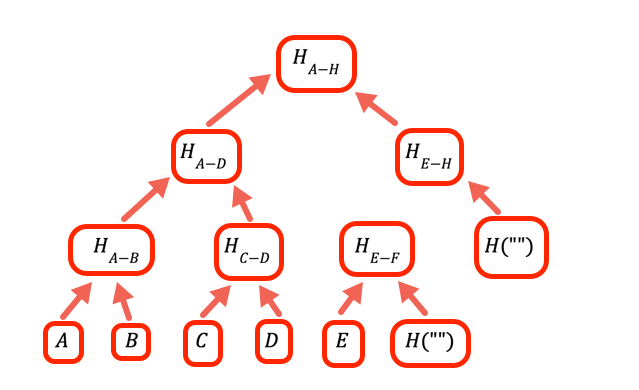

## Introduction

Ideally we'd like to store everything in Ethereum storage, which is stored across thousands of computers and has
extremely high availability (the data cannot be censored) and integrity (the data cannot be modified by in an
unauthorized manner), but storing a 32 byte word typically costs 20,000 gas. As I'm writing this, that cost is
equivalent to $6.60. At 21 cents a byte this is too expensive for most uses.

To solve this problem the Ethereum ecosystem developed [many alternative ways to store data in a decentralized 
fashion](https://ethereum.org/en/developers/docs/storage/). Usually they involve a tradeoff between availability
and price. However, integrity is usually assured.

In this article you learn **how** to ensure data integrity without storing the data on the blockchain, using
[merkle proofs](https://computersciencewiki.org/index.php/Merkle_proof). 

## How does it work?

In theory we could just store the hash of the data on chain, and send all the data in transactions that
require it. However, this is still too expensive. A byte of data to a transaction costs about 16 gas, 
currently about half a cent, or about $5 per kilobyte. At $5000 per megabyte, this is still too expensive
for many uses.

The solution is to repeatedly hash different subsets of the data, so for the data that you don't need to 
send you can just send a hash. You do this using a Merkle tree, a tree data structure where each node is a hash
of the nodes below it:


The root hash is the only part that needs to be stored on chain. To prove a certain value, for example C, you
provide all the hashes that need to be combined with it to obtain the root: `D`, `H(A-B)`, and `H(E-H)`.


## Off-chain code

### Creating the Merkle root

First we need a trusted source to provide the Merkle root. Let's write it in JavaScript using [Node](https://nodejs.org/en/).

```javascript
const ethers = require('ethers')
```

[We use the hash function from the ethers package](https://docs.ethers.io/v5/api/utils/hashing/#utils-keccak256).

```javascript
// The raw data whose integrity we have to verify. The first two bytes a
// are a user identifier, and the last two bytes the amount of tokens the
// user owns at present.
const dataArray = [
    0x0BAD0010, 0x60A70020, 0xBEEF0030, 0xDEAD0040, 0xCA110050,
    0x0E660060, 0xFACE0070, 0xBAD00080, 0x060D0091
]
```

Encoding each entry into a single 256 bit integer results in less readable code than using JSON, for example. However, this means significantly less processing to retrieve the data in the contract, so much lower gas costs. [You can read JSON on chain](https://github.com/chrisdotn/jsmnSol), it's just a bad idea if avoidable.

```javascript
// The array of hash values, as BigInts 
const hashArray = dataArray; 
```

In this case our data is 256 bit values to begin with, so no processing is needed. If we use a more complicated data structure, such as strings, we need to make sure we hash the data first to get an array of hashes. Note that this is also because we don't care if users know other users' information. Otherwise we would have had to hash so user 1 won't know the value for user 0, user 2 won't know the value for user 3, etc.


```javascript
const pairHash = (a,b) => BigInt(ethers.utils.keccak256('0x' + 
       (a^b).toString(16).padStart(64,0)))
```

The ethers hash function expects to get a Javascript string with a hexadecimal number, such as `0x60A7`, and responds with another string with the same structure. However, for the rest of the code it's easier to use `BigInt`, so we convert to a hexadecimal string and back again.

This function is symmetrical (hash of a [xor](https://en.wikipedia.org/wiki/Exclusive_or) b). This means that when we check the Merkle proof we don't need to worry about whether to put the value from the proof before or after the calculated value. Merkle proof checking is done on chain, so the less we need to do there the better.

```javascript
// The value to denote that a certain branch is empty, doesn't
// have a value
const empty = 0n
```

When the number of values is not an integer power of two we need to handle empty branches. The way this program does it is to put zero as a place holder.




```javascript
// Calculate one level up the tree of a hash array by taking the hash of 
// each pair in sequence
const oneLevelUp = inputArray => {
    var result = []
    var inp = [...inputArray]    // To avoid over writing the input

    // Add an empty value if necessary (we need all the leaves to be
    // paired)
    if (inp.length % 2 === 1)
        inp.push(empty)

    for(var i=0; i<inp.length; i+=2)
        result.push(pairHash(inp[i],inp[i+1]))

    return result
}    // oneLevelUp
```

This function "climbs" one level in the Merkle tree by hashing the pairs of values at the current layer. Note that this is not the most efficient implementation, we could have avoided copying the input and just added `hashEmpty` when appropriate in the loop, but this code is optimized for readability.


```javascript
const getMerkleRoot = inputArray => {
    var result

    result = [...inputArray]

    // Climb up the tree until there is only one value, that is the
    // root. 
    //
    // Note that if a layer has an odd number of entries the
    // code in oneLevelUp adds an empty value, so if we have, for example,
    // 10 leaves we'll have 5 branches in the second layer, 3
    // branches in the third, 2 in the fourth and the root is the fifth       
    while(result.length > 1)
        result = oneLevelUp(result)

    return result[0]
}```

To get the root, climb until there is only one value left. 


### Creating a Merkle proof

A Merkle proof is the values to hash together with the value being proved to get back the Merkle root. The value to prove is often available from other data, so I prefer to provide it separately.

```javascript
// A merkle proof consists of the value of the list of entries to 
// hash with. Because we use a symmetrical hash function, we don't
// need the item's location.

// A merkle proof consists of the value of the list of entries to 
// hash with. Because we use a symmetrical hash function, we don't
// need the item's location to verify the proof, only to create it
const getMerkleProof = (inputArray, n) => {
    var result = [], currentLayer = [...inputArray], currentN = n

    // Until we reach the top
    while (currentLayer.length > 1) {
        // No odd length layers
        if (currentLayer.length % 2)
            currentLayer.push(empty)

        result.push(currentN % 2    
               // If currentN is odd, add with the value before it to the proof
            ? currentLayer[currentN-1] 
               // If it is even, add the value after it
            : currentLayer[currentN+1])

```
We hash `(v[0],v[1])`, `(v[2],v[3])`, etc. So for even values we need the next one, for odd values the previous one.

```javascript
        // Move to the next layer up
        currentN = Math.floor(currentN/2)
        currentLayer = oneLevelUp(currentLayer)
    }   // while currentLayer.length > 1

    return result
}   // getMerkleProof
```


## On-chain code


```solidity
//SPDX-License-Identifier: Public Domain
pragma solidity ^0.8.0;

import "hardhat/console.sol";


contract MerkleProof {
    uint merkleRoot;

    function getRoot() public view returns (uint) {
      return merkleRoot;
    }

    // Extremely insecure, in production code access to
    // this function MUST BE strictly limited, probably to an
    // owner
    function setRoot(uint _merkleRoot) external {
      merkleRoot = _merkleRoot;
    }   // setRoot

    
    // Same function as in the JavaScript, just written in Solidity
    function pairHash(uint _a, uint _b) internal pure returns(uint) {
      return uint(keccak256(abi.encode(_a ^ _b)));
    }

    // Verify a Merkle proof
    function verifyProof(uint _value, uint[] calldata _proof) 
        public view returns (bool) {
      uint temp = _value;
      uint i;
  
      for(i=0; i<_proof.length; i++) {
        temp = pairHash(temp, _proof[i]);
      }

      return temp == merkleRoot;
    }
    
}  // MarkleProof

```


## Conclusion
