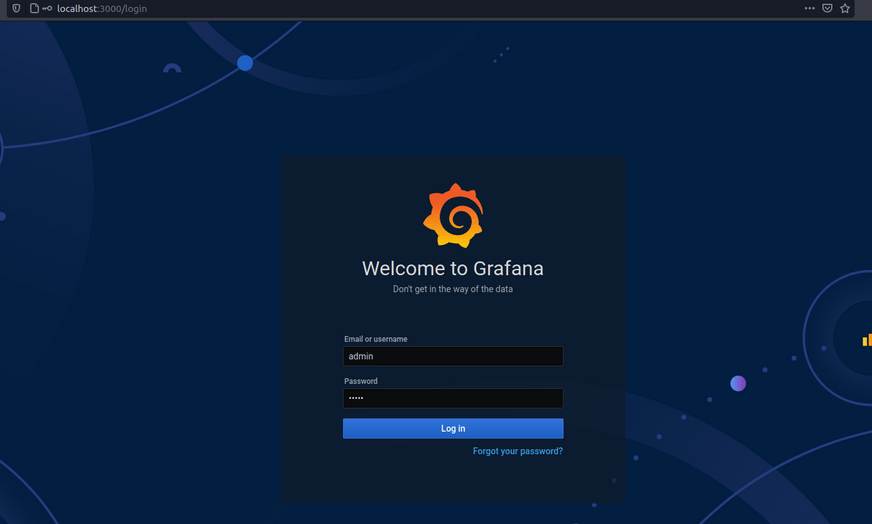
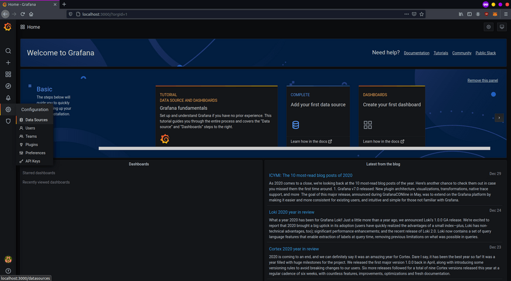
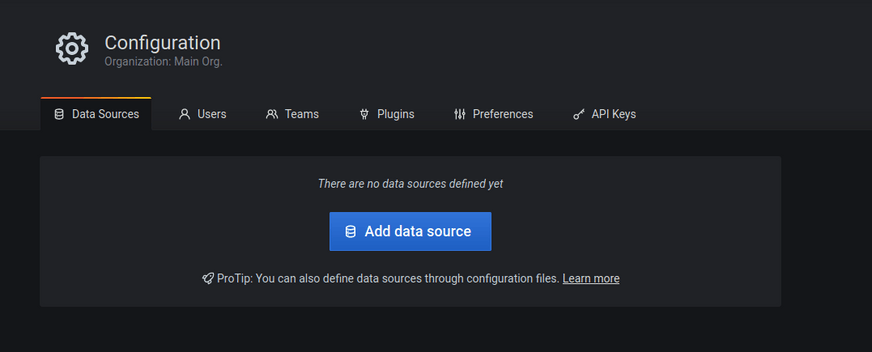
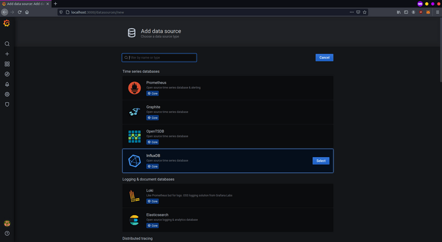
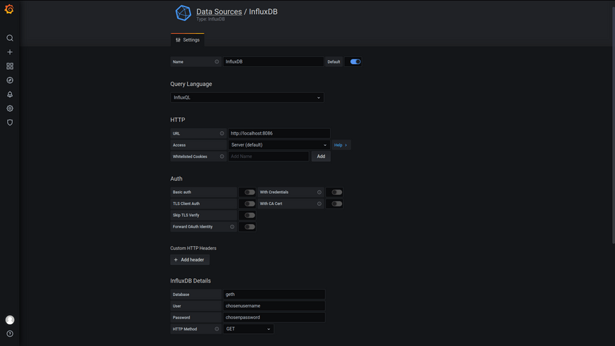
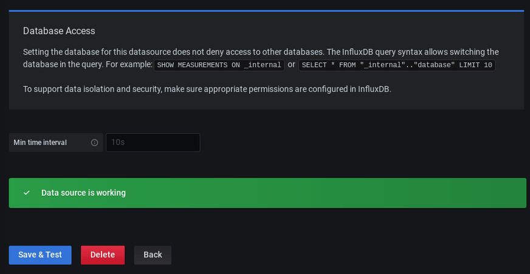
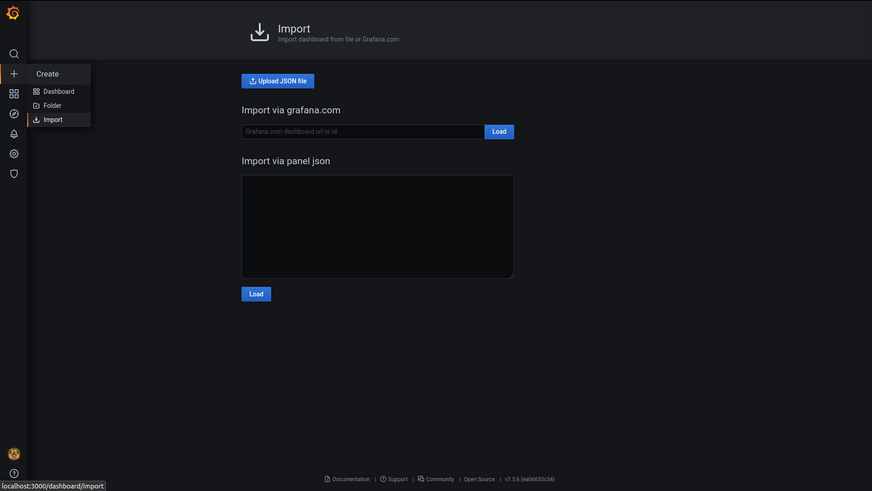
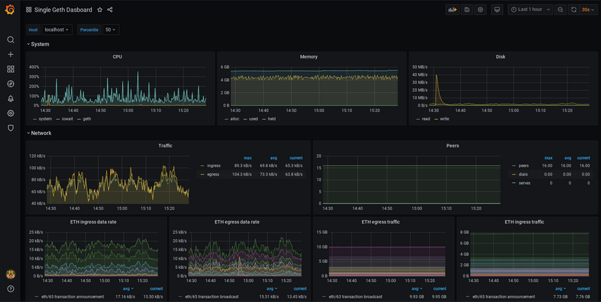

This tutorial will help you set up monitoring for your Geth node so you can better understand its performance and identify potential problems.

## Prerequisites {#prerequisites}

- You should already be running an instance of Geth.
- Most of the steps and examples are for linux environment, basic terminal knowledge will be helpful.
- Check out this video overview of Geth's suite of metrics: [Monitoring an Ethereum infrastructure by Péter Szilágyi](https://www.youtube.com/watch?v=cOBab8IJMYI).

## Monitoring stack {#monitoring-stack}

An Ethereum client collects lots of data which can be read in the form of a chronological database. To make monitoring easier, you can feed this into data visualisation software. There are multiple options available:

- [Prometheus](https://prometheus.io/) (pull model)
- [InfluxDB](https://www.influxdata.com/get-influxdb/) (push model)
- [Telegraf](https://www.influxdata.com/get-influxdb/)
- [Grafana](https://www.grafana.com/)
- [Datadog](https://www.datadoghq.com/)
- [Chronograf](https://www.influxdata.com/time-series-platform/chronograf/)

There's also [Geth Prometheus Exporter](https://github.com/hunterlong/gethexporter), an option preconfigured with InfluxDB and Grafana. You can set it up easily using docker and [Ethbian OS](https://ethbian.org/index.html) for RPi 4.

In this tutorial, we'll set up your Geth client to push data to InfluxDB to create a database and Grafana to create a graph visualisation of the data. Doing it manually will help you understand the process better, alter it, and deploy in different environments.

## Setting up InfluxDB {#setting-up-influxdb}

First, let's download and install InfluxDB. Various download options can be found at [Influxdata release page](https://portal.influxdata.com/downloads/). Pick the one that suits your environment.
You can also install it from a [repository](https://repos.influxdata.com/). For example in Debian based distribution:

```
curl -tlsv1.3 --proto =https -sL https://repos.influxdata.com/influxdb.key | sudo apt-key add
source /etc/lsb-release
echo "deb https://repos.influxdata.com/${DISTRIB_ID,,} ${DISTRIB_CODENAME} stable" | sudo tee /etc/apt/sources.list.d/influxdb.list
sudo apt update
sudo apt install influxdb -y
sudo systemctl enable influxdb
sudo systemctl start influxdb
sudo apt install influxdb-client
```

After successfully installing InfluxDB, make sure it's running on background. By default, it is reachable at `localhost:8086`.
Before using `influx` client, you have to create new user with admin privileges. This user will serve for high level management, creating databases and users.

```
curl -XPOST "http://localhost:8086/query" --data-urlencode "q=CREATE USER username WITH PASSWORD 'password' WITH ALL PRIVILEGES"
```

Now you can use influx client to enter [InfluxDB shell](https://docs.influxdata.com/influxdb/v1.8/tools/shell/) with this user.

```
influx -username 'username' -password 'password'
```

Directly communicating with InfluxDB in its shell, you can create database and user for geth metrics.

```
create database geth
create user geth with password choosepassword
```

Verify created entries with:

```
show databases
show users
```

Leave InfluxDB shell.

```
exit
```

InfluxDB is running and configured to store metrics from Geth.

## Preparing Geth {#preparing-geth}

After setting up database, we need to enable metrics collection in Geth. Pay attention to `METRICS AND STATS OPTIONS` in `geth --help`. Multiple options can be found there, in this case we want Geth to push data into InfluxDB.
Basic setup specifies endpoint where InfluxDB is reachable and authentication for the database.

```
geth --metrics --metrics.influxdb --metrics.influxdb.endpoint "http://0.0.0.0:8086" --metrics.influxdb.username "geth" --metrics.influxdb.password "chosenpassword"
```

This flags can be appended to a command starting the client or saved to the configuration file.

You can verify that Geth is successfully pushing data, for instance by listing metrics in database. In InfluxDB shell:

```
use geth
show measurements
```

## Setting up Grafana {#setting-up-grafana}

Next step is installing Grafana which will interpret data graphically. Follow installation process for your environment in Grafana documentation. Make sure to install OSS version if you don't want otherwise.
Example installation steps for Debian distributions using repository:

```
curl -tlsv1.3 --proto =https -sL https://packages.grafana.com/gpg.key | sudo apt-key add -
echo "deb https://packages.grafana.com/oss/deb stable main" | sudo tee -a /etc/apt/sources.list.d/grafana.list
sudo apt update
sudo apt install grafana
sudo systemctl enable grafana-server
sudo systemctl start grafana-server
```

When you've got Grafana running, it should be reachable at `localhost:3000`.
Use your preferred browser to access this path, then login with the default credentials (user: `admin` and password: `admin`). When prompted, change the default password and save.



You will be redirected to the Grafana home page. First, set up your source data. Click on the configuration icon in the left bar and select "Data sources".



There aren't any data sources created yet, click on "Add data source" to define one.



For this setup, select "InfluxDB" and proceed.



Data source configuration is pretty straight forward if you are running tools on the same machine. You need to set the InfluxDB address and details for accessing the database. Refer to the picture below.



If everything is complete and InfluxDB is reachable, click on "Save and test" and wait for the confirmation to pop up.



Grafana is now set up to read data from InfluxDB. Now you need to create a dashboard which will interpret and display it. Dashboards properties are encoded in JSON files which can be created by anybody and easily imported. On the left bar, click on "Create and Import".



For a Geth monitoring dashboard, copy the ID of [this dashboard](https://grafana.com/grafana/dashboards/13877/) and paste it in the "Import page" in Grafana. After saving the dashboard, it should look like this:



You can modify your dashboards. Each panel can be edited, moved, removed or added. You can change your configurations. It's up to you! To learn more about how dashboards work, refer to [Grafana's documentation](https://grafana.com/docs/grafana/latest/dashboards/).
You might also be interested in [Alerting](https://grafana.com/docs/grafana/latest/alerting/). This lets you set up alert notifications for when metrics reach certain values. Various communication channels are supported.
