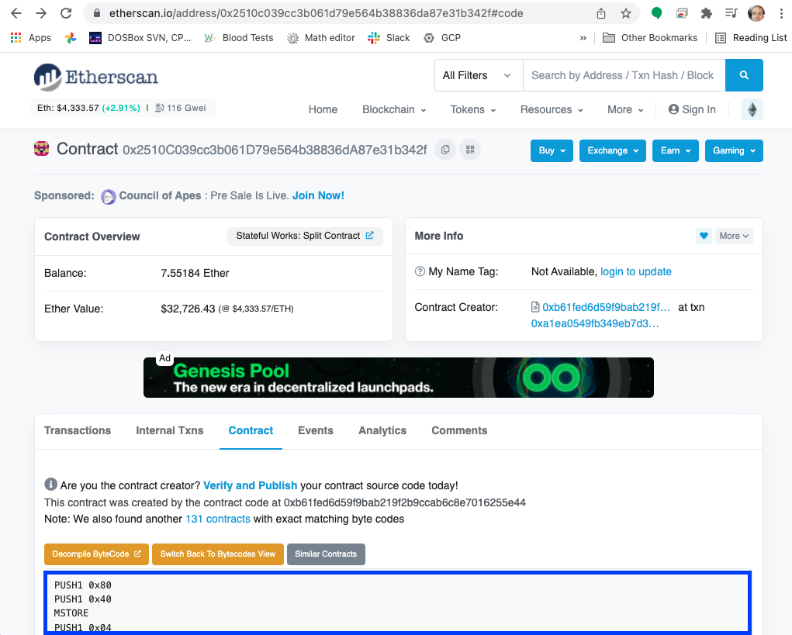

## Introduction {#introduction}

*There are no secrets on the blockchain*, everything that happens is consistent, verifiable, and publicly available. Ideally, [contracts should have their source code published and verified on Etherscan](https://etherscan.io/address/0xb8901acb165ed027e32754e0ffe830802919727f#code). However, [that is not always the case](https://etherscan.io/address/0x2510c039cc3b061d79e564b38836da87e31b342f#code).

There are reverse compilers, but they don't always produce [usable results](https://etherscan.io/bytecode-decompiler?a=0x2510c039cc3b061d79e564b38836da87e31b342f). In this article you learn how to manually reverse engineer and understand a contract from [the opcodes](https://github.com/wolflo/evm-opcodes).

To be able to understand this article you should already know the basics of the EVM, and be at least somewhat familiar with EVM assembler. [You read about about these topics here](https://medium.com/mycrypto/the-ethereum-virtual-machine-how-does-it-work-9abac2b7c9e).

## Prepare the Executable Code {#prepare-the-executable-code}

You can get the opcodes by going to Etherscan for the contract, clicking the **Contract** tab and then **Switch of Opcodes View**. You get a view that is one opcode per line.



To be able to understand jumps, however, you need to know where in the code each opcode is located. To do that, one way is to open a Google Spreadsheet and paste the opcodes in column C. [You can skip the following steps by making a copy of this already prepared spreadsheet](https://docs.google.com/spreadsheets/d/1tKmTJiNjUwHbW64wCKOSJxHjmh0bAUapt6btUYE7kDA/edit?usp=sharing).

The next step is to get the correct code locations so we'll be able to understand jumps. We'll put the opcode size in column B, and the location (in hexadecimal) in column A. Type this function in cell `B1` and then copy and paste it for the rest of column B, until the end of the code. After you do this you can hide column B.

```
=1+IF(REGEXMATCH(C1,"PUSH"),REGEXEXTRACT(C1,"PUSH(\d+)"),0)
```

First this function adds one byte for the opcode itself, and then looks for `PUSH`. Push opcodes are special because they need to have additional bytes for the value being pushed. If the opcode is a `PUSH`, we extract the number of bytes and add that.

In `A1` put the first offest, zero. Then, in `A2`, put this function and again copy and paste it for the rest of column A:

```
=dec2hex(hex2dec(A1)+B1)
```

We need this function to give us the hexadecimal value because the values that are pushed prior to jumps (`JUMP` and `JUMPI`) are given to us in hexadecimal. 

## The Entry Point (0x00) {#the-entry-point-0x00}

Contracts are always executed from the first byte. This is the initial part of the code:

| Offset | Opcode   | Stack (after the opcode) |
| -----: | ------   | ------------------------ |
| 0	 | PUSH1 0x80   | 0x80   
| 2	 | PUSH1 0x40   | 0x40, 0x80
| 4	 | MSTORE       | Empty
| 5	 | PUSH1 0x04   | 0x04
| 7	 | CALLDATASIZE | CALLDATASIZE 0x04
| 8	 | LT           | CALLDATASIZE<4
| 9	 | PUSH2 0x005e | 0x5E CALLDATASIZE<4
| C	 | JUMPI        | Empty

This code does two things:
1. Write 0x80 as a 32 byte value to memory locations 0x40-0x5F (0x80 is stored in 0x5F, and 0x40-0x5E are all zeroes).
2. Read the calldata size. Normally the call data for an Ethereum contract follows [the ABI (application binary interface)](https://docs.soliditylang.org/en/v0.8.10/abi-spec.html), which at a minimum requires four bytes for the function selector. If the call data size is less than four, jump to 0x5E.

### The Handler at 0x5E (for non-ABI call data) {#the-handler-at-0x5e-for-non-abi-call-data}


| Offset | Opcode |
| -----: | ------ |
| 5E | JUMPDEST |
| 5F |	CALLDATASIZE
| 60 |	PUSH2 0x007c
| 63 |	JUMPI

This snippet starts with a `JUMPDEST`. EVM (Ethereum virtual machine) programs throw an exception if you jump to an opcode that isn't `JUMPDEST`. Then it looks at the CALLDATASIZE, and if it is "true" (that is, not zero) jumps to 0x7C. We'll get to that below.


| Offset | Opcode | Stack (after opcode)
| -: | - | - |
| 64 | 	CALLVALUE | [Wei](https://ethereum.org/en/glossary/#wei) provided by the call. Called `msg.value` in Solidity
| 65 | PUSH1 0x06 | 6 CALLVALUE
| 67 | PUSH1 0x00 | 0 6 CALLVALUE
| 69 | DUP3       | CALLVALUE 0 6 CALLVALUE
| 6A | DUP3       | 6 CALLVALUE 0 6 CALLVALUE
| 6B | SLOAD      | Storage[6] CALLVALUE 0 6 CALLVALUE

So when there is no call data we read the value of Storage[6]. We don't know what this value is yet, but we can look for transactions that the contract received with no call data. Transactions which just transfer ETH without any call data (and therefore no method) have in Etherscan the method `Transfer`. In fact, [the very first transaction the contract received](https://etherscan.io/tx/0xeec75287a583c36bcc7ca87685ab41603494516a0f5986d18de96c8e630762e7) is a transfer.

If we look in that transaction and click **Click to see More**, we see that the call data, called input data, is indeed empty (`0x`). Notice also that the value is 1.559 ETH, that will be relevant later.


Next, click the **State** tab and expand the contract we're reverse engineering (0x2510...). You can see that `Storage[6]` did change during the transaction, and if you change Hex to **Number**, you see it became 1,559,000,000,000,000,000, the value transferred in wei (I added the commas for clarity), corresponding to the next contract value.

![The change in Storage[6]](storage6.png)

If we look in the state changes caused by [other `Transfer` transactions from the same period](https://etherscan.io/tx/0xf708d306de39c422472f43cb975d97b66fd5d6a6863db627067167cbf93d84d1#statechange) we see that `Storage[6]` tracked the value of the contract for a while. For now we'll call it `Value*`. The asterisk (`*`) reminds us that we don't *know* what this variable does yet, but it can't be just to track the contract value because there's no need to use storage, which is very expensive, when you can get your accounts balance using `ADDRESS BALANCE`. The first opcode pushes the contract's own address. The second one reads the address at the top of the stack and replaces it with the balance of that address.


| Offset | Opcode | Stack |
| -: | - | - |
| 6C | PUSH2 0x0075 | 0x75 Value\* CALLVALUE 0 6 CALLVALUE
| 6F | SWAP2        | CALLVALUE Value\* 0x75 0 6 CALLVALUE
| 70 | SWAP1        | Value\* CALLVALUE 0x75 0 6 CALLVALUE
| 71 | PUSH2 0x01a7 | 0x01A7 Value\* CALLVALUE 0x75 0 6 CALLVALUE
| 74 | JUMP         |

We'll continue to trace this code at the jump destination.


| Offset | Opcode | Stack |
| -: | - | - |
| 1A7	| JUMPDEST | Value\* CALLVALUE 0x75 0 6 CALLVALUE
| 1A8	|	PUSH1 0x00 | 0x00 Value\* CALLVALUE 0x75 0 6 CALLVALUE
| 1AA	|	DUP3       | CALLVALUE 0x00 Value\* CALLVALUE 0x75 0 6 CALLVALUE
| 1AB	|	NOT        | 2^256-CALLVALUE-1 0x00 Value\* CALLVALUE 0x75 0 6 CALLVALUE

The `NOT` is bitwise, so it reverses the value of every bit in the call value.  


| Offset | Opcode | Stack |
| -: | - | - |
| 1AC	|	DUP3 | Value\* 2^256-CALLVALUE-1 0x00 Value\* CALLVALUE 0x75 0 6 CALLVALUE
| 1AD	|	GT   | Value\*>2^256-CALLVALUE-1 0x00 Value\* CALLVALUE 0x75 0 6 CALLVALUE
| 1AE	|	ISZERO | Value\*<=2^256-CALLVALUE-1 0x00 Value\* CALLVALUE 0x75 0 6 CALLVALUE
| 1AF	|	PUSH2 0x01df | 0x01DF Value\*<=2^256-CALLVALUE-1 0x00 Value\* CALLVALUE 0x75 0 6 CALLVALUE
| 1B2	|	JUMPI

We jump if `Value*` is smaller than 2^256-CALLVALUE-1 or equal to it. This looks like logic to prevent overflow. And indeed, we see that after a few nonsense operations (writing to memory is about to get deleted, for example) at offset 0x01DE the contract reverts if the overflow is detected, which is normal behavior.

Note that such an overflow is extremely unlikely, because it would require the call value plus `Value*` to be comparable to 2^256 wei, about 10^59 ETH. [The total ETH supply, at writing, is less than two hundred million](https://etherscan.io/stat/supply).


| Offset | Opcode | Stack |
| -: | - | - |
| 1DF	| JUMPDEST | 0x00 Value\* CALLVALUE 0x75 0 6 CALLVALUE
| 1E0	|	POP | Value\* CALLVALUE 0x75 0 6 CALLVALUE
| 1E1	| ADD | Value\*+CALLVALUE 0x75 0 6 CALLVALUE
| 1E2	| SWAP1 | 0x75 Value\*+CALLVALUE 0 6 CALLVALUE
| 1E3	| JUMP

If we got here, get `Value* + CALLVALUE` and jump to offset 0x75.


| Offset | Opcode | Stack |
| -: | - | - | 
| 75 | JUMPDEST | Value\*+CALLVALUE 0 6 CALLVALUE
| 76 | SWAP1    | 0 Value\*+CALLVALUE 6 CALLVALUE
| 77 | SWAP2    | 6 Value\*+CALLVALUE 0 CALLVALUE
| 78 | SSTORE   | 0 CALLVALUE

If we get here (which requires the call data to be empty) we add to `Value*` the call value. This is consistent with what we say `Transfer` transactions do.

| Offset | Opcode |
| -: | - |
| 79 | POP
| 7A | POP
| 7B | STOP

Finally, clear the stack (which isn't necessary) and signal the successful end of the transaction.


## The Handler at 0x7C {#the-handler-at-0x7c}

I purposely did not put in the heading what this handler does. The point isn't to teach you how this specific contract works, but how to reverse engineer contracts. You will learn what it does the same way I did, by following the code.

We get here from several places:
* If there is call data of 1, 2, or 3 bytes (from offset 0x63)
* If the method signature is unknown (from offsets 0x42 and 0x5D)


| Offset | Opcode | Stack |
| -: | - | - | 
| 7C | JUMPDEST |
| 7D | PUSH1 0x00   | 0x00
| 7F | PUSH2 0x009d | 0x9D 0x00
| 82 | PUSH1 0x03   | 0x03 0x9D 0x00
| 84 | SLOAD        | Storage[3] 0x9D 0x00

This is another storage cell, one that I couldn't find in any transactions so it's harder to know what it means. The code below will make it clearer.


| Offset | Opcode | Stack |
| -: | - | - | 
| 85 | PUSH20 0xffffffffffffffffffffffffffffffffffffffff | 0xff....ff Storage[3] 0x9D 0x00
| 9A | AND | Storage[3]-as-address 0x9D 0x00


These opcodes truncate the value we read from Storage[3] to 160 bits, the length of an Ethereum address.

| Offset | Opcode | Stack |
| -: | - | - | 
| 9B | SWAP1 | 0x9D Storage[3]-as-address 0x00
| 9C | JUMP  | Storage[3]-as-address 0x00

This just is superflous, since we're going to the next opcode. This code isn't nearly as gas-efficient as it could be.

| Offset | Opcode | Stack |
| -: | - | - | 
| 9D | JUMPDEST | Storage[3]-as-address 0x00
| 9E | SWAP1    | 0x00 Storage[3]-as-address
| 9F | POP      | Storage[3]-as-address
| A0 | PUSH1 0x40 | 0x40 Storage[3]-as-address
| A2 | MLOAD      | Mem[0x40] Storage[3]-as-address

In the very beginning of the code we set Mem[0x40] to 0x80. If we look for 0x40 later, we see that we don't change it - so we can assume it is 0x80.


| Offset | Opcode | Stack |
| -: | - | - | 
| A3 | CALLDATASIZE | CALLDATASIZE 0x80 Storage[3]-as-address
| A4 | PUSH1 0x00   | 0x00 CALLDATASIZE 0x80 Storage[3]-as-address
| A6 | DUP3         | 0x80 0x00 CALLDATASIZE 0x80 Storage[3]-as-address
| A7 | CALLDATACOPY | 0x80 Storage[3]-as-address

Copy all the call data to memory, starting at 0x80.


| Offset | Opcode | Stack |
| -: | - | - | 
| A8 | PUSH1 0x00    | 0x00 0x80 Storage[3]-as-address
| AA | DUP1          | 0x00 0x00 0x80 Storage[3]-as-address
| AB | CALLDATASIZE  | CALLDATASIZE 0x00 0x00 0x80 Storage[3]-as-address
| AC | DUP4          | 0x80 CALLDATASIZE 0x00 0x00 0x80 Storage[3]-as-address
| AD | DUP6          | Storage[3]-as-address 0x80 CALLDATASIZE 0x00 0x00 0x80 Storage[3]-as-address
| AE | GAS           | GAS Storage[3]-as-address 0x80 CALLDATASIZE 0x00 0x00 0x80 Storage[3]-as-address
| AF | DELEGATE_CALL |

Now things are a lot clearer. This contract can act as a [proxy](https://blog.openzeppelin.com/proxy-patterns/), calling the address in Storage[3] to do the real work. `DELEGATE_CALL` calls a separate contract, but stays in the same storage. This means that the delegated contract, the one we are a proxy for, accesses the same storage space. The parameters for the call are:


- *Gas*: All the remaining gas 
- *Called address*: Storage[3]-as-address 
- *Call data*: The CALLDATASIZE bytes starting at 0x80, which is where we put the original call data
- *Return data*:  None (0x00 - 0x00) We'll get the return data by other means (see below)


| Offset | Opcode | Stack |
| -: | - | - | 
| B0 | RETURNDATASIZE | RETURNDATASIZE <call success/failure> 0x80 Storage[3]-as-address
| B1 | DUP1           | RETURNDATASIZE RETURNDATASIZE <call success/failure> 0x80 Storage[3]-as-address
| B2 | PUSH1 0x00     | 0x00 RETURNDATASIZE RETURNDATASIZE <call success/failure> 0x80 Storage[3]-as-address
| B4 | DUP5           | 0x80 0x00 RETURNDATASIZE RETURNDATASIZE <call success/failure> 0x80 Storage[3]-as-address
| B5 | RETURNDATACOPY | RETURNDATASIZE <call success/failure> 0x80 Storage[3]-as-address

Here we copy all the return data to the memory buffer starting at 0x80. 


| Offset | Opcode | Stack |
| -: | - | - | 
| B6 | DUP2 | <call success/failure> RETURNDATASIZE <call success/failure> 0x80 Storage[3]-as-address |
| B7 | DUP1 | <call success/failure> <call success/failure> RETURNDATASIZE <call success/failure> 0x80 Storage[3]-as-address |
| B8 | ISZERO |  <did the call fail> <call success/failure> RETURNDATASIZE <call success/failure> 0x80 Storage[3]-as-address |
| B9 | PUSH2 0x00c0 | 0xC0 <did the call fail> <call success/failure> RETURNDATASIZE <call success/failure> 0x80 Storage[3]-as-address
| BC | JUMPI | <call success/failure> RETURNDATASIZE <call success/failure> 0x80 Storage[3]-as-address
| BD | DUP2  | RETURNDATASIZE <call success/failure> RETURNDATASIZE <call success/failure> 0x80 Storage[3]-as-address
| BE | DUP5  | 0x80 RETURNDATASIZE <call success/failure> RETURNDATASIZE <call success/failure> 0x80 Storage[3]-as-address
| BF | RETURN | |
  
  
  
  
  
So after the call we copy the return data to the buffer 0x80 - 0x80+RETURNDATASIZE, and if the call is successful we then `RETURN` with exactly that buffer.  

  
### DELEGATECALL Failed {#delegatecall-failed}
  
If we get here, to 0xC0, it means that the contract we called reverted. As we are just a proxy for that contract, we want to return the same data and also revert. 
  
| Offset | Opcode | Stack |
| -: | - | - |   
| C0 | JUMPDEST | <call success/failure> RETURNDATASIZE <call success/failure> 0x80 Storage[3]-as-address
| C1 | DUP2 | RETURNDATASIZE <call success/failure> RETURNDATASIZE <call success/failure> 0x80 Storage[3]-as-address
| C2 | DUP5 | 0x80 RETURNDATASIZE <call success/failure> RETURNDATASIZE <call success/failure> 0x80 Storage[3]-as-address
| C3 | REVERT |

  
So we `REVERT` with the same buffer we used for `RETURN` earlier:  0x80 - 0x80+RETURNDATASIZE

  
## ABI calls {#abi-calls}
  
If the call data size is four bytes or more this might be a valid ABI call. 
  
| Offset | Opcode | Stack |
| -: | - | - |   
| D	 |PUSH1 0x00 | 0x00
| F	 | CALLDATALOAD | <First word (256 bits) of the call data>
| 10 | PUSH1 0xe0   | 0xE0 <First word (256 bits) of the call data>
| 12 | SHR | <first 32 bits (4 bytes) of the call data>
  
Etherscan tells us that `1C` is an unknown opcode, because [it was added after Etherscan wrote this feature](https://eips.ethereum.org/EIPS/eip-145) and they haven't updated it. An [up to data opcode table](https://github.com/wolflo/evm-opcodes) shows us that this is shift right
  
| Offset | Opcode | Stack |
| -: | - | - |   
| 13 | DUP1 | <first 32 bits (4 bytes) of the call data> <first 32 bits (4 bytes) of the call data>
| 14 | PUSH4 0x3cd8045e | 0x3CD8045E <first 32 bits (4 bytes) of the call data> <first 32 bits (4 bytes) of the call data>
| 19 | GT | 0x3CD8045E>first-32-bits-of-the-call-data  <first 32 bits (4 bytes) of the call data>
| 1A | PUSH2 0x0043 | 0x43 0x3CD8045E>first-32-bits-of-the-call-data  <first 32 bits (4 bytes) of the call data>
| 1D | JUMPI | <first 32 bits (4 bytes) of the call data>
  
By dividing the method signature matching tests in two like this saves half the tests on average. The code that immediately follows this and the code in 0x43 follow the same pattern: `DUP1` the first 32 bits of the call data, `PUSH4 <method signature>`, run `EQ` to check for equality, and then `JUMPI` if the method signature matches. Here are the method signatures, their addresses, and if known [the corresponding method definition](https://www.4byte.directory/):
  
| Method | Method signature | Offset to jump into |
| - | - | - |
| [splitter()](https://www.4byte.directory/signatures/?bytes4_signature=0x3cd8045e) | 0x3cd8045e | 0x0103 |
| ??? | 0x81e580d3 | 0x0138 |
| [currentWindow()](https://www.4byte.directory/signatures/?bytes4_signature=0xba0bafb4) | 0xba0bafb4 | 0x0158 |
| ??? | 0x1f135823 | 0x00C4 |
| [merkleRoot()](https://www.4byte.directory/signatures/?bytes4_signature=0x2eb4a7ab) | 0x2eb4a7ab | 0x00ED |

If no match is found, the code jumps to [the proxy handler at 0x7C](#the-handler-at-0x7c), in the hope that the contract to which we are a proxy has a match.
  
### splitter()   {#splitter}
  
| Offset | Opcode | Stack 
| -: | - | - |
| 103	| JUMPDEST |
| 104	| CALLVALUE | CALLVALUE 
| 105	| DUP1 | CALLVALUE CALLVALUE
| 106	| ISZERO | CALLVALUE==0 CALLVALUE
| 107	| PUSH2 0x010f | 0x010F CALLVALUE==0 CALLVALUE
| 10A	| JUMPI | CALLVALUE
| 10B	|	PUSH1 0x00 | 0x00 CALLVALUE
| 10D	| DUP1 | 0x00 0x00 CALLVALUE
| 10E	| REVERT |
  
The first thing this function does is check that the call did not send any ETH. This function is not [`payable`](https://solidity-by-example.org/payable/). If somebody sent us ETH that much be a mistake and we want to `REVERT` to avoid having that ETH where they can't get it back.
  
| Offset | Opcode | Stack |
| -: | - | - |   
| 10F | JUMPDEST |
| 110	| POP |
| 111 | PUSH1 0x03 | 0x03
| 113	| SLOAD | <Storage[3] a.k.a the contract for which we are a proxy>
| 114 | PUSH1 0x40 | 0x40 <Storage[3] a.k.a the contract for which we are a proxy>
| 116	| MLOAD | 0x80 <Storage[3] a.k.a the contract for which we are a proxy> |
| 117	| PUSH20 0xffffffffffffffffffffffffffffffffffffffff | 0xFF...FF 0x80 <Storage[3] a.k.a the contract for which we are a proxy>
| 12C	| SWAP1 | 0x80 0xFF...FF <Storage[3] a.k.a the contract for which we are a proxy>
| 12D	| SWAP2 | <Storage[3] a.k.a the contract for which we are a proxy> 0xFF...FF 0x80
| 12E	| AND   | ProxyAddr 0x80
| 12F	| DUP2  | 0x80 ProxyAddr 0x80
| 130	| MSTORE | 0x80    

And 0x80 now contains the proxy address
  
| Offset | Opcode | Stack |
| -: | - | - |   
| 131	| PUSH1 0x20 | 0x20 0x80
| 133	| ADD | 0xA0
| 134	| PUSH2 0x00e4 | 0xE4 0xA0
| 137	|	JUMP | 0xA0
  
  
#### The E4 Code {#the-e4-code}
  
This is the first time we see these lines, but they are shared with other methods (see below). So we'll call the value in the stack X, and just remember that in `splitter()` the value of this X is 0xA0.
  

| Offset | Opcode | Stack |
| -: | - | - |
| E4	| JUMPDEST | X
| E5	| PUSH1 0x40 | 0x40 X
| E7	| MLOAD | 0x80 X
| E8	| DUP1  | 0x80 0x80 X
| E9	| SWAP2 | X 0x80 0x80
| EA	|	SUB   | X-0x80 0x80
| EB	| SWAP1 | 0x80 X-0x80
| EC	| RETURN |
  
So this code receives a memory pointer in the stack (X), and causes the contract to `RETURN` with a buffer that is 0x80 - X.
  
In the case of `splitter()`, this returns the address for which we are a proxy. `RETURN` returns the buffer in 0x80-0x9F, which is where we wrote this data (offset 0x130 above).
  
  
### currentWindow()  {#currentwindow}
  
The code in offsets 0x158-0x163 is identical to what we saw in 0x103-0x10E in `splitter()` (other than the `JUMPI` destination), so we know `currentWindow()` is also not `payable`. 
  
| Offset | Opcode | Stack |
| -: | - | - |
| 164	| JUMPDEST |
| 165	| POP |
| 166	| PUSH2 0x00da | 0xDA
| 169	| PUSH1 0x01 | 0x01 0xDA
| 16B	| SLOAD | Storage[1] 0xDA
| 16C	| DUP2 | 0xDA Storage[1] 0xDA
| 16D	| JUMP | Storage[1] 0xDA
  

#### The DA code {#the-da-code}  

This code is also shared with other methods. So we'll call the value in the stack Y, and just remember that in `currentWindow()` the value of this Y is Storage[1].   

| Offset | Opcode | Stack |
| -: | - | - |   
| DA  | JUMPDEST | Y 0xDA
| DB	| PUSH1 0x40 | 0x40 Y 0xDA
| DD	| MLOAD | 0x80 Y 0xDA
| DE	| SWAP1 | Y 0x80 0xDA
| DF	| DUP2 | 0x80 Y 0x80 0xDA
| E0	| MSTORE | 0x80 0xDA

Write Y to 0x80-0x9F.

| Offset | Opcode | Stack |
| -: | - | - |
| E1 | PUSH1 0x20 | 0x20 0x80 0xDA
| E3	| ADD | 0xA0 0xDA

And the rest is already explained [above](#the-e4-code). So jumps to 0xDA write the stack top (Y) to 0x80-0x9F, and return that value. In the case of `currentWindow()`, it returns Storage[1].
  
  
### merkleRoot()   {#merkleroot}
  
The code in offsets 0xED-0xF8 is identical to what we saw in 0x103-0x10E in `splitter()` (other than the `JUMPI` destination), so we know `merkleRoot()` is also not `payable`. 
  

| Offset | Opcode | Stack |
| -: | - | - |  
| F9 | JUMPDEST
| FA |  POP
| FB | PUSH2 0x00da | 0xDA
| FE | PUSH1 0x00 | 0x00 0xDA 
| 100	| SLOAD | Storage[0] 0xDA
| 101	| DUP2 | 0xDA Storage[0] 0xDA
| 102	| JUMP | Storage[0] 0xDA
  
What happens after the jump [we already figured out](#the-da-code). So `merkleRoot()` returns Storage[0].
  
  
### 0x81e580d3  {#0x81e580d3}
  
The code in offsets 0x138-0x143 is identical to what we saw in 0x103-0x10E in `splitter()` (other than the `JUMPI` destination), so we know this function is also not `payable`. 
  

| Offset | Opcode | Stack |
| -: | - | - |
| 144	| JUMPDEST
| 145	| POP
| 146	| PUSH2 0x00da | 0xDA
| 149	| PUSH2 0x0153 | 0x0153 0xDA
| 14C	| CALLDATASIZE | CALLDATASIZE 0x0153 0xDA
| 14D	| PUSH1 0x04   | 0x04 CALLDATASIZE 0x0153 0xDA |
| 14F	| PUSH2 0x018f | 0x018F 0x04 CALLDATASIZE 0x0153 0xDA |
| 152	| JUMP         | 0x04 CALLDATASIZE 0x0153 0xDA |
| 18F	| JUMPDEST     | 0x04 CALLDATASIZE 0x0153 0xDA |
| 190	| PUSH1 0x00   | 0x00 0x04 CALLDATASIZE 0x0153 0xDA |
| 192	| PUSH1 0x20   | 0x20 0x00 0x04 CALLDATASIZE 0x0153 0xDA |
| 194	| DUP3         | 0x04 0x20 0x00 0x04 CALLDATASIZE 0x0153 0xDA |
| 195	| DUP5         | CALLDATASIZE 0x04 0x20 0x00 0x04 CALLDATASIZE 0x0153 0xDA |
| 196	| SUB          | CALLDATASIZE-4 0x20 0x00 0x04 CALLDATASIZE 0x0153 0xDA |
| 197	| SLT          | CALLDATASIZE-4<32 0x00 0x04 CALLDATASIZE 0x0153 0xDA |
| 198	| ISZERO       | CALLDATASIZE-4>=32 0x00 0x04 CALLDATASIZE 0x0153 0xDA |
| 199	| PUSH2 0x01a0 | 0x01A0 CALLDATASIZE-4>=32 0x00 0x04 CALLDATASIZE 0x0153 0xDA |
| 19C	| JUMPI        | 0x00 0x04 CALLDATASIZE 0x0153 0xDA |

It looks like this function takes at least 32 bytes (one word) of call data. If it doesn't get it:

  
| Offset | Opcode | Stack |
| -: | - | - |  
| 19D | DUP1 | 0x00 0x00 0x04 CALLDATASIZE 0x0153 0xDA | 
| 19E	| DUP2 | 0x00 0x00 0x00 0x04 CALLDATASIZE 0x0153 0xDA |
| 19F	| REVERT  
  
The transaction is reverted without any return data.

  
Let's see what happens if the function *does* get the call data it needs.

| Offset | Opcode | Stack |
| -: | - | - | 
| 1A0	| JUMPDEST | 0x00 0x04 CALLDATASIZE 0x0153 0xDA | 
| 1A1	| POP | 0x04 CALLDATASIZE 0x0153 0xDA |
| 1A2	| CALLDATALOAD | calldataload(4) CALLDATASIZE 0x0153 0xDA |
  
`calldataload(4)` is the first word of the call data *after* the method signature
  
| Offset | Opcode | Stack |
| -: | - | - |   
| 1A3	| SWAP2        | 0x0153 CALLDATASIZE calldataload(4)  0xDA
| 1A4	|	SWAP1        | CALLDATASIZE 0x0153 calldataload(4) 0xDA
| 1A5	| POP          | 0x0153 calldataload(4)  0xDA
| 1A6	| JUMP         | calldataload(4)  0xDA
| 153	| JUMPDEST     | calldataload(4)  0xDA
| 154	| PUSH2 0x016e | 0x016E calldataload(4)  0xDA
| 157	| JUMP         | calldataload(4) 0xDA  
| 16E	| JUMPDEST     | calldataload(4) 0xDA
| 16F	| PUSH1 0x04   | 0x04 calldataload(4) 0xDA
| 171	| DUP2         | calldataload(4) 0x04 calldataload(4) 0xDA
| 172	| DUP2         | 0x04 calldataload(4) 0x04 calldataload(4) 0xDA
| 173	| SLOAD        | Storage[4] calldataload(4) 0x04 calldataload(4) 0xDA
| 174	| DUP2         | calldataload(4) Storage[4] calldataload(4) 0x04 calldataload(4) 0xDA
| 175	| LT           | calldataload(4)<Storage[4] calldataload(4) 0x04 calldataload(4) 0xDA
| 176	| PUSH2 0x017e | 0x017EC calldataload(4)<Storage[4] calldataload(4) 0x04 calldataload(4) 0xDA
| 179	| JUMPI        | calldataload(4) 0x04 calldataload(4) 0xDA
  
  
If the first word is not less than Storage[4], the function fails. It reverts without any returned value:
  
| Offset | Opcode | Stack |
| -: | - | - | 
| 17A	| PUSH1 0x00 | 0x00 ...
| 17C	| DUP1 | 0x00 0x00 ...
| 17D	| REVERT 
  
If the calldataload(4) is less than Storage[4], we get this code:  
  
| Offset | Opcode | Stack |
| -: | - | - | 
| 17E	| JUMPDEST | calldataload(4) 0x04 calldataload(4) 0xDA
| 17F	| PUSH1 0x00 | 0x00 calldataload(4) 0x04 calldataload(4) 0xDA
| 181	| SWAP2      | 0x04 calldataload(4) 0x00 calldataload(4) 0xDA
| 182	| DUP3       | 0x00 0x04 calldataload(4) 0x00 calldataload(4) 0xDA
| 183	| MSTORE     | calldataload(4) 0x00 calldataload(4) 0xDA
  
And memory locations 0x00-0x1F now contain the data 0x04 (0x00-0x1E are all zeros, 0x1F is four)

| Offset | Opcode | Stack |
| -: | - | - | 
| 184	| PUSH1 0x20 | 0x20 calldataload(4) 0x00 calldataload(4) 0xDA
| 186	| SWAP1 | calldataload(4) 0x20 0x00 calldataload(4) 0xDA
| 187	| SWAP2 | 0x00 0x20 calldataload(4) calldataload(4) 0xDA
| 188	| SHA3  | <SHA3 of 0x00-0x1F> calldataload(4) calldataload(4) 0xDA
| 189	| ADD   | <SHA3 of 0x00-0x1F>+calldataload(4) calldataload(4) 0xDA
| 18A	| SLOAD | Storage[<SHA3 of 0x00-0x1F> + calldataload(4)] calldataload(4) 0xDA
  
So there is a lookup table in storage, which starts at the SHA3 of 0x000...0004 and has an entry for every legitimate call data value (value below Storage[4]).
  

| Offset | Opcode | Stack |
| -: | - | - | 
| 18B	|	SWAP1 | calldataload(4) Storage[<SHA3 of 0x00-0x1F> + calldataload(4)] 0xDA
| 18C	| POP   | Storage[<SHA3 of 0x00-0x1F> + calldataload(4)] 0xDA
| 18D	| DUP2  | 0xDA Storage[<SHA3 of 0x00-0x1F> + calldataload(4)] 0xDA
| 18E	| JUMP  | Storage[<SHA3 of 0x00-0x1F> + calldataload(4)] 0xDA
  
We already know what [the code at offset 0xDA](#the-da-code) does, it returns the stack top value to the caller. So this function returns the value from the lookup table to the caller. 
  
  
### 0x1f135823  {#0x1f135823}

The code in offsets 0xC4-0xCF is identical to what we saw in 0x103-0x10E in `splitter()` (other than the `JUMPI` destination), so we know this function is also not `payable`.  
  
| Offset | Opcode | Stack |
| -: | - | - |  
| D0 | JUMPDEST
| D1 | POP
| D2 | PUSH2 0x00da | 0xDA
| D5 | PUSH1 0x06   | 0x06 0xDA
| D7 | SLOAD        | Value\* 0xDA
| D8 | DUP2         | 0xDA Value\* 0xDA
| D9 | JUMP         | Value\* 0xDA
  
We already know what [the code at offset 0xDA](#the-da-code) does, it returns the stack top value to the caller. So this function returns `Value*`.
  
## The Constructor {#the-constructor}
  
Do you feel you understand the contract at this point? I don't. So far we have these methods:
  
| Method | Meaning |
| - | - | 
| Transfer | Accept the value provided by the call and increase `Value*` by that amount
| splitter() | Return Storage[3], the proxy address 
| 
